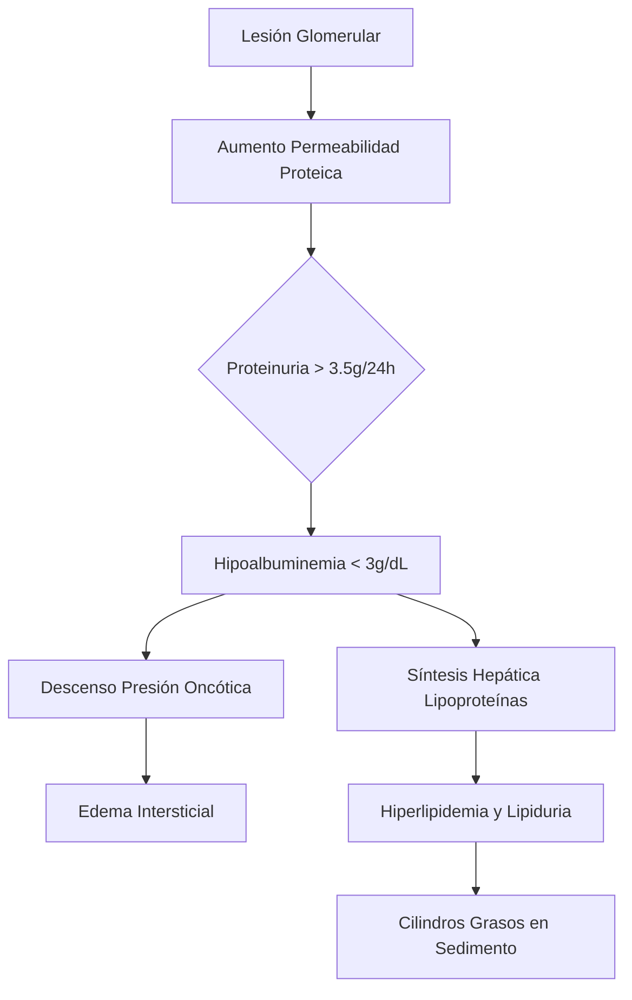
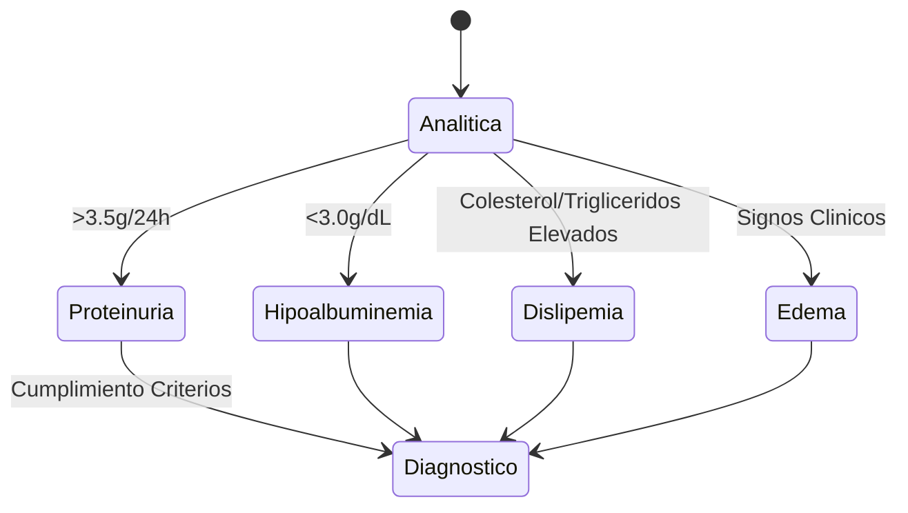
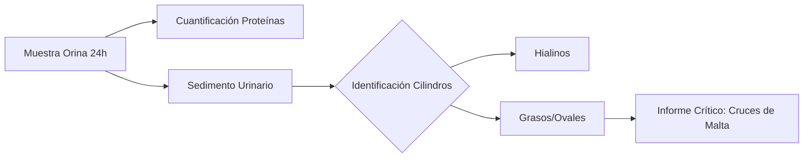
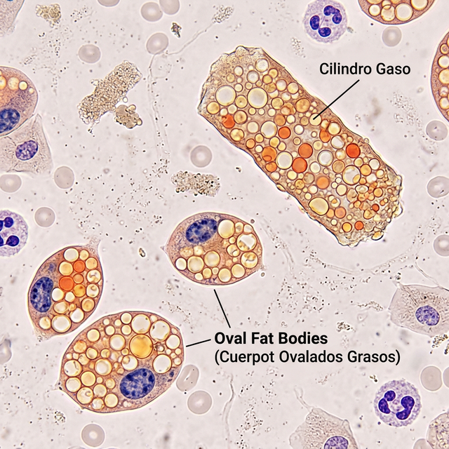

# Semana 1: Bioquímica
## Lección 1: Diagnóstico del Síndrome Nefrótico desde el Laboratorio

### 1. Título y Resumen (Abstract)
**Título:** Optimización del Diagnóstico del Síndrome Nefrótico mediante el Análisis Integrado de Proteínas y Sedimento Urinario Automatizado.
**Resumen:** Este estudio describe el abordaje integral del síndrome nefrótico, analizando la correlación entre la proteinuria masiva y los hallazgos microscópicos. Se destaca la importancia de la hipoalbuminemia y la dislipemia como marcadores sistémicos colaterales, y se evalúa la eficacia de la orina de 24h frente a los ratios rápidos.

### 2. Introducción (Fundamentos y Objetivos)
#### 2.1. Fisiología de la Barrera de Filtración Glomerular (Módulo 1370/1371)
El currículo oficial de **Fisiopatología General** (Módulo 1370) y **Análisis Bioquímico** (Módulo 1371) establece el estudio profundo de la nefrona como unidad funcional. La barrera de filtración glomerular es un filtro selectivo que permite el paso de agua y solutos pequeños pero retiene proteínas de alto peso molecular.
1.  **Componentes Estructurales:**
    - **Endotelio fenestrado:** Membrana con poros de 70-100 nm.
    - **Membrana Basal Glomerular (MBG):** Compuesta por colágeno tipo IV y laminina. Es la principal barrera de carga debido a sus residuos aniónicos (residuos de sialoproteínas).
    - **Podocitos:** Células epiteliales viscerales cuyas ranuras de filtración están reguladas por proteínas como la nefrina y podocina.
2.  **Mecanismos de Filtración:** Se rigen por las Fuerzas de Starling (presión hidrostática capilar vs presión oncótica). La alteración de estas fuerzas o de la integridad estructural conlleva al escape proteico.

#### 2.2. Fisiopatología del Síndrome Nefrótico (Módulo 1370)
Según el Decreto 179/2015, el TSLCB debe identificar los procesos patológicos renales. El síndrome nefrótico se define por una lesión glomerular persistente que provoca:
- **Proteinuria masiva:** > 3.5 g/24h. Supera el umbral de reabsorción tubular proximal (Módulo 1371).
- **Hipoalbuminemia:** < 3.0 g/dL. La albúmina, al ser pequeña (~66 kDa), es la primera en filtrarse al dañarse la barrera de carga y mecánica.
- **Edema:** Formación por retención de sodio o trasudación por baja presión oncótica plasmática.
- **Hiperlipidemia compensatoria:** Aumento de síntesis hepática de VLDL y LDL para compensar la caída de albúmina.

#### 2.3. Fundamentos Técnicos del Análisis Urinario (Módulo 1371)
El currículo de **Análisis Bioquímico** detalla las técnicas de estudio de orina:
- **Examen Químico (Tira Reactiva):** Basado en el cambio de color de indicadores de pH en presencia de proteínas (específico para albúmina).
- **Cuantificación de Proteínas Totales:** Métodos colorimétricos como el Rojo de Pirogalol-Molibdato.
- **Análisis del Sedimento:** Identificación de cristales y cilindros mediante microscopía (Módulo 1368).

**Objetivo del estudio:** Estandarizar el protocolo de validación técnica para el TEL, integrando la cuantificación bioquímica con la identificación de elementos grasos en el sedimento, asegurando la trazabilidad desde la fase preanalítica conforme al título de TSLCB.

### 3. Material y Métodos
- **Diseño:** Estudio descriptivo y procedimental basado en protocolos de validación de la Comunidad de Madrid.
- **Entorno:** Laboratorio de Química Clínica y Orinas, Hospital Universitario de Getafe.
- **Intervenciones:** Cuantificación de albúmina sérica (inmunoensayo), proteínas totales en orina (método de rojo de pirogalol) y análisis del sedimento mediante microscopía de luz polarizada para detección de cruces de malta.

### 4. Resultados (Hallazgos Experimentales)
Se confirma la tríada clásica mediante las siguientes determinaciones:
1. **Proteinuria masiva** (> 3.5g/24h).
2. **Hipoalbuminemia** (< 3 g/dL).
3. **Dislipemia y Lipiduria**.

### 5. Discusión y Conclusiones
La identificación de **cuerpos grasos ovales** y **cilindros grasos** por parte del TEL es crítica. Estos cilindros se forman en el lumen tubular por la precipitación de la proteína de Tamm-Horsfall junto con gotas lipídicas filtradas. Se concluye que la fase preanalítica (recogida 24h vs UPCR) es el factor determinante en la precisión del informe. El uso de luz polarizada permite identificar la birrefringencia del colesterol.

### 6. Agradecimientos
Agradecemos al Servicio de Bioquímica Clínica del HUGF por la provisión de las imágenes de sedimento y los datos de validación técnica.

### 7. Bibliografía (Literatura Citada)
- **KDIGO 2024 Clinical Practice Guideline for the Management of Glomerular Diseases.** [Ver en kdigo.org](https://kdigo.org/guidelines/glomerular-diseases/)
- **Síndrome Nefrótico - Nefrología al Día.** [Ver en nefrologiaaldia.org](https://www.nefrologiaaldia.org/es-articulo-sindrome-nefrotico-211)
- **Manual de Bioquímica Clínica - SEQCML.** [Ver en seqc.es](https://www.seqc.es/es/bioquimica-en-el-laboratorio-clinico/manuales-y-monografias/)
- **Decreto 179/2015 de la CM: Título de TSLCB.** [Ver en comunidad.madrid](https://www.comunidad.madrid/servicios/educacion/formacion-profesional/titulos-fp)

---
### 8. Charla y Transcripción (Contenido Multimedia)

**Enlace al vídeo:** [Ver en YouTube](https://www.youtube.com/watch?v=y8xUaivoTG0)

#### Transcripción de la Sesión
> Hola, buenas. Yo soy [nombre], residente de segundo año de Nefrología en el hospital. Y en esta sesión voy a hablaros sobre el Síndrome Nefrótico, en concreto sobre su diagnóstico temprano en laboratorio. Esta enfermedad puede afectar tanto a adultos como a niños, y reconocerla rápidamente y entender su hallazgo es clave para prevenir complicaciones renales. Por eso, en esta sesión combinaremos conceptos de la enfermedad como su definición, su clínica, diagnóstico y hallazgo analítico con un caso clínico real que se dio en nuestro laboratorio. Este es el índice que vamos a seguir durante la sesión. Y bueno, vamos a empezar hablando sobre lo que es el Síndrome Nefrótico. Se define como un conjunto de hallazgos clínicos y analíticos cuyas características clásicas incluyen una proteinuria masiva acompañada por tanto de una hipoalbuminemia. Se presenta de forma más generalizada y además va a presentar alteraciones del perfil lipídico. Esto además va a estar acompañado de una función renal que inicialmente está conservada pero que con el tiempo puede empeorar. Es importante recordar que aunque estas son las características típicas, la presentación puede variar según la edad del paciente y la causa subyacente. Por eso, una buena interpretación de laboratorio es esencial para confirmar el diagnóstico. La incidencia de la enfermedad se estima en aproximadamente 3 casos por cada 100.000 personas al año en el caso de adultos, mientras que en población pediátrica es más frecuente con cifras del orden de 2 a 7 por cada 100.000 niños por año.
> 
> Pasando a la fisiopatología del síndrome nefrótico, vamos a buscar lo que falla. Los hallazgos clínicos y analíticos observados en el síndrome nefrótico tienen su origen en el mismo mecanismo fisiopatológico. Por eso es una alteración de la barrera de filtración glomerular que pierde su capacidad de retener proteínas plasmáticas. El glomérulo, como el que vemos en la imagen, es una red de capilares sanguíneos situada al inicio de cada nefrona y constituye el primer paso en la formación de la orina. Su función es filtrar la sangre, permitiendo la eliminación de desecho y el exceso de líquido. Al mismo tiempo, que retiene proteínas plasmáticas y células sanguineas esenciales. Esto es gracias a que la membrana es muy selectiva, siendo capaz de discriminar sustancias o moléculas por tamaño. ¿Qué va a depender de esta selectividad? O bien, va a depender de la denominada barrera de filtración glomerular, la cual está formada por tres capas principales, cada una con un papel específico. ¿Cuál es esta estructura? En la primera basa, el endotelio capilar glomerular, el cual va a presentar capilares con fenestraciones u orificios. Esto, estas fenestraciones permiten el paso de agua y solutos pequeños. Su función principal es facilitar la filtración inicial e impedir el paso de células sanguineas hacia el espacio urinario. La segunda membrana va a ser la membrana basal glomerular, la cual es una estructura gruesa especializada que contribuye a la selectividad de la filtración glomerular. Esta membrana contiene componentes con carga negativa que participan de forma complementaria en la repulsión de proteínas plasmáticas. En tercer lugar, y más importante, están los podocitos, los cuales van a discriminar por tamaño. Estos podocitos rodean los capilares glomerulares y, a través del diafragma de filtración, el cual es un filtro poroso compuesto por proteína, constituyen el principal elemento responsable de la selección del paso de macromoléculas, siendo su alteration, uno de los mecanismos principales implicados en el desarrollo de proteinuria en el nefrótico.
> 
> Y, pasando ahora a las causas que van a provocar la aparición del síndrome nefrótico, vamos a diferenciar entre dos tipos. El primero será las causas primarias cuando el daño empieza en el riñón y se limita al riñón, o las causas secundarias. Estas causas secundarias se van a producir, es decir, el síndrome nefrótico se va a producir en el contexto de enfermedades sistémicas que puedan ocasionar un daño en el riñón, pero no son la causa del síndrome nefrótico. Por tanto, en la glomerulopatía primaria, vamos a encontrar causas como son la enfermedad de cambios mínimos, la causa más frecuente del síndrome nefrótico en el riñón, siendo el 80% de los casos, aunque también puede aparecer en adultos, pero con menos frecuencia. Esta enfermedad recibe su nombre debido a que al realizar un examen histopatológico rutinario del riñón, no vamos a poder encontrar alteraciones, el riñón está normal y sólo puede verse la alteración cuando se utiliza un microscopio electrónico. Esta enfermedad va a responder muy bien a corticoides y en la mayoría de los casos la función renal suele estar más conservada. La segunda glomerulopatía primaria es la glomeruloesclerosis focal y segmentaria, que es causada por la formación de cicatrización en segmentos de algunos glomérulos, debido a lesiones del parénquima. Esta afecta más a adultos que a niños y, por último, tenemos la nefropatía membranosa, la cual va a ser un engrosamiento de la membrana basal glomerular. La causa más frecuente en adultos es especialmente en mayores de 40 años y esta nefropatía membranosa muchas veces suele tener un componente autoinmune. Como ya hemos dicho, en el caso de la glomerulopatía secundaria van a ser enfermedades sistémicas, las cuales terminan dañando el riñón, terminan causando una pérdida de proteínas por daño secundario al riñón. Esta enfermedad principalmente suele ser la diabetes mellitus, el lupus sistémico, infecciones como en el caso de virus, como puede ser el virus de la hepatitis B, la hepatitis C, HIV, también el virus de Epstein-Barr puede causarlo o debido a algún tratamiento con fármacos que dañen el riñón e incluso a neoplasias.
> 
> Bien, vamos a pasar ahora a la parte de clínica y complicaciones de este síndrome. Bueno, cuando ya hemos comentado, el principal problema en este síndrome es que se pierde la selectividad de la barrera de filtración glomerular, principalmente por nuestra acción estructural. Lo que voy a comentar es la permeabilidad de proteínas plasmáticas y esto qué va a causar. En primer lugar va a causar edema. La pérdida de estas proteínas por la orina va a originar una disminución progresiva de la concentration de proteína. Esto provoca que disminuya la presión oncótica plasmática y va a explicar la aparición de edema que suelen formarse más en el caso de síndrome nefrótico, alrededor de los ojos, en los tobillos y en los pies. También puede producirse un aumento de peso en la persona y disminución de la diuresis. Esto es debido a la retención hidrosalina. También vamos a tener, debido a la alta concentración de proteína en la orina, que se forme una orina espumosa. Además de la pérdida urinaria de proteínas plasmáticas, no solo va a perder alguna por la orina, sino que también va a perder proteínas como pueden ser la inmunoglobulina o factores del complemento. ¿Qué pasa con esto? ¿Qué va a generar un estado de inmunodeficiencia? Perder esta inmunoglobulina, lo cual hace que tengan menos defensas contra las bacterias y los virus. Por tanto, estamos inmunodeprimidos. También vamos a perder proteínas anticoagulantes, como es el caso de la antitrombina III. Esto junto con el aumento de factores procoagulantes, como por ejemplo, el aumento de fibrinógeno, aumento de los factores V y VIII de la coagulación,给我们 un estado protrombótico. También vamos a tener alteración en el perfil lipídico. Esto va a provoking una marcada hipercolesterolemia y la elevación del LDL en el síndrome nefrótico.
> 
> Vamos a pasar ahora a la parte del diagnóstico y de lo que vamos a encontrar nosotros en la analítica o en la muestra que se manda al laboratorio. Como ya vamos a comentar a lo largo de la sesión, el perfil analítico típico, por ejemplo, en la persona con el síndrome nefrótico va a ser la baja concentración de albúmina en la sangre, una hipoproteinemia, una hiperlipidemia, una alteración del perfil lipídico, una hipercoagulabilidad y una hipogamaglobulinemia. La primera prueba que nos indica la existencia de síndrome nefrótico va a ser fundamentalmente por nuestra tira reactiva de orina. Y vamos a ver una proteinuria masiva definida por una excreción de proteína superior a 3,5 gramos por día, lo cual es muchísimo y que está compuesta principalmente por albúmina. Este es el criterio analítico principal del síndrome nefrótico. Vamos a encontrar la analítica de síndrome nefrótico. Y comentamos encontrar una hipoproteinemia con nivel de albúmina, alteramos por decilitro, asociado con hipoproteinemia. Esto debido a que la pérdida urinaria de proteína supera por mucho la capacidad síntesis hepática, lo que conduce a un balance de proteína negativo. En el perfil lipídico se va a observar hiperlipidemia con una posible elevación del perfil total y un aumento del área yutilizado elevado. Por lo tanto, el colesterol aumentado, esto se explica porque el hepático como mecanismo compensatorio ante esta pérdida está en gran cantidad de proteína, va a incrementar la síntesis hepática de proteína. Pero no solo va a incrementar la síntesis de albúmina, también va a incrementar la síntesis de lipoproteínas. Esta lipoproteína va a dar lugar a esta hiperlipidemia característica, típica de síndrome nefrótico y clínicamente relevante por su asociación con un mayor riesgo cardiovascular, ya que puede inducir a riesgo de hacer aterosclerosis y tromboembolismo.
> 
> La tira reactiva de orina nos va a servir mucho ya que es una herramienta muy sencilla y accesible, cada mano nos puede aportar información relevante. Es un dato característico, la proteinuria, la cual es un resultado muy positivo y en general en la tira de orina no se van a mostrar ni proteinuria ni leucocituria, ya que si no es el nefrótico puro, no se asocia con un proceso inflamatorio. La presencia de leucocituría franca o la piuria, incluso nitritos positivos, debe hacer sospechar de otra entidad. También podemos encontrar alterada la densidad en la que nos gonna dar una densidad elevada en orina, debido a que la concentración de proteína en la orina es muy elevada. Sin embargo, el resto de parámetros, como puede ser la glucosa, acetona y nitritos, debería ser negativo.
> 
> Bien, pasando ahora al sedimento urinario, en el síndrome nefrótico puro, el sedimento urinario es suelen ser poco llamativo. Esto es sobre todo desde el punto de vista inflamatorio, como ya hemos dicho no se suelen encontrar leucocituria o piuria. Pero esto no significa que sea completamente normal. Lo que se puede encontrar con más frecuencia en el sedimento van a estar relacionados con la proteinuria urinaria, y también con la eliminación de lípidos y detritus. En el sedimento habitual, en contra de la presencia de cilindro hialino, las cuales son las estructuras que se forman en el túbulo renal. Y se van a formar a partir de la proteína de Tamm-Horsfall, que es secretada por el túbulo renal. La composición de esta estructura depende de lo que se incorpora a esa matriz proteica. En el caso de los cilindro hialino en el sedimento, es muy específico, pero es muy frecuente en este contexto. De forma característica, pueden encontrarse cilindro grasp, resultado de la acumulación de lípidos en el túbulo renal. Así como cuerpos grasos, correspondientes al epitelio tubular cargado de lípidos. Esto último pueden mostrar la denominada cruz de Malta, que es muy característica, y que va a ser observada cuando utilizamos la luz polarizada del microscopio.
> 
> Bien, una vez realizadas las características principales, es muy importante diferenciarlo de otra manera muy similar, cuál es el síndrome nefrítico, pero que a pesar de su parecido terminológico, ambos síndromes responden a mecanismos fisiopatológicos muy distintos. Se asocia a la presentación clínica, analítica y del sedimento urinario muy diferenciada. Por ello, a continuación voy a daros las principales características que permiten distinguir el síndrome nefrótico del síndrome nefrítico. Teniendo las características de cada tipo de enfermedad. En el caso de síndrome nefrótico y viendo la proteinuria, bueno, como ya lo han dicho, pues la proteinuria es muy elevada, se eliminan más de 3,5 gramos al día de proteína, y en el síndrome nefrítico, es verdad que puede haber proteinuria, pero es mucho menor, siempre va a ser menor de 3,5 gramos. En el caso de síndrome nefrítico, puede haber leucocituria, pero no normal, y el síndrome nefrítico sí suele haber hematuria. En el sedimento, que vamos a encontrar el síndrome nefrótico, sí cilindro hialino, formado por proteína y cilindro graso, debido a la alta concentración de grasa eliminada por la urine. Y el síndrome nefrítico, vamos a encontrar cilindro hemático. Edema, vamos a encontrarlo, en el caso de síndrome nefrótico. Y la función renal, pues ya hemos dicho que en el síndrome nefrítico no se altera, y en el caso de síndrome nefrótico, sí va a estar bastante deteriorada.
> 
> Bien, para pasar al caso clínico que había comentado, el cual trata de una paciente mujer adulta, 57 años, que acudir a la consulta porque tiene edemas progresivos de varias semanas de evolución, que inicialmente se encuentran en los miembros inferiores, pero con progresión ascendente hacia el abdomen. No refiere clínica urinaria, más allá de que bueno, la orina es oscura, pero sin cambio que llamativa de color, no presenta ni fiebre ni síntomas infecciosos asociados, pero sí refiere una ganancia de más de 6 kilogramos en el último mes.
> 
> Bueno, pasando ahora a la parte de la analítica sanguínea, la cual la tenemos, lo que vamos a encontrar es que debeoms encontrar una persona sana. Y bueno, lo curiouso de este caso clínico es que lo que nos llamó la atención y lo que nos hizo indagar un poco en el tema fue ver la alteración del perfil lipídico, ya que la mujer en la analítica anterior no tenía alteración del perfil lipídico, no tenía el colesterol elevado ni el LDL fuera de lo normal, y ese cambio del perfil lipídico fue lo que nos hizo sospechar de si la persona podía tener alguna patología. Y ya, bueno, indagando un poco, vimos la disminución de las proteínas y la disminución de las albúminas. Y eso fue lo que nos hizo pensar que era un patrón típico de síndrome nefrótico. Y bueno, continuando con el estudio de la orina, comentamos lo que ya comentaba antes, la tira de reactiva de orina, la densidad elevada debido a la alta concentración de proteína, pero sobre todo esa proteinuria es muy positiva y al realizar la bioquímica de la orina de visto, veamos esa proteinuria masiva característica, sobre todo de albúmina, como una cuantificación de eso de proteína, de proteinuria de hasta 16 miligramos por litro. Además, se realizaron pruebas complementarias, se le realizó un proteinograma y una medición de inmunoglobulinas, en la cual, como podíamos ver, la immunoglobulina está disminuida debido a la disminución por la orina y en el proteinograma, lo que se ve es el perfil electroforético claro de un síndrome nefrótico, es decir, una hipoalbuminemia e una hipogamaglobulinemia. Además, también se incluyó un estudio immunológico y serológico, los cuales resultaron negativos.
> 
> Hasta aquí parece claro que el diagnóstico de esta mujer sería de un síndrome nefrótico ya que cumple con todas las características. Sin embargo, al realizar la biopsia renal, encontramos que de los 45 glomérulos que se identifican ninguno se encuentra esclerosado y no se van a encontrar lesiones significativas, además de que no hay fibrosis o atrofia. La imagen es compatible con escasa de daño tubular agudo y nos encontramos con arteriolas normales. Entonces, ¿cómo puede ser esto, si todos los demás hallazgos sugieren el nefrótico? Vale, ¿por qué? Porque los médicos podían investigar de una glomerulopatía de cambios mínimos, la cual ya hemos comentado que es uno de los posibles subdiagnósticos. Si se utiliza el microscopio electrónico, ya que si no, la alteración no se ve y que aunque es típica de personas en edad pediátrica, también se puede ver en adulto y que puede debutar con un síndrome nefrótico marcado.
> 
> A la paciente se le trató con corticoides, los cuales son el tratamiento para este tipo de glomerulopatía, en su caso respondedora a principio y altas que se puede ir reduciendo con el paso del tiempo y se iba viendo una mejora clínica. También se le ha minimizado el tratamiento y polimialgia y con esta terapia, además de un diurético para la mejora de la retención hidrosalina. Un resultado del tratamiento fue la normalización de la albúmina, una proteinuria muy bien pero mucho menos que la primera vez, la normalización del perfil lipídico y la pérdida de hasta 10 kilos de peso.
> 
> Para terminar, las conclusiones son que el síndrome nefrótico es recognizable en el laboratorio por el patrón de proteinuria masiva, más hipoalbuminemia e hipoproteinemia en la sangre, más hiperlipidemia, que en orina la tira reactiva nos va a variar rápidamente y el sedimento nos puede aporta información cuando aparezcan los cuerpo grasos o cilindro graso, y la enfermedad no es solo renal, ya que implica un riesgo de complicación grave, es decir, edemas y sobre todo de infecciones y trombosis, especialmente importantes cuando la albúmina está baja y que el laboratorio es importante, la atención pero también el seguimiento de la respuesta, como he visto, viendo cuando disminuye la proteinuria y aumenta la albúmina y anticipando problemas, por eso identificar el patrón y comunicarlo de forma temprana, como en el caso clínico, mejora la derivación y el manejo del paciente.
> 
> Bueno, espero que os haya gustado la sesión y que hayáis aprendido algo nuevo. Si, nada, muchas gracias por vuestra atención.

#### Explicación de la Ponencia
La sesión clínica profundiza en la **barrera de filtración glomerular** como eje central del síndrome nefrótico. Desde una perspectiva del TSLCB, es crítico comprender que la pérdida de selectividad (tanto de carga como de tamaño) en el glomérulo no solo produce proteinuria, sino que desencadena una cascada metabólica:
1.  **Hipoalbuminemia**: Resultado directo de la pérdida urinaria que supera la capacidad de síntesis hepática.
2.  **Edema**: Explicado por la disminución de la presión oncótica plasmática.
3.  **Hiperlipidemia de compensación**: El hígado, al intentar compensar la hipoproteinemia, incrementa la síntesis de lipoproteínas (LDL, VLDL), aumentando el riesgo cardiovascular del paciente.
4.  **Estado de Inmunodeficiencia y Trombosis**: El ponente destaca la importancia de monitorear no solo la albúmina, sino también la pérdida de inmunoglobulinas y antitrombina III (riesgo protrombótico).

El caso clínico ilustra el reto diagnóstico de la **Enfermedad de Cambios Mínimos (ECM)** en adultos, donde la microscopía óptica puede parecer normal, requiriendo microscopía electrónica para observar la fusión de los pedicelos. La recuperación de la paciente tras el uso de corticoides reafirma la importancia del laboratorio en el seguimiento de la respuesta terapéutica mediante la monitorización de la proteinuria y el perfil lipídico.

---
### Sobre el Ponente
**Antonio M. Cáliz** es FEA del Servicio de Análisis Clínicos del **Hospital Universitario de Getafe**.

*Contenido actualizado con transcripción y análisis clínico - Marzo 2026*
