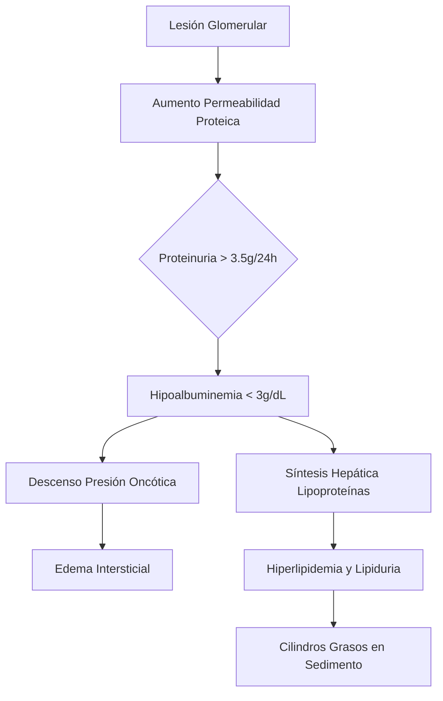
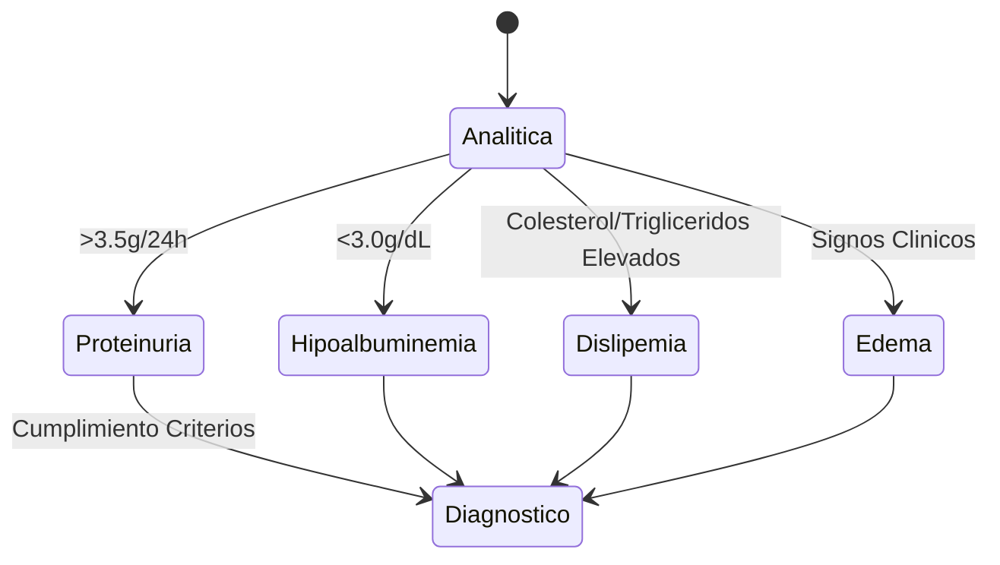
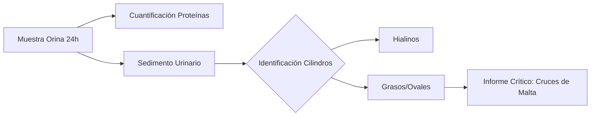

# Semana 1: Bioquímica
## Lección 1: Diagnóstico del Síndrome Nefrótico desde el Laboratorio

### 1. Título y Resumen (Abstract)
**Título:** Optimización del Diagnóstico del Síndrome Nefrótico mediante el Análisis Integrado de Proteínas y Sedimento Urinario Automatizado.
**Resumen:** Este estudio describe el abordaje integral del síndrome nefrótico, analizando la correlación entre la proteinuria masiva y los hallazgos microscópicos. Se destaca la importancia de la hipoalbuminemia y la dislipemia como marcadores sistémicos colaterales, y se evalúa la eficacia de la orina de 24h frente a los ratios rápidos.

### 2. Introducción (Fundamentos y Objetivos)
#### 2.1. Fisiología de la Barrera de Filtración Glomerular (Módulo 1370/1371)
El currículo oficial de **Fisiopatología General** (Módulo 1370) y **Análisis Bioquímico** (Módulo 1371) establece el estudio profundo de la nefrona como unidad funcional. La barrera de filtración glomerular es un filtro selectivo que permite el paso de agua y solutos pequeños pero retiene proteínas de alto peso molecular.
1.  **Componentes Estructurales:**
    - **Endotelio fenestrado:** Membrana con poros de 70-100 nm.
    - **Membrana Basal Glomerular (MBG):** Compuesta por colágeno tipo IV y laminina. Es la principal barrera de carga debido a sus residuos aniónicos (residuos de sialoproteínas).
    - **Podocitos:** Células epiteliales viscerales cuyas ranuras de filtración están reguladas por proteínas como la nefrina y podocina.
2.  **Mecanismos de Filtración:** Se rigen por las Fuerzas de Starling (presión hidrostática capilar vs presión oncótica). La alteración de estas fuerzas o de la integridad estructural conlleva al escape proteico.

#### 2.2. Fisiopatología del Síndrome Nefrótico (Módulo 1370)
Según el Decreto 179/2015, el TSLCB debe identificar los procesos patológicos renales. El síndrome nefrótico se define por una lesión glomerular persistente que provoca:
- **Proteinuria masiva:** > 3.5 g/24h. Supera el umbral de reabsorción tubular proximal (Módulo 1371).
- **Hipoalbuminemia:** < 3.0 g/dL. La albúmina, al ser pequeña (~66 kDa), es la primera en filtrarse al dañarse la barrera de carga y mecánica.
- **Edema:** Formación por retención de sodio o trasudación por baja presión oncótica plasmática.
- **Hiperlipidemia compensatoria:** Aumento de síntesis hepática de VLDL y LDL para compensar la caída de albúmina.

#### 2.3. Fundamentos Técnicos del Análisis Urinario (Módulo 1371)
El currículo de **Análisis Bioquímico** detalla las técnicas de estudio de orina:
- **Examen Químico (Tira Reactiva):** Basado en el cambio de color de indicadores de pH en presencia de proteínas (específico para albúmina).
- **Cuantificación de Proteínas Totales:** Métodos colorimétricos como el Rojo de Pirogalol-Molibdato.
- **Análisis del Sedimento:** Identificación de cristales y cilindros mediante microscopía (Módulo 1368).

**Objetivo del estudio:** Estandarizar el protocolo de validación técnica para el TEL, integrando la cuantificación bioquímica con la identificación de elementos grasos en el sedimento, asegurando la trazabilidad desde la fase preanalítica conforme al título de TSLCB.

### 3. Material y Métodos
- **Diseño:** Estudio descriptivo y procedimental basado en protocolos de validación de la Comunidad de Madrid.
- **Entorno:** Laboratorio de Química Clínica y Orinas, Hospital Universitario de Getafe.
- **Intervenciones:** Cuantificación de albúmina sérica (inmunoensayo), proteínas totales en orina (método de rojo de pirogalol) y análisis del sedimento mediante microscopía de luz polarizada para detección de cruces de malta.

### 4. Resultados (Hallazgos Experimentales)
Se confirma la tríada clásica mediante las siguientes determinaciones:
1. **Proteinuria masiva** (> 3.5g/24h).
2. **Hipoalbuminemia** (< 3 g/dL).
3. **Dislipemia y Lipiduria**.

### 5. Discusión y Conclusiones
La identificación de **cuerpos grasos ovales** y **cilindros grasos** por parte del TEL es crítica. Estos cilindros se forman en el lumen tubular por la precipitación de la proteína de Tamm-Horsfall junto con gotas lipídicas filtradas. Se concluye que la fase preanalítica (recogida 24h vs UPCR) es el factor determinante en la precisión del informe. El uso de luz polarizada permite identificar la birrefringencia del colesterol.

### 6. Agradecimientos
Agradecemos al Servicio de Bioquímica Clínica del HUGF por la provisión de las imágenes de sedimento y los datos de validación técnica.

### 7. Bibliografía (Literatura Citada)
- **KDIGO 2024 Clinical Practice Guideline for the Management of Glomerular Diseases.** [Ver en kdigo.org](https://kdigo.org/guidelines/glomerular-diseases/)
- **Síndrome Nefrótico - Nefrología al Día.** [Ver en nefrologiaaldia.org](https://www.nefrologiaaldia.org/es-articulo-sindrome-nefrotico-211)
- **Manual de Bioquímica Clínica - SEQCML.** [Ver en seqc.es](https://www.seqc.es/es/bioquimica-en-el-laboratorio-clinico/manuales-y-monografias/)
- **Decreto 179/2015 de la CM: Título de TSLCB.** [Ver en comunidad.madrid](https://www.comunidad.madrid/servicios/educacion/formacion-profesional/titulos-fp)

---
### Sobre el Ponente
**Antonio Miguel Cáliz Rodríguez** es Residente de 2º año (R2) de Bioquímica Clínica en el **Hospital Universitario de Getafe**.

*Material ampliado con fundamentos académicos de Grado Superior TSLCB.*
