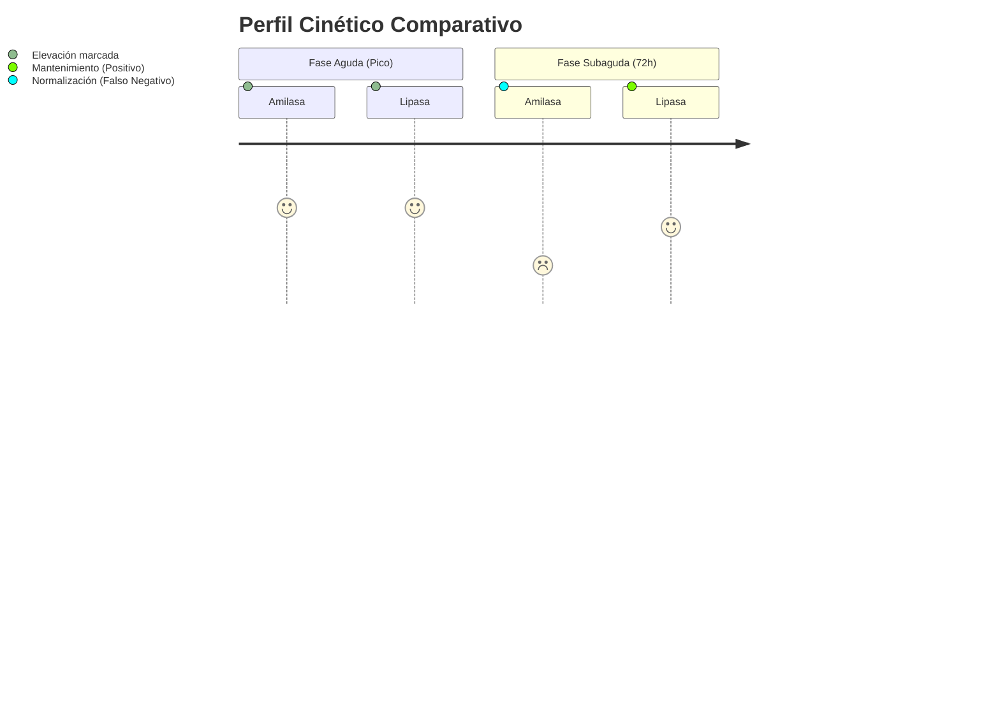
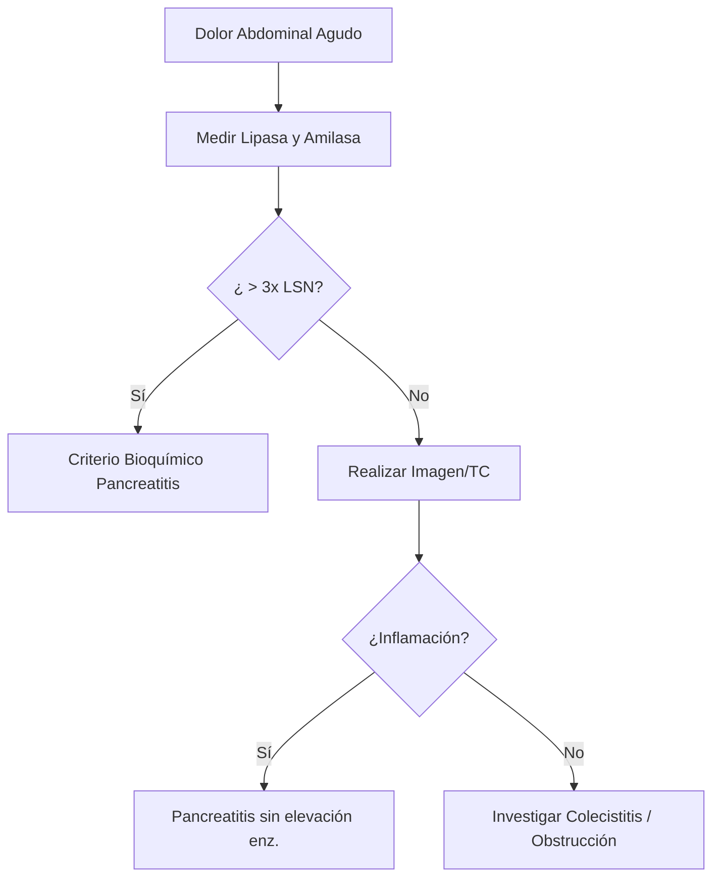

# Semana 1: Bioquímica
## Lección 2: Lipasa vs Amilasa: Diferencias, Similitudes e Implicaciones Clínicas

### 1. Título y Resumen (Abstract)
**Título:** Evaluación Comparativa de la Cinética de Amilasa y Lipasa en el Diagnóstico de Pancreatitis Aguda: Un Enfoque Anatomo-Fisiológico.
**Resumen:** Este artículo analiza la utilidad clínica de la amilasa y lipasa como biomarcadores de daño pancreático. Se evalúa su sensibilidad y especificidad en diferentes ventanas temporales tras el inicio del dolor abdominal, fundamentando su comportamiento en la fisiología exocrina del páncreas y los procesos de aclaramiento renal.

### 2. Introducción (Fundamentos y Objetivos)
#### 2.1. Fisiología y Cinética Enzimática (Módulo 1371)
El currículo oficial del **Módulo de Análisis Bioquímico** exige el conocimiento de la fisiología y cinética de las enzimas plasmáticas. Las enzimas son catalizadores biológicos que disminuyen la energía de activación de las reacciones metabólicas.
1.  **Amilasa (α-amilasa):** Hidrolasa que cataliza la hidrólisis de los enlaces α-1,4-glucosídicos. 
    - **Propiedades Físicas:** Bajo peso molecular (~50 kDa), permitiendo su filtración libre en el glomérulo (aclaramiento renal).
    - **Activación:** Requiere iones $Ca^{2+}$ (activador metálico) y $Cl^-$.
    - **Distribución:** Diferenciación entre isoenzimas tipo P (pancreática) y tipo S (salival).
2.  **Lipasa (Triacilglicerol acilhidrolasa):** Enzima específica del páncreas exocrino para la hidrólisis de triglicéridos de cadena larga.
    - **Cofactores:** Requiere colipasa y sales biliares para actuar en la interfaz agua-lípido (Módulo 1370).

#### 2.2. Fisiopatología de la Inflamación Pancreática (Módulo 1370)
En el módulo de **Fisiopatología General**, se detalla la necrosis pancreática. El daño a las células acinares provoca la liberación masiva de enzimas al espacio intersticial y sangre.
- **Cinética Diferencial:** La amilasa eleva precozmente (2-12h) pero desaparece en 48-72h. La lipasa es más sensible y permanece elevada hasta 14 días.
- **Interferencias Analíticas (Módulo 1368):** La turbidez lipémica interfiere en la fotometría de absorción, fenómeno común en pancreatitis agudas por hipertrigliceridemia etílica.

#### 2.3. Fundamentos Técnicos de la Medición (Módulo 1371)
- **Métodos Espectrofotométricos Dinámicos:** Medición de la tasa de formación de producto en el tiempo.
- **Relación Absorbancia-Concentración (Lambert-Beer):** Empleada en sistemas automatizados para cuantificar actividad catalítica (U/L).

**Objetivo:** Definir el algoritmo de validación técnica para el TSLCB, fundamentando el uso de la lipasa como marcador de elección sobre la amilasa.

### 3. Material y Métodos
- **Diseño:** Estudio técnico sobre protocolos de urgencias bioquímica.
- **Entorno:** Servicio de Urgencias y Análisis Clínicos, Hospital Universitario de Getafe.
- **Intervenciones:** Medición de actividad enzimática mediante métodos espectrofotométricos cinéticos de colorimetría enzimática (sustratos 4-nitrofenil o sustratos sintéticos específicos).

### 4. Resultados (Hallazgos Experimentales)
La comparación de perfiles muestra que la lipasa es superior en sensibilidad (90-100%) y especificidad frente a etiologías no pancreáticas (como parotiditis o insuficiencia renal).

### 5. Discusión y Conclusiones
La lipasa debe considerarse el marcador de referencia. El diagnóstico de laboratorio se establece clásicamente con valores > 3 veces el límite superior de la normalidad (LSN). Para el TEL, es fundamental identificar el estado de las amilasas séricas frente a las urinarias para descartar nefropatías.

### 6. Agradecimientos
Agradecemos al equipo de Bioquímica de la Comunidad de Madrid por la estandarización de métodos analíticos.

### 7. Bibliografía (Literatura Citada)
- **WGO: World Gastroenterology Organisation Global Guidelines - Acute Pancreatitis.** [Ver en worldgastroenterology.org](https://www.worldgastroenterology.org/guidelines/acute-pancreatitis)
- **Amilasa y Lipasa en el Diagnóstico de Pancreatitis - Manual SEQCML.** [Ver en seqc.es](https://www.seqc.es/es/bioquimica-en-el-laboratorio-clinico/manuales-y-monografias/)
- **Fisiología de la Secreción Pancreática Exocrina.** [Ver en elsevier.es](https://www.elsevier.es/es-revista-gastroenterologia-hepatologia-continuada-42-articulo-fisiologia-secrecion-pancreatica-exocrina-13094191)

---
### 8. Charla y Transcripción (Contenido Multimedia)

**Enlace al vídeo:** [Ver en YouTube](https://www.youtube.com/watch?v=uTmXbeD4IAE)

#### Transcripción de la Sesión
> Hola, mi nombre es María Sánchez Puche, soy R1 de Bioquímica Clínica en el Hospital Universitario de Getafe y os voy a hablar acerca de la lipasa y la milasa, diferencias, similitudes e implicaciones clínicas. Este es el índice que voy a seguir a lo largo de la presentación, tanto para la milasa como la lipasa. En primer lugar, vamos a hablar de la definición, de la reacción que llevan a cabo estas enzimas, de las distintas localizaciones en las que los podemos encontrar luego de la terminación en nuestro laboratorio de las patologías o situaciones clínicas en las que nos podemos encontrar una lipasa y una milasa aumentada. Luego de la especificidad de la sensibilidad, comentaremos por encima dos casos clínicos y terminaremos con los líquidos biológicos. Vamos a comenzar eh hablando de la lipasa. La lipasa pancreática humana es una glucoproteína. Esto significa que es una molécula mixta formada por una proteína y cadenas de azúcares, lo que le confiere estabilidad para trabajar en el entorno al intestino. Por lo tanto, la digestión química de las grasas no comienza de forma significativa en la boca, sino que espera encontrarse con las secreciones del pangres. Las lipas no cortan cualquier enlace, sino que tienen una preferencia muy marcada por los esteres de glicerol de los ácidos grasos de cadera larga. Si visualizamos un triglicéido como una estructura con tres brazos en forma de E, los ácidos grasos están unidos a los carbonos 1, 2 y 3 del glicerol. La lipasa actúa primero sobre los carbonos 1 y tres, lo cual eh provoca la liberación de dos moléculas de ácidos grasos y nos deja una pieza central llamada dos monoglico. El tercer ácido graso, el que está en la posición central o carbono 2, es más difícil de quitar. Para que la lipasa pueda cortarlo, la molécula debe sufrir un proceso de isomerización, es decir, de reordenamiento. Una vez que este brazo se mueve posición, la lipasa puede exprenderlo, aunque lo hace a un ritmo mucho más lento que los dos primeros. Este proceso asegura que las grasas se puedan convertir en unidades lo suficientemente pequeñas para que puedan atravesar las membranas de los ácidos grasos intestinales. Para eh entender cómo digerimos las grasas, es necesario tener en cuenta que la grasa no se mezcla con el agua, que es donde están las enzimas. Por lo tanto, en el caso concreto de las grasas, aparte de la lipasa, necesitamos la colipasa y la bilis. Cuando las clasas llegan al intestino delgado en forma de grandes cotas aceitosas, como la lipas enzima que ve un medio acuoso, no puede penetrar en esas bolas de grasa. Aquí es necesario la participación de la bilis que es fabricada por el hígado, que actúa exactamente como detergente de cocina. Rompe esas gotas grandes en miles de gotitas microscópicas, proceso llamado emulsificación y este es vital porque multiplica el área de contacto para que las enzimas puedan trabajar. La bilis que recubre la grasa una especie de escudo protector que impide que la lipas se acerque. Para solucionar este problema, el páncreas secreta la colipasa. Esta proteína funciona como un ancla o un puente. Se engancha la gota de grasa desplazando un poco de bilis y crea un sitio no específico. Si la colipasa, la lipasa simplemente resbalaría sobre la grasa sin poder retocarla. Una vez que la colipasa ha fijado la lipasa labilicie la gota, la enzima puede finalmente hacer su trabajo. Como vamos a comentar en la diapiva anterior, la eh principal fuente de actividad de la lipasa en el suero es, sin duda, el páncreas. Este órgano es una verdadera fábrica de enzimas digestivas. En condiciones normales, el páncreas produce la lipas y le abierte directamente al intestino para digerir las grasas. Sin embargo, una pequeña cantidad siempre se escapa de forma natural al torrente de sanguíneo y es lo que medimos en los laboratorios. Debido a que el páncreas es el productor masivo, cuando los niveles en sangre suben drásticamente, casi siempre es la primera señal de que este orano está sufriendo una inflamación o daño. Aunque el páncreas se lleva todo el protagonismo, no es el único lugar donde se genera esta enzima. Existen otras fuentes, aunque son mucho menos importantes en términos de cantidad. Eh, no lo podemos encontrar en la mogos intestinal. El revestimiento de nuestros intestinos también tiene la capacidad de producir cierta lipasa para ayudar a la absorción local de los nutrientes. También la podemos encontrar en el tejido adiposo. Nuestras células de grasa, los adipocitos, contienen su propia versión de la lipas, la cual utilizan para descomponer la grasa almacenada y convertirla en energía cuando el pano necesita. Y finalmente también lo podemos encontrar en el hígado. La lipasa es una proteína de bajo peso molecular. Esta característica física le permite ser filtrada por los glomérulos desde el sanguíneo hacia el sistema tubular. Sin embargo, a diferencia de otras enzimas que simplemente se excretan, el cuerpo trata la lipasa de una forma muy eficiente a través de los mecanismos principales en los túbulos proximales. En condiciones de salud normales, una vez que la lipasa entre los túbulos renales, las células que lo recubren lo atrapan y la eh devuelven hacia el interior del tejido. Este proceso es tan efectivo que la lipase es reabsorbida por completo. Además de ser recuperada, la lipase es captada por los túbulos renales es metabolizada. El riñón no solo actúa como un filtro, sino como un lugar de degradación por esta encima. Por lo tanto, en condiciones de salud, eh la cantidad de lipasa en orina es nula. Cuando eh realizamos una lis de sangre y encontramos la lipas asérica elevada, lo primero que se sospecha es una pancreatitis. Sin embargo, debido a que esta enzima circula por la sangre y es procesada por varios órganos, su elevación puede deberse a un abanico de problemas distintos. No solo las inflamaciones agudas en la lipas. En la pancreitis crónica, el tejido del páncreas está dañado a largo plazo y puede liberar enzimas de forma resistente. Asimismo, si existe una obstrucción del conducto pancrático, por ejemplo, por un cálculo o un tumor, la lipasa no puede salir hacia el intestino, retrocede y acaba filtrándose hacia el torrete sanguíneo. El riñón es el encargado de eh limpiar la lipasa de la sangre. Si un paciente sufre una enfermedad renal, el filtro falla y la lipasa no puede ser eliminada correctamente. Esto provoca que los niveles en sangre suban, no porque el páncreas esté fabricando de más, sino porque el riñón no está aclarando de forma adecuada. El sistema digestivo está inemamente conectado, por eso otras enfermedades graves pueden aumentar la lipas, como por ejemplo la colecisita aguda, la inflamación de la vesícula biliar, obstrucción infarto intestinal. Cuando el lado se bloquea o pierce eh riego sanguíneo, las enzimas pueden alterarse. Úlcera dubodenal. Si una úlcera perfora, aburrita la zona cercana al páncreas, los animales de lipasas disparan. Enfermedades hepáticas, el hígado enfermo altera el metabolismo general de las enzimas. Finalmente, existen condiciones que afectan a todo el cuerpo y que repercuten a la lipas, como por ejemplo el alcoholismo. El consumo crónico de alcohol es una agresión directa y constante a las enzimas pancráticas y la cetacidosis diabética. En esta complicación grave de la diabetes, el desequilibrio químico del cuerpo es tan severo que es muy frecuente encontrar rimeles elevados de lipasa, inclusive en páncreas no tiene un inflamación primaria. Ahora vamos a hablar acerca de cómo se lleva a cabo la terminación de la lipasa en nuestro laboratorio. El método que se utiliza es la excisión de un sustrato cromogénico específico para la lipas. La actividad de la lipasa pancreática se determina de forma específica gracias a la combinación de ácidos bbiliares y colipasa utilizada en este ensayo. En ausencia de colipasa prácticamente no se deja activar a lipasa. La colipasa activa exclusivamente la lipasa pancreática, ignorando otras enzimas lipolíticas presentes en el suelo. El principio del text se trata de un ensayo colorimétrico enzimático. En un primer momento tenemos este de metil resofurina más colipas más ácidos biliares más la lipasa que nos encontremos en el suero. Esto da lugar a seis metil resorfurina, que en una solución alcalina se descompone espontáneamente a metil resorfurina, que eh es de color rojo. Por lo tanto, la intensidad del color rojo es directamente proporcional a la cantidad de alipasa en la muestra. A continuación vamos a hablar de la milasa. El alfalminasa es una encima fundamental para nuestra supervivencia, ya que es encargada de desmontar los carboxos complejos que comemos, como el pan, el arroz o las patatas para convertirlos en energía utilizable. Su modo acción es muy específico. Actúa como una tijera bioquímica que corta los enlaces glucosídicos alfa 14. Estos enlaces son los puentes que mantienen unidas a las moléculas de glucosa en largas cadenas. La milasa no corta de forma ordenada entre los extremos, sino que lo hace a intervalos aleatorios a lo largo de la cadena, rompiendo el almidón o el glucógeno desde su interior. Al romper esas estructuras, como no rompe siempre los mismos enlaces, nos genera una mezcla de piezas más pequeñas, como puede ser glucosa, que es la unidad eh de energía más simple, maltosa o isomaltosa, que son grupos de parejas de glucosas unidas, oligosacáridos, que son cadenas cortas de azúcares. A pesar de su eficacia, esta enzima tiene limitaciones importantes que definen nuestra nutrición. No rompe los enlaces alfa 16. El almidón tiene ramas. La milasa puede acortar esas ramas, pero no puede cortar el sitio en el que esas ramas se unan al tronco principal porque tiene enlaces alfa 16. Por eso siempre quedan fragmentos llamados textrinas. No degrada la celulosa. Aunque la celulosa se parece mucho al midón, sus enlaces son de tipo beta, beta 14. A diferencia del almidón, que son alfa 14, como la eh amilasa solo reconoce los enlaces alfa, no puede digerirla. Esto es por la razón por lo que la fibra pasa por nuestro cuerpo, pero sin aportarnos calorías. Para que la enzima funcione correctamente, no basta con que estés presente. Necesita un entorno muy específico. Es una enzima. Es una metaloencima. Esto significa que lleva un metal en su estructura para ser estable. En este caso requiere calcio. Sin el calcio, la enzima se deforma y pierde su capacidad de corte. Y la milasa es muy sensible a la acidez. Su punto máximo de eficacia está entre un pH de 6,9 o 7. Esta es la razón por lo que la milasa salival trabaja amarillar en la boca, pero se desactiva rápidamente cuando llega al ambiente extremadamente ácido del estómago. Y posteriormente cuando llegamos de nuevo al intestino, tenemos la milesia intestinal. La lipasa no es una única sustancia, sino que se presenta en diferentes formas llamadas isoenzimas. Aunque realizan la misma función, están codificadas por dos genes distintos ubicados en el mismo cromosomo. El unulo. Dependiendo de qué g se active y en qué órgano suceda, produciremos de las dos variantes principales. Tenemos la isoforma S o salival. Se fabrica principalmente las glándulas salivales. Es la encarga de iniciar la digestión de los carbohidratos en cuanto el alimento entre en la boca. Luego tenemos la isoforma B, que es la pancreática. Se producen los eh células de los acinos del páncreas y su función es mucho más potente, ya que termina de romper los azúcares complejos una vez que llegan al intestino delgado. Aunque el páncreas y las glándulas salivades son los principales lugares donde vamos a encontrar la milasa, esta es una muy versátil que se encuentra en diferentes lugares. Existe actividad de amilasa en tejidos como el intestino, pulmón, músculo y tejido adipos, incluso en el sistema reproductor como testículos, ovarios y trompas de falopio. Esta presencia extendida explica por qué en ocasiones los niveles de amilasa pueden alterarse por causas que no tienen nada que ver con el páncreas. Como amas y enzimas son muy parecidas, no se pueden separar fácilmente. El método clásico más preciso para identificarlas es la electroforesis. Este proceso consiste en aplicar una corriente eléctrica en una muestra de suero. Dido a pequeñas diferencias en su carga eléctrica y su estructura, la isoenzima S y la isoenzima P se desplazan a velocidades distintas creando bandas separadas. Esto laboratorio y terminar con esa actitud cuánta milasa viene de cada órgano, facilitando un diagnóstico mucho más certero. La milasa, al igual que la lipasa, es una proteína de bajo peso molecular, lo que le permite pasar eh sin dificulta el glomérulo renal. Una vez que ha sido filtrada, la milasa eh recorre los túbulos del riñón. A diferencia de otras sustancias, como hemos hablado antes de la lipasa, que el cuerpo intenta recuperar para no perder, la milasa no se reabsorbe los túmbulos, lo que provoca que sea eliminada de forma natural a través de la orina. Por esta razón es común medir su actividad tanto en sangre como en orina para evaluar la salud del paciente. Sin embargo, este proceso de eliminación puede ser alterado por una condición llamada macroamilasemia. Esto ocurre principalmente con la isoforma S. En ciertas eh personas, la milasa tiende a unirse a otras proteínas mucho más grandes que circulan en la sangre, específicamente anticuerpos conocidos como inmunoglobinas, IGGA o IGG. Al unirse forma un complejo gigante llamado macroamilasa. Al convertirse una molécula eh T elevado peso molecular, la amilasa pierde su capacidad para ser filtrada por el riñón. Esto genera dos efectos inmediatos. En el lente enentecimiento del acramiento, el cuerpo no puede eliminar la mirasa de la sangre a velocidad normal y al no poder salir por la orina, los niveles de ábilas en sangre aumentan drásticamente, lo cual genera un falso positivo. Lo más importante de la macroomilasemia es que aunque los niveles de laboratorio muestren una actividad de amilas varias veces por encima del límite de referencia, no existe una enfermedad real detrás de este aumento. La hiperamilascemia no es una enfermedad en sí misma, sino un halzco de laboratorio que indica que algo está liberando demasiada milaza del torret sanguíneo. Aunque automáticamente si noos pensar en el páncreas existe múltiples causas dependiendo de qué variante la enzima esté elevada. El páncreas es la cosa principal y más frecuente, especialmente en la pancreat aguda. En este inflamatorio las zulas del páncreas se dañan y liberan de forma masiva la isoforma P hacia la sangre. Esta es una señal de alcad crítica que los médicos utilizan para diagnosticar esta urgencia médica. No toda la milasa alta viene del pangles. Una inflamación de las clones salivales como la parodiditis paperas provoca un aumento de la isonforma S en el suelo. En este caso, el páncreas está sano, pero el exceso de producción en la boca se refleja en los analistes de sangre. Debido a que la milesa también está presente en nuestros tejidos del sistema digestivo, diversas eh causas pueden generar una alteración de la misma. Infarto mesentérico cuando el intestino pierde riesgo sanguíneo. Úlfera peptídica y gastritis, la irritación o la perforación de la mucosa gástrica. Apendicitis y peritonitis, inflamaciones graves en la cavidad abdominal que afectan indirectamente a la regulación de la enzima y el efecto de las drogas y el alcohol. Eh, como pueden ser los opácios, el uso de estas drogas puede provocar la contracción del esfínter de odi, la válvula por donde el páncreas vierte sus huevos al intestino. Si esta válvula se cierra bruscamente, laa no puede salir y se acumula la sangre o el alcoholismo. La intoxicación aguda por alcohol es un irritante directo de las células que producen enzimas provocando picos de amilasa. Finalmente, existen situaciones donde la milasa sube por razones ajenas a la digestión. salud femenina, el embarazo ectópico y las alpingitis, inflamación de las tropas de palopio son cosas con importantes que las trombas también producen amilas. Fallos metabólicos y otros la enfermedad renal por parte de eliminación, la aceta viética, las cirugías cardíacas y ciertos tipos de tumores pueden descontrolar los niveles séricos. En el caso de la milasa también se eh determina mediante un método enzimático cromogénico. En este caso tenemos el 5 etiliten G7PNP que junto con agua y amilasa acaba convirtiéndose en P nitrofenol. La intensidad del color del P nitrofenol formado es directamente proporcional a la actividad del alfa milasa. Esta se determina midiendo el aumento de la absorbancia generalmente a 405 nanm. Ahora vamos a hablar acerca de los tubos que se pueden utilizar para determinación de la lipas y la amilasa. Como hemos comentado anteriormente, la lipasa y la milasa son metaloenzimas, es decir, necesitan el calcio para mantener su forma activa. Si disminuimos los niveles de calcio de calcio, la lipas y la milasa pierden su forma activa y por tanto darían resultados falsamente bajos. Cuando utilizamos los tubos de citrato y de heqelantes, van a atrapar y disminuir los niveles de calcio presentes en la muestra. Por lo tanto, las enzimas van a perder su forma activa y nos van a dar resultados falsamente bajos, por lo que podríamos descartar una patología cuando el paciente en realidad sí podría tenerlo. En cuanto a los tubos eh secos o de plasma perinizado, en el cabo del tubo seco, al no utilizar ningún eh anticoagulante, se utilizaría el suero para llevar a cabo la medición. Los niveles de calcio no están alterados, por tanto, nos darían un resultado fiable. Y en el caso del plasma heparizado, la heparina tiene otra forma de actuar para evitar la coagulación de la sangre y por tanto los niveles de calcio se mantendrían eh correctos y las lipas lámilas serían activas y estables para su medición. Ahora vamos a hablar acerca de la especificidad y de la sensibilidad para posteriormente compararla entre la lipasa y la velas. La especificidad es la capacidad que tiene una prueba para poder identificar correctamente las personas que están sanas. Si una prueba es 100% específica, significa que si no tienes la enfermedad, el test siempre saldrá negativo. No hay falsos positivos y, por tanto, no te asustas de manera incorrecta. En cuanto a la sensibilidad, es la capacidad que tiene una prueba para identificar correctamente las personas que están enfermas. Si una prueba es 100% sensible, significa que si tienes la enfermedad, el test siempre saldrá positivo. No hay falsos negativos. No dice que está sano si realmente está enfermo. En la realidad no hay ninguna prueba que sea 100% específica y 100% sensible. Por tanto, siempre habrá falsos negativos y falsos positivos. Vale, ahora eh vamos a hablar acerca de la pancreatitis aguda, que como hemos comentado anteriormente era una de las patologías las que nos podíamos encontrar rimeles de lipas y amilasa aumentados en sangre. Pero antes de explicar las causas principales de la pancritis aguda, voy a explicar cómo se produce la activación de las enzimas pancreáticas. En el páncreas, las enzimas se secretan en forma de proencimas o cimógenos, que son enzimas inactivas. Estas no se activan hasta que llegan a un lugar adecuado, en este caso el intestino delgado. Cuando el juego pancreático llega al intestino, se encuentra con una enzima llamada enteroquinasa o enteropéeptidas que está pegada a las paredes del intestino. La enteroquinasa actúa sobre el tripsinógeno y lo convierte en tripsina activo. Una vez que tenemos tripsina activa, ella misma va a activar más tripsinógeno tripsina y va a llevar a cabo la activación del resto de enzimas pancráticas como puede ser quimiotripsinógeno o procarbospéptidas. Si estas enzimas se activaran dentro del páncreas empezarían agrar su prueba proteínas y grasas provocando una pancreatitis. Para evitarlo, el cuerpo utiliza diferentes mecanismos de seguridad. Como he mencionado, las enzimas se sintizan como precursores inactivos. Es decir, no se activan hasta que llegan al lugar adecuado y como se encuentran con la entropidad. Incluso si este mecanismo eh fallara, existe el riesgo de que una peña cantidad de tripsinógeno se active por error dentro del páncreas. Para neutralizarlo, el páncreas fabrica una proteína llamada inhibidor de la tripsina. Si una molécula de tripsina se activa antes de tiempo, el inhibidor se pega a ella y la bloquea de inmediato, impidiendo que inicie la reacción en cadena dentro del órgano. Y por último, las enzimas no andan sueltas por el citoplasma de las células pancréticas. Se guardan dentro de unas pequeñas bolsas llamadas gránulos de cimugo que están rodeadas una membrana resistente. Además, el pH de estas bolsas es ligeramente ácido, lo cual mantiene las enzimas en un estado de baja energía y por tanto inactivas. Ahora vamos a hablar acerca de la pancreatitis aguda, que es un tartuna inflamatorio del páncreas y es una de las causas gastrointestinales más frecuentes de ingreso hospitalario. Esta condición puede resolverse espontáneamente o por el contrario, puede provocar una respuesta inflamatoria sistémica que derive en la insuficiencia multiorgánica y en la muerte. Las causas más comunes de pangritis agudas son la obstrucción del tracto biliar por cálculos biliares y el abuso de alcohol. En el caso de la obstrucción del conducto pancrático, se bloquea la secreción pancreática y por tanto se provoca la activación de las enzimas en interior del páncreas y esto provoca una respuesta inflamatoria. Y el alcohol ejerce un efecto tóxico en varios tipos de células pancreáticas, especialmente las células acinales. Esto gena metabolitos tóxicos y astías vía dealización que promueven el daño celular. Otras causas menores frecuentes son medicamentos, infecciones, hipercalcemias, hipertrigliceremias, tumores, anomalias vasculares y traumatismos abdominales. La páncretis aguda se manifiesta principalmente a través de un cuadro de dolor abdominal intenso y síntomas digestivos asociados. Su reconocimiento temprano es vital para el manejo médico. El síntoma principal es el dolor aguda abdominal. Se localiza típicamente en el epigastrio, la zona alta y central del abdome, conocida generalmente como la boca del estómago. Una característica extintiva es su patrón de irradiación. El dolor suele desplazarse hacia ambos hipocondrios o extenderse de forma circular hacia la espalda, lo que se denomina técnicamente dolor en cinturón. Es muy frecuente que el dolor no aparezca solo. Los pacientes suelen presentar náusean y vómitos generalmente persistentes y difícil de controlar. Hilio paralítico. Debido a la inflamación cercana al intestino, puede haber una interrupción del movimiento extintinal. Esto provoca la falta de emisión de eces y gases, lo que agrava la sensación de malestar del paciente. Durante el examen médico es habitual encontrar un abdomen distendido. Al utilizar el estetoscopio se nota una disminución de los ruidos intestinales. Además, el paciente experimenta un dolor intenso en la palpación localizado principalmente en el emiabdomen superior. sintetxinos físicos, que aunque son muy poco frecuentes, tienen un elevado valor diagnóstico porque indican la presencia de una hemorragia retroperitoneal y por tanto una pancreatitis necroemorrágica grave, que son el signo de Cooler se observa como una colación azul o equimosis como un moratón en la zona periumbilical alrededor del ombligo y el signo de Grey Thurmel consiste en esa misma coloración azulada pero localizada en los francos, los costales del abdomen. La aparición de cualquiera de estos dos signos es un criterio crítico de gravidad y mal pronóstico si no se actúa de inmediato. Para diagnosticar una páncritis aguda no basta con saber que las enzimas suben. Es crucial entender cuándo lo hacen y cuánto tiempo hacen elevadas. Aquí es donde la amilasia y la lipasa muestran diferencia notables. La amilasia comienza a elevarse entre las 2 4 horas tras inicio del dolor, alcanza su punto máximo a las 48 horas y tiende a normalizarse rápidamente en un periodo de 5 a 7 días. Debido a su ida media corta, si un paciente acude al hospital varios días después de que empecé el dolor, es posible que sus niveles de amilaza y hayan bajado, perdiendo así la oportunidad de diagnosticar la enfermedad. La lipasa empieza a subir apenas 4 o seis horas por su parte después del inicio del cuadro. alcanzando su punto máximo a las 48 horas. Lo más importante es que esos nueles permanecerán mucho más tiempo descendiendo lentamente entre las 8 o 14 días. Debido a su comportamiento biológico, la lipata se considera eh superiora de la milasa por eh para razones por especificidad, su sensibilidad y porque durar más tiempo en sangre permite diagnosticar casos donde el paciente ha tardado varios días en buscar atención mínica. Vale, ahora vamos a hablar acerca de dos casos clínicos. El primero es el de una mujer de 65 años que acude por aumento de volumen en la región preauricular desde hace 3 días. Refiere que esta mañado tiene más inflamado y a lo largo del día ha ido disminuyendo el volumen. Debido al gran aumento del volumen que se encontraba, la principal eh sospecha clínica por parte del clínico fue la de una varotiritis y contactó con el laboratorio de urgencias. para eh poder realizar esta técnica. El resultado fue de 1758 y por tanto se diagnosticó la brotiditis. Actualmente, como he documento a lo largo de la presentación, el principal uso de la amilas en laboratorio se restringe principalmente al diagnóstico de paraoditis. El segundo caso clínico que vamos a comentar es un paciente de 63 años que acude a la puerta de urgencias por dolor abdominal y radiado en cinturón asociado a náuseas y vómitos sin fiebre y ni otros a totalar alarma. La primera sospecha clínica por parte del médico era una pancreatis agud porque como hemos comentado anteriormente tanto el dorado abdominal y radi cinturón las náuseas y los vómitos los vemos encontrar en esta patología. Por tanto, el médico solicitó un análisis de sangre y pruebas de imagen. En análisis de sangre, la lipas y la milasa salieron elevadas y en las pruebas de imagen eh observaron una litiasis biliar. Eh, la lítis biliar, como os comentaba anteriormente, era una de las causas posibles de la bangetis aguda junto con el abuso de alcohol. Por tanto, el paciente finalmente fue diagnosticado de pancreatitis aguda por coletasis. Último, eh vamos a hablar acerca del uso de la milas y la lipasa en los líquidos biológicos. Más allá de la sangre, la medición de la milasa en otros líquidos del cuerpo, como el líquido aítico, el plural o el de drenajes, es una herramienta diagnóstica fundamental. Funciona como un rastreador que nos indica que el contenido digestivo se está acapando hacia lugares donde no debería estar. En primer lugar tenemos, por ejemplo, la detención de perforaciones y astitar. En la stitis pancrática o perforación intestinal, si se acumula líquido en el abdomen astitis, medir la milasa ayuda a confirmar si el origen es el páncreas o si existe una perforación en el intestino que está vertiendo enzimas hacia la cavidad peruteneal. En este caso nos encontraremos con nivel tamilasa tres o cinco veces superiores al límite en sangre. perforaciones esofágicas. Eh, cuando el exófago se rompe en la parte posterior del tórax, lo que se filtra al espacio de los pulmones es principalmente saliva rica en enzimas. Por eso un aumento brusco de amilasa iso forma salivar en el líquido plural es un marcador clave de rotura esofágica. Si por el contrario la perforación ocurre a nivel dúodenal o pancrático, la isonforma predominante va a ser la pancrática. Luego tenemos la fístula pancrática, pues operatoria. En cirugías abdominales se vigila de cerca el líquido que sale por los drenajes quirúrgicos. Se confirma la existencia de una fístula pancrática si a partir del tercer día tras la operación la concentración de amilas en el líquido del drenaje es al menos tres veces superior a la que el paciente tiene en sangre. A pesar de la que la amilasa es el estándar actual por inercia histórica y facilidad técnica, existe un debate importante en la medicina. Como hemos visto, en sangre la lipasa es mucho mejor que la milasa. dura más tiempo y es más específica del páncreas. Sorprendentemente, no existen suficientemente estudios que demuestren si medir la lipas en el líquido asítico o plural es mucho mejor que la milasa, por lo que actualmente la milase se sigue utilizando para el diagnóstico en los líquidos biológicos, aunque se sospecha que la lipasa podría evitar fases positivos que a veces daría la milasa. Muchas gracias por vuestra atención. Espero que os haya resultado a meno y que hayáis aprendido durante la presentación.

#### Explicación de la Ponencia
La sesión destaca la importancia de la **cinética enzimática** y la **especificidad de órgano** en el diagnóstico de patología pancreática. Puntos clave para el TSLCB:
1.  **Sinergia Lipasa-Colipasa**: La lipasa requiere de la colipasa como "ancla" para superar la barrera de las sales biliares en la gota de grasa. En el laboratorio, los ensayos modernos incluyen colipasa para asegurar que medimos la actividad de la lipasa pancreática real.
2.  **Ventaja Diagnóstica de la Lipasa**: A diferencia de la amilasa, la lipasa permanece elevada en sangre durante más tiempo (hasta 14 días), lo que la hace ideal para pacientes que acuden tardíamente a urgencias. Además, su especificidad es mayor al no presentar isoformas tan prevalentes en otros tejidos como la amilasa salival.
3.  **Interferencias por Quelantes**: La ponente recalca que tanto la amilasa como la lipasa son **metaloenzimas** (requieren Calcio). El uso de tubos con EDTA o Citrato capturará el calcio, invalidando la actividad enzimática y produciendo resultados falsamente bajos.
4.  **Líquidos Biológicos**: Se introduce el uso de la amilasa como marcador de perforación esofágica (isoforma S) o fístulas pancreáticas post-operatorias (isoforma P), aunque se abre el debate sobre la posible superioridad futura de la lipasa en estos escenarios.

---
### Sobre la Ponente
**María Sánchez Puche** es FEA del Servicio de Análisis Clínicos del **Hospital Universitario de Getafe**.

*Contenido actualizado con transcripción y análisis técnico - Marzo 2026*
*Material adaptado al currículo profesional de Técnico de Laboratorio.*
