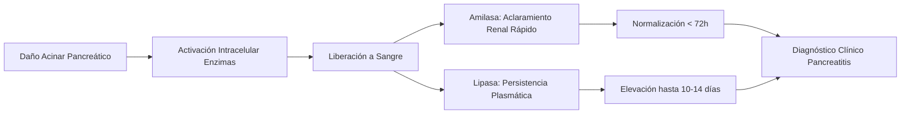
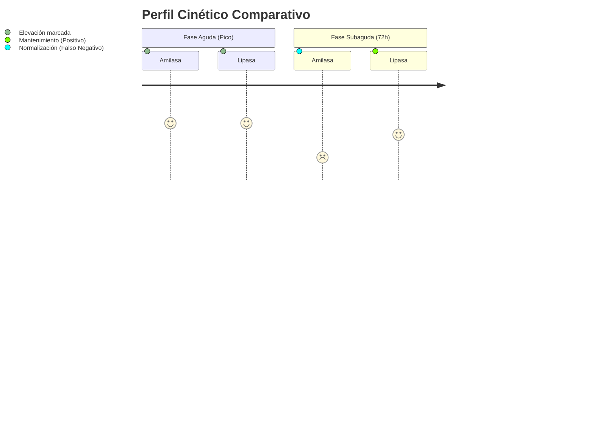
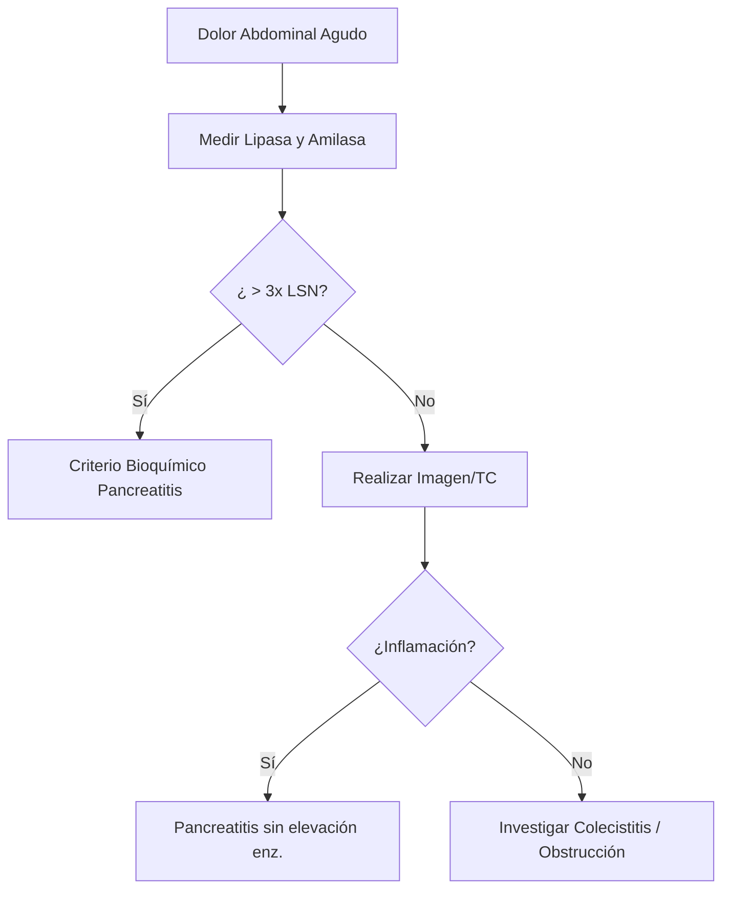

# Semana 1: Bioquímica
## Lección 2: Lipasa vs Amilasa: Diferencias, Similitudes e Implicaciones Clínicas

### 1. Título y Resumen (Abstract)
**Título:** Evaluación Comparativa de la Cinética de Amilasa y Lipasa en el Diagnóstico de Pancreatitis Aguda: Un Enfoque Anatomo-Fisiológico.
**Resumen:** Este artículo analiza la utilidad clínica de la amilasa y lipasa como biomarcadores de daño pancreático. Se evalúa su sensibilidad y especificidad en diferentes ventanas temporales tras el inicio del dolor abdominal, fundamentando su comportamiento en la fisiología exocrina del páncreas y los procesos de aclaramiento renal.

### 2. Introducción (Fundamentos y Objetivos)
#### 2.1. Fisiología y Cinética Enzimática (Módulo 1371)
El currículo oficial del **Módulo de Análisis Bioquímico** exige el conocimiento de la fisiología y cinética de las enzimas plasmáticas. Las enzimas son catalizadores biológicos que disminuyen la energía de activación de las reacciones metabólicas.
1.  **Amilasa (α-amilasa):** Hidrolasa que cataliza la hidrólisis de los enlaces α-1,4-glucosídicos. 
    - **Propiedades Físicas:** Bajo peso molecular (~50 kDa), permitiendo su filtración libre en el glomérulo (aclaramiento renal).
    - **Activación:** Requiere iones $Ca^{2+}$ (activador metálico) y $Cl^-$.
    - **Distribución:** Diferenciación entre isoenzimas tipo P (pancreática) y tipo S (salival).
2.  **Lipasa (Triacilglicerol acilhidrolasa):** Enzima específica del páncreas exocrino para la hidrólisis de triglicéridos de cadena larga.
    - **Cofactores:** Requiere colipasa y sales biliares para actuar en la interfaz agua-lípido (Módulo 1370).

#### 2.2. Fisiopatología de la Inflamación Pancreática (Módulo 1370)
En el módulo de **Fisiopatología General**, se detalla la necrosis pancreática. El daño a las células acinares provoca la liberación masiva de enzimas al espacio intersticial y sangre.
- **Cinética Diferencial:** La amilasa eleva precozmente (2-12h) pero desaparece en 48-72h. La lipasa es más sensible y permanece elevada hasta 14 días.
- **Interferencias Analíticas (Módulo 1368):** La turbidez lipémica interfiere en la fotometría de absorción, fenómeno común en pancreatitis agudas por hipertrigliceridemia etílica.

#### 2.3. Fundamentos Técnicos de la Medición (Módulo 1371)
- **Métodos Espectrofotométricos Dinámicos:** Medición de la tasa de formación de producto en el tiempo.
- **Relación Absorbancia-Concentración (Lambert-Beer):** Empleada en sistemas automatizados para cuantificar actividad catalítica (U/L).

**Objetivo:** Definir el algoritmo de validación técnica para el TSLCB, fundamentando el uso de la lipasa como marcador de elección sobre la amilasa.

### 3. Material y Métodos
- **Diseño:** Estudio técnico sobre protocolos de urgencias bioquímica.
- **Entorno:** Servicio de Urgencias y Análisis Clínicos, Hospital Universitario de Getafe.
- **Intervenciones:** Medición de actividad enzimática mediante métodos espectrofotométricos cinéticos de colorimetría enzimática (sustratos 4-nitrofenil o sustratos sintéticos específicos).

### 4. Resultados (Hallazgos Experimentales)
La comparación de perfiles muestra que la lipasa es superior en sensibilidad (90-100%) y especificidad frente a etiologías no pancreáticas (como parotiditis o insuficiencia renal).

### 5. Discusión y Conclusiones
La lipasa debe considerarse el marcador de referencia. El diagnóstico de laboratorio se establece clásicamente con valores > 3 veces el límite superior de la normalidad (LSN). Para el TEL, es fundamental identificar el estado de las amilasas séricas frente a las urinarias para descartar nefropatías.

### 6. Agradecimientos
Agradecemos al equipo de Bioquímica de la Comunidad de Madrid por la estandarización de métodos analíticos.

### 7. Bibliografía (Literatura Citada)
- **WGO: World Gastroenterology Organisation Global Guidelines - Acute Pancreatitis.** [Ver en worldgastroenterology.org](https://www.worldgastroenterology.org/guidelines/acute-pancreatitis)
- **Amilasa y Lipasa en el Diagnóstico de Pancreatitis - Manual SEQCML.** [Ver en seqc.es](https://www.seqc.es/es/bioquimica-en-el-laboratorio-clinico/manuales-y-monografias/)
- **Fisiología de la Secreción Pancreática Exocrina.** [Ver en elsevier.es](https://www.elsevier.es/es-revista-gastroenterologia-hepatologia-continuada-42-articulo-fisiologia-secrecion-pancreatica-exocrina-13094191)

---
### Sobre la Ponente
**María Sánchez Puche** es Residente de 1er año (R1) de Bioquímica Clínica en el **Hospital Universitario de Getafe**.

*Material adaptado al currículo profesional de Técnico de Laboratorio.*
