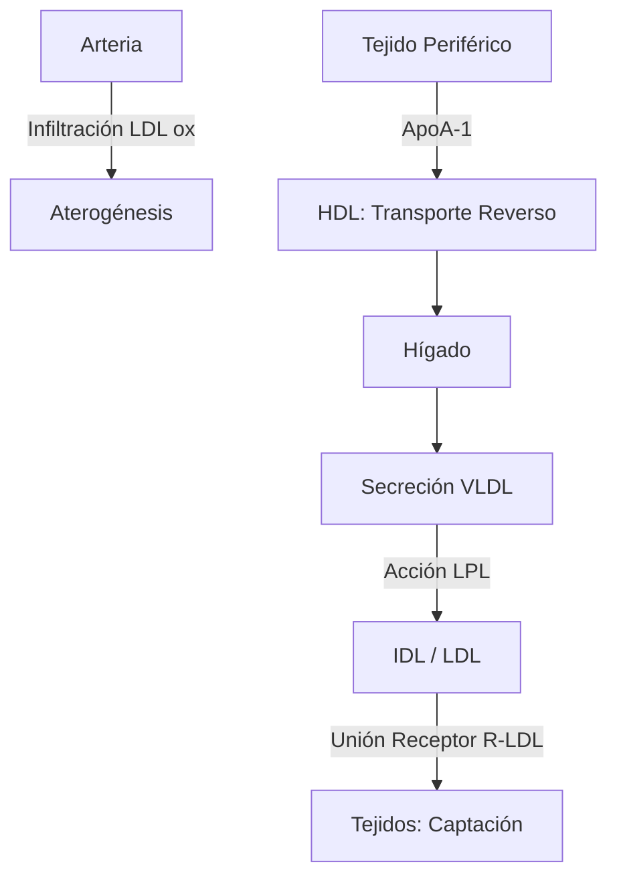
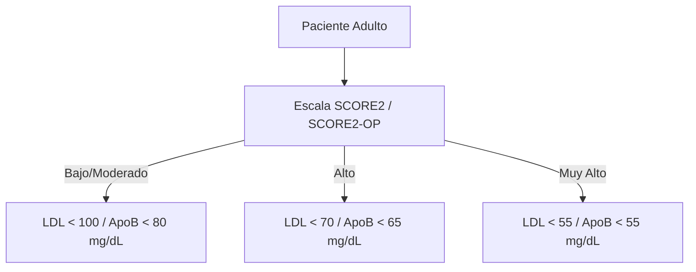
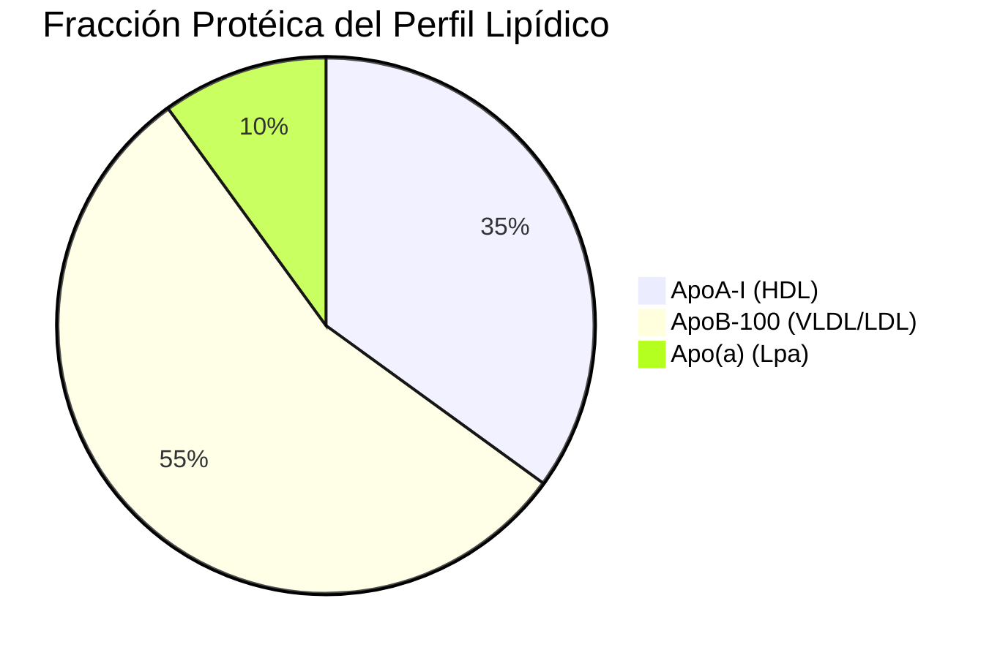

# Semana 1: Bioquímica
## Lección 3: Papel de las Lipoproteínas en la Enfermedad Cardiovascular

### 1. Título y Resumen (Abstract)
**Título:** Estratificación Avanzada del Riesgo Cardiovascular mediante el Perfil Lipídico Metabólico: Dinámica de Apolipoproteínas y Ratios Aterogénicos.
**Resumen:** Este artículo revisa la fisiopatología del transporte de lípidos y su implicación en la aterosclerosis. Se profundiza en el metabolismo de las lipoproteínas (vía endógena y exógena) y se justifica la importancia de la medición de ApoB y Lp(a) como marcadores de riesgo residual frente al c-LDL convencional, integrando las últimas recomendaciones de las sociedades europeas de cardiología y aterosclerosis.

### 2. Introducción (Fundamentos y Objetivos)
#### 2.1. Metabolismo de los Lípidos y Lipoproteínas (Módulo 1371)
El currículo oficial de **Análisis Bioquímico** para el TSLCB detalla la estructura y transporte de las lipoproteínas séricas (Módulo 1371). Los lípidos, al ser hidrofóbicos, se transportan en complejos anfipáticos formados por:
- **Núcleo:** Ésteres de colesterol y triglicéridos.
- **Capa Externa:** Fosfolípidos, colesterol libre y apolipoproteínas (ApoB-100, ApoA-1, entre otras).
- **Funcionalidad:** Actúan como cofactores enzimáticos y ligandos de receptores (Módulo 1370).

#### 2.2. Vías de Transporte y Aterogénesis (Módulo 1370)
La **Fisiopatología de los Lípidos** clasifica las vías de transporte:
1.  **Vía Exógena:** Los Quilomicrones transportan grasas dietéticas (ApoB-48). Su acumulación causa sueros lactescentes que el TSLCB debe identificar (Módulo 1368).
2.  **Vía Endógena:** El hígado secreta VLDL. La acción de la Lipoproteinlipasa (LPL) las transforma en IDL y finalmente en LDL.
3.  **Proceso Aterogénico:** Las LDL infiltran la íntima arterial. Su oxidación desencadena la respuesta inflamatoria local, formación de células espumosas y la placa de ateroma. 

#### 2.3. Fundamentos del Análisis en el Laboratorio (Módulo 1371/1368)
- **Determinación Fotométrica:** Uso de métodos enzimáticos colorimétricos con punto final (CHOD-PAP, GPO-PAP).
- **Cálculo de LDL (Friedewald):** $c-LDL = CT - (HDL + TG/5)$. Limitado a triglicéridos < 400 mg/dL.
- **Técnicas de Separación (Módulo 1368):** Centrifugación diferencial e inmunoensayos de fase líquida para HDL.

**Objetivo:** Estandarizar la identificación analítica de perfiles aterogénicos según el currículo oficial TSLCB, enfatizando el cálculo de c-no-HDL.

### 3. Material y Métodos
- **Diseño:** Análisis normativo de protocolos de lipidología clínica.
- **Entorno:** Laboratorio de Bioquímica, Hospital Universitario de Getafe.
- **Intervenciones:** Determinación de colesterol total, HDL y TG (métodos enzimáticos de punto final), LDL calculado (Ecuación de Friedewald vs Sampson) y determinación directa de ApoB y Lp(a) por inmunolumini/turbidimetría.

### 4. Resultados (Hallazgos Experimentales)
Estratificación según el nivel de ApoB y LDL-c objetivo (Guías 2024-2025):

### 5. Discusión y Conclusiones
El c-LDL es el objetivo primario, pero en situaciones de hipertrigliceridemia o diabetes, la ApoB refleja mejor el número total de partículas aterogénicas. Se concluye que el TEL debe monitorizar la presencia de sueros lípicos, ya que interfieren por turbidez en los métodos espectrofotométricos, requiriendo en ocasiones ultracentrifugación o aclaramiento químico.

### 6. Agradecimientos
A la unidad de Riesgo Vascular por la validación de los datos clínicos de pacientes en tratamiento con estatinas.

### 7. Bibliografía (Literatura Citada)
- **2024 ESC Guidelines for the Management of Cardiovascular Disease (CVD) Risk.** [Ver en academic.oup.com](https://academic.oup.com/eurheartj/article/42/34/3227/6358045)
- **EAS: European Atherosclerosis Society Guidelines on Dyslipidemias.** [Ver en eas-society.org](https://www.eas-society.org/)
- **Estudio del riesgo cardiovascular en el laboratorio - SEQCML.** [Ver en seqc.es](https://www.seqc.es/es/bioquimica-en-el-laboratorio-clinico/manuales-y-monografias/)
- **Protocolo de Prevención Cardiovascular de la Comunidad de Madrid.** [Ver en comunidad.madrid](https://www.comunidad.madrid/servicios/salud/prevencion-riesgo-cardiovascular)

---
### Sobre la Ponente
**Gema Sánchez Helguera** es Facultativa Especialista de Área (FEA) en Bioquímica Clínica en el **Hospital Universitario de Getafe**.

*Contenido alineado con el Módulo de Análisis Bioquímico del título oficial.*
