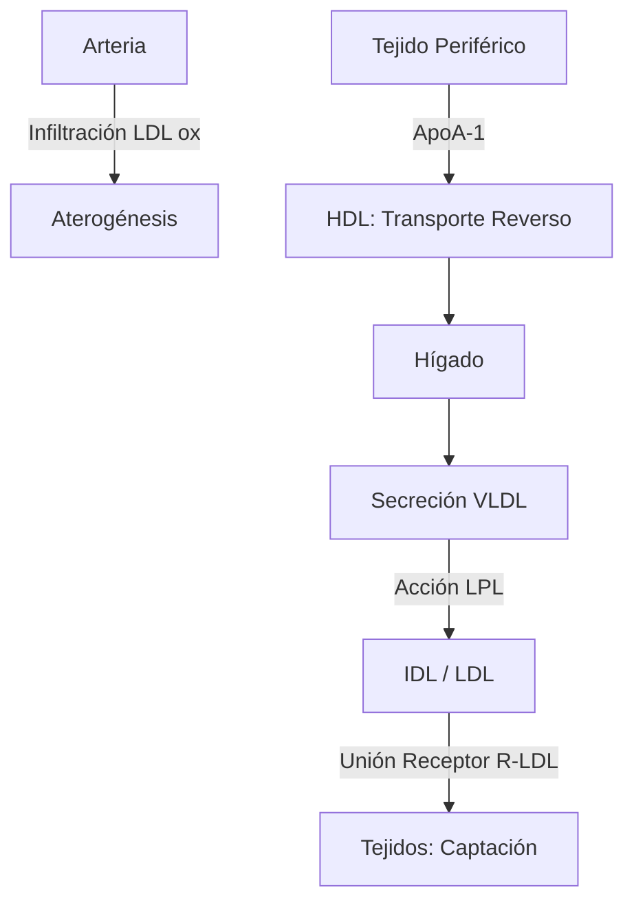
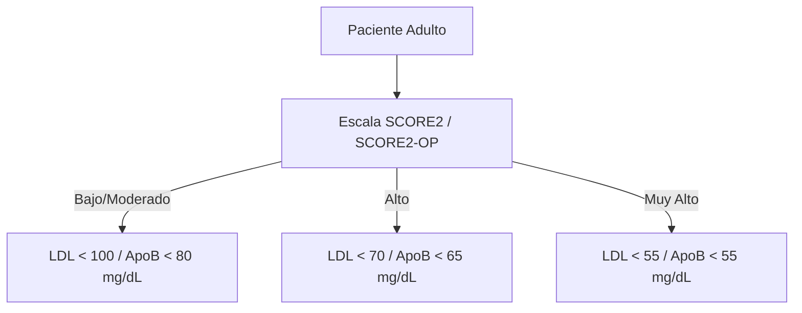
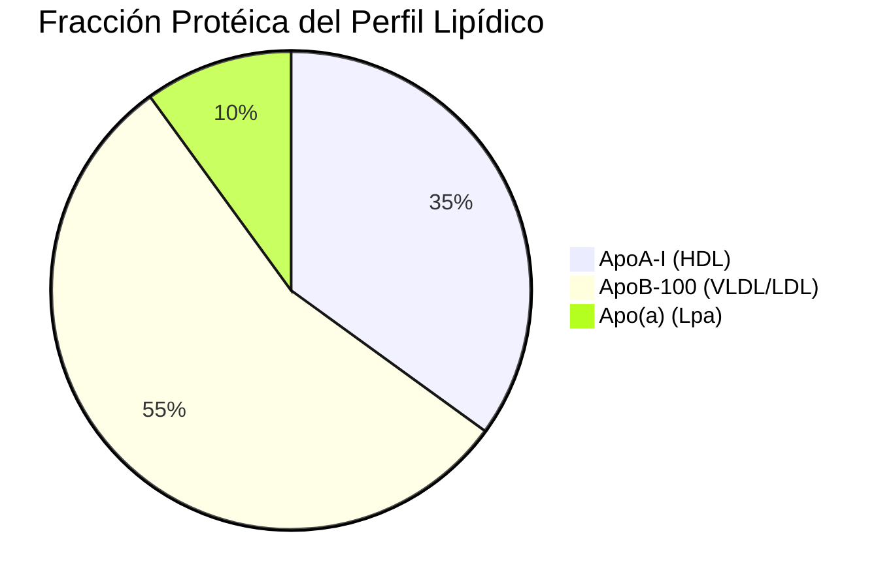

# Semana 1: Bioquímica
## Lección 3: Papel de las Lipoproteínas en la Enfermedad Cardiovascular

### 1. Título y Resumen (Abstract)
**Título:** Estratificación Avanzada del Riesgo Cardiovascular mediante el Perfil Lipídico Metabólico: Dinámica de Apolipoproteínas y Ratios Aterogénicos.
**Resumen:** Este artículo revisa la fisiopatología del transporte de lípidos y su implicación en la aterosclerosis. Se profundiza en el metabolismo de las lipoproteínas (vía endógena y exógena) y se justifica la importancia de la medición de ApoB y Lp(a) como marcadores de riesgo residual frente al c-LDL convencional, integrando las últimas recomendaciones de las sociedades europeas de cardiología y aterosclerosis.

### 2. Introducción (Fundamentos y Objetivos)
#### 2.1. Metabolismo de los Lípidos y Lipoproteínas (Módulo 1371)
El currículo oficial de **Análisis Bioquímico** para el TSLCB detalla la estructura y transporte de las lipoproteínas séricas (Módulo 1371). Los lípidos, al ser hidrofóbicos, se transportan en complejos anfipáticos formados por:
- **Núcleo:** Ésteres de colesterol y triglicéridos.
- **Capa Externa:** Fosfolípidos, colesterol libre y apolipoproteínas (ApoB-100, ApoA-1, entre otras).
- **Funcionalidad:** Actúan como cofactores enzimáticos y ligandos de receptores (Módulo 1370).

#### 2.2. Vías de Transporte y Aterogénesis (Módulo 1370)
La **Fisiopatología de los Lípidos** clasifica las vías de transporte:
1.  **Vía Exógena:** Los Quilomicrones transportan grasas dietéticas (ApoB-48). Su acumulación causa sueros lactescentes que el TSLCB debe identificar (Módulo 1368).
2.  **Vía Endógena:** El hígado secreta VLDL. La acción de la Lipoproteinlipasa (LPL) las transforma en IDL y finalmente en LDL.
3.  **Proceso Aterogénico:** Las LDL infiltran la íntima arterial. Su oxidación desencadena la respuesta inflamatoria local, formación de células espumosas y la placa de ateroma. 

#### 2.3. Fundamentos del Análisis en el Laboratorio (Módulo 1371/1368)
- **Determinación Fotométrica:** Uso de métodos enzimáticos colorimétricos con punto final (CHOD-PAP, GPO-PAP).
- **Cálculo de LDL (Friedewald):** $c-LDL = CT - (HDL + TG/5)$. Limitado a triglicéridos < 400 mg/dL.
- **Técnicas de Separación (Módulo 1368):** Centrifugación diferencial e inmunoensayos de fase líquida para HDL.

**Objetivo:** Estandarizar la identificación analítica de perfiles aterogénicos según el currículo oficial TSLCB, enfatizando el cálculo de c-no-HDL.

### 3. Material y Métodos
- **Diseño:** Análisis normativo de protocolos de lipidología clínica.
- **Entorno:** Laboratorio de Bioquímica, Hospital Universitario de Getafe.
- **Intervenciones:** Determinación de colesterol total, HDL y TG (métodos enzimáticos de punto final), LDL calculado (Ecuación de Friedewald vs Sampson) y determinación directa de ApoB y Lp(a) por inmunolumini/turbidimetría.

### 4. Resultados (Hallazgos Experimentales)
Estratificación según el nivel de ApoB y LDL-c objetivo (Guías 2024-2025):

### 5. Discusión y Conclusiones
El c-LDL es el objetivo primario, pero en situaciones de hipertrigliceridemia o diabetes, la ApoB refleja mejor el número total de partículas aterogénicas. Se concluye que el TEL debe monitorizar la presencia de sueros lípicos, ya que interfieren por turbidez en los métodos espectrofotométricos, requiriendo en ocasiones ultracentrifugación o aclaramiento químico.

### 6. Agradecimientos
A la unidad de Riesgo Vascular por la validación de los datos clínicos de pacientes en tratamiento con estatinas.

### 7. Bibliografía (Literatura Citada)
- **2024 ESC Guidelines for the Management of Cardiovascular Disease (CVD) Risk.** [Ver en academic.oup.com](https://academic.oup.com/eurheartj/article/42/34/3227/6358045)
- **EAS: European Atherosclerosis Society Guidelines on Dyslipidemias.** [Ver en eas-society.org](https://www.eas-society.org/)
- **Estudio del riesgo cardiovascular en el laboratorio - SEQCML.** [Ver en seqc.es](https://www.seqc.es/es/bioquimica-en-el-laboratorio-clinico/manuales-y-monografias/)
- **Protocolo de Prevención Cardiovascular de la Comunidad de Madrid.** [Ver en comunidad.madrid](https://www.comunidad.madrid/servicios/salud/prevencion-riesgo-cardiovascular)

---
### 8. Charla y Transcripción (Contenido Multimedia)

**Enlace al vídeo:** [Ver en YouTube](https://www.youtube.com/watch?v=Q1r10k991oU)

#### Transcripción de la Sesión
> Hola, buenos días a todos. Bienvenidos a la séptima edición del curso de actualización en el laboratorio clínico. Yo soy Gema Sánchez Helguera, facultativo especialista en bioquímica clínica del Hospital Universitario de Getafe y hoy os voy a hablar de riesgo cardiovascular del laboratorio y las nuevas guías de práctica clínica. Este es el índice que voy a seguir. Primero hablaremos de forma muy general del metabolismo lipídico, luego de la teresclerosis, de las guías de práctica clínica, de las nuevas metas de LD del de L del colesterol y al final terminaremos con unos mensajes para llevarnos a casa. Eh las enfermedades cardiovasculares siguen siendo la principal causa de muerte en España, de hecho casi un 25 por ciento de la de las muertes que se producen al año son debidas a la enfermedad cardiovascular. Eh las de la forma general podemos decir que las lipoproteínas se clasifican en cinco cinco clases dependiendo de su tamaño y de su densidad y eso lo confiere la el porcentaje que tengan de lípido y de proteína. Así que desde los kilomicrones son las más grandes y las menos densas hasta las hdl que son las hdl que son las más pequeñas y las más densas. A su vez también las apolipoproteínas que tienen cada una estas partículas es diferente. Como podéis ver en el gráfico de abajo las partículas los kilómetrones la que tienen es la polipoapoproteína B cuarenta y ocho y vldl ile hdl y el la LDL tiene la poliproina ve cien esto es importante porque eh a la hora de de ver qué riesgo tiene el paciente el tener una u otra pues tiene una implicación u otra. El metabolismo h de los lípidos se divide en dos vías. La vía exógena que es la de transporte los lípidos de la dieta que vienen a través de los kilómetrones de los kilomicrones y la vía endógena que es los lípidos que se sintetizan a nivel de ligado a través de la formación de partículas de vldl que el que liberan los triglicéridos a los tejidos a través de la lpl y luego van van convirtiéndose hasta h de perdón hasta LDL a LDL. Eh el como decía el primer paso de la de la formación de la aterotrombosis perdón de la aterosclerosis es la formación de es la deposición de esas de esas partículas de LDL en la en la pared endotelial de la arteria. Eh la elevación de LDL colesterol es un factor causal en el desarrollo de la de la enfermedad cardiovascular y de hecho numerosos estudios tanto con estatinas estetiniba y con los inhibidores pc sk nueve han demostrado que las concentraciones reducidas de del colesterol se asocian a un menor riesgo de infarto y de infarto. Eh a su vez hay otras otras partículas que también cobran importancia hoy en día como son la lipoproteína a. La lipoproteína a se considera un un factor de riesgo cardiovascular independiente de LDL colesterol y además es un es un factor pro inflamatorio y trombótico y la diferencia de esta partícula es que el 90 por ciento viene determinado genéticamente, es decir que no los niveles que tengamos no dependen de los de la dieta de lo que comamos de lógicamente así que con una vez que lo midamos eh suele ser estable durante toda la vida. Por tanto en un paciente debería medirse al menos una sola vez eh lo si las guías de práctica clínica sobre las que me basa la la mi presentación son las de dos mil veintiuno de la sep y la eas. Eh las guía de de prevenciones enfermedades cardiovasculares en la práctica clínica el eh el estas guías proponen eh el uso de estimar el el riesgo de estos pacientes a través de la escala de score dos para personas de entre cuarenta y setenta años y score dos op para más de setenta años. Eh esta escala eh lo que nos va a medir perdón eh perdón nos va a nos va a clasificar a los pacientes en riesgo bajo moderado alto o muy alto y esto lo lo hace basándose en el colesterol no h d l de los pacientes la edad del paciente su presión arterial sistólica y si eso no fumador. El colesterol no h de l no es una cosa que nosotros miramos en el laboratorio sino que es un parámetro calculado. Se calcula restando el colesterol total menos el l h de l y este parámetro es un reflejo de toda la carga térmica que tiene el paciente de hecho es como una forma de que te de medir mejor el riesgo que el que l perdón que el LDL colesterol. Las guías de práctica clínica dos mil veintiuno de la eas lo que nos nos va a indicar es qué objetivos tenemos que tener nosotros para ese paciente dependiendo de si de si de qué nivel de riesgo tenga nuestro paciente de forma de que si tiene riesgo bajo tiene que tener un LDL colesterol de menores de cien y el no h de h de l menor de ciento treinta, si es muy riesgo muy alto pues tiene que tener h LDL colesterol de cincuenta y cinco perdón LDL de cincuenta y cinco y no de h perdón no el no h d h l perdón de h L de ochenta. Una de las causas eh perdón eh otras de las de las otras de las marcadores que están que hoy en día también están el apopo ve, la apo ve es el el es una molécula que que se muer perdón es es una es la apoli proteína que se encuentra en cada toda cada una de las de las de las de las lipoproteínas atrogénicas como ldl y de l v l v l de l por lo tanto cuando medimos apo ve lo que estamos haciendo es medir todas las partículas atrogénicas que tiene el suero del paciente. Eh este la apo ve la apo ve tiene la ventaja de que no de que su medición es exacta no es calculado como l de l por tanto en algunos casos nos puede dar una m perdón una medición más precisa del riesgo del paciente. En cuanto a las recomendaciones de las guías eh en cuanto a de laboratorio de cómo tenemos que pedir los pacientes eh en cuanto a las condiciones del paciente pues eh con las de ya las de perdón las recomendaciones son de que no se necesita ayuno para el el cribado de rutina es decir que un paciente que se ha hecho una analítica y no eh si bien si desayunado antes no sería impedimento para por lo menos la para ver de forma general cómo está su perfil lipídico. En cuanto a las perdón en cuanto a las mediciones para para para en el laboratorio el marcador primario que que para el cribado de rutina l d l colesterol el no h del no h d h de l se recomienda en pacientes con hiper triglicidemia diabetes obesidad ya que como hemos dicho reflejan mucho más mide mejor el riesgo y la apopo ve también se puede usar en esos pacientes como como marcador de perdón como como marcador secundario para pacientes perdón una medición de riesgo. La Lp de a Lp Lp lipoproteína a perdón eh se recomienda que se mida al menos una sola vez en la vida en de de cada cada adulto. Por último qué mensaje nos debemos llevar a casa? El colesterol LDL es la causa es la causa fundamental de desterrosclerosis y sus concentraciones plasmáticas y el tiempo que de exposición están directamente relacionados con el riesgo de enfermedades cardiovasculares. El colesterol no h de no h de l h d perdón el h d L el no h d l colesterol y la po B son son dos indicadores que nos muestran el número de partículas atogénicas en sangre y nos pueden ser muy útiles en pacientes obesos y diabéticos. Eh las se debe estimar eh el riesgo cardíaco cardiovascular en personas asintomáticas mediante la escala score dos y score score dos op. Eh la Lp Lp lipoproteína a perdón se recomienda que se se mueva se mide al menos una sola vez en cada vida del cada persona en el caso de cada adulto para detectar personas con elevado riesgo cardiovascular hereditario. Por último decir que no es necesario el ayuno profiláctico para para para las analíticas de de rutina para el riesgo cardiovascular. Muchas gracias por su atención y ya está.

#### Explicación de la Ponencia
La sesión redefine el papel del laboratorio en el manejo del riesgo cardiovascular, moviendo el foco del "colesterol total" hacia el **número y tamaño de las partículas aterogénicas**:
1.  **Apolipoproteína B (apo B)**: Se posiciona como una técnica superior a la medición aislada de LDL-C. Dado que cada partícula aterogénica (VLDL, IDL, LDL) contiene exactamente una molécula de apo B, medirla es equivalente a contar el número de partículas. Esto es vital en pacientes con diabetes u obesidad, donde las partículas pueden ser pequeñas y densas (patrón B).
2.  **Lipoproteína(a)**: La ponente subraya que su valor es estable de por vida y está determinado genéticamente. Identificar niveles elevados es crucial para explicar eventos cardiovasculares prematuros en pacientes con perfiles lipídicos estándar aparentemente normales.
3.  **Cambio en la Preanalítica**: Un punto disruptor para el TSLCB es la flexibilización del ayuno. Las guías actuales permiten la extracción postprandial para el cribado inicial, simplificando la logística para el paciente, aunque manteniendo el ayuno estricto para la confirmación de hipertrigliceridemias.
4.  **Descarte de Causas Secundarias**: Se enfatiza el papel proactivo del facultativo de laboratorio al ampliar pruebas (como TSH para descartar hipotiroidismo o glucosa para diabetes) ante dislipidemias de nuevo diagnóstico.

---
### Sobre la Ponente
**Gema Sánchez Helguera** es FEA del Servicio de Análisis Clínicos y responsable del área de Bioquímica de Rutina y Biología Molecular del **Hospital Universitario de Getafe**.

*Contenido actualizado con transcripción y análisis de riesgo cardiovascular - Marzo 2026*
*Material adaptado al currículo profesional de Técnico de Laboratorio.*
