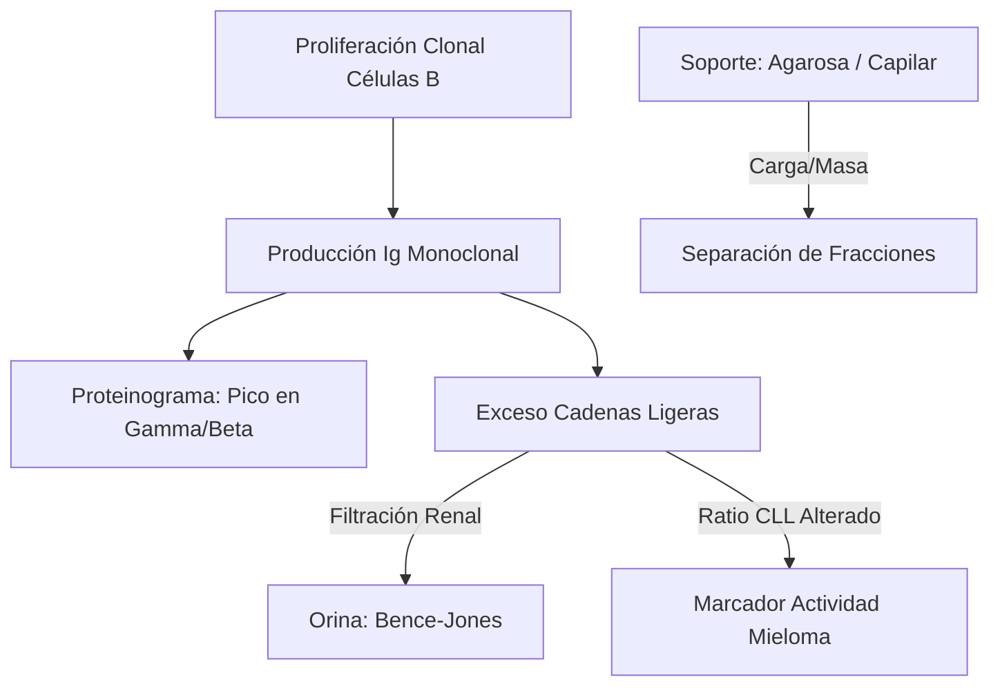
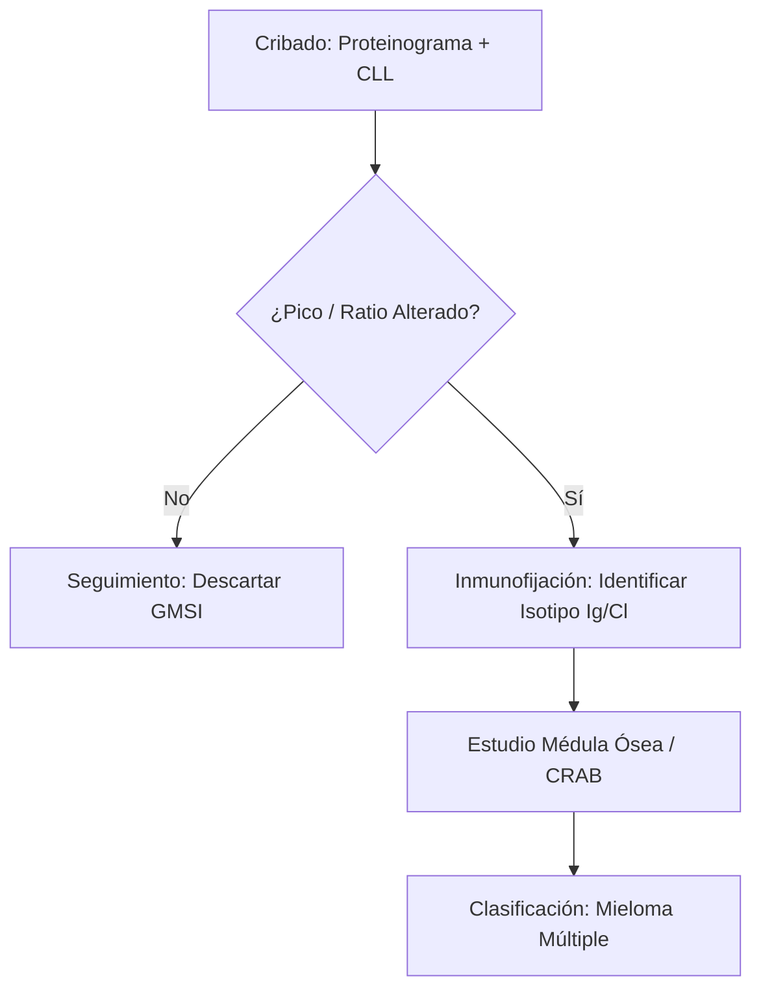
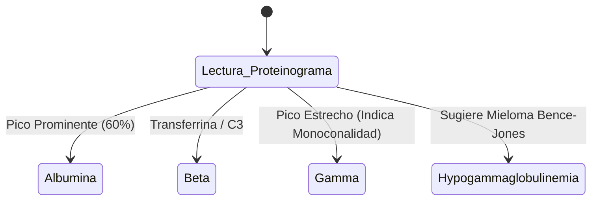

# Semana 1: Bioquímica
## Lección 4: Abordaje de Gammapatías Monoclonales desde la Bioquímica Celular

### 1. Título y Resumen (Abstract)
**Título:** Optimización del Cribado de Gammapatías Monoclonales: Del Proteinograma de Alta Resolución a la Caracterización Molecular de Cadenas Ligeras.
**Resumen:** Este artículo analiza los fundamentos celulares de las gammapatías y valida el uso de la electroforesis capilar y el estudio de cadenas ligeras libres (CLL) en el algoritmo diagnóstico. Se evalúa la transición tecnológica hacia la espectrometría de masas, destacando la importancia de la precisión analítica en la detección precoz del Mieloma Múltiple y la GMSI.

### 2. Introducción (Fundamentos y Objetivos)
#### 2.1. Inmunopatología de las Gammapatías (Módulo 1370)
El currículo de **Fisiopatología General** (Módulo 1370) incluye el estudio de las neoplasias del sistema inmunitario. Las gammapatías monoclonales resultan de la proliferación de un solo clon de células B (generalmente plasmocitos) que producen una inmunoglobulina idéntica: el componente monoclonal (CM) o **Proteína M**.
- **Clonalidad:** A diferencia de la respuesta policlonal (infecciones), aquí hay una restricción de cadena ligera (solo Kappa o solo Lambda).
- **Cadenas Ligeras Libres (CLL):** Exceso de cadenas que, por su bajo peso molecular, filtran al glomérulo (Proteína de Bence-Jones).

#### 2.2. Fundamentos Físicos de la Electroforesis (Módulo 1368/1371)
El **Módulo de Técnicas Generales de Laboratorio** establece los principios de separación electroforética:
1.  **Campo Eléctrico:** Migración de proteínas cargadas en un medio soporte.
2.  **Carga Neta:** Dependiente del pH del tampón (alcalino, pH 8.6 para que las proteínas tengan carga negativa).
3.  **Electroendosmosis:** Flujo de disolvente hacia el cátodo que desplaza a las globulinas en soportes de agarosa.
4.  **Técnicas Capilares:** Utilización de microtubos de sílice que permiten voltajes de hasta 30 kV con disipación eficiente del Efecto Joule.

#### 2.3. Inmunodiagnóstico Avanzado (Módulo 1372)
- **Inmunofijación (IFE):** Técnica de precipitación in situ con antisueros específicos (G, A, M, K, L) tras la electroforesis.
- **Cuantificación de CLL:** Inmunoensayos competitivos de alta sensibilidad para el ratio K/L.

**Objetivo:** Establecer los criterios técnicos de validación para la integración del proteinograma y el ratio CLL según el sistema de calidad regional.

### 3. Material y Métodos
- **Entorno:** Laboratorio de Proteínas, Hospital Universitario Severo Ochoa.
- **Intervenciones:** Electroforesis capilar de alta resolución (seis capilares de sílice), inmunofijación en gel de agarosa y cuantificación de CLL por quimioluminiscencia. Comparativa experimental con Espectrometría de Masas (MS-IA).

### 4. Resultados (Hallazgos Experimentales)
Algoritmo de respuesta y perfiles de bandas:

### 5. Discusión y Conclusiones
La combinación de proteinograma y CLL tiene una sensibilidad diagnóstica > 99%. Se concluye que la pericia del TEL en la identificación de "picos" atípicos en la zona Beta es fundamental, dado que la IgA migra frecuentemente en esta posición. La espectrometría de masas sustituirá progresivamente a la inmunofijación por su capacidad de detectar clones residuales mínimos de alta relevancia pronóstica.

### 6. Agradecimientos
Al equipo de Hematología del Hospital Severo Ochoa por la cesión institucional de datos de biosupervivencia tras tratamiento.

### 7. Bibliografía (Literatura Citada)
- **International Myeloma Working Group (IMWG) Updated Criteria for the Diagnosis of Multiple Myeloma.** [Ver en myeloma.org](https://www.myeloma.org/resource/imwg-updated-criteria-diagnosis-multiple-myeloma)
- **Diagnóstico y Seguimiento de Gammapatías Monoclonales - Guía SEQCML.** [Ver en seqc.es](https://www.seqc.es/es/bioquimica-en-el-laboratorio-clinico/manuales-y-monografias/)
- **Guía de Práctica Clínica para el tratamiento del Mieloma Múltiple.** [Ver en semh.es](https://www.sehh.es/index.php?option=com_content&view=article&id=1000)
- **Interpretation of Serum Protein Electrophoresis - AAFP.** [Ver en aafp.org](https://www.aafp.org/afp/2005/0101/p105.html)

---
### Sobre la Ponente
**Raquel Jáñez Carrera** es Facultativa Especialista de Área (FEA) en el **Hospital Universitario Severo Ochoa**.

*Material técnico ampliado para el Grado Superior de Laboratorio Clínico.*
