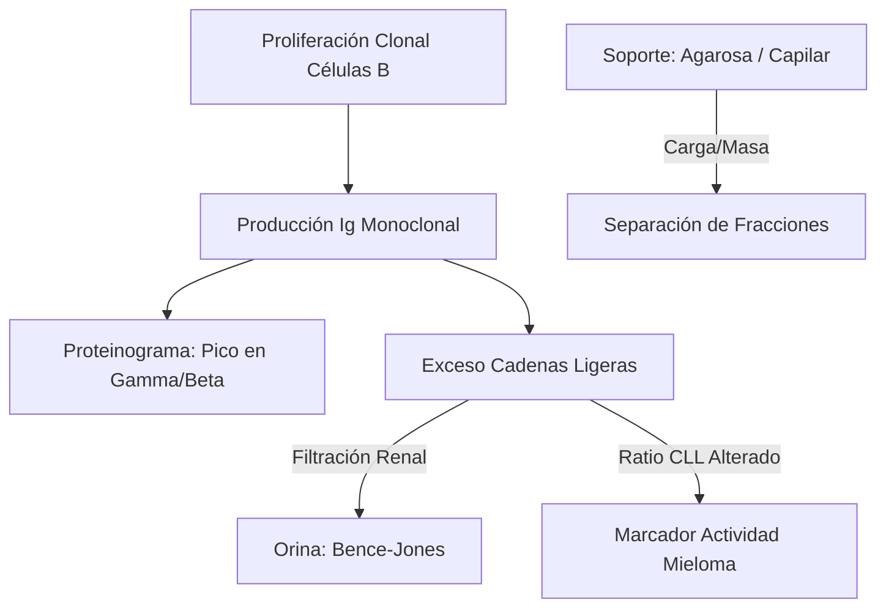
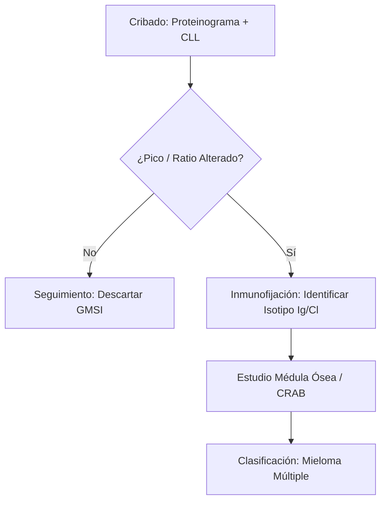
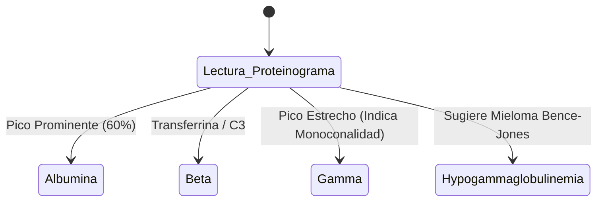

# Semana 1: Bioquímica
## Lección 4: Abordaje de Gammapatías Monoclonales desde la Bioquímica Celular

### 1. Título y Resumen (Abstract)
**Título:** Optimización del Cribado de Gammapatías Monoclonales: Del Proteinograma de Alta Resolución a la Caracterización Molecular de Cadenas Ligeras.
**Resumen:** Este artículo analiza los fundamentos celulares de las gammapatías y valida el uso de la electroforesis capilar y el estudio de cadenas ligeras libres (CLL) en el algoritmo diagnóstico. Se evalúa la transición tecnológica hacia la espectrometría de masas, destacando la importancia de la precisión analítica en la detección precoz del Mieloma Múltiple y la GMSI.

### 2. Introducción (Fundamentos y Objetivos)
#### 2.1. Inmunopatología de las Gammapatías (Módulo 1370)
El currículo de **Fisiopatología General** (Módulo 1370) incluye el estudio de las neoplasias del sistema inmunitario. Las gammapatías monoclonales resultan de la proliferación de un solo clon de células B (generalmente plasmocitos) que producen una inmunoglobulina idéntica: el componente monoclonal (CM) o **Proteína M**.
- **Clonalidad:** A diferencia de la respuesta policlonal (infecciones), aquí hay una restricción de cadena ligera (solo Kappa o solo Lambda).
- **Cadenas Ligeras Libres (CLL):** Exceso de cadenas que, por su bajo peso molecular, filtran al glomérulo (Proteína de Bence-Jones).

#### 2.2. Fundamentos Físicos de la Electroforesis (Módulo 1368/1371)
El **Módulo de Técnicas Generales de Laboratorio** establece los principios de separación electroforética:
1.  **Campo Eléctrico:** Migración de proteínas cargadas en un medio soporte.
2.  **Carga Neta:** Dependiente del pH del tampón (alcalino, pH 8.6 para que las proteínas tengan carga negativa).
3.  **Electroendosmosis:** Flujo de disolvente hacia el cátodo que desplaza a las globulinas en soportes de agarosa.
4.  **Técnicas Capilares:** Utilización de microtubos de sílice que permiten voltajes de hasta 30 kV con disipación eficiente del Efecto Joule.

#### 2.3. Inmunodiagnóstico Avanzado (Módulo 1372)
- **Inmunofijación (IFE):** Técnica de precipitación in situ con antisueros específicos (G, A, M, K, L) tras la electroforesis.
- **Cuantificación de CLL:** Inmunoensayos competitivos de alta sensibilidad para el ratio K/L.

**Objetivo:** Establecer los criterios técnicos de validación para la integración del proteinograma y el ratio CLL según el sistema de calidad regional.

### 3. Material y Métodos
- **Entorno:** Laboratorio de Proteínas, Hospital Universitario Severo Ochoa.
- **Intervenciones:** Electroforesis capilar de alta resolución (seis capilares de sílice), inmunofijación en gel de agarosa y cuantificación de CLL por quimioluminiscencia. Comparativa experimental con Espectrometría de Masas (MS-IA).

### 4. Resultados (Hallazgos Experimentales)
Algoritmo de respuesta y perfiles de bandas:

### 5. Discusión y Conclusiones
La combinación de proteinograma y CLL tiene una sensibilidad diagnóstica > 99%. Se concluye que la pericia del TEL en la identificación de "picos" atípicos en la zona Beta es fundamental, dado que la IgA migra frecuentemente en esta posición. La espectrometría de masas sustituirá progresivamente a la inmunofijación por su capacidad de detectar clones residuales mínimos de alta relevancia pronóstica.

### 6. Agradecimientos
Al equipo de Hematología del Hospital Severo Ochoa por la cesión institucional de datos de biosupervivencia tras tratamiento.

### 7. Bibliografía (Literatura Citada)
- **International Myeloma Working Group (IMWG) Updated Criteria for the Diagnosis of Multiple Myeloma.** [Ver en myeloma.org](https://www.myeloma.org/resource/imwg-updated-criteria-diagnosis-multiple-myeloma)
- **Diagnóstico y Seguimiento de Gammapatías Monoclonales - Guía SEQCML.** [Ver en seqc.es](https://www.seqc.es/es/bioquimica-en-el-laboratorio-clinico/manuales-y-monografias/)
- **Guía de Práctica Clínica para el tratamiento del Mieloma Múltiple.** [Ver en semh.es](https://www.sehh.es/index.php?option=com_content&view=article&id=1000)
- **Interpretation of Serum Protein Electrophoresis - AAFP.** [Ver en aafp.org](https://www.aafp.org/afp/2005/0101/p105.html)

---
### 8. Charla y Transcripción (Contenido Multimedia)

**Enlace al vídeo:** [Ver en YouTube](https://www.youtube.com/watch?v=IpWRSEyPL4E)

#### Transcripción de la Sesión
> Hola a todos, soy Raquel Jáñez, facultativa especialista en bioquímica clínica del Hospital Universitario Severo Ochoa de Leganés. En la sesión de hoy os voy a hablar sobre el abordaje de las gammapatías monoclonales desde el laboratorio de bioquímica clínica. Las gammapatías monoclonales son una serie de trastornos caracterizados por la proliferación clonal de células B en sus últimos estadios de diferenciación, que son las células plasmáticas. Estas células plasmáticas lo que van a liberar a la sangre es una inmunoglobulina eh o un fragmento de la mima, lo que conocemos habitualmente como paraproteína o componente monoclonal. Como recordatorio, las inmunoglobulinas eh están formadas por dos cadenas pesadas y por dos cadenas ligeras que están eh unidas mediante enlaces de disulfuro. Según las cadenas pesadas tenemos diferentes isotipos. Eh la G, la A, la M, la D y la E. Y las cadenas ligeras pues pueden ser de dos tipos kappa o lambda. Las gammapatías monoclonales eh abarcan un gran abanico de enfermedades que van desde patologías benignas a patologías muy m muy graves. El espectro es muy amplio. Entre ellas pues tenemos eh la gammapatía monoclonal de significado incierto o GMSI, el mieloma múltiple o la amiloidosis o la macroglobulinemia de Waldeström. El laboratorio clínico es una pieza fundamental tanto en el estudio del cribado como en el diagnóstico y seguimiento de estos pacientes. El estudio de una amapatia monoclonal tiene tres fases. Una primera fase de detección que se realiza mediante la electroforesis de proteínas o proteinograma. En una segunda fase eh lo que tenemos que hacer es cuantificar ese componente monoclonal y en una tercera fase de identificación del mismo que se realizará mediante la inmunofijación. El primer paso eh por tanto es la detección eh y por para ello realizamos el proteinograma. El proteinograma como veis en la imagen es eh una representación en bandas eh o picos de las diferentes de las diferentes eh facciones del suero. Cuando en el se produce el pico eh la banda tiene esta forma típica eh un pico estrecho picudo y esto nos hace sospechar que que que nos encontramos ante un componente monoclonal que debemos identificar posteriormente. La técnica por excelencia usada en los laboratorios de bioquímica es la electroforesis capilar de alta resolución ya que es una técnica eh muy rápida muy sensible y automatizada. En cuanto a la cuantificación eh lo realizamos mediante la tensitometría es decir la cuantificación de de ese pico que que nos ha dado el proteinograma y posteriormente lo que tendremos que hacer es identificarlo es decir ponerle nombre y apellido a esa inmunoglobulina pues una IGG kappa IGA lda o o el tipo que sea. Para ello utilizamos la técnica de inmunofijación la inmunofijación es una técnica eh basada en la inmunoprecipitación una vez de que se ha producido la electroforesis en g de agarosa lo que eh se se se emplean son antisueros contra las tres cadenas pesadas más frecuentes GMA y las dos ligeras kappa y lambda. Entonces eh donde se produzca esa m esa banda de precipitación o ese esa banda en el gel pues nos dirá el tipo de h de inmunoglobulina que tiene el paciente. El estudio de las proteínas orina es eh una pieza clave en el estudio de estas gammapatías ya que en muchas ocasiones eh el el en sangre no vemos el componente monoclonal pero sí se libera por orina lo que conocemos como proteinuria de Bence Jones que son las cadenas ligeras libres que filtran por el riñón. Para realizar el estudio en orina eh lo que tenemos que hacer es una concentración de la muestra por tanto para ello disponemos de unos dispositivos que m de filtración Amicom Ultra de diez kilovaltos que eh lo que nos permiten es concentrar la muestra unas cincuenta veces para que posteriormente elproteinograma de orina se vea mejor. Por ello es muy importante que eh m al el personal técnico del laboratorio para la concentración de orina se se haga de de una manera eh de una manera correcta. Finalmente eh voy a hablar sobre el cociente de las cadenas ligueras libres kappa y lambda eh os lo han comentado en un inmunoensayo en fase de quimioluminiscencia y eh es muy importante sobre todo en el mieloma múltiple de cadenas ligeras que solo eh el paciente solo fabrica cadenas ligeras y y no inmunoglobulina completa y eh se se mira el ratio kappa lambda el valor de referencias va de cero veintiséis a uno sesenta y cinco pero tenemos que tener mucho cuidado con el paciente eh nefrótico un paciente con insuficiencia renal ya que este ratio suele estar aumentado en estos en estos pacientes por una disminución de su acareamiento. Bueno con todo esto espero que os haya servido de ayuda de ayuda a los fundamentos básicos para el estudio de las amapatitmonoclonales y para cualquier duda o consulta pues eh m hacernos eh podéis pasaros por el laboratorio de proteínas. Muchas gracias por vuestra atención.

#### Explicación de la Ponencia
La sesión profundiza en el **flujo de trabajo diagnóstico** para las gammapatías monoclonales, destacando innovaciones tecnológicas clave para el TSLCB:
1.  **Electroforesis Capilar vs. Gel de Agarosa**: Se resalta la superioridad de la electroforesis capilar en términos de automatización, eliminación de errores manuales de dispensación y mayor resolución. Para el técnico, es fundamental entender que la detección en capilar se basa en la absorbancia de los enlaces peptídicos a 200-214 nm, lo que evita la variabilidad de afinidad de los colorantes tradicionales.
2.  **Inmunotipado (Inmunosustracción)**: Se explica como una técnica rápida y automatizada en fase líquida donde los inmunocomplejos se "desplazan" hacia la zona de la albúmina, permitiendo identificar el isotipo por la desaparición del pico original.
3.  **Inmunofijación**: Sigue siendo el "gold standard" para la máxima sensibilidad, especialmente crítica en la monitorización de la **Respuesta Completa** tras el tratamiento, donde un pico puede ser invisible en la electroforesis convencional pero detectable en gel.
4.  **Manejo de la Orina (Bence Jones)**: Un punto procedimental crítico para el laboratorio es la **concentración previa** de la muestra. La ponente detalla el uso de dispositivos Amicon Ultra (10 kDa) para asegurar que las cadenas ligeras no se pierdan en el proceso y puedan ser cuantificadas correctamente por electroforesis.
5.  **Cociente Kappa/Lambda (Freelite)**: Se subraya la importancia de ajustar el rango de referencia en pacientes con **insuficiencia renal** (0.85-3.6), un ajuste vital para evitar falsos positivos de monoclonalidad debidos a la disminución del aclaramiento renal.

---
### Sobre la Ponente
**Raquel Jáñez** es Facultativa Especialista de Área (FEA) en Bioquímica Clínica del **Hospital Universitario Severo Ochoa de Leganés**.

*Contenido actualizado con transcripción y análisis técnico de gammapatías - Marzo 2026*
*Material adaptado al currículo profesional de Técnico de Laboratorio.*
