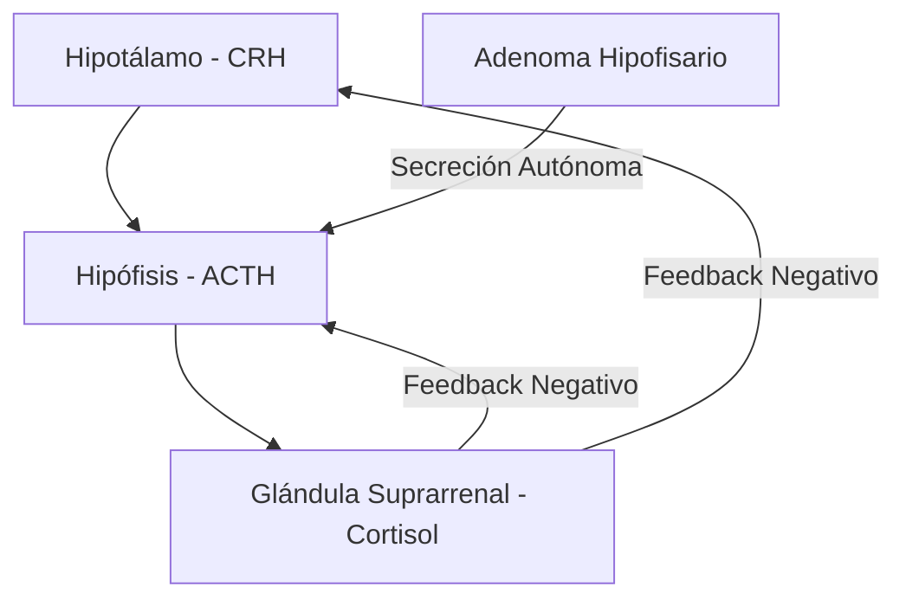
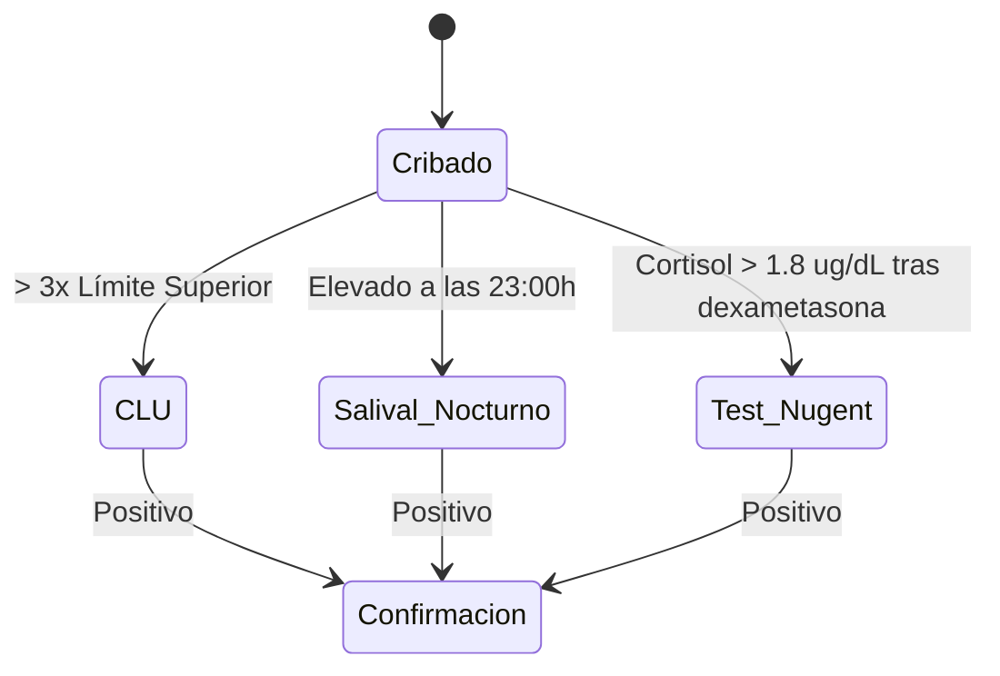

# Semana 2: Hormonas
## Lección 1: Cushing: ¿Síndrome o Enfermedad? Papel del Laboratorio en su Diagnóstico

### 1. Título y Resumen (Abstract)
**Título:** Abordaje Diagnóstico Diferencial del Hipercortisolismo: Optimización de Pruebas Dinámicas y Variabilidad Preanalítica.
**Resumen:** Este estudio analiza la fisiopatología del eje hipotálamo-hipofisario-suprarrenal, distinguiendo entre el síndrome de Cushing (endógeno/exógeno) y la enfermedad de Cushing. Se evalúa el rendimiento de las pruebas de cribado (cortisol libre urinario, salival nocturno y test de Nugent) y se profundiza en la complejidad de la fase de confirmación etiológica mediante la medición de ACTH e inmunofijación de muestras dinámicas.

### 2. Introducción (Fundamentos y Objetivos)
#### 2.1. Fisiología del Eje Adrenal (Módulo 1370/1371)
El currículo oficial del **Módulo de Análisis Bioquímico** exige el conocimiento del eje hipotálamo-hipofisario-suprarrenal.
1.  **Hormonas implicadas:** CRH (Hipotálamo), ACTH (Hipófisis) y Cortisol (Corteza Suprarrenal).
2.  **Ritmo Circadiano:** El cortisol presenta un pico máximo matutino (08:00h) y un nadir nocturno (00:00h). La pérdida de este ritmo es el primer signo de patología.
3.  **Funciones del Cortisol:** Catabolismo proteico, gluconeogénesis y acción antiinflamatoria (Módulo 1370).

#### 2.2. Fisiopatología del Hipercortisolismo (Módulo 1370)
- **Síndrome de Cushing:** Cuadro clínico derivado de la exposición prolongada a niveles elevados de glucocorticoides.
- **Enfermedad de Cushing:** Subtipo específico causado por un adenoma hipofisario productor de ACTH.
- **Causas Exógenas:** El uso crónico de corticoides sintéticos (iatrogenia) es la causa más frecuente de fenotipo cushingoide.

#### 2.3. Fundamentos Técnicos de la Medición (Módulo 1371/1368)
- **Inmunoanálisis (ECLIA/Quimioluminiscencia):** Técnica estándar para cortisol y ACTH.
- **Transporte de ACTH:** Molécula extremadamente lábil. Requiere extracción en tubo con EDTA, transporte en hielo y centrifugación inmediata (Módulo 1368).

**Objetivo:** Protocolizar el flujo de validación del TSLCB ante sospechas de hipercortisolismo, minimizando errores preanalíticos en pruebas dinámicas.

### 3. Material y Métodos
- **Diseño:** Análisis de casos clínicos y validación de protocolos hormonales.
- **Entorno:** Laboratorio de Hormonas, Hospital Universitario de Getafe.
- **Intervenciones:** Determinación de cortisol sérico, cortisol libre urinario (CLU), cortisol salival y ACTH. Realización de pruebas dinámicas (Test de Nugent, Test de Supresión Larga con Dexametasona).

### 4. Resultados (Hallazgos Experimentales)
Criterios de interpretación para el cribado inicial:

### 5. Discusión y Conclusiones
La principal causa de error es la fase preanalítica. Factores como el estrés durante la venopunción, la ingesta de fármacos que alteran la CBG (estrógenos) o la mala técnica de recogida de orina 24h invalidan los resultados. El TSLCB debe asegurar la trazabilidad del transporte en frío para la ACTH.

### 6. Agradecimientos
A la Dra. Blanco y al equipo de Endocrinología por la discusión de los casos de Cushing iatrogénico.

### 7. Bibliografía (Literatura Citada)
- **The Diagnosis of Cushing's Syndrome: An Endocrine Society Clinical Practice Guideline.** [Ver en endocrine.org](https://www.endocrine.org/clinical-practice-guidelines/cushings-syndrome)
- **Diagnóstico y tratamiento del síndrome de Cushing - Manual SEQCML.** [Ver en seqc.es](https://www.seqc.es/es/bioquimica-en-el-laboratorio-clinico/manuales-y-monografias/)
- **Guía de práctica clínica de la enfermedad de Cushing - SEEN.** [Ver en seen.es](https://www.seen.es/portal/guias-clinicas/)

---
### 8. Charla y Transcripción (Contenido Multimedia)

**Enlace al vídeo:** [Ver en YouTube](https://www.youtube.com/watch?v=y8xUaivoTG0)

#### Transcripción de la Sesión
> Hola a todos, mi nombre es Lucía Pardoito y soy residente de bioquímica clínica de segundo año en el hospital universitario de Getafe. Hoy os voy a hablar de Cusing, síndrome o enfermedad y del papel del laboratorio que tienen su diagnóstico. Este es el índice que voy a seguir en mi presentación. Primero os voy a presentar dos casos clínicos, después algunos conceptos clave relacionados con esta patología. Hablaré un poco del papel que tiene el laboratorio en su diagnóstico y de las pruebas que se pueden realizar desde aquí. Después un poco del algoritmo diagnóstico que siguen los médicos para llegar a un diagnóstico concreto y terminaré con unas pinceladas del tratamiento, unas conclusiones y la bibliografía. Bueno, como os he comentado, vamos a empezar por dos casos clínicos, ¿vale? La protagonista del primer caso clínico es una mujer de 69 años que no tiene hábitos tóxicos y que no ha sido tratada con corticoides exógenos recientemente. Por si alguien está un poco perdido, los corticoides son unos fármacos derivados del cortisol que se usan para tratar enfermedades inflamatorias o autoinmunes. Algunos de estos medicamentos que nos pueden sonar son premnisona, dexametas o hidrocortisona, por ejemplo. Y esto lo comento porque va a ser importante, ya que su uso continuado y sostenido en el tiempo puede causar síndrome de cusing, como luego veremos. Vale, entonces como antecedentes, esta mujer solo tiene hipertensión arterial con cardiopatía hipertensiva leve tratada con tres fármacos antihipertensivos y osteoporosis sin fracturas patológicas previas. Fue remitida la consulta de endocrinología y nutrición por un aumento significativo de peso, empeoramiento del control de la presión arterial y empeoramiento de la ostoporosis. En cuanto a la exploración física, la paciente presentaba irutismo, es decir, un crecimiento excesivo de bello con cara con forma redondeada y rojiza, que se conoce como cara de luna llena, una jiba o joroba, redistribución de la grasa corporal con obesidad en la zona abdominal, piel fina con presencia de estrías violáceas y pérdida de masa muscular en las extremidades. Con estos datos, ¿qué creéis que sospechó el médico y qué pruebas de laboratorio pediríais para ayudar a su diagnóstico? Bueno, pues así a primera vista la mujer presentaba un fenotipo característico de síndrome o enfermedad de Cusin, además de la hipertensión y la osteoporosis que también los caracteriza, por lo que se decantaron por pedir pruebas en dirección a confirmar o descartar este diagnóstico. Pidieron pruebas bioquímicas en las que destacó un sodio moderadamente elevado. Los valores de referencia se encuentran escritos al lado de cada uno de los parámetros. un potasio bajo y una alcalosis metabólica. Además, eh pidieron pruebas para medir el cortisol tanto en orina de 24 horas como cortisol en su basal a las 8 de la mañana y midieron dos veces el cortisol salival nocturno a las 11 de la noche, todas ellas dando valores elevados. Y una vez que se confirmó el hipercortisolismo, el siguiente paso puede ver si era dependiente de aceite o no, que es la hormona que estimula su producción de forma fisiológica. Entonces solicitaron esta medición y se obtuvo un valor de 31 picog militro que está dentro del rango normal, lo que confirma un diagnóstico de hipercortisolismo ACTH dependiente. Un exceso de cortisol con ACTH normal o elevada hace sospechar de un origen central del problema, es decir, de enfermedad de cusin. La CTH es la hormona que estimula la secreción de cortisol, como os he comentado, y se produce y se secreta en la hipófisis anterior, en la base del cerebro bajo el estímulo de la hormona liberadora de corticotropina CRH. Para terminar de confirmar el diagnóstico, solicitaron una resonancia magnética nuclear en la que observaron una imagen nodular de unos 5 mm en la zona posterior del adeno hipófisis, lo que indicaba con mucha probabilidad un problema en la síntesis de ACT, pero para confirmarlo le realizaron un cateterismo de senospetrosos inferiores con estimulación con CRH, que es una prueba invasiva que luego os explicaré un poco, ¿vale? Entonces, en el caso de esta paciente se observó una lateralización a la derecha de la secreción de ACTH, lo que confirmó el origen hipofisiario y por tanto confirmó la enfermedad de CUS. Y bueno, pues si os preguntáis un poco cómo terminó este caso, pues finalmente le estirparon el tumor hipofisario a la paciente y un año después de de la recepción quirúrgica, la paciente presentaba insuficiencia adrenal, es decir, producía poca CTH que no estimulaba la suficiente producción de cortisol, por lo que fue tratada con hidrocortisona, que es un corticoide, para sustituir el déficit de cortisol. y el resto de hormonas hipofisarias las producía en cantidades normales, por lo que la paciente presentó una correcta evolución clínica con pérdida de peso y mejoría del control de la presión arterial y de la osteoporosis. Bueno, el protagonista de este segundo caso es un hombre de 49 años, fumador, con múltiples antecedentes como dislipidemia, asma bronquial, cardiopatía isquémica y VIH. Y resaltó en negro la asma bronquial porque nos va a interesar con qué está siendo tratado para esta patología, ¿vale? tiene diferentes tratamientos para estas patologías y también terapia antiretroviral para el VIH. Y h por vía inhalada para el asma está en tratamiento con broncodilatadores y con fluticasona, que es un corticoide para reducir la inflamación. Como os he comentado en el caso anterior, los corticoides son fármacos derivados del cortisol que se usan para tratar a enfermedades inflamatorias o autoinmunes y que su uso continuado y sostenido en el tiempo pueden causar síndrome de cusing, por lo que ya podemos empezar a pensar por dónde van a ir los tiros en este diagnóstico. Eh, acudió a consulta por Astia, peor tolerancia al ejercicio, aumento de la grasa abdominal con presencia de estrías rojovinosas, adelgazamiento y formación de hematomas con facilidad. En la exploración física, pues se pudo observar como en el caso anterior, cara redondeada o de luna llena, giba o joroba, obesidad abdominal, eh con estas estrías, piel muy fina con presencia de hematomas y adelgazamiento en las extremidades. podemos ver como el fenotipo de este paciente es muy parecido a la de la a la del a la de la al de la paciente del caso anterior, por lo que el médico sospechando de un síndrome de Cusing solicitó varias pruebas al laboratorio. En las pruebas bioquímicas destacó un aumento de la glucosa en ayunas, mientras que en las pruebas hormonales se observó una supresión del cortisol basal a las 8 de la mañana y una supresión de ACTH. Esto hace descartar la enfermedad de Cusing, que como he comentado antes, cursa con cortisol elevado y a CTH normal o elevada y y decantarse más hacia un síndrome de cusin yatrogénico o exógeno, es decir, provocado por el uso excesivo y continuado de glucocorticoides sintéticos. Estos fármacos externos sustituyen el cortisol endógeno inhibiendo la síntesis de cortisol por las glándulas suprarrenales y a la síntesis de ACTH por la hipófisis. En este caso se descartó la administración de glucocorticoides por otras vías y solo se vio eh la exposición a fluticasona inhalada para el tratamiento del asma. Además también se sospechó que la fluicasona podía estar interacciona interaccionando con el covicistat que también tomaba el paciente para el VIH, ¿vale? Que es un potenciador farmacocinético para aumentar los niveles de ciertos medicamentos contra el VIH en sangre. Por ello se retiraron ambos fármacos, se cambió la fluticasona a becclometas y se modificó la terapia antirretroviral. Al cabo de 2 meses, el fenópocusinoide descrito se había resuelto con pérdida de 8 kg de peso, normalización de la glucemia y valores normales de cortisol, aunque valores un poco elevados de ACTH. Para ver si existía ahora insuficiencia suprarenal, se realizó una prueba de estimulación corta con 200 g de ACTH sintética y así podían evaluar la capacidad del cortezar suprarrenal para producir cortisol. Se observó un pico máximo de cortisol de 8,49 microgr de cilitro, no pudiendo descartar esta insuficiencia suprarrenal que se descarta con un pico de cortisol mayor de 18 microg de cilitro. Los cambios clínicos y analíticos objetivados tras la retirada de ambos fármacos permitirán establecer el diagnóstico de síndrome de pusing y atrogénico secundario a la interacción de flucicasona y cobicistat y posterior insuficiencia suprarrenal terciaria debido a su presión del eje adrenal. Se inició tratamiento sustitutivo con hidroalteresona, que es otro corticoide, para sustituir el cortisol que ya no producía, y se entregaron recomendaciones sobre el uso de glucocorticoides en caso de cirugía o de enfermedad intercurrente. Para resumir un poco estos casos y compararlos, os pongo esta tabla. El caso uno trataba de una enfermedad de Cusing que cursaba con un cortisol elevado y una producción de ACTH elevada y esto ocurría por la presencia de un tumor en la hipófisis que sobreproducía eh ACTH y esto hacía que se sobreestimulara la producción de cortisol en la corteza suprarrenal de los riñones. En el segundo caso teníamos un paciente que tomaba un glucocorticoide externo que hacía de sustituto del cortisol endógeno que producía el propio paciente. Por eso su cuerpo había desarrollado un fenotipo propio de cuando tienes un hipercortisolismo, pero realmente el cortisol que el propio paciente producía era muy bajo porque su cuerpo tenía demasiado cortisol externo debido al fármaco, ¿vale? Eh, al tener tan elevado este cortisol exógeno estaba inhibida la hipófisis y no se producía CTH porque como sabíamos la CTH estimula la síntesis de cortisol, pero si ya había suficiente, aunque fuese el del fármaco, pues nuestro su cuerpo no necesitaba más cortisol. Por tanto, la hipófisis funcionaba bien, pero el fallo estaba en que la corteza suprarrenal estaba suprimida por la administración de glucocorticoides. Voy a pasar ahora a hablar de algunos conceptos clave para que entendáis un poco mejor los casos que os acabo de comentar. Primero voy a hablar del cortisol, que es la hormona culpable de producir estas patologías que estamos abordando. El cortisol es una hormona glucocorticoide esteroidea derivada del colesterol que se sintetiza en la zona fasticulada de la corteza de las glándulas suprarrenales situadas encima de los riñones. Esta es la ruta de síntesis del cortisol a partir del colesterol. No la voy a comentar. Únicamente decir que en esta ruta se encuentran también otras hormonas como andrógenos, estrógenos o la aldeesterona, por ejemplo. Diversos estímulos pueden provocar la síntesis de cortisol como son la baja concentración de este, la interleucina 1, el estrés, traumatismos, hipoglucemia, la ingesta de alcohol o la desnutrición. Al tratarse de una hormona lipídica derivada del colesterol, su transporte por la sangre requiere la unión de este a una proteína transportadora. La mayor parte del cortisol sanguíneo alrededor del 75% se encuentra unido a la globulina transportadora o transcortina CBG, cuya síntesis está mediada por un factor de transcripción hepatilipestrógenos. Aproximadamente otro 15% del cortisol se une albumina para ser transportado y el resto, una fracción muy pequeña de alrededor del 10% se encuentra no unido a proteínas, es decir, cortisol libre, que es el biológicamente activo. ¿Y cómo se regula la síntesis del cortisol? Pues por el eje hipotalamo hipofisios suprarrenal. En respuesta a estos estímulos fisiológicos y emocionales que acabo de comentar, el hipotálamo produce hormona liberadora de corticotropina que llega la hipófisis y estimula la secreción de ACTH. Esta llega por la circulación sanguínea a la glándula suprarrenal donde estimula la síntesis y secreción de cortisol. A su vez, la elevación de cortisol ejerce una retroalimentación negativa tanto en la hipófisis como en el hipotálamo, provocando la disminución de la síntesis de CRH y AC para que no sigan estimulando la síntesis de más cortisol. La producción de CRH depende del del ritmo fisiológico y emocional, por lo que a su concentraciones plasmáticas de ACTH y cortisol siguen un ritmo circadiano en condiciones normales de vigilia y sueño. Así, las concentraciones de ACTH y cortisol son máximas a las 6 de la mañana y van disminuyendo progresivamente a lo largo del día hasta alcanzar su punto más bajo cerca de la medianoche para facilitar el descanso. El objetivo de este eje es regular la producción de cortisol, que es una hormona fundamentalmente catabólica cuyas funciones son las siguientes. Gestiona la respuesta al estrés, estimula la gluconeogénesis y disminuir el uso periférico de glucógeno, ejerciendo una acción hiperglucémica, además de estimular la síntesis de glucógeno. Estimular la proteisis en el músculo e inhibir la captación de aminoácidos y la síntesis de proteínas. estimular la lipólis en el tejido adiposo. También es antiinflamatorio inmunosupresor, tiene cierta acción mineral o corticoide e influye en el equilibrio hidroeléctrico y en la presión sanguínea. Si os acordáis, en el caso clínico uno teníamos un sodio elevado en sangre y potasio bajo. Esto es debido a la acción mineral corticoide del cortisol que tiende a reabsorber sodio y eliminar potasio en los tubulos renales, igual que hace la aldosterona. Ahora voy a hablar un poco de la diferencia entre síndrome y enfermedad, porque como podéis suponer, esto no es lo mismo. Por un lado, un síndrome es un conjunto de signos y síntomas que ocurren juntos y esto puede sugerir una enfermedad, mientras que una enfermedad sí que tiene una causa biológica definida y específica que explica este conjunto de síntomas. Una cosa que caracteriza un síndrome es que los signos y síntomas que lo componen ocurren juntos con más frecuencia de lo que se esperaría por casualidad. Vale, y claro, como los síndromes no tienen una causa clara, pues uno de los aspectos más desafantes de ellos es que a menudo no hay única una única prueba o síntoma para confirmar un diagnóstico. En cuanto al síndrome de Cusi, pues es un conjunto de signos y síntomas derivados de un exceso crónico de cortisol, independientemente de la causa que lo provoca. Sin embargo, la enfermedad de Cusin es una forma específica del síndrome de Cusing causada por un adenoma hipofisario productor de ACTH. Si recordamos los casos que os he comentado, en el primero se estaba produciendo un exceso de cortisol producido por la estimulación excesiva de ACTH como consecuencia de una adenoma en la hipófisis. Por ello era una enfermedad de cusing con síndrome de cusin asociado. Sin embargo, en el caso dos trata se trataba de un exceso crónico de cortisol exógeno producido por el tratamiento con corticoides, por lo que se estaba produciendo un síndrome de cusing, pero no una enfermedad de cusing porque no había ningún problema de base en la hipófisis. Esto se resume con la siguiente frase. Toda enfermedad de Cusin es un síndrome de Cusin, pero no todo síndrome de Cusin es una enfermedad de Cusin. Como acabo de comentar, el síndrome de Cusin es un conjunto de signos y síntomas derivados de un exceso crónico de cortisol en sangre, ¿vale? En cuanto a la procedencia de cortisol, tenemos dos tipos de síndrome de cusing. Por un lado, el endógeno en el que el cortisol se produce en el propio cuerpo. Y por otro lado, tenemos el exógeno oatrogénico, que es la causa más frecuente de la manifestación de este síndrome y se produce por la administración exógena en dosis altas y de forma prolongada en el tiempo de glucocorticoides o ACTH como parte del tratamiento de diversas patologías. En cuanto a los síndromes de cusin derivados de cortisol endógeno, los podemos dividir en dos tipos, los ACTH dependientes y los ACTH independientes. En los dependientes se producen cantidades elevadas de ACTH que estimulan la producción de cortisol por la corteza suprarrenal con pérdida del ritmo normal de su secreción y cursan con una hiperplasia suprarrenal bilateral difusa. Al estar aumentados los niveles de cortisol en suero, se inhibe la producción de CRH por el hipotálamo y la de ACTH por las células hipofisiarias normales, aunque no por las tumorales. En este grupo tenemos la enfermedad de cusi que se produce por la presencia de un tumor en la hipófisis que produce a en exceso y esta a su vez estimula la producción de cortisol y el síndrome de ACTH ectópico y de CRH ectópico, en cuyos casos el exceso de cortisol se debe a tumores que producen a CTH o CRH en algún lugar distinto de la hipófisis o del hipotálamo, respectivamente. La secreción tópica de CRH es muy rara. Respecto a las causas de síndrome de Cusing, que no dependen de ACTH, tenemos tanto el adenoma suprarrenal como el carcinoma suprarrenal, en cuyo caso el exceso de cortisol se debe a un tumor no canceroso o canceroso en la glándula suprarrenal. La displasia suprarrenal, particularmente la hiperplasia, que se caracteriza por la formación de pequeños nódulos en la corteza suprarrenal que secretan cortisol excesivo de forma autónoma y el síndrome de Macunal Albright, que es un trastorno genético raro, no hereditario, y en mosaicismo, caracterizado por la presencia de huesos frágiles y deformes, manchas cutáneas, color café con leche y pubertad precoz u otras hiperfunciones endocrines como el síndrome de Cusing. El síndrome de Cusin más común es el exógeno biatrogénico, seguido de la CTH dependiente y en último y el y en última instancia la ACH independiente. En cuanto a la clínica del síndrome de Cusin, independientemente de la causa, los síntomas suelen ser los mismos porque es derivada del aumento de cortisol que se produce. Fundamentalmente se observa un fenotipo con rostro redondeado, hinchado y enrojecido como conocido como cara de luna llena, obesidad con distribución abdominal, acumulación de grasa entre los hombros conocida como joroba ojiva, estrías de color rosado, púrpura en vientre, atrofía muscular de extremidades, piel fina y frágil que sea morata con facilidad. Eh, en mujeres puede aparecer crecimiento de bello denso y oscuro en cara y cuerpo conocido como insutismo. Y otros signos que pueden aparecer son hipertensión arterial, intolerancia a la a la glucosa, diabetes tipo 2, h pérdida osa que puede derivar en en fracturas de huesos, ansiedad, depresión, etcétera. En cuanto a la enfermedad de Cusin, como he comentado anteriormente, es una forma específica del síndrome de Cusin y se está causada por un exceso de cortisol debido a la presencia de un tumor productor de ACTH. ¿Vale? Si nos fijamos en el escama, pues debido a la presencia de un adenoma hipofisiario se produce un aumento en la síntesis de ACTH que estimula la síntesis de cortisol por la glándula suprarrenal. Este aumento de cortisol en sangre inhibe la producción de CRH en el hipotálamo, pero la síntesis de ACTH sigue elevada porque las células del adenoma hipofisiario no se inhiben aunque haya mucho cortisol en sangre. En cuanto a la clínica, es la misma que he comentado en la diapositiva anterior, porque en este caso tenemos igualmente un hipercortisolismo en sangre, que es lo que hace que se desarrolle tanto el fenot el fenotipo típico como esos signos síntomas que he estado comentando. Y bueno, aquí una tabla resumen de los tipos de síndrome de Cing causas y cómo se afectan las hormonas CRH, ACTH y cortisol, que bueno, ya lo he ido comentando, así que no me voy a volver a repetir. Ahora os voy a hablar un poco de del papel que tenemos desde el laboratorio para el diagnóstico de estas patologías. Bueno, para el diagnóstico de este síndrome hay que seguir varias fases. Para empezar se se comienza con una fase de cribado cuyo objetivo es delimitar qué pacientes son potenciales portadores del síndrome de Cusin y sus candidatos son los pacientes que presentan pues el fenotípico el fenotipo típico de síndrome de Cusing que os he ido comentando o signos y síntomas asociados a este síndrome, ¿vale? y para ello se utilizan tres pruebas. el cortisol libre en orina de 24 horas, el cortisol salival nocturno y el test de supresión nocturna con 1 mg de dexametas o tes de nugent. La alteración de cualquiera de estas pruebas hace que el paciente pase a la siguiente fase de confirmación. En cuanto a la prueba de cortisol libre en orina de 24 horas, se mide la cantidad excretada de esta hormona durante un día completo. Esto se hace en orina de 24 horas para evitar la variabilidad circadiana, aunque debido a que la producción de cortisol puede variar, puede ser que sea necesario hacer el examen varias veces por separado durante cierto tiempo para obtener una imagen más precisa de la producción promedio de de cortisol. El hipercortisolismo en la circulación sanguínea se encuentra ligado a proteínas plasmáticas, pero la fracción libre se es la que se filtra en el glomérulo de los riñones y se escreta por la orina. Por ello, la cuantificación del cortisol libre en orina de 24 horas refleja la cantidad del cortisol libre sérico que es el biológicamente activo. En cuanto a los valores de referencia, pues entre 3,5 y 45 microg de cortisol en orden 24 horas se consideran normales, aunque algunas fuentes hablan de niveles normales algo mayores, dependiendo del ensayo utilizado para su medición. Cuando se sospecha del síndrome de Cusin y se obtiene una concentración urinaria de cortisol libre muy elevada, más de cuatro veces el límite superior, puede confirmarse el diagnóstico casi con certeza. Y a menudo se observan falsos positivos o interferencias en algunas condiciones clínicas diferentes al síndrome de Cusing como obesidad, estrés, trastornos psiquiátricos, etcétera. La valoración simultánea de la creatinina aumenta su rendimiento, ya que corrige una posible recolección incompleta de la muestra de orina de 24 horas. La segunda prueba es el cortisol salival nocturno. Como he comentado antes, el cortisol se sintetiza de forma cíclica durante el día. se encuentra su mayor nivel por la mañana y por la noche o cerca de la medianoche el nivel más bajo. En el síndrome de Cursing se pierde el ritmo normal de secreción, por lo que en estos casos el nivel de cortisol por la noche será mayor de lo esperado. Y para ello se mide el cortisol salival nocturno una muestra de saliva a las 11 de la noche bajo algunas medidas especiales, pues al menos 60 minutos después de una comida no se puede beber, no se puede fumar durante unas horas y no se pueden usar productos eh bucales higiénicobales. Se se introduce un rollo absorbente en la boca y se mantiene bajo la lengua unos minutos y se inserta en un tubo. que cierran eh con un tapón, se conservan el frío ororífico hasta se entrado en el laboratorio. Y bueno, en nuestro laboratorio se usan como valores normales de cortisol salival nocturno eh menor de 0,2173 microgr de cilitro y en el caso que el valor sea superior a lo normal sugiere volver a repetir el test antes de avanzar con otros estudios. Por último, la última prueba de esta fase es el test de supresión nocturna con 1 mg de dexametas. Que bueno, el fundamento de esta prueba es administrar una dosis suprafisiológica de un glucocorticoide que suprime la secreción de ACTH y por tanto de cortisol en sujetos sanos. Si presentan un síndrome de Qin endógeno de cualquier etología, no se produce la inhibición de la síntesis de cortisol tras una dosis de 1 mg de hexametasón. Y este gluco cortóticoético no interfiere en la medida del cortisolérico. Entonces, a las 11 de la noche se administra el paciente 1 mg de dexametas y se extrae sangre para medir el cortisol al día siguiente entre las 8 y las 9 de la mañana. El punto de corte más utilizado es 1,8 microg de cilitro y los resultados de la prueba pueden verse afectados por alterados por fármacos que afecten a la absorción o metabolismo de la dexametas. Los pacientes que tienen alteradas algunas de las pruebas de la fase anterior pasan a la fase dos o de confirmación. Y esta fase también intenta diferenciar el síndrome de Cusing del pseudocusin, que es un cuadro clínico que simula el síndrome de Cusin, pero sin tener un tumor u origen orgánico primario, ¿vale? se debe a una hiperactivación funcional transitoria de del eje que estamos hablando todo el rato y está causada por factores externos como depresión, alcoholismo crónico, estrés extremo, etcétera. Cuando hay elevación moderada de cortisol libre en orina y o falta de supresión nocturna trás de exametas, pues puede plantearse el diagnóstico de pseudocopocusing si la intensidad de la alteración o el cuadro clínico acompañante no son suficientemente significativos o hay dudas acerca de que la activación del eje hipotálamo hipofisiario superarrenal sea secundaria. En las pruebas de esta fase, pues tenemos eh la repetición del cortisol libre en orina y la repetición de la prueba de cortisol salival nocturno y también la medición de cortisol nocturno plasmático y el test combinado de dexametas. En cuanto a la prueba de cortisol noctunoplasmático, pues valora la normalidad del ritmo circadiano de cortisol. Para ello se exige ayuno desde las 9 de la noche y reposo con 2 horas antes de la extracción. Se inserta al catéter como mínimo una hora antes de extraer la muestra. Y esta prueba tiene un buen rendimiento para separar el pseudocusing del síndrome de Cusin. Una cifra de cortisol nocturno en plasma menor de 1,8 mg de cilitro excluiría el hipercortisolismo. El otro test que tenemos dentro de esta fase es el test combinado de de exametas con CRH en el que se administra una dosis, bueno, varias dosis de cada 6 horas de de exametas oral durante 2 días y a las 8 de la mañana de siguiente, la última dosis se administra CRH, un bolo de CRH. Se determina la concentración de ACTH y cortisol 15 minutos antes del CRH, 5 minutos antes eh, justo cuando se administra el bolo de CRH y 15 minutos después de la administración de CRH. El paciente con pseudocusing mostrará niveles bajos o indetectables de ACTH y cortisol sin respuesta tras estimulación con CRH. En cambio, pacientes con síndrome de cusing, pues tendrán respuesta trash, con niveles de cortisol mayores de 1,4 microrogramos declilitro y de CTH mayores de 27 picoglil. Las limitaciones de esta prueba pues son el precio y la disponibilidad del CRH y bueno, también la dificultad de la administración de las dosis de dexamitas tan frecuentemente. Una vez está claro que se trata de un síndrome de cusing y no de un pseudo pasamos a la tercera fase que es la de evaluar la dependencia de ACTH. Así se pueden diferenciar a pacientes con síndrome de cusing que cursan con valores detectables o elevados de ACTH de aquellos que son ACH independientes y por tanto de causa primaria suprarrenal. ¿Vale? Si los niveles de ACTH son bajos, se trata de un síndrome de cusing ACTH independiente, por lo que será de origen suprarrenal. Y si los niveles de ACTH son normales o altos, significa que el síndrome es dependiente de ACTH, por lo que su origen será hipofisiario o ectópico. El ACTH se mide en plasma frío y es fundamental que los técnicos estén atentos para aceptar solo muestras en las condiciones óptimas transportadas en hielo. Tienen que ser centrifugadas inmediatamente y analizadas rápidamente. Esto es debido a que la CTH es una molécula muy inestable que es propensa a la a la degradación rápida por enzimas proteíticas. En cuanto a los valores de referencia CT en plasma, eh medidos en una muestra entre las 7 y las 10 de la mañana son estos que aparecen aquí. Si en la prueba anterior el nivel de ACTH es bajo, podemos confirmar que el origen del síndrome es suprarrenal. En cambio, si tenemos valores de ACTH normales o elevados, no podemos saber si su origen es hipofisario o ectópico. Y para diferenciar entre estas dos localizaciones se realizan las pruebas de la fase cuatro, que son el test de supresión con 8 mg de dextrametas, el test de CRH y el cateterismo de senos petrosos. En el test de supresión con 8 mg de dexametas se mide el cortisol en sangre a las 8 de la mañana. Esa misma ese mismo día por la noche se ingieren 8 mg dexametasona a las 11 de la noche y se vuelve a medir el cortisol en sangre a las 8 de la mañana del día siguiente. Si se trata de una denomana de hipófisis o una enfermedad de cusin, aunque estas células produzcan descontroladamente a CTH, esta dosis tan alta dexametas es capaz de suprimir al menos en parte su síntesis de ACTH, lo que produce una inhibición de la producción de cortisol en un 50% o más de un día para otro. Supen, ¿vale? y hay que avanzar con estudios de imagen por resonancia magnética nuclear. En cambio, si se trata de un tumor productor de ACTH ectópico en otro lugar distinto a la hipófisis, como puede ser un tumor pulmonar o neuroendocrino, no se inhibe la producción de ACTH y por tanto no se inhibe la producción de cortisol, no suprime y la diferencia del mismo de un día al otro es menor del 50%. La siguiente prueba, la de el test de CRH, pues basa su fundamento en que la mayoría de los adenomas hipofisarios productores de ACTH retienen la capacidad de estimular la secreción de ACTH tras CRH en contraste con los tumores ectópicos que en principio carecen de receptor específico. Puede emplearse CRH de origen o vino o humano. se usa esas dosis que aparecía ahí y se toma una extracción basal y luego a los 30, 60, 90 y 120 minutos de inyectar la CRH. Habitualmente el criterio de respuesta positiva y por tanto indicativa de origen hipoficiario es de un aumento de ACTH mayor del 50% del valor basal y o de cortisol mayor del 20% aunque estos criterios varían. En general la respuesta de cortisol es más discriminativa que la de ACTH. Y bueno, dentro de la fase cuatro, la última prueba que existe que tenemos es el cateterismo de senos petrosos inferiores, que no voy a comentar mucho, solo que se trata de una prueba invasiva que se realiza a través de la cateterrización de ambas venas femorales a nivel de las ingles y se asciende con catéter hasta la base del cráneo ubicando pues el extremo del catéter a nivel de ambos senospectrosos inferiores de cada lado de manera simultánea y se toman diferentes muestras tras estimular ular con la secreción de ACTH con CRH, ¿vale? Eh, se hace un gradiente y pues bueno, eh se compara el gradiente de ACTH entre cada seno petroso inferior y la sangre periférica y se considera que el estudio es positivo para una denoma de hipófisis cuando el gradiente es mayor a tres tras la estimulación farmacológica. Esta respuesta rara vez se observa en personas con síndrome de ACTH ectópico y prácticamente nunca en aquellas con tumores suprarrenales. Y bueno, como última fase para el diagnóstico tenemos el estudio morfológico, que no entraría dentro de las pruebas de laboratorio, pero bueno, por ver un poco la visión general de todas las fases al completo. La finalidad de esta fase se confirma mediante técnicas de imagen las alteraciones, ya sea hipofisaria, hipotalámica, suprarrenales o de otros órganos. un poco con este apartado voy a hablar de los errores preanalíticos que como ya sabemos en el teorío pues es fundamental tenerlos en cuenta. Eh, concretamente estos errores en las pruebas de síndrome de Cusing son críticos debido a la alta variabilidad biológica que presenta el cortisol y a la inestabilidad del hormona ACTH, lo que hace que estos errores pues puedan derivar en resultados falsos positivos o falsos negativos. Por eso, detectar los errores preanalíticos es imprescindible, ya que la calidad preanalítica determina la calidad diagnóstica, ¿vale? Los principales errores preanalíticos con los que nos podemos encontrar en estas pruebas y sus posibles soluciones son las siguientes. Eh, una inadecuada recolección de orina de 24 horas puede, como es difícil recolectar esta muestra, entonces puede estar recolectada durante más o menos tiempo de 24 horas, lo que puede hacer que el valor del cortisol pues no sea el adecuado. Entonces, pues además de que también es necesario que el recipiente esté refrigerado durante la recolección de la muestra. Para evitar este error, ¿qué hay que hacer? Pues informar bien al paciente sobre cómo se recoge. También medimos la creatinina en la muestra para poder normalizar el resultado y hay que medir y registrar correctamente desde el laboratorio el volumen de la muestra. En cuanto otras interferencias, pues hay interferencias farmacológicas que el consumo de medicamentos, por ejemplo, con estrógenos o, por supuesto, glucocorticoides, pues afecta a los niveles del cortisol, también afecta al consumo de otros fármacos como como fenobarbital o carbamacepina. Entonces, ¿cómo cómo solucionamos esto? pues intentar retirar de desde parte de los clínicos los fármacos un tiempo antes de la realización de la prueba y eh pues bueno, preguntar una vez que nos traen las muestras o que vamos a extraer las muestras si los han tomado, si no, etcétera. La contaminación de muestras de saliva también es bastante frecuente, como he comentado antes, no se puede comer ni lavarse los dientes antes de las muestras ni beber, etcétera. Entonces, para evitar este error preanalítico, pues hay que informar bien al paciente de los pasos a seguir a la hora de la recolección de la muestra. Como hemos visto, el cortisol tiene un y la CTH también tiene un ritmo circadiano. Entonces, es super importante la toma de muestra a las horas que que tienen que ser tomadas. Entonces, un error preanalítico bastante frecuente es tomar las muestras a des horas. Eh, pues bueno, eh, hay que hay que informar al paciente de las horas exactas en las que se tiene que tomar las muestras. También es un error bastante común eh no tomarse la dexametas a la hora que le corresponde. Entonces, pues bueno, pues puede dar valores afectados del cortisol. Entonces, pues eso, también volver a a informar al paciente de que se tome bien las cosas y confirmarlo a la hora de extraerle la muestra. ¿Vale? También otro error es el estrés agudo durante la punción. Entonces, pues bueno, para solucionar este error es necesario un reposo adecuado tras realizar la venopunción y antes de la extracción. Como también he comentado, pues la CTH es una hormona muy inestable, por lo que pues la muestra debe ser recolect recolectada en tubos conecta y mantener en hielo y centrifugar y procesar inmediatamente. Este error preanalítico solo puede ser controlado por los técnicos de laboratorio y es fundamental que si no se han cumplido las condiciones de transporte de la muestra, esta sea rechazada para no dar resultados falsos. Bueno, como todos los parámetros o casi todos, pues la mólisis y la lipemia también son errores preanalíticos que afectan a estos parámetros y se evitaría pues bueno, con los índices de mólisis deepomia que tenemos en los equipos que nos ayudan a rechazar pruebas que van a verse afectadas. Y por último, y también una cosa que afecta a todas las pruebas de laboratorio, pues es la identificación y el etiquetado, que también pues debe ser controlado por los técnicos de laboratorio. Entonces, hay que pues intentar controlar que estén lo mejor identificadas y etiquetadas posibles. Bueno, pues como habéis visto, la función de los técnicos del laboratorio es muy importante en todas las pruebas de laboratorio, pero concretamente en estas pruebas de el diagnóstico del síndrome de Cusing es excepcionalmente importante, sobre todo controlar los errores preanalíticos para no dar eh falsos resultados que puedan encaminar al diagnóstico de este síndrome por otra vía que no es la que le corresponde. Entonces ahora, bueno, os voy a poner una diapositiva un poco del algoritmo diagnóstico completo. Y bueno, no la voy a comentar mucho, solo porque es es tal cual lo que os he ido comentando, pero en resumen son las diferentes fases y eh cómo pues una vez que que hacemos el cribado y confirmamos podemos irnos hacia un hacia un bueno, hay que determinar la CTH para ver si es dependiente o independiente y dependiendo de ahí tenemos el origen suprarrenal o enfermedad de excusión o origen ectópico que también podemos realizar eh el ceter eterismo de de senospetrosos para terminar de confirmar la enfermedad de Cusi. Y bueno, finalmente pues un poco el tratamiento que se sigue. Eh, el tratamiento en el síndrome de Cusing no está enfocado solo a suprimer el hipercortisolismo, sino además también al tratar sus secuelas, que serán más importantes cuanto más tiempo se haya demorado su diagnóstico. ¿Vale? En la actualidad, el tratamiento del síndrome de Cusing sigue siendo quirúrgico, a pesar de los grandes avances que hay tanto en radioterapia como en tratamientos farmacológicos. En cuanto a tratamiento quirúrgico, pues tenemos cirugía hipofisaria, suprarrenalectomía o estiparación de tumor productor de ATH ectópico, dependiendo de del tipo de síndrome de Cusing que tengamos. Eh, otro de los tratamientos es radioterapia, sobre todo se usa en población pediátrica. eh y está reservada en aquellos casos en los que la cirugía hipofisiaria ha fracasado y en cuanto al tratamiento farmacológico, pues tiene un papel bastante secundario y unas indicaciones bien definidas. Es se usa para disminuir el hipercortisolismo previo a la cirugía. Cuando la cirugía no es posible o ha fracasado o la radioterapia también ha fracasado y cuando existe un síndrome de cusinectópico en el que no se puede extirpar el tumor primitivo. Bueno, se usan dos tipos de fármacos, unos que suprimen la secreción de ACTH y otros que inhiben la secreción de cortisol. Y bueno, para terminar unas breves conclusiones. El síndrome de Cusin engloba todas las causas de hipercortisolismo, mientras que la enfermedad de CUSIN es específicamente causada por un adenoma hipofisario productor de ACTH, que el diagnóstico se inicia confirmando hipercortisolismo y luego se determina si es ACTH dependiente o independiente, que el laboratorio tiene un papel central, ya que permite confirmar el exceso de cortisol y orientar la etiología mediante la medición de ACTH y pruebas dinámicas. que los errores preanalíticos como estrés, mala recolección de orina de 24 horas, mala conservación de las muestras, el uso de glucocorticoides exógenos, fármacos, etcétera, que alteran el metabolismo del cortisol, pueden generar falsos positivos o negativos y que un diagnóstico correcto y oportuno apoyado en una adecuada interpretación clínica y de laboratorio es fundamental para reducir las complicaciones metabólicas cardiovasculares y la mortalidad asociada. Y bueno, aquí tenemos la bibliografía y muchas gracias por vuestra atención. Si tenéis alguna duda, pues no dudéis en preguntarme. Gracias. Yeah.

#### Explicación de la Ponencia
La sesión profundiza en la complejidad diagnóstica del hipercortisolismo, destacando puntos críticos para el Técnico Superior en Laboratorio Clínico y Biomédico:
1.  **Diferenciación Síndrome vs. Enfermedad**: Es vital entender que el "Síndrome" es el cuadro clínico general (exceso de cortisol), mientras que la "Enfermedad" es la causa específica hipofisaria. El laboratorio es el único capaz de discriminar ambas mediante el algoritmo de fases.
2.  **Fase de Cribado**: Se utilizan tres pruebas complementarias. El TSLCB debe validar que el CLU proviene de una orina de 24h bien recogida (verificando creatinuria) y que el cortisol salival se tomó estrictamente a las 23:00h, evitando contaminaciones bucales.
3.  **Manejo Crítico de la ACTH**: Al ser una hormona altamente inestable (degradación por proteasas), el técnico debe rechazar cualquier muestra que no haya llegado en hielo (0-4°C) o que no haya sido centrifugada en frío inmediatamente. Un error aquí puede simular un Cushing ACTH-independiente.
4.  **Pruebas Dinámicas**: Pruebas como el test de Nugent (1mg dexametasona) o la supresión fuerte (8mg) requieren una coordinación perfecta entre la toma del fármaco por el paciente y la extracción sanguínea al día siguiente. El técnico debe confirmar con el paciente la hora exacta de la ingesta antes de proceder.
5.  **Interferencias**: Se destaca el papel de fármacos inductores enzimáticos (fenobarbital) que aceleran el metabolismo de la dexametasona, produciendo falsos positivos por falta de supresión.

---
### Sobre la Ponente
**Lucía Pardoito** es Residente de Bioquímica Clínica (R2) del **Hospital Universitario de Getafe**.

*Contenido actualizado con transcripción íntegra - Marzo 2026*
*Material adaptado al currículo profesional de Técnico de Laboratorio.*
