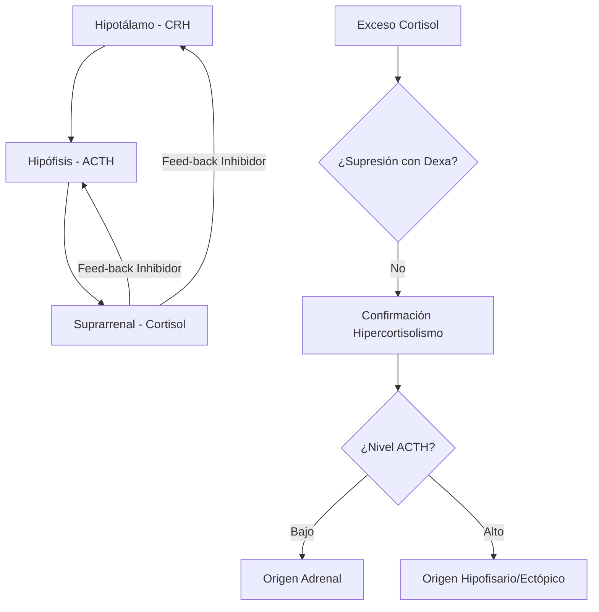
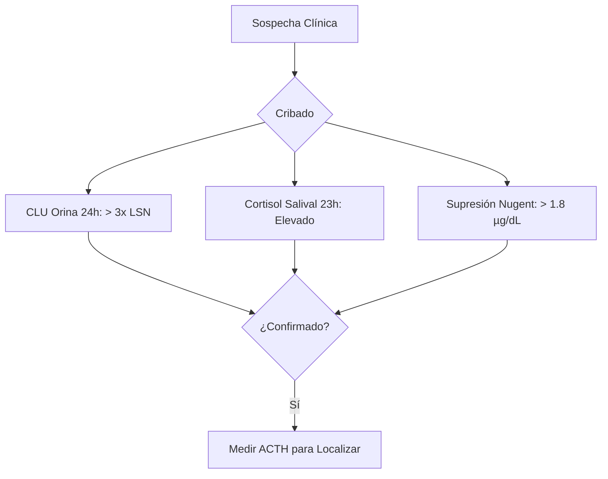
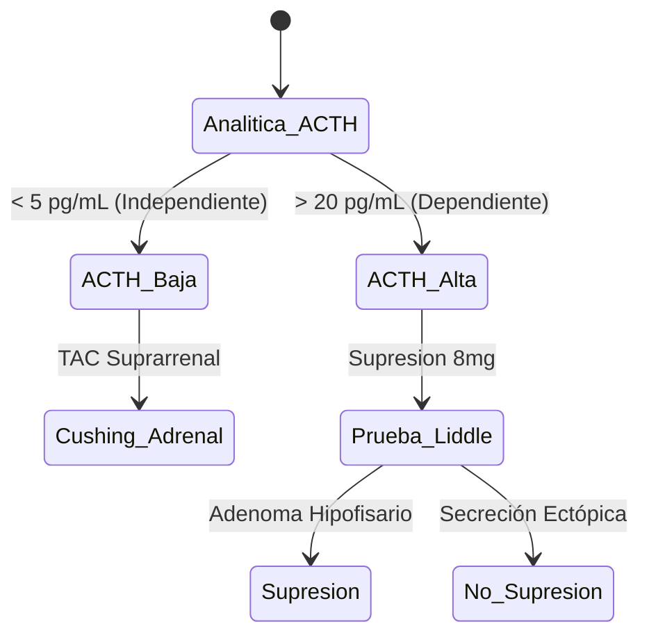

# Semana 2: Hormonas
## Lección 1: Cushing: ¿Síndrome o Enfermedad? Papel del Laboratorio Clínico

### 1. Título y Resumen (Abstract)
**Título:** Diagnóstico Diferencial del Hipercortisolismo mediante el Análisis Dinámico del Eje Hipotálamo-Hipófisis-Suprarrenal.
**Resumen:** Este artículo describe los fundamentos endocrinos del exceso de cortisol y la metodología bioquímica para localizar la patología. Se evalúa la eficacia de las pruebas de supresión y el análisis del ritmo circadiano, fundamentando el papel del Técnico Superior de Laboratorio en la gestión de muestras críticas y la ejecución de pruebas funcionales de alta complejidad.

### 2. Introducción (Fundamentos y Objetivos)
#### 2.1. Fisiología del Eje Hipotálamo-Hipófisis-Suprarrenal (Módulo 1370/1371)
El currículo de **Fisiopatología General** (Módulo 1370) detalla la regulación hormonal sistémica. El cortisol es un glucocorticoide sintetizado en la zona fasciculada de la corteza suprarrenal.
1.  **Regulación:** El eje HHS se activa ante el estrés. El hipotálamo secreta CRH, que estimula la producción de ACTH en la adenohipófisis.
2.  **Mecanismo de Acción:** La ACTH se une a receptores de membrana en la corteza adrenal, activando el AMPc y la cascada de la esteroidogénesis desde el colesterol.
3.  **Feedback Negativo:** El cortisol inhibe la secreción de CRH y ACTH.
4.  **Ritmo Circadiano:** Patrón cíclico regulado por el núcleo supraquiasmático (máximo 08:00h, mínimo 00:00h).

#### 2.2. Alteraciones del Metabolismo de Glucocorticoides (Módulo 1370)
El diagnóstico diferencial es un resultado de aprendizaje clave del TSLCB:
- **Síndrome de Cushing ACTH-independiente:** Lesión primaria en la glándula (adenoma/carcinoma). ACTH inhibida (< 5 pg/mL).
- **Enfermedad de Cushing (ACTH-dependiente):** Adenoma hipofisario productor de ACTH.
- **Secreción Ectópica:** Producción de ACTH por tumores no endocrinos (ej. pulmón).

#### 2.3. Metodología de las Pruebas de Función Hormonal (Módulo 1371)
El **Módulo de Análisis Bioquímico** exige el dominio de las pruebas dinámicas:
- **Pruebas de Supresión:** Uso de Dexametasona para evaluar la integridad del feedback negativo.
- **Gestión de la Muestra (Módulo 1367):** La ACTH es extremadamente lábil. Requiere extracción en tubo plástico con EDTA, transporte refrigerado inmediato y separación del plasma en < 30 min para evitar la degradación por peptidasas.

**Objetivo:** Establecer un protocolo de validación para las pruebas funcionales hormonales, garantizando la estabilidad de la ACTH (termosensibilidad) según el currículo de TSLCB.

### 3. Material y Métodos
- **Diseño:** Estudio procedimental sobre dinámica endocrina.
- **Entorno:** Unidad de Hormonas y Pruebas Funcionales, Hospital Universitario de Getafe.
- **Intervenciones:** Determinación de cortisol libre urinario (extracción previa), cortisol salival y sérico por CLIA (Quimioluminiscencia) y cuantificación de ACTH por inmunometría en fase sólida (muestras en EDTA-Plástico).

### 4. Resultados (Hallazgos Experimentales)
Algoritmo de cribado y confirmación analítica:

### 5. Discusión y Conclusiones
La fase preanalítica es crítica para el análisis de la ACTH debido a su propensión a la degradación por peptidasas plasmáticas; requiere transporte inmediato en hielo y centrifugación refrigerada. Se concluye que el diagnóstico de hipercortisolismo es puramente bioquímico en su fase inicial, y la pericia del TEL en el control de calidad de las curvas de calibración de hormonas es vital para evitar errores de clasificación.

### 6. Agradecimientos
Al personal del Hospital de Día Endocrinológico por la supervisión de las tomas de muestra en las pruebas funcionales.

### 7. Bibliografía (Literatura Citada)
- **Ganong Fisiología Médica. LANGE McGraw Hill.**
- **Manual de Endocrinología y Nutrición SEEN.**
- [MSD Manual: Trastornos Hipofisarios y Suprarrenales](https://www.msdmanuals.com)

---
### Sobre la Ponente
**Lucía Pardo Deito** es Residente de 2º año (R2) de Bioquímica Clínica en el **Hospital Universitario de Getafe**.

*Material adaptado con rigor pedagógico según la normativa de la CM.*
