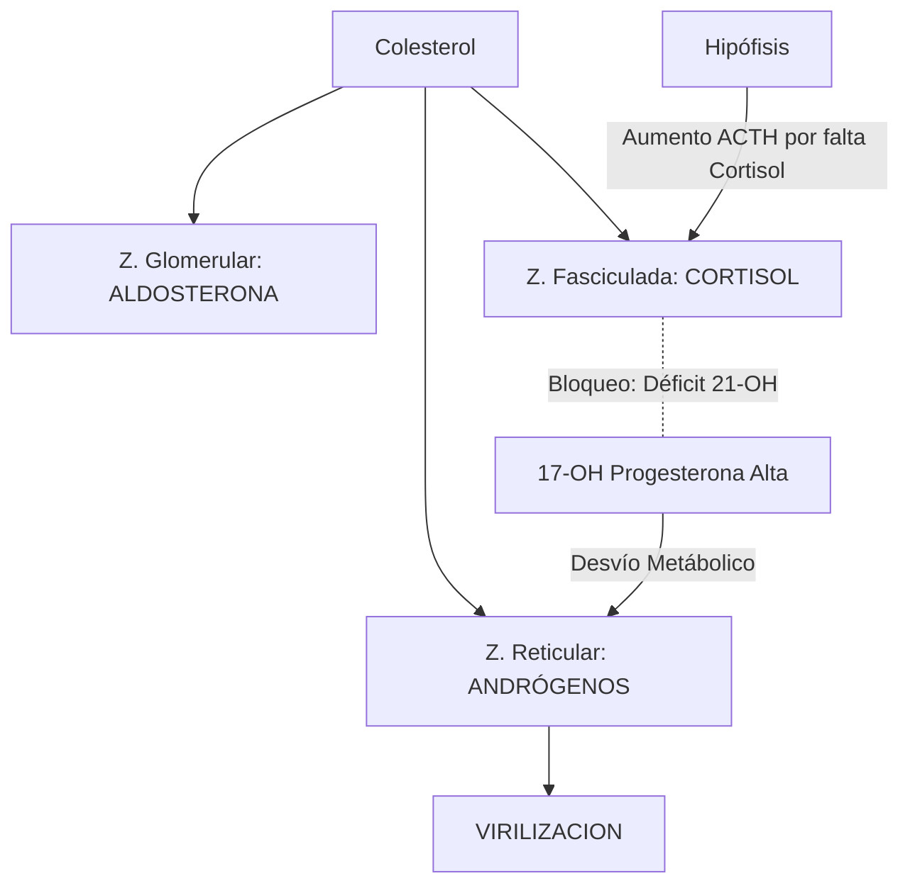
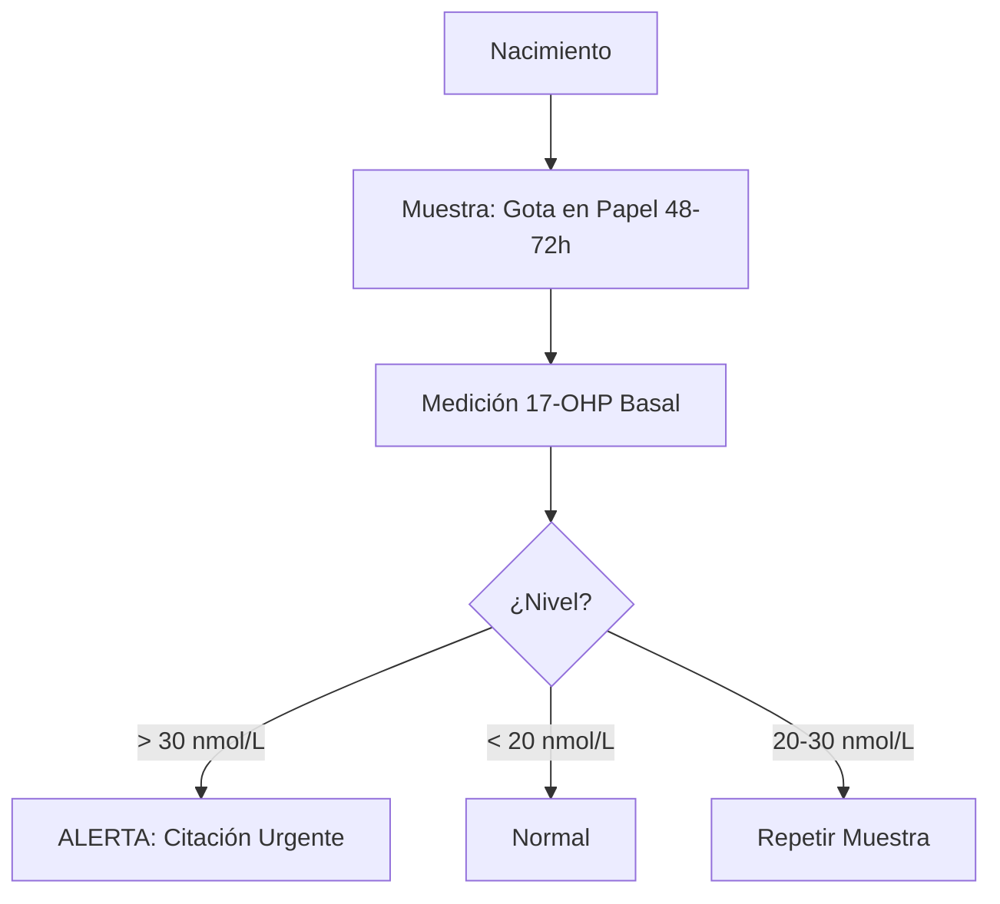
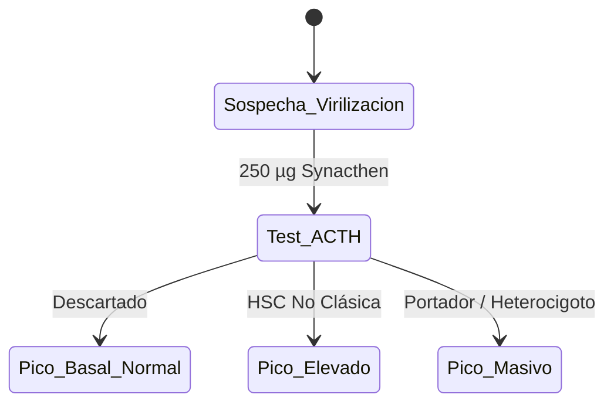

# Semana 2: Hormonas
## Lección 2: Aportación del Laboratorio en la Hiperplasia Suprarrenal Congénita (HSC)

### 1. Título y Resumen (Abstract)
**Título:** Implementación del Cribado Neonatal y Diagnóstico Molecular de la Hiperplasia Suprarrenal por Déficit de 21-Hidroxilasa.
**Resumen:** Este artículo analiza los fundamentos bioquímicos de la HSC, centrándose en el bloqueo enzimático de la esteroidogénesis cortical. Se evalúa la eficacia de la 17-hidroxiprogesterona (17-OHP) como biomarcador clave en la prevención de crisis adrenales neonatales y en el diagnóstico de hiperandrogenismo en la edad adulta.

### 2. Introducción (Fundamentos y Objetivos)
#### 2.1. Anatomía y Fisiología de la Corteza Suprarrenal (Módulo 1370)
El currículo de **Fisiopatología General** (Módulo 1370) detalla la organización zonal de la glándula:
1.  **Zona Glomerular:** Síntesis de Mineralocorticoides (Aldosterona) bajo control del eje RAA.
2.  **Zona Fasciculada:** Síntesis de Glucocorticoides (Cortisol) bajo control de la ACTH hipofisaria.
3.  **Zona Reticular:** Síntesis de Andrógenos suprarrenales (DHEA/Androstenediona).

#### 2.2. La Cascada de la Esteroidogénesis y sus Defectos (Módulo 1370/1371)
Hacia 2026, el TSLCB debe dominar la bioquímica de los precursores esteroideos. La HSC es un error innato del metabolismo causado por el déficit de enzimas codificadas genéticamente:
- **Déficit de 21-Hidroxilasa (95% de casos):** Impide la conversión de progesterona a DOC y de 17-OHP a 11-desoxicortisol.
- **Acúmulo de Precursores:** La elevación de la **17-Hidroxiprogesterona (17-OHP)** es el marcador diagnóstico de elección (Módulo 1371).
- **Virilización:** El exceso de precursores se desvía hacia la vía androgénica por falta de feedback negativo (aumento masivo de ACTH).

#### 2.3. Gestión del Cribado Neonatal y Validación Técnica (Módulo 1371/1367)
- **Técnica de Referencia:** Medición de 17-OHP en mancha de sangre seca (DBS) mediante fluorimetría (DELFIA).
- **Procesado (Módulo 1367):** El TSLCB debe asegurar una impregnación homogénea de la tarjeta de Guthrie para evitar errores por volumen de sangre.
- **Control de Calidad (Módulo 1368):** Influencia del peso al nacer en los puntos de corte.

**Objetivo:** Sistematizar el flujo del Programa de Cribado Neonatal de la Comunidad de Madrid y la validación de muestras en papel filtro.

### 3. Material y Métodos
- **Diseño:** Análisis descriptivo basado en el currículo de TSLCB.
- **Entorno:** Unidad de Metabolopatías, Hospital Universitario de Getafe.
- **Intervenciones:** Determinación de 17-OHP por inmunoensayo de tiempo resuelto (DELFIA) en DBS (*Dried Blood Spots*) y confirmación en suero mediante HPLC-MS/MS.

### 4. Resultados (Hallazgos Experimentales)
Workflow del cribado y algoritmos de confirmación:

### 5. Discusión y Conclusiones
La rapidez es el factor crítico para salvar vidas en la forma pierde-sal. Se concluye que el TEL debe poseer una técnica depurada para el sacabocados del papel filtro, evitando zonas con exceso o defecto de carga de sangre que provoquen errores analíticos. Hacia 2026, la espectrometría de masas en tándem se consolida como el paso de confirmación obligatorio ante falsos positivos por estrés o prematuridad.

### 6. Agradecimientos
Al equipo de Neonatología por la optimización de los protocolos de recogida de sangre capilar.

### 7. Bibliografía (Literatura Citada)
- **Congenital Adrenal Hyperplasia Due to Steroid 21-Hydroxylase Deficiency: An Endocrine Society Guideline.** [Ver en endocrine.org](https://www.endocrine.org/clinical-practice-guidelines/congenital-adrenal-hyperplasia)
- **Protocolo Diagnóstico de la Hiperplasia Suprarrenal Congénita - AEP.** [Ver en aeped.es](https://www.aeped.es/documentos/protocolos-endocrinologia)
- **Cribado Neonatal de Hiperplasia Suprarrenal Congénita - SEQCML.** [Ver en seqc.es](https://www.seqc.es/es/bioquimica-en-el-laboratorio-clinico/manuales-y-monografias/)
- **StatPearls: Congenital Adrenal Hyperplasia.** [Ver en ncbi.nlm.nih.gov](https://www.ncbi.nlm.nih.gov/books/NBK448080/)

---
### Sobre el Ponente
**Ramiro Antonio Torrado Carrión** es Facultativa Especialista de Área (FEA) en Bioquímica Clínica en el **Hospital Universitario de Getafe**.

*Contenido científico ampliado alineado con el título de TSLCB.*
