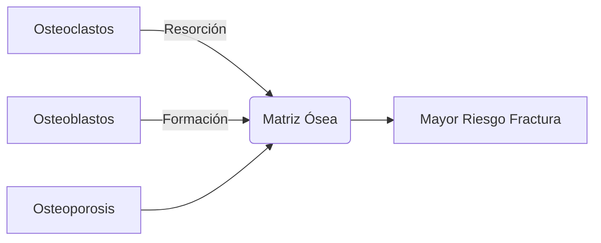

# Semana 2: Hormonas
## Lección 3: Marcadores de Osteoporosis

### 1. Título y Resumen (Abstract)
**Título:** Utilidad Clínica de los Marcadores de Recambio Óseo (MRO) en el Diagnóstico y Seguimiento de la Osteoporosis.
**Resumen:** La osteoporosis es una enfermedad silente caracterizada por la pérdida de masa y calidad ósea. Este tema revisa el ciclo de remodelado óseo (osteoblastos vs. osteoclastos) y el papel fundamental de los biomarcadores bioquímicos (P1NP y β-CTX) en la monitorización de la eficacia terapéutica, permitiendo una evaluación dinámica mucho más rápida que la densitometría ósea.

### 2. Introducción (Fundamentos y Objetivos)
#### 2.1. Remodelado Óseo (Módulo 1370)
El hueso es un tejido vivo en renovación constante:
1.  **Fase de Resorción:** Los osteoclastos disuelven la matriz mineral.
2.  **Fase de Formación:** Los osteoblastos sintetizan nueva matriz (osteoide).
3.  **Equilibrio:** En la osteoporosis, este balance es negativo (más resorción que formación).

#### 2.2. Definición de Osteoporosis
- Enfermedad esquelética sistémica caracterizada por baja masa ósea y deterioro de la microarquitectura.
- **Densitometría (DEXA):** Gold standard para el diagnóstico (T-score < -2.5).

### 3. Material y Métodos
- **Marcadores de Formación:** P1NP (Propéptido aminoterminal del procolágeno tipo 1), Osteocalcina, Fosfatasa Alcalina Ósea.
- **Marcadores de Resorción:** β-CTX (Telopéptido carboxiterminal), NTX, Desoxipiridinolina.
- **Instrumentos de Riesgo:** Índice FRAX, Modelo EPIC.

### 4. Resultados (Biomarcadores en el Laboratorio)
Recomendaciones internacionales (IOF/IFCC):
- **Marcador de Formación de Referencia:** P1NP sérico.
- **Marcador de Resorción de Referencia:** β-CTX sérico (Beta-Crosslaps).
- **Importancia Preanalítica:** Deben recogerse en ayunas y preferiblemente a primera hora de la mañana debido al ritmo circadiano (especialmente β-CTX).

### 5. Discusión y Conclusiones
Los marcadores de recambio óseo no sustituyen a la densitometría para el diagnóstico, pero son superiores para el seguimiento. El TSLCB debe conocer el "Cambio Mínimo Significativo": una reducción del 30% en β-CTX o del 20-40% en P1NP indica que el tratamiento está funcionando (adherencia), lo cual es objetivable meses antes que cualquier cambio radiológico.

### 6. Agradecimientos
A la Dra. Esperanza Cuadrado y al Servicio de Análisis Clínicos del Hospital Universitario de Getafe.

### 7. Bibliografía (Literatura Citada)
- **IOF-IFCC Recommendations on Bone Marker Standards.** [Ver en iofbonehealth.org](https://www.iofbonehealth.org)
- **Guía de práctica clínica de la osteoporosis - Sociedad Española de Reumatología.** [Ver en ser.es](https://www.ser.es/guias-clinicas/)
- **Marcadores de recambio óseo: utilidad clínica - Monografía SEQCML.** [Ver en seqc.es](https://www.seqc.es)

---
### 8. Charla y Transcripción (Contenido Multimedia)

**Enlace al vídeo:** [Ver en YouTube](https://www.youtube.com/watch?v=A19wuT0FfxM)

#### Transcripción de la Sesión
> Hola a todos, soy Esperanza Cuadrado, facultativo especialista de análisis clínicos del Hospital Universitario de Getafe y os voy a hablar de los marcadores de osteoporosis. Este es el índice que voy a seguir. En primer lugar, una introducción en la que hablaré un poco del remodelado óseo, el hueso y los factores que lo regulan para pasar al tema que nos ocupa, la osteoporosis. Después, la charla se centrará en los métodos de diagnóstico, sobre todo centrándonos en el laboratorio y, por último, en el tratamiento y en el algoritmo resumen para ver lo importante que es el laboratorio en esta patología. Vamos a pasar a comentar brevemente unas nociones de la remodelación ósea. Es el fenómeno de renovación constante al que está sometido el hueso en la edad adulta, de manera que se puede definir como el volumen de hueso renovado por unidad de tiempo. Las unidades básicas estructurales en las que se desarrolla este proceso se denominan unidades de remodelación y están dispersas por todo el esqueleto. En cada una de ellas, el hueso es destruido y después sustituido por otro recién formado. Estas unidades están constituidas por osteoclastos y osteoblastos, células derivadas u osteocitos y otras accesorias. Mediante la remodelación ósea, el organismo sustituye el hueso envejecido y lesionado por tejido nuevo y contribuye al mantenimiento de la homeostasis mineral. El ciclo de remodelado óseo consta de varias fases. En la fase quiescente, el hueso se encuentra en condiciones de reposo. En la fase de activación, los osteoblastos maduros de la superficie que recubre las cavidades internas del hueso se retraen. Las colágenas digieren la membrana, dejando dicha superficie expuesta, y se produce la tracción de células osteoclásticas y sus precursores desde los vasos próximos. En la fase de resorción, los osteoclastos comienzan a disolver la matriz mineral y a descomponer la matriz osteoide, que es el hueso no mineralizado. Este proceso finaliza por la actividad de los macrófagos y permite la liberación de factores de crecimiento contenidos en la matriz. En la fase de formación, simultáneamente en las zonas reabsorbidas, se produce el fenómeno de agrupamiento de preosteoblastos atraídos por los factores de crecimiento liberados de la matriz ósea que actúan como quimioatácticos y estimulan su proliferación. Y en la fase de mineralización, el osteoide comienza a mineralizarse y de nuevo pasa por una fase quiescente o de descanso. Como resultado, el hueso trabecular se renueva completamente cada cuatro años y el hueso cortical cada seis a ocho. A los 30-35 años se encuentra el pico de masa ósea, como podemos ver en el gráfico. En condiciones normales, al cabo de un año se renueva el 3% al 5% del hueso cortical y el 25% del hueso trabecular. Voy a aprovechar para explicar brevemente las características del hueso cortical y trabecular. ¿Qué caracteriza al hueso cortical? Es un hueso denso y sólido. Actúa de sostén y protección. Se encuentra sobre todo en huesos largos y supone aproximadamente el 80% del esqueleto. Además, tiene una tasa de renovación, como he comentado, anual del 3% al 5%. Y el hueso trabecular, pues es esponjoso, forma el 20% restante, metabólicamente es más activo y con una tasa de renovación anual del 25%. También es más sensible a los cambios bioquímicos, hormonales y nutricionales y a sufrir mayores pérdidas de tejido, por lo que la mayoría de las fracturas osteoporóticas suceden en los huesos con más cantidad de tejido trabecular, como puede ser la columna, el extremo superior del fémur, etc. Como es de suponer, existen factores de regulación de la formación del hueso. En primer lugar, factores hormonales como la PTH, que es el factor más importante regulador de la homeostasis del calcio, actúa a nivel del hueso y a nivel renal. La vitamina D o calcitriol, que también aumenta la absorción intestinal de calcio y fósforo, promoviendo la mineralización ósea; la calcitonina, que inhibe los osteoclastos y, por tanto, la resorción ósea; las hormonas del crecimiento; los factores IGF-1 e IGF-II en la formación de hueso; los glucocorticoides, que tienen efectos estimulantes e inhibitorios; las hormonas tiroideas, que estimulan la resorción y formación contribuyendo al remodelado óseo; y las hormonas sexuales, que, tanto estrógenos como andrógenos, ayudan al desarrollo esquelético estimulando la formación ósea directamente o a través del tejido muscular adyacentec. También hay involucrados factores locales, citoquinas y factores de crecimiento con múltiples acciones regulatorias en el esqueleto, como factores de crecimiento fibroblástico, otras citoquinas como interleucina 1, interleucina 6, etc. También, y para que os suene un poco, el sistema RANK/RANKL/OPG, que es la vía común donde actúan hormonas y factores locales que regulan la interacción osteoblasto-osteoclasto y el remodelado óseo. ¿Por qué se define la osteoporosis? Es la enfermedad metabólica ósea más frecuente, asintomática en ausencia de fractura. Es una enfermedad esquelética difusa con disminución generalizada de la resistencia ósea que predispone a un mayor riesgo de fracturas por fragilidad, disminuye la densidad mineral ósea y supone un problema de cantidad de masa ósea y de calidad del hueso. El aumento de riesgo de fractura es responsable de la mayor parte de las fracturas que se producen en mayores de 50 años y la fragilidad ósea no solo es huesos débiles. ¿Por qué es importante esta patología? Es una enfermedad silenciosa y progresiva que provoca alta carga sanitaria y social, frecuentemente con un diagnóstico tardío. De manera que la primera fractura por osteoporosis suele ser también la primera vez que el paciente oye hablar de ella, pero el laboratorio puede detectarla mucho antes. Tiene un alto coste socioeconómico. Por ejemplo, en 2019, en España supuso unos 4.300 millones de euros por gasto en cuidados de salud, sumando el coste directo por fracturas, la discapacidad a largo plazo, la evaluación y el tratamiento. El laboratorio tiene un papel clave tanto en la detección precoz como en el seguimiento del tratamiento y el control de calidad de los resultados. ¿Por qué es la magnitud del problema? Afecta a 200 millones de personas en todo el mundo. Una de cada tres mujeres y uno de cada cinco hombres mayores de 50 años experimentarán una fractura relacionada con la osteoporosis. Como hemos comentado, las fracturas por esta enfermedad cuestan 4.200 millones de euros al sistema, pero más de la mitad de los casos se podrían prevenir. ¿Por qué ocurre en España? Pues más de 3 millones de personas tienen osteoporosis y, sobre todo, mujeres. La mayor prevalencia se produce en mujeres mayores de 50 años y el incremento con el envejecimiento poblacional nos lleva a previsiones de gran incremento en el futuro de casi un 30% en 2034, suponiendo que la población mayor de 50 años crecerá un 22%. La prevalencia en mujeres postmenopáusicas es del 30%. Hay alrededor de 100.000 fracturas anuales, siendo las fracturas de cadera las más críticas. Es un problema frecuente y para nada excepcional. ¿Qué es lo que falla en la osteoporosis? En general, las alterations patológicas en la remodelación ósea pueden deberse a excesiva resorción o formación. La mayor parte de las enfermedades óseas se producen cuando los procesos de remodelado no están acoplados. Las fracturas óseas tienen una distribución bimodal. En la adolescencia son normalmente de origen traumático y en la vejez, de origen osteoporótico. En el caso de la osteoporosis, la alteración del remodelado óseo se debe, en la mayoría de los casos, a un predominio de la resorción, ligada a deficiencia de estrógenos y al envejecimiento, con insuficiente formación que resulta de una pérdida de masa ósea provocando microfracturas acumulativas. La osteoporosis es un proceso silente que merma la calidad del hueso hasta que, por un traumatismo o sobrecarga, se produce la rotura micro o macroscópica del hueso y este se fractura. Hay que distinguir una osteoporosis sin fractura, diagnosticada por densitometría ósea o ultrasonidos, y la osteoporosis con fractura establecida, más fácil de cuantificar desde el punto de vista epidemológico. Hay dos tipos de osteoporosis: osteoporosis primaria y secundaria. La osteoporosis primaria supone más del 95% de casos en mujeres y alrededor del 80% en hombres sin una causa subyacente identificable. Es decir, la mayoría son mujeres postmenopáusicas y hombres mayores. Hay ciertas condiciones que aceleran la pérdida ósea en pacientes con osteoporosis primaria, como la insuficiencia gonadal, la disminución en la ingesta de calcio, niveles bajos de vitamina D, etc. El principal mecanismo es la pérdida ósea por aumento de la resorción ósea, pero también puede haber alterations en la formación. Las fracturas por fragilidad son excepcionales en niños, adolescentes, mujeres premenopáusicas y hombres de edad inferior a 50 años y sin una causa secundaria añadida. En este tipo de personas se consideran afectos de una osteoporosis idiopática. Podemos diferenciar dos tipos de osteoporosis: osteoporosis tipo 1 o postmenopáusica, principalmente en mujeres después de la menopausia por cese de la función ovárica, rápida pérdida de masa ósea y aumento del riesgo de fracturas. Por lo tanto, el hueso afectado es fundamentalmente trabecular. La edad es de 50 a 75 años, mayor en mujeres que en hombres, debido al déficit de estrógenos fundamentalmente. En cuanto a la osteoporosis tipo 2 o senil, afecta a hombres y a mujeres mayores de 70 años, aún así más a mujeres que a hombres. La pérdida ósea es más gradual, no está acelerada, y se debe fundamentalmente al envejecimiento, disminución de formación ósea y aumento de la resorción. La osteoporosis secundaria, como su nombre indica, es secundaria a otra patología primaria, independiente de la edad, el sexo y la menopausia, pero con las mismas consecuencias en cuanto a fracturas y morbimortalidad. Se sospecha en pacientes jóvenes y premenopáusicas. Y como causas identificables están las que aparecen en la tabla, que son relacionadas con enfermedades endocrinas, digestivas, desórdenes hematológicos, conectivopatías, consumo de drogas, de medicamentos, alterations en la nutrición, etc. ¿Por qué son los factores de riesgo? Pues hay factores de riesgo genéticos, constitucionales, según el estilo de vida y la nutrición, por déficits de hormonas sexuales, tratamientos crónicos, patologías del metabolismo, enfermedades renales, hematológicas, inflamatorias o neoplasias, etc. Hay factores que están claramente asociados a osteoporosis, como los que veis ahí en la tabla, y hay otros que inicialmente podrían parecer muy asociados, pero parece que existe menor consistencia, como el déficit de calcio, de vitamina D o el hiperparatiroidismo. Hay algunos que son no modificables, como la edad, el sexo, algunas enfermedades y algunos fármacos. Y hay factores que afectan directamente a la salud, como el consumo de calcio y otros nutrientes, la vitamina D, el ejercicio, el consumo de tóxicos y enfermedades, como ya he comentado. ¿Por qué es la patogenia de la enfermedad? Pues viene determinada por cuatro componentes: el pico de masa ósea, que está determinado por factores genéticos en un 80% y el 20% restante por influencias hormonales, por el movimiento de la pubertad, alimentación y ejercicio; la pérdida de masa ósea: alcanzado el pico de masa ósea, el esqueleto adulto se renueva continuamente por acción sucesiva y acoplada de osteoclastos y osteoblastos, depende también de los niveles de testosterona y estrógenos; la alteración en la calidad: pues hay factores de la calidad del hueso como la actividad del remodelado, la porosidad, mineralización, etc., y hay otros factores como la genética, la menopausia y la edad. Los distintos factores de riesgo a lo largo de la vida de la persona se van sumando y dan lugar a menor cantidad y calidad del hueso. Y, por último, la propensión a las caídas, en situación de baja masa ósea y/u alteración de la calidad del hueso, es decir, disminución de la resistencia. La fractura dependerá solo de la existencia de un traumatismo, a veces mínimo, como ocurre en fracturas vertebrales, o del sufrimiento de una caída, como ocurre en la fractura de cadera. Por ello, todas las circunstancias que favorecen la propensión a las caídas serán factores de riesgo para la producción de fracturas. Y pasamos a la tercera parte de la charla, el diagnóstico. En primer lugar, hablaremos de la radiología simple, que es un método muy común pero impreciso y ha sido y es la herramienta diagnóstica más empleada en la evaluación de la osteoporosis. Tiene limitaciones notables. Por ejemplo, la osteopenia radiológica precisa de una disminución de masa ósea de hasta un 35% para ser perceptible por el ojo humano. Además, hay artefactos de la propia técnica que impiden ver con claridad los signos característicos. La técnica de elección para medir la densidad mineral ósea es la densitometría, aprobada para uso clínico por la FDA en el año 1984. Permite evaluar la masa ósea. La medición se realiza en columna, cadera y fémur proximal. La OMS y la Fundación Internacional para la Osteoporosis recomiendan, para la clasificación, los valores medidos en cuello femoral. La columna no es el lugar ideal para el diagnóstico debido a la alta prevalencia de cambios degenerativos. Sin embargo, se prefiere para evaluar la respuesta al tratamiento. A pesar de la utilidad demostrada en la valoración de los pacientes en riesgo de fractura, la densitometría presenta una sensibilidad y especificidad limitadas. No identifica a todos los sujetos en riesgo de fractura y más del 50% de las fracturas periféricas suceden en pacientes con una puntuación mayor a la definida para osteoporosis. La tendencia actual es considerar la medición de densidad mineral ósea como un factor de riesgo más, utilizándolo junto con los factores de riesgo clínicos presentes para calcular el riesgo absoluto de fractura. En cuanto a cuándo utilizar la densidad mineral ósea, no hay criterios universales, pero se recomienda cuando existen factores de riesgo fuertemente asociados a osteoporosis o fracturas. El índice trabecular óseo es un parámetro de la textura ósea a partir de la imagen de la densitometría en columna lumbar. Está disminuido en pacientes con fracturas por fragilidad y es útil, independientemente de la densidad mineral ósea, en la valoración del riesgo de fractura en mujeres y hombres mayores de 50 años. La predicción del riesgo de fractura es mejor con la combinación de densidad mineral ósea y el índice trabecular óseo que midiendo solo la densidad mineral ósea. Pero, ¿en qué consiste la densitometría? pues aporta dos valores: el T-score, número de desviaciones estándar de densidad mineral ósea de un individuo en comparación con una población de referencia, y el Z-score, que es el número de desviaciones estándar de la densidad mineral ósea de un individuo en relación a una población de su mismo sexo, raza y edad. Para estimar el riesgo de fractura se combina la densidad mineral ósea con factores de riesgo clínicos, y el uso aislado de la densidad mineral ósea para evaluar el riesgo de fractura tiene alta especificidad pero baja sensibilidad. Y esta baja sensibilidad significa que la mayoría de las fracturas por fragilidad ocurrirán en mujeres que no tienen osteoporosis según la medición de densidad mineral ósea. Aquí podéis ver la clasificación según el T-score: normal, osteopenia, osteoporosis y osteoporosis grave. Y el punto de corte es una T menor de -2,5. En cambio, para mujeres premenopáusicas, niños y varones menores de 50 años, se utiliza mejor Z-score menor de -2, que indica una disminución de la densidad mineral ósea para la edad cronológica. Existen varios instrumentos para valorar el riesgo de fracturas, como el índice FRAX. Este modelo se desarrolló a partir del estudio de cohortes poblacionales de Europa, Norteamérica, Asia y Australia, aunque en España parece que infraestima el riesgo de fracturas, sobre todo en mayores. Se puede acceder a través de esta página web, rellenando un cuestionario y los distintos factores de riesgo que se tengan, y te da la probabilidad a 10 años de fractura de cadera y la probabilidad a 10 años de una fractura osteoporótica mayor. Existe otro modelo, el modelo EPIC, más correlacionado con la población española, que utiliza factores epidemiológicos, clínicos y antropométricos, analíticos, la evaluación nutricional, la presencia de fracturas previas, pérdida de agudeza visual, la circunferencia, la sarcopenia y la osteoporosis medida por densitometría en el cuello del fémur, y te indica el riesgo de fracturas de 1 a 5 años. Vamos a ver unos ejemplos del índice FRAX. En primer lugar, rellenamos continente y país. Después, datos demográficos de edad, sexo, peso y talla. Si tenemos una T de la densitometría de -1, tendríamos estos porcentajes de riesgo de fractura. Si modificamos la T tenida en la densitometría, pues aumentan el porcentaje de riesgo de fractura. Si mantenemos la T de -1 y lo que hacemos es marcar distintos factores de riesgo, pues también aumentaría más el riesgo de fracturas. Y, por último, con una T de -2,5, que ya es de osteoporosis, al tener otros factores de riesgo, pues el riesgo de fractura aumenta mucho más. Ahora pasamos a los métodos complementarios en el diagnóstico y seguimiento de la osteoporosis y, en concreto, el laboratorio. ¿Qué sentido tiene pedir una analítica? Identificar una osteoporosis secundaria basada en los factores asociados a osteoporosis que hemos visto anteriormente; detectar comorbilidades que condicionan el tratamiento; valorar el estado del metabolismo fosfocálcico y de la vitamina D; disponer de valores basales para monitorizar la respuesta terapéutica. ¿Por qué es el perfil analítico básico recomendado? Pues, después de un análisis y exploración física, el estudio debería incluir un hemograma, determinación de parámetros de perfil renal, de perfil hepático, perfil endocrino, además de calcio en orina para valoración indirecta del recambio óseo y el proteinograma. Y con todos estos parámetros se deberían determinar antes del tratamiento y repetirse, en caso de indicación clínica, después. ¿Por qué ampliar el estudio? En pacientes jóvenes y cuando se sospechan enfermedades concretas deben realizarse los estudios pertinentes para descartar causas secundarias de osteoporosis. En varón con baja masa ósea o fractura por fragilidad se deberían realizar estudios hormonales, lo mismo que en mujer premenopáusica o menor de 50 años. Cuando hay sospecha de hiperparatiroidismo, habría que realizar PTH intacta y calcio y fósforo. Cuando hay sospecha de Cushing y otras endocrinopatías, pues cortisol y las hormones que sean pertinentes. En sospecha de mieloma u otros procesos neoplásicos, proteinograma, inmnofijación o cadenas ligeras. En sospecha de mastocitosis, una triptasa sérica. Si se ven datos de malabsorción y enfermedad inflamatoria intestinal, estudio de celiaquía, reactantes de fase aguda, etc. Y ante sospecha de osteogénesis imperfecta, hipofosfatasia u otras, un estudio genético. Existen marcadores más específicos de recambio óseo, unos de formación y otros de resorción. No se usan de forma rutinaria para diagnosticar osteoporosis, pero sí para valorar la respuesta y la adherencia al tratamiento. Requieren condiciones estandarizadas de muestra matutina, en ayunas, y que se realicen en el mismo laboratorio. Un aumento en sangre y orina indican una situación de recambio óseo con pérdida ósea por alteration de la calidad ósea y aumento de la fragilidad. En múltiples estudios prospectivos se ha visto una clara relación entre una resorción ósea elevada y el mayor riesgo de fractura, incluso independientemente de la densidad mineral ósea. Hay estudios de los últimos años que sugieren que la fragilidad puede reflejarse por la medida de la actividad del remodelado óseo mediante estos marcadores bioquímicos. Y en la tabla tenéis marcadores de formación y resorción en uso y obsoletos y la muestra en la que se tiene que determinar. Como marcadores de formación ósea están los clásicos: la osteocalcina y el propéptido carboxiterminal del procolágeno tipo 1, que se usan como reflejo de formación, pero, debido a su variabilidad biológica y menor estandarización, han quedado relegados. Actualmente se utiliza el propéptido aminoterminal del procolágeno tipo 1, que está recomendado junto al telopéptido carboxiterminal como marcador de referencia para monitorizar tratamiento y estimar el riesgo de fracturas según la Fundación Internacional de Osteoporosis y la IFCC, además de otros grupos de consenso. Y se ha definido como el marcador de formación ósea con mayor sensibilidad diagnóstica en la menopausia. Y, por otra parte, la fosfatasa alcalina ósea, que especialmente es útil en pacientes con insuficiencia renal debido a que el propéptido aminoterminal del procolágeno tipo 1 puede acumularse por el menor aclaramiento. En cuanto a los marcadores de resorción ósea, están los clásicos, cada vez menos usados: hidroxiprolina, piridinolina y desoxipiridinolina urinarias, que han quedado relegados por la variabilidad preanalítica y por la mayor comodidad de los marcadores séricos. La hidroxiprolina, además, es poco específica debido a que la cantidad secretada depende de la degradación del colágeno total del organismo, no solo del óseo, y además puede provenir de dieta rica en hidroxiprolinas, como, por ejemplo, gelatinas. En cuanto a la piridinolina y desoxipiridinolina urinarias, son productos de degradación del colágeno derivados de lisina o hidroxilisina y también pueden estar aumentados en otras patologías, como la enfermedad de Paget, el hiperparatiroidismo y la hipercalcemia maligna. También los telopéptidos carboxiterminales del colágeno tipo 1 urinarios son sensibles a osteoporosis postmenopáusica sin el seguimiento del tratamiento con bifosfonatos, pero cada vez están más en desuso. De los marcadores de resorción ósea en uso actual, destacar el telopéptido carboxiterminal o beta-crosslaps como marcador de resorción preferente en guías y consensos para la osteoporosis, junto al propéptido aminoterminal del procolágeno tipo 1 para valorar la formación. La mayor utilidad clínica es una medición previa a terapia antirresortiva y es un marcador de elección para valorar resorción ósea, monitorización de tratamiento y predicción del riesgo de fracturas. Tiene menor variabilidad biológica que otros y se puede medir por inmunoquimioluminiscencia. Por otra parte, está la fosfatasa ácida tartrato-resistente 5B, que es relevante en enfermedad ósea asociada a enfermedad renal crónica debido a que no se elimina por vía renal y se correlaciona bien con el número de osteoclastos. El calcio urinario implica la degradación de la matriz ósea y es marcador indirecto de resorción y se puede utilizar para ver la presencia de un recambio óseo aumentado. Como utilidad práctica de los marcadores de remodelación ósea, pues en una respuesta precoz al tratamiento antirresortivo, una disminución significativa de la beta-crosslaps a las pocas semanas o meses indica buena respuesta y mejoría posterior de la densidad mineral ósea. En enfermedad renal crónica avanzada, la fosfatasa ácida tartrato-resistente y la fosfatasa alcalina ósea ayudan a discriminar entre un aumento y disminución del recambio óseo donde la beta-crosslaps y el propéptido aminoterminal del procolágeno tipo 1 pueden estar falsamente aumentados por retención. En cuanto a los marcadores emergentes y nuevas dianas, se encuentra la esclerostina, que es una proteína producida por osteocitos que inhibe la formación ósea, clave en el mecanismo de acción de romosozumab. Se ha propuesto como biomarcador, pero debido a su falta de estandarización y a la variabilidad analítica, limitan su uso rutinario. DKK1 es otro inhibidor de formación ósea con posible papel en la atenuación de la respuesta anabólica a romosozumab. Otros candidatos son periostina y distintos fragmentos de colágeno tipo 1 y otros tipos, así como perfiles multimarcadores que están en evaluación, pero hay una recomendación para su uso en la práctica diaria de osteoporosis. Es decir, se encuentran en investigación y sin uso rutinario. En el futuro se utilizarán paneles combinados de marcadores de remodelado óseo y biomarcadores moleculares para estratificar mejor el riesgo y personalizar los tratamientos. A modo de resumen, en desuso para la clínica habitual se encuentran, para valorar la formación, la osteocalcina y el propéptido carboxiterminal del procolágeno tipo 1; para valorar la resorción, las piridinolinas y desoxipiridinolinas urinarias y el telopéptido aminoterminal urinario. En uso, para la formación, el propéptido aminoterminal sérico; para la resorción, la beta-crosslaps, y otros útiles: la fosfatasa alkaline ósea y la fosfatasa ácida tartrato-resistente en enfermedad renal crónica avanzada. Y emergentes, principalmente en investigación, la esclerostina y DKK1, y en estudio la periostina y paneles multimarcadores, aunque aún sin uso rutinario. En esta tabla tenéis los distintos marcadores con el proceso metabólico en el que intervienen, la fuente de donde proceden, el tipo de muestra en la que se pueden valorar y el tipo de medida, y ver que están automatizados. En cuanto a los factores que contribuyen a la variabilidad de los biomarcadores óseos, decir que hay varios: el ritmo circadiano, hay mayor concentración de algunos por la noche, como la beta-crosslaps. En invierno también hay algunos que están más elevados, como podéis ver ahí. La función renal también les afecta; la función hepática, están más elevados en hombres y en jóvenes. También tener en cuenta que, por el mayor recambio óseo, se alteran en la menopausia y durante el ciclo menstrual y el embarazo. El uso de anticonceptivos también puede influir en algunos, como el propéptido aminoterminal del colágeno tipo 1. El ejercicio físico aumenta los de formación y disminuye los de resorción, y algunos alimentos también pueden estar alterando los niveles; la dieta y el estilo de vida ya influyen, como hemos hablado en los factores involucrados en la osteoporosis. Como ideas prácticas respecto a los marcadores de recambio óseo, pues en cuanto a la utilidad clínica, no valen para el cribado poblacional, pero sí para el seguimiento terapéutico y la evaluación de la adherencia, que cambian antes que la densidad mineral ósea. En cuanto a variabilidad y limitaciones, pues tienen una variabilidad biológica mayor a la analítica, pero hay falta de estandarización de los métodos. Hay una interpretación basada en cambios porcentuales y lo importante es la tendencia, no el valor aislada. Y para eso vamos a definir el cambio mínimo significativo, que está basado en la variabilidad biológica más la analítica. El umbral habitual para la beta-crosslaps estaría en torno a una disminución del 30% y, para el propéptido aminoterminal del procolágeno tipo 1, del 20% al 40%. Y solo los cambios mayores a este cambio mínimo significativo serían clínicamente relevantes. ¿Por qué son los criterios de tratamiento? La Sociedad Española de Reumatología recomienda iniciar tratamiento en fractura por fragilidad. En caso de que sean vertebral o de cadera, tratar siempre y otros tipos según el riesgo y la densitometría. También en osteoporosis densitométrica y en osteopenia con alto riesgo de fractura, marcado el riesgo por el índice FRAX, la presencia de múltiples factores de riesgo clínico o que existan fracturas vertebrales osteoporóticas, y también en el tratamiento con glucocorticoides crónicos según la dosis, la duración y el riesgo individual. En cuanto a las medidas no farmacológicas, aporte adecuado y suficiente de calcio y vitamina D. En cuanto al ejercicio, ejercicio de resistencia y fuerza, entrenamiento de equilibrio para prevenir caídas y evitar inmovilización prolongada. En cuanto a los hábitos, evitar tabaco y alcohol y promover una exposición adecuada al sol. En cuanto a la prevención de caídas, una corrección visual y auditiva, adaptación del hogar para evitar las caídas y valoración de la sarcopenia. En cuanto al tratamiento farmacológico, hay fármacos antirresortivos de primera línea, como los bifosfonatos, que tienen como ventajas la amplia evidencia y reducen las fracturas vertebrales y no vertebrales; y denosumab, que es un anticuerpo monoclonal que impide la activación de los osteoclastos inhibiendo la resorción ósea, requiere un control cada 6 meses y es muy buena alternativa para la intolerancia a bifosfonatos, en insuficiencia renal moderada-grave y cuando hay un alto riesgo de fractura. Es importante, pues no se puede suspender sin un plan porque hay un riesgo de rebote del aumento de fracturas vertebrales y, para retirarlo, hay que iniciar el tratamiento con bifosfonatos. En cuanto a los fármacos osteoformadores, están los análogos de PTH, indicados en muy alto riesgo de fracturas, en fracturas vertebrales múltiples, en fallo o intolerancia a antirresortivos o en osteoporosis inducida por glucocorticoides. Tiene un tiempo de duración máximo y, después, siempre hay que pasar a antirresortivo. El romosozumab, del cual ya hemos hablado, es un anticuerpo antiesclerostina de acción dual y también requiere un antirresortivo tras su retirada. Está reservado para muy alto riesgo de fracturas y otros fármacos serían: raloxifeno, útil en mujeres postmenopáusicas; los estrógenos como opción en mujeres jóvenes con menopausia precoz, igual que los fitoestrógenos isoflavonas; y la calcitonina, que ya no está en uso debido a su riesgo de cáncer. Aquí tenéis una tabla con los distintos fármacos y para qué tipo de fracturas son útiles. Y, por último, un algoritmo resumen para plasmar el importante papel del laboratorio. Ante un paciente con sospecha de osteoporosis, hacer una evaluación inicial de laboratorio con un perfil básico y un perfil más encaminado a buscar causas secundarias. Si existen alteraciones, se sospecharía de una osteoporosis secundaria y, si no, una probable osteoporosis primaria. En ambos casos se realizarían los marcadores óseos para tener unos valores basales. Se iniciaría el tratamiento y habría que hacer un seguimiento a los 3-6 meses para ver si hay un descenso significativo en los marcadores de resorción. Si no los hay, pues habría que revisar la adherencia y la absorción al tratamiento del paciente y, si sí los hay, pues se catalogaría de respuesta adecuada. Como conclusiones, la osteoporosis es una enfermedad frecuente, silenciosa y de alto impacto clínico y socioeconómico. Produce fragilidad ósea y fracturas, especialmente en población envejecida y mujeres postmenopáusicas. El diagnóstico es densitométrico, pero el manejo es integral y existen herramientas que predicen el riesgo de fracturas a 1, 5 o 10 años. El laboratorio es fundamental para determinar la causa en osteoporosis secundaria y en el seguimiento del tratamiento. Los marcadores de remodelado óseo no diagnostican, pero sí aportan información dinámica de la actividad metabólica del hueso y permiten entender el equilibrio entre formación y resorción. Su principal utilidad es la monitorización del tratamiento para evaluar respuesta y adherencia. La fase preanalítica y la estandarización son determinantes y la interpretación se basa en cambios porcentuales. Aquí os dejo la bibliografía que he utilizado para esta charla. Muchas gracias por vuestra atención.

#### Explicación de la Ponencia
La sesión detalla la importancia de los Marcadores de Recambio Óseo (MRO) para el TSLCB:
1.  **Monitorización Dinámica**: A diferencia de la densitometría (que mide "fotos" estáticas del hueso y tarda un año en mostrar cambios), los marcadores bioquímicos permiten ver si un tratamiento funciona en solo 3 meses.
2.  **Preanalítica Crítica**: El β-CTX (marcador de resorción) tiene un ritmo circadiano muy marcado. El técnico debe asegurar que la muestra sea matutina y en ayunas estricto para que los resultados sean comparables.
3.  **Cambio Mínimo Significativo (LSC)**: El laboratorio debe informar si el descenso del marcador supera el umbral de variabilidad (aprox. 30%). Solo entonces el clínico puede asegurar que el paciente ha ganado densidad ósea.
4.  **Dianas Emergentes**: Se introducen conceptos como la Esclerostina, que abren la puerta a nuevas terapias anabólicas que el TSLCB empezará a medir en el futuro próximo.

---
### Sobre la Ponente
**Esperanza Cuadrado** es Facultativo Especialista de Análisis Clínicos del **Hospital Universitario de Getafe**.

*Contenido actualizado con transcripción íntegra - Marzo 2026*
*Material adaptado al currículo profesional de Técnico de Laboratorio.*
