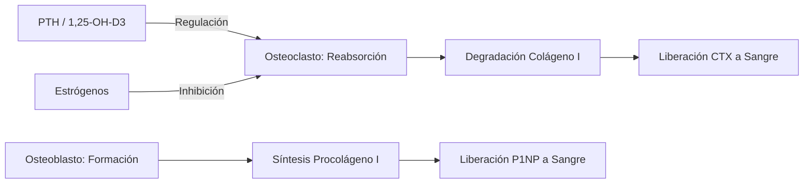
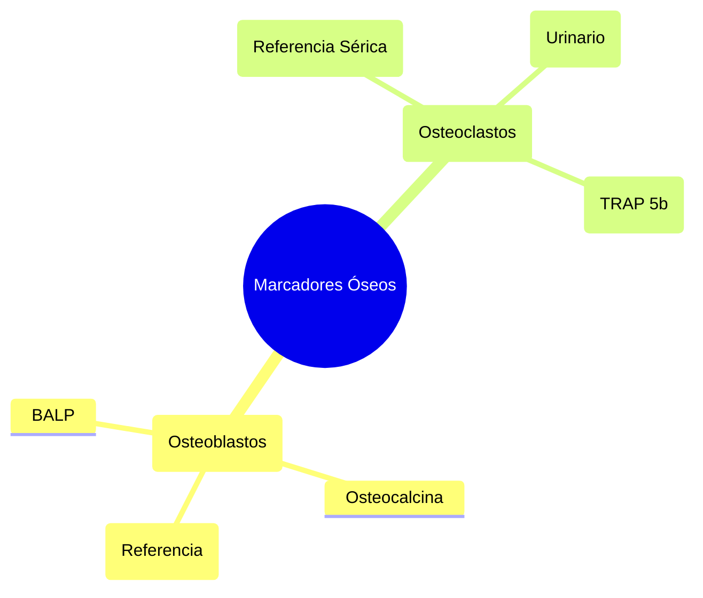
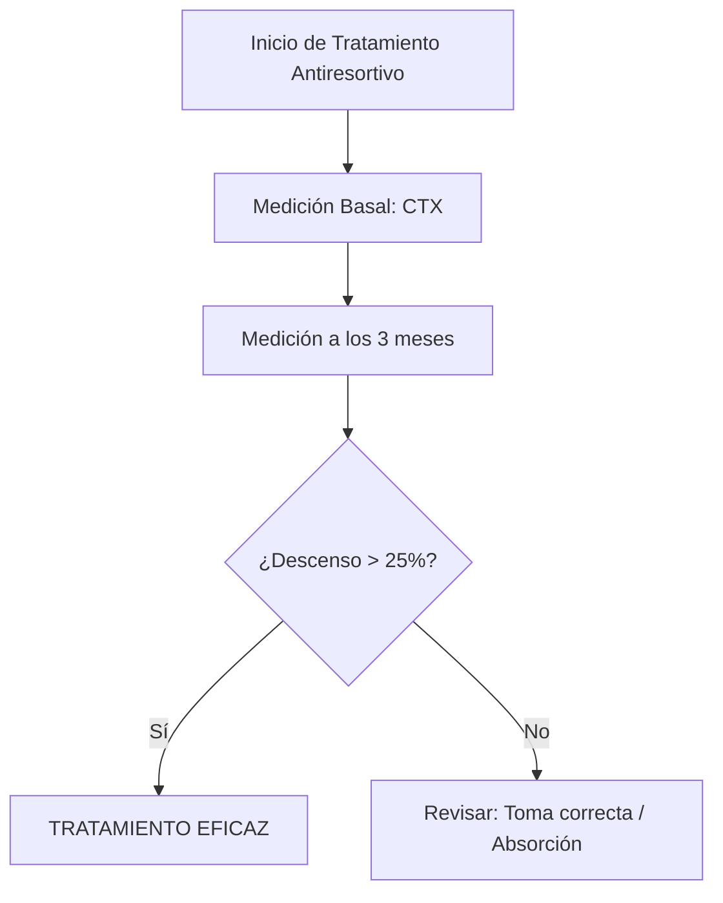

# Semana 2: Hormonas
## Lección 3: Marcadores de Osteoporosis: P1NP y CTX

### 1. Título y Resumen (Abstract)
**Título:** Aplicabilidad Clínica de los Biomarcadores del Remodelado Óseo en el Diagnóstico y Monitorización de la Osteoporosis Postmenopáusica.
**Resumen:** Este artículo profundiza en la fisiología del tejido óseo y la importancia de la fase de reabsorción frente a la formación. Se evalúa la especificidad de los telopéptidos del colágeno tipo I (CTX) y el propéptido aminoterminal del procolágeno tipo I (P1NP) como herramientas para la monitorización temprana del tratamiento antiresortivo, integrando los requisitos preanalíticos estandarizados en el laboratorio clínico.

### 2. Introducción (Fundamentos y Objetivos)
#### 2.1. Metabolismo Mineral y Tejido Óseo (Módulo 1370/1371)
El currículo oficial de **Fisiopatología General** (Módulo 1370) integra el estudio del aparato locomotor y el metabolismo del Calcio ($Ca$) y Fósforo ($P$). El hueso es un tejido dinámico que se remodela mediante las **Unidades Multicelulares Básicas**:
1.  **Reabsorción (Osteoclastos):** Células multinucleadas que disuelven la matriz mineralizada mediante un medio ácido y enzimas proteolíticas.
2.  **Formación (Osteoblastos):** Células encargadas de sintetizar el osteoide (90% colágeno tipo I) y regular su mineralización con cristales de hidroxiapatita.

#### 2.2. Biomarcadores del Remodelado (Módulo 1371)
El **Módulo de Análisis Bioquímico** exige la caracterización de los marcadores cinéticos:
- **Marcadores de Formación:** P1NP (Propéptido aminoterminal del procolágeno I). Se libera proporcionalmente a la síntesis de colágeno. Es el marcador de referencia por su baja variabilidad individual.
- **Marcadores de Reabsorción:** CTX (Telopéptido carboxiterminal). Fragmentos del colágeno degradado por los osteoclastos.

#### 2.3. Regulación Hormonal y Errores Analíticos (Módulo 1371/1368)
- **Hormonas Implicadas:** PTH (Paratohormona), Vitamina D y Calcitonina (Módulo 1371).
- **Variabilidad Preanalítica (Módulo 1367):** El CTX presenta el ritmo circadiano más elevado de la bioquímica (pico máximo a las 05:00 AM). El TSLCB debe asegurar que la extracción sea en ayunas y antes de las 09:00 AM.
- **Estabilidad (Módulo 1368):** Los marcadores óseos son termosensibles; requieren congelación si el proceso no es inmediato.

**Objetivo:** Establecer los criterios de validación técnica del TSLCB basados en el cumplimiento de los periodos de estabilidad y ayuno.

### 3. Material y Métodos
- **Diseño:** Estudio técnico sobre el seguimiento de la enfermedad metabólica ósea.
- **Entorno:** Laboratorio de Metabolismo Mineral, Hospital Universitario de Getafe.
- **Intervenciones:** Determinación de P1NP y β-CTX mediante electroquimioluminiscencia (ECLIA).
- **Control Preanalítico:** Extracción estrictamente entre las 08:00 y 10:00 h tras 12h de ayuno.

### 4. Resultados (Hallazgos Experimentales)
Clasificación de marcadores y algoritmo de monitorización del tratamiento:

### 5. Discusión y Conclusiones
La utilidad de estos marcadores radica en su capacidad para detectar respuesta terapéutica en 3 meses, frente a los 2 años necesarios para la densitometría (DEXA). Se concluye que el TEL debe gestionar con extrema precaución la estabilidad lipémica del suero y el momento de extracción, ya que el CTX presenta el mayor ritmo circadiano de toda la bioquímica clínica.

### 6. Agradecimientos
A la unidad de Reumatología por la coordinación en la captura de datos de densitometría ósea pareada.

### 7. Bibliografía (Literatura Citada)
- **Vander. Fisiología renal y del medio interno.**
- **Manual AMIR de Reumatología y Endocrinología.**
- [Consenso de la SEIOMM sobre Seguimiento de Osteoporosis](https://seiomm.org)

---
### Sobre la Ponente
**Esperanza Rosalina Cuadrado Galván** es Facultativa Especialista de Área (FEA) en Bioquímica Clínica en el **Hospital Universitario de Getafe**.

*Contenido técnico-didáctico ampliado para alumnos de FP Grado Superior.*
