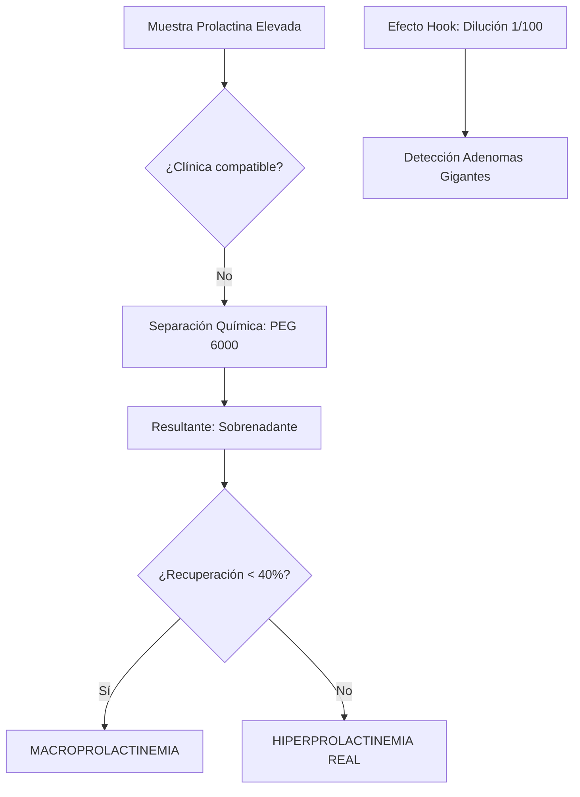
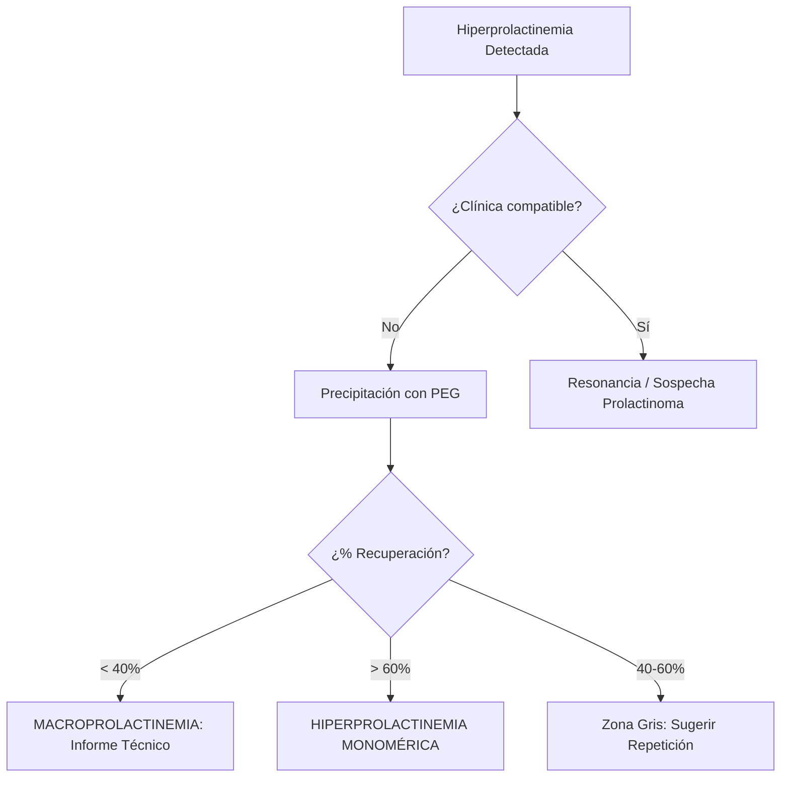
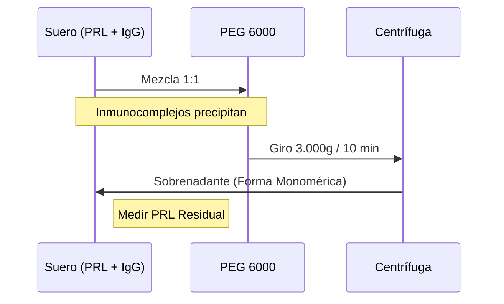

# Semana 2: Hormonas
## Lección 4: La Prolactina y su cara oculta: Las Macroprolactinas

### 1. Título y Resumen (Abstract)
**Título:** Abordaje Técnico-Clínico de la Macroprolactinemia: Implementación del Método de Precipitación con Polietilenglicol (PEG) para la Resolución de Discordancias Analíticas.
**Resumen:** Este artículo revisa la heterogeneidad molecular de la prolactina y el impacto del fenómeno de la macroprolactinemia en la práctica del laboratorio. Se evalúa el protocolo de cribado sistemático mediante precipitación fraccionada, analizando la tasa de recuperación para distinguir entre verdadera hiperprolactinemia y falsas elevaciones por inmunocomplejos. Se discute además la importancia de la validación del Técnico de Laboratorio en la detección de interferencias y efecto Hook.

### 2. Introducción (Fundamentos y Objetivos)
#### 2.1. Fisiología y Regulación de la Prolactina (Módulo 1370/1371)
El currículo de **Fisiopatología General** (Módulo 1370) detalla el control hipotálamo-hipofisario. La prolactina (PRL) es una hormona peptídica secretada por las células lactotropas.
- **Control Inhibidor:** Mediado por la dopamina hipotalámica.
- **Heterogeneidad Molecular:** La PRL circula en distintas formas fisicoquímicas: Monomérica (23 kDa), Big (50 kDa) y **Macroprolactina** (Big-Big PRL, > 150 kDa), compuesta por agregados de PRL con autoanticuerpos IgG.

#### 2.2. Fundamentos de las Técnicas de Inmunoanálisis (Módulo 1372)
El **Módulo de Inmunodiagnóstico** describe las reacciones Ag-Ab primarias:
1.  **Inmunoensayos Tipo Sándwich (ECLIA):** Utilizan dos anticuerpos dirigidos contra diferentes epítopos de la PRL. Los complejos de macroprolactina exponen epítopos que reaccionan con los anticuerpos del kit, dando elevaciones falsas (inactividad biológica).
2.  **Efecto Gancho (Hook Effect):** Concentraciones extremas de antígeno saturan los anticuerpos impidiendo la formación del sándwich. El TSLCB debe detectar discordancias clínicas y realizar diluciones seriadas (Módulo 1368).

#### 2.3. Precipitación con PEG y Validación Técnica (Módulo 1371/1368)
El TSLCB debe aplicar métodos de separación química:
- **Técnica:** El Polietilenglicol (PEG) altera la solubilidad de las proteínas de alto peso molecular, provocando la precipitación selectiva de inmunocomplejos (inmunoglobulinas).
- **Cálculo de Recuperación:** $Recuperación\% = (PRL_{sobrenadante} / PRL_{total}) \times 100$.

**Objetivo:** Sistematizar el cribado de macroprolactina en el flujo de validación del TSLCB ante toda hiperprolactinemia asintomática.

### 3. Material y Métodos
- **Diseño:** Estudio técnico-experimental sobre reactividad analítica.
- **Entorno:** Unidad de Hormonas, Hospital Universitario Infanta Sofía.
- **Intervenciones:** Determinación de PRL total por ECLIA. Protocolo de precipitación con PEG 6000 (mezcla suero/PEG 1:1, incubación, centrifugación y re-determinación de PRL en el sobrenadante).
- **Control de Calidad:** Verificación del coeficiente de variación (CV%) tras diluciones seriadas para descartar efecto Hook.

### 4. Resultados (Hallazgos Experimentales)
Interpretación de la recuperación post-PEG:

### 5. Discusión y Conclusiones
La macroprolactinemia es una causa frecuente de derivaciones innecesarias a neurocirugía. El TSLCB debe estar alerta ante sueros con elevaciones de PRL de 30-100 ng/mL sin causa aparente. Se concluye que la implementación del PEG es una solución económica y altamente eficaz. Además, en casos de discordancia masiva (clínica de tumor vs lab normal), el TEL debe realizar diluciones 1/100 sistemáticamente para salvar el efecto Hook.

### 6. Agradecimientos
A los Facultativos de Endocrinología del Hospital Infanta Sofía por la retroalimentación diagnóstica en casos de macroprolactinemia.

### 7. Bibliografía (Literatura Citada)
- **Barrett et al. Ganong Fisiología Médica. 26ª Ed. McGraw Hill.**
- **Gutiérres Uzquiza, A.; Sayagués Manzano, J.M. Pautas para Artículos Originales (2025).**
- **Decreto 179/2015 de la CM: Módulo de Análisis Bioquímico.**
- [SEQCML: Guía para el estudio de la Hiperprolactinemia 2024](https://www.seqc.es)
- [Society for Endocrinology: Clinical Management of Hyperprolactinaemia](https://www.endocrinology.org)

---
### Sobre la Ponente
**Laura Mayor García** es Facultativa Especialista de Área (FEA) en Bioquímica Clínica en el **Hospital Universitario de Infanta Sofía**.

*Ficha pedagógica ampliada según el marco de competencias del TSLCB.*
