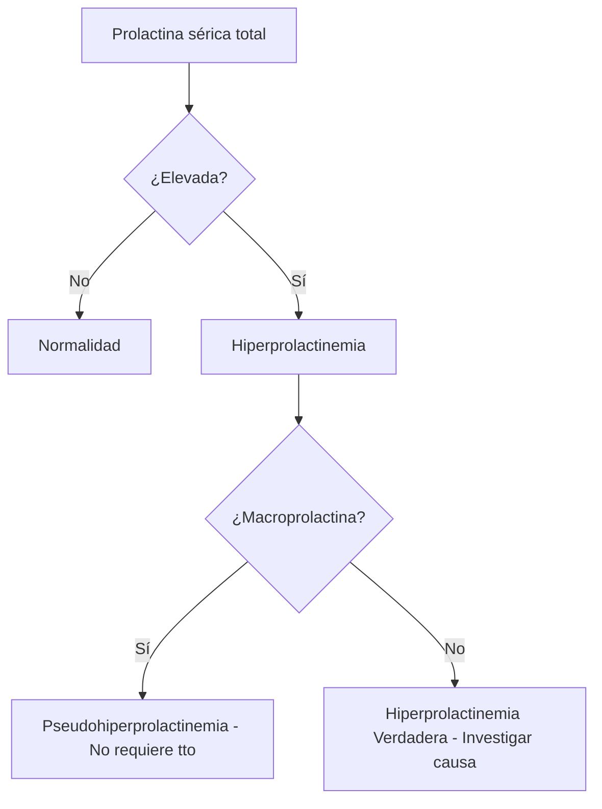

# Semana 2: Hormonas
## Lección 4: La Prolactina y su cara oculta: Las Macroprolactinas

### 1. Título y Resumen (Abstract)
**Título:** Desafíos del Laboratorio en el Diagnóstico de la Hiperprolactinemia: Identificación y Relevancia Clínica de la Macroprolactina.
**Resumen:** La hiperprolactinemia es una situación clínica frecuente con múltiples etiologías (fisiológicas, farmacológicas y patológicas). Este tema se enfoca en una causa de "falso positivo" bioquímico: la macroprolactina (complejo prolactina-IgG). Se analiza cómo su presencia puede llevar a diagnósticos erróneos y tratamientos innecesarios, y se describe la técnica de precipitación con Polietilenglicol (PEG) como método de cribado en el laboratorio.

### 2. Introducción (Fundamentos y Objetivos)
#### 2.1. Fisiología de la Prolactina (Módulo 1370)
- **Origen:** Células lactotropas de la adenohipófisis.
- **Regulación:** Principalmente inhibida por la Dopamina.
- **Función:** Inducción y mantenimiento de la lactancia, regulación de la función reproductiva.

#### 2.2. Formas Moleculares de la Prolactina
1.  **Monomérica (Little PRL):** 23 kDa. Es la forma biológicamente activa (80-95% en condiciones normales).
2.  **Big PRL:** 50-60 kDa. Dímeros/Trímeros.
3.  **Macroprolactina (Big Big PRL):** >150 kDa. Complejo de prolactina con anticuerpos IgG. No es biológicamente activa pero sí inmunoreactiva.

### 3. Material y Métodos
- **Inmunoensayo:** Medición de Prolactina Total (sensible a interferencias).
- **Cribado de Macroprolactina:** Precipitación con Polietilenglicol (PEG) al 25%.
- **Confirmación (Gold Standard):** Cromatografía de Filtración en Gel (GFC).

### 4. Resultados (Interpretación del Laboratorio)
Tras el tratamiento con PEG:
- **Recuperación > 60%:** Ausencia de macroprolactina (hiperprolactinemia verdadera).
- **Recuperación < 40%:** Presencia significativa de macroprolactina.
- **Zona Gris (40-60%):** Requiere correlación clínica o GFC.

### 5. Discusión y Conclusiones
La macroprolactinemia puede afectar hasta al 10-25% de los pacientes con hiperprolactinemia. Para el TSLCB, es vital reconocer que un resultado de prolactina muy elevado en un paciente asintomático (sin galactorrea ni amenorrea) sugiere fuertemente la presencia de macroprolactina. El uso sistemático del PEG ahorra costes en pruebas de imagen (RM) y evita el uso de fármacos agonistas dopaminérgicos innecesarios.

### 6. Agradecimientos
A la Dra. Laura Mayor García y al equipo de Bioquímica del Hospital Universitario Infanta Sofía por su exhaustiva revisión de la prolactina.

### 7. Bibliografía (Literatura Citada)
- **Diagnosis and Treatment of Hyperprolactinemia: An Endocrine Society Clinical Practice Guideline.** [Ver en endocrine.org](https://www.endocrine.org)
- **Macroprolactinemia: Information for Clinicians - AACB.** [Ver en aacb.asn.au](https://www.aacb.asn.au)
- **Documento de consenso sobre la hiperprolactinemia - SEEN.** [Ver en seen.es](https://www.seen.es)

---
### 8. Charla y Transcripción (Contenido Multimedia)

**Enlace al vídeo:** [Ver en YouTube](https://www.youtube.com/watch?v=ncs8B1EDD3A)

#### Transcripción de la Sesión
> Hola, buenas tardes. Soy Laura Mayor García, facultativo especialista de Bioquímica Clínica del Hospital Universitario Infanta Sofía de San Sebastián de los Reyes. En primer lugar, quería agradecer al Comité Organizador, a Marta Prat, a Alba Barreiro y a la Doctora Blanco, por haberme invitado una vez más a participar en este curso de actualización del laboratorio clínico que ya celebra su séptima edición. Durante esta sesión vamos a hablar sobre la prolactina y su cara oculta, las macroprolactinas. Este es el índice que vamos a seguir durante la charla. En primer lugar, daremos unas pinceladas sobre la fisiología de la prolactina para poder entender la hormona y las hiperprolactinemias. Después pasaremos a hablar sobre las macroprolactinas propiamente dichas y por último os enseñaremos cómo se estudia y se detecta la macroprolactina desde nuestro laboratorio clínico. Para empezar, vamos a recordar brevemente la fisiología de la prolactina. Como sabéis, la prolactina es una hormona peptídica segregada por las células lactotropas de la parte anterior de la hipófisis, la adenohipófisis. Su función principal es el desarrollo de la glándula mamaria y la inducción y mantenimiento de la lactancia. Al contrario de lo que ocurre con el resto de las hormonas de la adenohipófisis, la secreción de la prolactina se encuentra predominantemente bajo un control inhibitorio por parte de la dopamina hipotalámica, que es el factor liberador de la dopamina, a nivel de la eminencia media cerebral. La secreción de la prolactina se produce de forma pulsátil, siguiendo un ritmo circadiano con un pico máximo durante el sueño, pero este ritmo no tiene importancia a nivel diagnóstico. Su vida media en circulación es de unos 30-50 minutos y su aclaramiento se produce fundamentalmente por vía hepática y renal. En cuanto al diagnóstico, el laboratorio se encarga de cuantificar los niveles de prolactina en sangre. Se considera hiperprolactinemia cuando los niveles son superiores al límite superior de la referencia para cada laboratorio, generalmente por encima de 20 nanogramos mililitro en varones y 25 mililitros en mujeres. Las causas de hiperprolactinemia son muy diversas y se pueden clasificar principalmente en tres grupos. En primer lugar, las causas fisiológicas, como pueden ser el embarazo y la lactancia, el estrés, el ejercicio físico o el sueño. También destaca el papel de los fármacos. La secreción de la prolactina es sensible a numerosos fármacos, principalmente aquellos que alteran la transmisión dopaminérgica, como pueden ser antipsicóticos, antidepresivos, antihipertensivos o anticonceptivos orales. Y por último, las causas patológicas, donde se incluyen patologías hipotálamo-hipofisarias, como los prolactinomas que son tumores productores de prolactina, o bien por compresión del tallo hipofisario, el hipotiroidismo primario y la insuficiencia renal, que es muy importante ya que en este caso su aclaramiento se encuentra disminuido. El cuadro clínico de la hiperprolactinemia se caracteriza fundamentalmente por alteraciones del eje hipotálamo-hipófiso-gonadal y la galactorrea. En las mujeres los síntomas más frecuentes son la amenorrea primaria o secundaria, menstruaciones irregulares o infertilidad y galactorrea, que es la secreción de leche fuera del periodo de lactancia. En los hombres destaca la disminución del líbido, impotencia sexual, oligospermia e infertilidad, y con menos frecuencia ginecomastia y galactorrea. Todo esto se debe a que la prolactina elevada inhibe de forma potente la secreción pulsátil de la hormona liberadora de gonadotropinas. Pero de qué hablamos cuando hablamos de la cara oculta de la prolactina? Entramos en este segundo bloque para hablar de las macroprolactinas. A modo de introducción, cabe mencionar que la secreción de la prolactina por la hipófisis no es completamente uniforme en cuanto a su tamaño molecular. La prolactina circula en tres formas fundamentalmente: La forma más pequeña o Little Prolactin, que es la monomérica de 23 kilodaltons. Es la más abundante en condiciones normales, representando entre un 80 y un 95% de la prolactina total y es la forma biológicamente activa y con alta afinidad por su receptor. La forma intermedia o Big Prolactin que tiene un peso molecular de entre 50 y 60 kilodaltons, lo cual nos indica que se trata de dímeros o polímeros de la forma monomérica. Y por último, la forma más grande o Big Big Prolactin, también conocida como macroprolactina. Tiene un peso molecular superior a los 150 kilodaltons circulando unida a anticuerpos tipo inmunoglobulina G de carácter autoinmune. Aunque esta forma es capaz de ser detectada de forma similar por los inmunoensayos de laboratorio, no posee actividad biológica in vivo debido a su gran tamaño que le impide el paso a través de los capilares hasta alcanzar sus receptores específicos a nivel de su tejido diana. Las macroprolactinas se encuentran en circulación en forma de complejos estables que, como hemos dicho, son biológicamente inactivos. Por lo tanto, si la mayoría de la prolactina de un paciente se encuentra en forma de macroprolactina, este no presentará los síntomas clásicos de una hiperprolactinemia y será asintomático. Cómo afecta al diagnóstico esta situación? Pues si el laboratorio detecta niveles elevados de prolactina total sin realizar un fraccionamiento de las diferentes formas moleculares, el clínico puede diagnosticar erróneamente una hiperprolactinemia de causa patológica o medicamentosa. Esto puede dar lugar a que el paciente se someta a pruebas radiológicas innecesarias, como resonancias magnéticas, para descartar tumores hipofisarios e incluso a tratamientos farmacológicos crónicos con agonistas dopaminérgicos que el paciente no necesita. Por lo tanto, la presencia de macroprolactina conlleva el hallazgo fortuito de la macroprolactinemia, que es una causa común de pseudohiperprolactinemia. La prevalencia de la macroprolactina es variable, pero se estima que está presente en aproximadamente el 10 al 25% de los pacientes diagnosticados de hiperprolactinemia. Por lo tanto, no es una patología infrecuente. La importancia estriba en que esta macroprolactina puede causar una elevación persistente de la prolactina total que es detectada por los inmunoensayos comunes del laboratorio. Y cómo se detecta la macroprolactina desde nuestro laboratorio? Pues existen varias técnicas para poder detectar o separar estas formas de la prolactina. Lo ideal para detectar y confirmar la macroprolactina sería identificar las diferentes fracciones moleculares o lo que es lo mismo, conocer su perfil molecular. La técnica patrón o Gold Standard es la cromatografía de filtración en gel o GFC, que permite separar las fracciones de la prolactina según su tamaño molecular. Sin embargo, esta técnica es costosa, consume mucho tiempo y no está disponible en la mayoría de los laboratorios clínicos de forma rutinaria. Para solventar este inconveniente, la técnica más empleada en la práctica clínica para el cribado de la macroprolactina es la precipitación con polietilenglicol o PEG. Este método se basa en la propiedad que tiene el PEG de precipitar selectivamente los complejos de alto peso molecular, como son los complejos prolactina-IgG o macroprolactinas del suero. El procedimiento en el laboratorio se realiza de la siguiente manera: En primer lugar, se mide la prolactina total en el suero del paciente. Seguidamente, se mezcla una alícuota del suero con una solución de PEG al 25% a partes iguales. Se mezcla vigorosamente y se incuba. Tras un proceso de centrifugación, las macroprolactinas sedimentan en el fondo del tubo y se vuelven a medir la prolactina en el sobrenadante, que contiene principalmente la prolactina monomérica. Para informar del resultado, lo que calculamos es el porcentaje de recuperación de la prolactina tras la precipitación con el PEG. Generalmente se considera que existe macroprolactina cuando la recuperación es inferior al 40% de la prolactina inicial. Por el contrario, si la recuperación es superior al 60%, se asume que no hay macroprolactina y los niveles elevados de prolactina se deben a la forma monomérica biológicamente activa. En los casos donde la recuperación se encuentra entre el 40 y el 60% se habla de una zona gris y lo ideal sería realizar una confirmación mediante la cromatografía de filtración en gel. Un aspecto muy importante que debemos conocer desde el laboratorio son las interferencias del PEG. Al ser un agente precipitante no específico, puede arrastrar también proteínas o analitos que nos interesan, causando una ligera subestimación de la prolactina monomérica incluso en ausencia de macroprolactina. Por eso es vital comparar el resultado tras PEG con los valores de referencia del propio laboratorio establecidos para el sobrenadante tras PEG. En este punto os preguntaréis a qué pacientes debemos realizar este estudio? Pues las recomendaciones internacionales no son del todo uniformes. Por un lado, algunos autores sugieren realizar el cribado de macroprolactina a todos los pacientes con hiperprolactinemia antes de proceder a cualquier otra prueba diagnóstica. Otros sugieren que solo se debe realizar en aquellos pacientes que presentan hiperprolactinemia sin clínica acompañante. En nuestro hospital lo que hacemos es incluir el estudio de macroprolactina de forma sistemática en todas las primeras determinaciones de prolactina elevada de cada paciente, independientemente de la clínica que sepamos de dicho paciente. Conclusiones y mensajes finales: 1. La hiperprolactinemia es un hallazgo clínico frecuente en el laboratorio con múltiples causas. 2. La macroprolactina es un complejo prolactina-IgG biológicamente inactivo que es detectado por los inmunoensayos comerciales. 3. La macroprolactina es causa de pseudohiperprolactinemia y su prevalencia no es despreciable. Su detección sistemática en el laboratorio clínico evita exploraciones radiológicas y tratamientos farmacológicos innecesarios. 4. La precipitación con peg es el método de cribado más accesible y de elección en la rutina del laboratorio. 5. Por último, recordar que la interpretación de los niveles de prolactina siempre debe ir acompañada de una buena correlación clínica. Pues esto es todo, muchísimas gracias por vuestra atención. Espero que les haya resultado útil e interesante.

#### Explicación de la Ponencia
La sesión detalla la importancia de la Macroprolactina para el TSLCB:
1.  **Heterogeneidad Molecular**: La prolactina no es una molécula única. El técnico debe saber que existen formas "Big" y "Big-Big" (Macro) que falsean los resultados de los equipos automatizados.
2.  **Técnica de PEG**: Es una técnica manual de precipitación que el TSLCB realiza a pie de laboratorio. El uso de polietilenglicol permite "limpiar" el suero de complejos pesados para medir solo la prolactina real (monomérica).
3.  **Ahorro de Pruebas Innecesarias**: Al detectar macroprolactina, el laboratorio informa que el paciente no tiene una patología real, evitando que se le someta a una Resonancia Magnética (RM) del cerebro para buscar tumores inexistentes.
4.  **Recuperación**: El post-proceso de cálculo (porcentaje de recuperación) es la clave diagnóstica que se añade al informe final.

---
### Sobre la Ponente
**Laura Mayor García** es Facultativo Especialista de Bioquímica Clínica del **Hospital Universitario Infanta Sofía**.

*Contenido actualizado con transcripción íntegra - Marzo 2026*
*Material adaptado al currículo profesional de Técnico de Laboratorio.*
