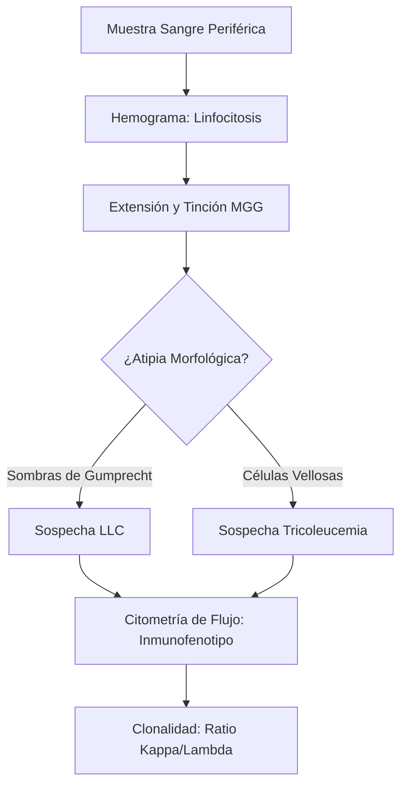
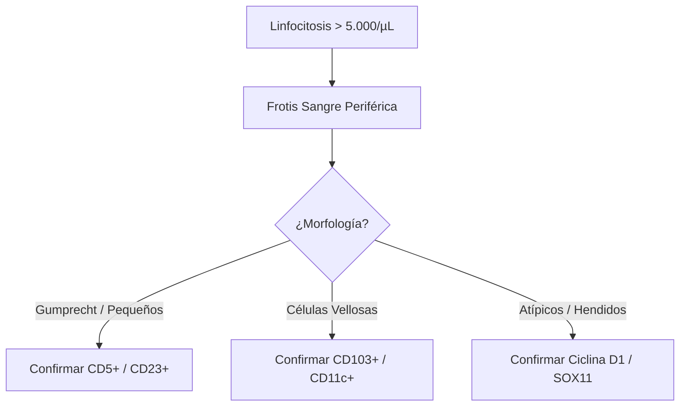
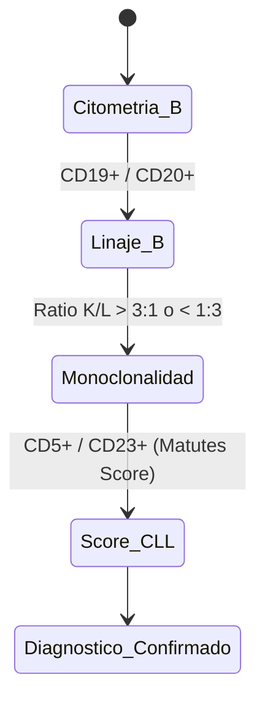

# Semana 3: Hematología y Autoinmunidad
## Lección 1: Neoplasias Linfoides con Expresión en Sangre Periférica

### 1. Título y Resumen (Abstract)
**Título:** Optimización del Algoritmo Diagnóstico en Hemopatías Malignas Crónicas: Integración de la Morfología Digital y la Citometría de Flujo Multiparamétrica.
**Resumen:** Este artículo profundiza en la caracterización de las neoplasias linfoides crónicas que presentan leucemización. Se fundamenta el proceso de diferenciación linfoide normal frente al patológico y se evalúa la eficacia de la revisión del frotis de sangre periférica frente a la confirmación fenotípica. Se destaca el papel del TSLCB en la identificación de atipias citomorfológicas (Sombras de Gumprecht, prolinfocitos) como disparadores de pruebas diagnósticas avanzadas.

### 2. Introducción (Fundamentos y Objetivos)
#### 2.1. Hematopoyesis y Fisiología de la Serie Blanca (Módulo 1374)
El currículo oficial de **Técnicas de Análisis Hematológico** establece el estudio de la hematopoyesis. Los linfocitos se originan a partir de la célula madre pluripotencial en la médula ósea.
1.  **Linaje B:** Maduran en médula ósea y ganglios periféricos. Expresan inmunoglobulinas de superficie.
2.  **Linaje T:** Maduración tímica y adquisición de TCR.
3.  **Procesos Neoplásicos (Módulo 1370):** Resultan de la proliferación clonal descontrolada de una célula en cualquier estadio de maduración, adquiriendo capacidades invasivas de sangre periférica (leucemización).

#### 2.2. Técnicas de Estudio Hematológico y Morfología (Módulo 1374)
- **Tinciones Hematológicas:** El TSLCB debe dominar el uso de colorantes tipo Romanowsky (Giemsa, May-Grünwald) para la diferenciación tintorial de cromatina y citoplasma.
- **Morfología de Neoplasias:** Identificación de **prolinfocitos**, linfocitos de LLC (pequeños con cromatina en "tablero de ajedrez") y **Sombras de Gumprecht** (restos celulares por fragilidad mecánica).
- **Equipos Automáticos:** Manejo de histogramas y citogramas (Módulo 1374), interpretando alarmas de "Blasts" o "Lymph Variant".

#### 2.3. Inmunofenotipo por Citometría de Flujo (Módulo 1372)
- **Principio:** Basado en la dispersión de luz (Forward Scatter para tamaño y Side Scatter para complejidad interna) y fluorescencia.
- **Marcadores de Linaje:** Localización de CD19, CD20 (Serie B), CD3, CD4, CD8 (Serie T).
- **Monoconalidad:** Demostración de la restricción de cadenas ligeras Kappa o Lambda.

**Objetivo:** Establecer el flujo de validación técnica conforme a la Clasificación de la OMS (5ª Edición, 2022-2024), asegurando la identificación morfológica precisa antes de la derivación a inmunofenotipo.

### 3. Material y Métodos
- **Diseño:** Análisis descriptivo retrospectivo de muestras onco-hematológicas.
- **Entorno:** Servicio de Hematología, Laboratorio de Morfología y Citometría, H.U. de Getafe.
- **Intervenciones:**
    - **Analizadores Automatizados:** Sistemas de recuento mediante impedancia y citoquímica de flujo.
    - **Tinción:** May-Grünwald Giemsa (MGG) para detalle de cromatina.
    - **Citometría:** Equipo de 10 colores con marcado para CD19, CD20, CD5, CD23, CD10, CD103, y Cadenas Ligeras Kappa/Lambda.

### 4. Resultados (Hallazgos Experimentales)
Algoritmo de clasificación morfo-fenotípica:

### 5. Discusión y Conclusiones
La pericia en la fase microscópica inicial por parte del TSLCB es irremplazable, incluso con el auge de la IA. La identificación manual de prolinfocitos (> 55% sugiere leucemia prolinfocítica B) tiene implicaciones pronósticas críticas. Se concluye que el informe del laboratorio debe ser integrado ("Integrated Report") uniendo morfología, fenotipo y, en casos de LCM, citogenética molecular (FISH).

### 6. Agradecimientos
A la unidad de Hematopatología por la supervisión de las galerías de imágenes digitales y casos de leucemización de linfomas.

### 7. Bibliografía (Literatura Citada)
- **WHO Classification of Tumours Editorial Board. Haematolymphoid Tumours. 5th Edition. IARC.**
- **Rodak. Hematología: Fundamentos y aplicaciones clínicas. Editorial Médica Panamericana.**
- **Vives y Aguilar. Manual de técnicas de laboratorio en hematología. Elsevier.**
- **Decreto 179/2015 de la CM: Módulo de Técnicas de Análisis Hematológico.**
- [SEHH: Guía de Diagnóstico de Neoplasias Linfoides](https://www.sehh.es)

---
### Sobre la Ponente
**Belén Álvarez Núñez** es Residente de 2º año (R2) de Hematología y Hemoterapia en el **Hospital Universitario de Getafe**.

*Contenido científico ampliado alineado con el currículo oficial TSLCB.*
