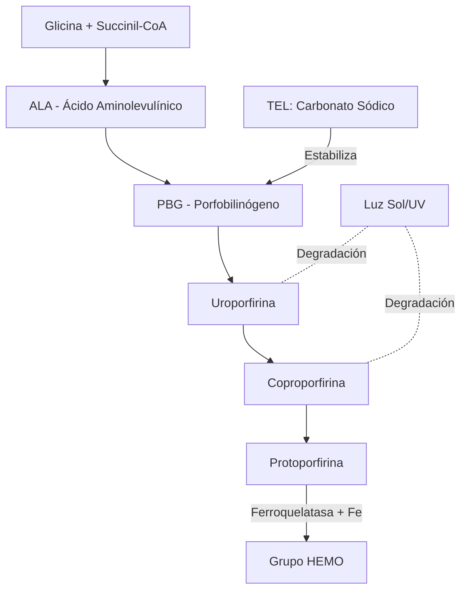
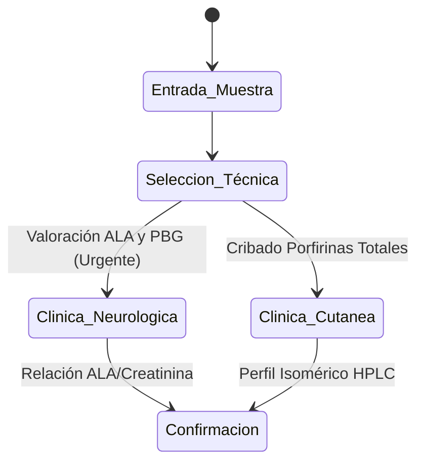
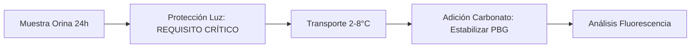

# Semana 3: Hematología y Autoinmunidad
## Lección 2: Determinación de Porfirinas Totales en Orina

### 1. Título y Resumen (Abstract)
**Título:** Optimización de la Fase Preanalítica en la Cuantificación de Porfirinas Urinarias: Evaluación de la Estabilidad Lumínica y Protocolización del Ajuste de pH.
**Resumen:** Este artículo analiza la ruta biosintética del grupo Hemo y los errores innatos del metabolismo que conducen a las porfirias. Se evalúa cómo las condiciones de recogida (protección de la luz, temperatura y agentes conservantes) determinan la integridad analítica de los precursores (ALA, PBG) y las porfirinas fraccionadas. Se concluye con un algoritmo de validación técnica que minimiza los falsos negativos en el diagnóstico de crisis agudas y manifestaciones cutáneas.

### 2. Introducción (Fundamentos y Objetivos)
#### 2.1. Metabolismo del Grupo Hemo y Porfirinas (Módulo 1370/1371)
El currículo de **Análisis Bioquímico** (Módulo 1371) establece el estudio de la biosíntesis del grupo Hemo. El Hemo es una metaloporfirina compuesta por Protoporfirina IX y un átomo de hierro ($Fe^{2+}$).
- **Ruta Metabólica:** Comienza en la mitocondria con la condensación de succinil-CoA y glicina (enzima ALA-sintetasa).
- **Precursores:** Ácido delta-aminolevulínico (ALA) y Porfobilinógeno (PBG).
- **Estructura Química (Módulo 1368):** Las porfirinas son compuestos cíclicos formados por cuatro anillos pirrólicos unidos por puentes metino, lo que les confiere **fluorescencia** característica bajo luz UV.

#### 2.2. Porfirias y Fisiopatología de los Errores Metabólicos (Módulo 1370)
El TSLCB debe identificar los procesos patológicos derivados de bloqueos enzimáticos:
1.  **Porfirias Agudas:** Acúmulo de precursores (ALA, PBG). Toxicidad neuroquímica.
2.  **Porfirias Cutáneas:** Acúmulo de porfirinas fraccionadas (Uro, Copro, Proto). Fotosensibilidad por reacción con la luz en la banda de Soret (~400 nm).

#### 2.3. Gestión de Muestras Fotosensibles y Técnicas (Módulo 1367/1371)
La fase preanalítica es el contenido prioritario para el TSLCB:
- **Protección Lumínica (Módulo 1367):** El espécimen (orina de 24h) debe protegerse de la luz UV para evitar la degradación irreversible de las porfirinas.
- **pH y Estabilidad:** El PBG es inestable a pH ácido; el TSLCB debe instruir sobre el uso de conservantes químicos (Carbonato Sódico) para mantener el pH entre 8 y 9.
- **Técnicas Oficiales:** Cromatografía Líquida de Alta Resolución (HPLC) y espectrometría.

**Objetivo:** Sistematizar los requisitos preanalíticos y la selección de técnicas de confirmación (HPLC vs Espectroscopia) según la normativa de la Comunidad de Madrid.

### 3. Material y Métodos
- **Entorno:** Laboratorio de Química Clínica y Metabolopatías, Hospital Universitario de Getafe.
- **Intervenciones:**
    - **Cribado:** Reacción de Hoesch para PBG (especificidad rápida).
    - **Cuantificación:** Método de separación por HPLC (Cromatografía Líquida de Alta Resolución) con detector de fluorescencia.
    - **Protocolo Preanalítico:** Uso de contenedores opacos (ámbar) o recubiertos con papel de aluminio. Ajuste de pH con Carbonato Sódico (5g/L).

### 4. Resultados (Hallazgos Experimentales)
Diferenciación analítica por tipo de síntoma:

### 5. Discusión y Conclusiones
La integridad del espécimen de orina de 24h es el factor limitante. Una exposición accidental a la luz del sol de solo 30 minutos puede degradar el 40% del contenido de uroporfirinas. Se concluye que el TSLCB debe informar cualquier signo de oscurecimiento de la orina al contacto con el aire ("orina color vino"), sugestivo de Porfiria Aguda Intermitente. El uso de HPLC permite resolver diagnósticos diferenciales complejos entre Porfiria Cutánea Tardía y Coproporfiria Hereditaria.

### 6. Agradecimientos
Al personal de Recogida de Muestras del Área Sanitaria 10 por la implementación del kit de transporte fotosensible.

### 7. Bibliografía (Literatura Citada)
- **Kaplan. Bioquímica Clínica. Panamericana.**
- **Decreto 179/2015 de la CM: Módulo de Gestión de Muestras Biológicas.**
- **Balcells. La Clínica y el Laboratorio. 23ª Ed. Elsevier.**
- [European Porphyria Network: Best Practice Guidelines for Lab Diagnosis](https://porphyrianet.org)
- [AACC: Porphyrias and the Clinical Laboratory](https://www.aacc.org)

---
### Sobre la Ponente
**Alejandra Mariana Calderón** es Residente de 3er año (R3) de Bioquímica Clínica en el **Hospital Universitario de Getafe**.

*Contenido científico actualizado conforme a los objetivos docentes TEL/TSLCB.*
