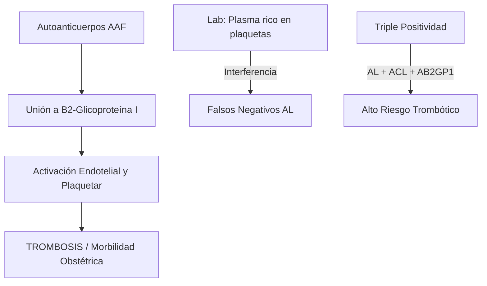
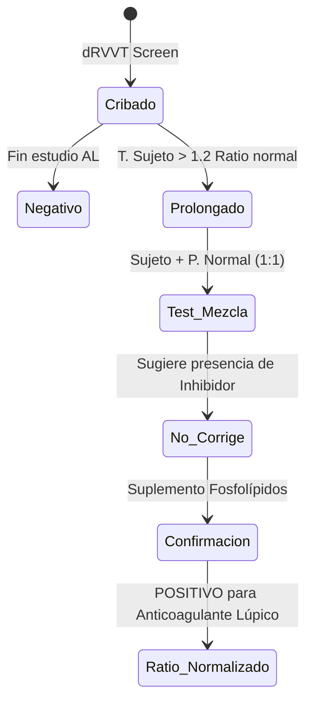
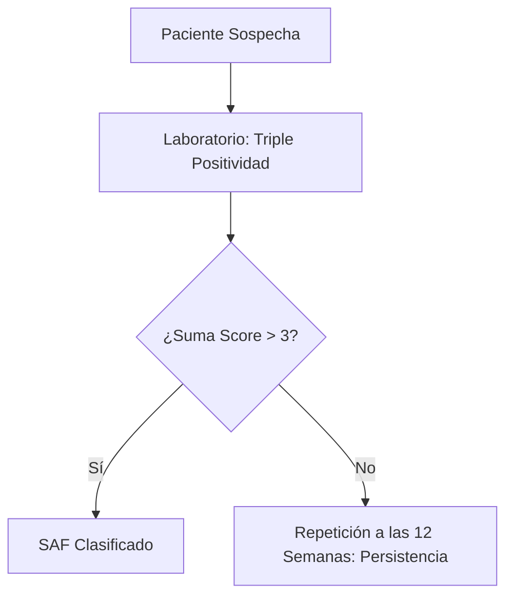

# Semana 3: Hematología y Autoinmunidad
## Lección 3: Síndrome Antifosfolípido (SAF): Criterios de Clasificación y Diagnóstico Biológico

### 1. Título y Resumen (Abstract)
**Título:** Aplicación de los Criterios ACR/EULAR 2023 en el Abordaje Multidisciplinar del SAF: Calidad Preanalítica en el Estudio de la Coagulación y el Inmunoensayo.
**Resumen:** Este artículo analiza la fisiopatología del estado protrombótico inmunomediado y profundiza en la paradoja del anticoagulante lúpico (AL). Se evalúan los requisitos de la fase preanalítica (obtención de plasma pobre en plaquetas) y se comparan las metodologías de coagulación funcionales con las detecciones antigénicas por ELISA, estableciendo un sistema de puntuación para la clasificación diagnóstica definitiva. Se destaca el papel del TSLCB en la gestión del tiempo y la temperatura de las muestras citratadas.

### 2. Introducción (Fundamentos y Objetivos)
#### 2.1. Fisiopatología de la Hemostasia e Inmunidad (Módulo 1374/1370)
El currículo de **Técnicas de Análisis Hematológico** (Módulo 1374) establece el estudio de la coagulación. El Síndrome Antifosfolípido (SAF) es una enfermedad sistémica autoinmune caracterizada por un estado de hipercoagulabilidad mediado por autoanticuerpos.
- **Mecanismo:** Los anticuerpos antifosfolípido (AAF) se dirigen contra proteínas plasmáticas con afinidad por fosfolípidos aniónicos, principalmente la **Beta-2-Glicoproteína I** ($\beta2GPI$).
- **Consecuencia (Módulo 1370):** La unión de estos complejos a células endoteliales y plaquetas induce la expresión de factor tisular y la activación de la cascada de la coagulación, provocando trombosis recurrentes.

#### 2.2. Anticoagulante Lúpico y Paradoja Analítica (Módulo 1374/1371)
El Anticoagulante Lúpico (AL) es un hallazgo de laboratorio crítico para el TSLCB:
- **Efecto In Vitro:** Prolonga los tiempos de coagulación dependientes de fosfolípidos (APTT, dRVVT) al competir por los sitios de unión del reactivo.
- **Efecto In Vivo:** Es un potente factor protrombótico.

#### 2.3. Fase Preanalítica y Técnicas de Inmunoanálisis (Módulo 1367/1372)
- **Gestión de la Muestra (Módulo 1367):** Obtención de **Plasma Pobre en Plaquetas (PPP)** mediante doble centrifugación. Las plaquetas residuales liberan fosfolípidos que neutralizan el AL, causando falsos negativos.
- **Inmunodiagnóstico (Módulo 1372):** Detección de anticuerpos Anticardiolipina (ACL) y Anti-$\beta2GPI$ mediante técnicas ELISA o quimioluminiscencia.

**Objetivo:** Adaptar los flujos de validación del laboratorio de Hemostasia y Autoinmunidad a los requisitos de puntuación 2023.

### 3. Material y Métodos
- **Diseño:** Estudio técnico-comparativo de metodologías funcionales y de inmunoensayo.
- **Entorno:** Laboratorio de Hemostasia y Coagulación, H.U. de Fuenlabrada.
- **Intervenciones:** 
    - **Fase Preanalítica:** Doble centrifugación (2.500g / 15 min x 2) para obtener **Plasma Pobre en Plaquetas (PPP)** < 10.000 plaquetas/µL.
    - **Metodología AL:** Tiempo de veneno de víbora de Russell diluido (dRVVT) y APTT-sensible al AL.
    - **Detección ELISA:** Inmunoensayo enzimático para anticuerpos dirigidos contra Cardiolipina y β2-Glicoproteína 1 (IgG/IgM).

### 4. Resultados (Hallazgos Experimentales)
Workflow de cribado y confirmación técnica para el AL:

### 5. Discusión y Conclusiones
La pericia en la obtención del PPP es fundamental. La presencia de plaquetas intactas por mala centrifugación libera fosfolípidos de membrana durante la congelación, que neutralizan el AL dando falsos negativos catastróficos. Se concluye que el TSLCB debe asegurar que la muestra citratada no permanezca más de 4 horas a temperatura ambiente antes de su procesado. Solo la persistencia analítica (≥ 12 semanas) otorga valor diagnóstico al hallazgo.

### 6. Agradecimientos
Al equipo de Hematología del HUF por la provisión de casos de SAF obstétrico para la validación de los puntos de corte de la β2GP1.

### 7. Bibliografía (Literatura Citada)
- **Vives y Aguilar. Manual de técnicas de laboratorio en hematología. 5ª Ed. Elsevier.**
- **Decreto 179/2015 de la CM: Módulo de Técnicas de Inmunodiagnóstico.**
- [ACR/EULAR: 2023 Classification Criteria for Antiphospholipid Syndrome](https://www.rheumatology.org)
- [ISTH: Guidelines for Lupus Anticoagulant Testing](https://www.isth.org)

---
### Sobre la Ponente
**Verónica Benito Zamorano** es Facultativa Especialista de Área (FEA) de Bioquímica Clínica en el **Hospital Universitario de Fuenlabrada**.

*Material técnico ampliado según las competencias del título de Técnico Superior.*
