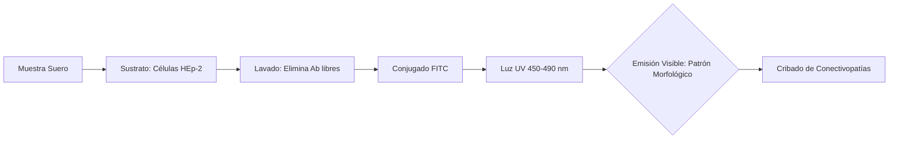
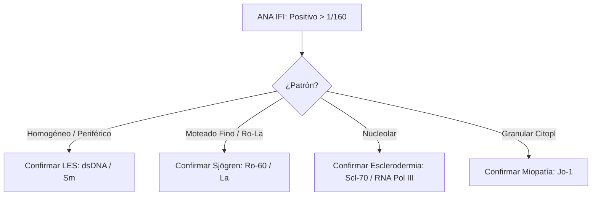

# Semana 3: Hematología y Autoinmunidad
## Lección 4: Las Enfermedades Autoinmunes desde el Laboratorio Clínico

### 1. Título y Resumen (Abstract)
**Título:** Estandarización de la Inmunoflorescencia Indirecta (IFI) y Análisis de Especificidades Antigénicas en el Diagnóstico de Enfermedades Autoinmunes Sistémicas.
**Resumen:** Este artículo profundiza en los fundamentos técnicos del diagnóstico de autoinmunidad. Se fundamenta el uso de células HEp-2 como sustrato de referencia para la detección de Anticuerpos Antinucleares (ANA) y se valida la nomenclatura internacional ICAP. Se evalúa el algoritmo de cribado frente a la confirmación por técnicas de fase sólida (ELISA/LIA), destacando el valor del TSLCB en la identificación de patrones morfológicos complejos y la importancia de la titulación analítica.

### 2. Introducción (Fundamentos y Objetivos)
#### 2.1. Inmunopatología de los Trastornos Autoinmunes (Módulo 1370/1372)
El currículo de **Fisiopatología General** (Módulo 1370) incluye el estudio de la inmunidad natural y específica. Las enfermedades autoinmunes resultan de la rotura de la autotolerancia, con la consiguiente producción de autoanticuerpos contra antígenos propios.
- **Dianas Antigénicas:** Componentes del núcleo (ANA), citoplasma, membranas celulares o proteínas plasmáticas.

#### 2.2. Fundamentos de la Inmunofluorescencia Indirecta (IFI) (Módulo 1372)
El **Módulo de Técnicas de Inmunodiagnóstico** detalla el fundamento de la IFI:
1.  **Sustrato:** Uso de cortes de tejidos o líneas celulares fijadas (habitualmente células **HEp-2**, de carcinoma laríngeo humano, por su gran tamaño nuclear y riqueza en antígenos de división).
2.  **Reacción Ag-Ab Secundaria:** Los autoanticuerpos del paciente se unen al sustrato. Tras el lavado, se añade un conjugado (anti-IgG humana marcada con **FITC** - isotiocianato de fluoresceína).
3.  **Visualización (Módulo 1368):** Uso del microscopio de fluorescencia con fuente de luz de vapor de mercurio o LED y filtros de excitación/emisión.

#### 2.3. Estandarización y Nomenclatura (Módulo 1372)
El TSLCB debe conocer los patrones morfológicos según el consenso internacional (ICAP):
- **Homogéneo:** Sugiere anticuerpos anti-dsDNA o histonas (Lupus).
- **Moteado:** Sugiere anticuerpos frente a antígenos nucleares extraíbles (ENA) como Ro, La, Sm, RNP.
- **Centromérico:** Típico de la Esclerodermia.



**Objetivo:** Sistematizar el cribado de ANA según el currículo nacional, asegurando la correlación entre el patrón óptico y la confirmación antigénica.

### 3. Material y Métodos
- **Diseño:** Estudio técnico sobre el flujo de validación inmunológica.
- **Entorno:** Unidad de Autoinmunidad, Hospital Universitario de Getafe.
- **Intervenciones:** Determinación de ANA por IFI sobre sustrato HEp-2 (punto de corte 1/80), cuantificación de ENA (Anti-Ro, La, Sm, RNP, Scl70, Jo1) mediante Inmunoblot y dsDNA por CLIA.
- **Criterio Técnico:** Uso de microscopio con cámara digital para archivo de imágenes.

### 4. Resultados (Hallazgos Experimentales)
Algoritmo de avance basado en el patrón observado:
```mermaid
mindmap
  root((ANA Patterns ICAP))
    Nucleares
      Nuclear Homogéneo (AC-1) --> Confirmar Anti-dsDNA
      Nuclear Moteado (AC-4/5) --> Confirmar Panel ENA
      Centromérico (AC-3) --> Alta espec. CREST
    Citoplasmáticos
      Fibrilar (AC-15/17)
      Moteado Fino (AC-19/20)
```


### 5. Discusión y Conclusiones
La IFI es altamente sensible pero poco específica; un ANA positivo no es diagnóstico *per se* sin clínica compatible. Se concluye que el TSLCB debe dominar la titulación semi-cuantitativa, ya que títulos bajos (1/80) se encuentran en un 20-30% de la población sana, mientras que títulos > 1/320 son altamente indicativos de patología. La transición a sistemas de lectura automatizada mejora la trazabilidad pero requiere siempre validación humana experta. 

### 6. Agradecimientos
Al equipo de residentes de Bioquímica por la gestión del banco de imágenes de fluorescencia para docencia.

### 7. Bibliografía (Literatura Citada)
- **International Consensus on ANA Patterns (ICAP): Standardized Nomenclature.** [Ver en anapatterns.org](https://www.anapatterns.org/)
- **EULAR Recommendations for ANA Testing and Clinical Interpretation.** [Ver en eular.org](https://www.eular.org/recommendations.cfm)
- **Guía SEQCML: El laboratorio clínico en el diagnóstico de enfermedades autoinmunes.** [Ver en seqc.es](https://www.seqc.es/es/bioquimica-en-el-laboratorio-clinico/manuales-y-monografias/)
- **ANA/ENA Profile Interpretation - StatPearls.** [Ver en ncbi.nlm.nih.gov](https://www.ncbi.nlm.nih.gov/books/NBK539825/)

---
### Sobre la Ponente
**Alba Barreiro Lusquiños** es Residente de 4º año (R4) de Bioquímica Clínica en el **Hospital Universitario de Getafe**.

*Contenido científico exhaustivo para el Grado Superior de Laboratorio Clínico y Biomédico.*
