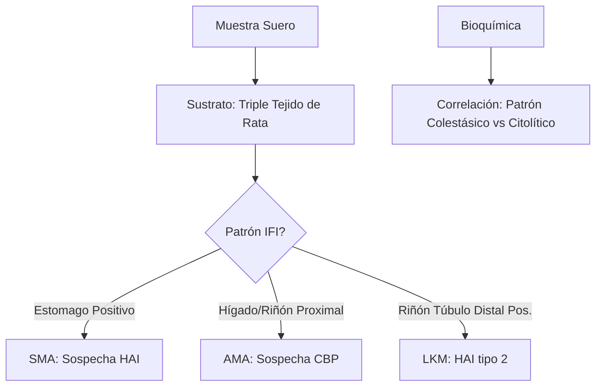
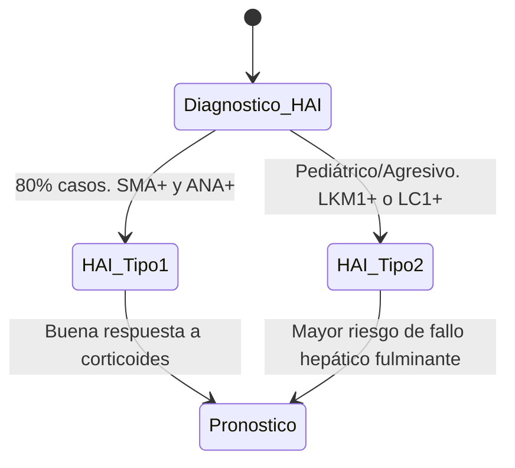
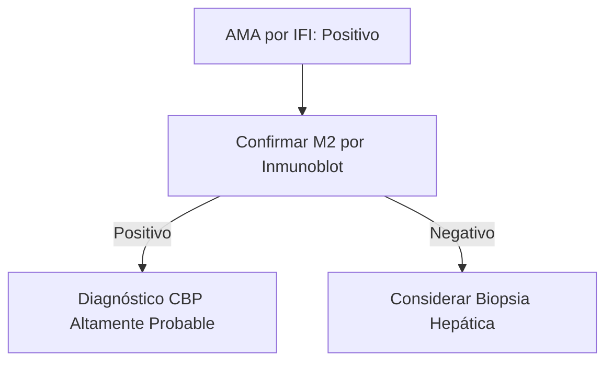

# Semana 3: Hematología y Autoinmunidad
## Lección 5: HAI, CBP, CEP... El ABC de las Hepatopatías Autoinmunes

### 1. Título y Resumen (Abstract)
**Título:** Valor Diagnóstico de los Anticuerpos Hepatopáticos en la Enfermedad Inflamatoria Crónica del Hígado: Caracterización por Triple Tejido y ELISA.
**Resumen:** Este artículo revisa la tríada principal de hepatopatías autoinmunes: Hepatitis Autoinmune (HAI), Cirrosis Biliar Primaria (CBP) y Colangitis Esclerosante Primaria (CEP). Se profundiza en la técnica de IFI sobre triple tejido (estómago, hígado, riñón de rata) para la identificación de patrones SMA, AMA y LKM. Se evalúa la correlación con el perfil bioquímico de colestasis y citólisis, destacando la importancia del diagnóstico precoz para evitar la progresión a cirrosis idiopática.

### 2. Introducción (Fundamentos y Objetivos)
#### 2.1. Fisiopatología de los Trastornos Digestivos y Hepáticos (Módulo 1370)
El currículo de **Fisiopatología General** (Módulo 1370) incluye el estudio de la patología digestiva, hepática y biliar. Las hepatopatías autoinmunes son inflamaciones crónicas mediadas por linfocitos T y autoanticuerpos.
1.  **Hepatitis Autoinmune (HAI):** Destrucción de hepatocitos. Se asocia a hiperganmaglobulinemia e IgG elevada.
2.  **Colangitis Biliar Primaria (CBP):** Destrucción de conductos biliares intrahepáticos.
3.  **Colangitis Esclerosante Primaria (CEP):** Inflamación fibro-obliterativa de los conductos biliares.

#### 2.2. Fundamentos de la IFI sobre Triple Tejido (Módulo 1372)
El **Módulo de Técnicas de Inmunodiagnóstico** describe el estudio de autoanticuerpos mediante sustratos multitisulares:
- **Triple Tejido (Hígado, Estómago, Riñón de Rata):** Permite identificar patrones diferenciales.
    - **SMA (Anti-músculo liso):** Tinción de fibras musculares en estómago. Sugiere HAI.
    - **AMA (Anti-mitocondriales):** Fluorescencia granular en citoplasma de hepatocitos y túbulo renal. Sugiere CBP.
    - **LKM (Anti-microsomales):** Tinción intensa del citoplasma de hepatocitos y túbulos renales. Típico de HAI tipo 2.

#### 2.3. Bioquímica Analítica de la Función Hepática (Módulo 1371)
- **Citolisis:** Medición de ALT (Alanina aminotransferasa) y AST.
- **Colestasis:** Medición de GGT y Fosfatasa Alcalina (Módulo 1371).
- **Inmunoglobulinas:** Cuantificación por nefelometría (Módulo 1368/1372).

**Objetivo:** Sistematizar el flujo de validación inmunológica hepatológica conforme a la normativa de la Comunidad de Madrid.

### 3. Material y Métodos
- **Diseño:** Estudio observacional descriptivo transversal.
- **Entorno:** Unidad de Inmunología Hepática, Hospital Universitario de Getafe.
- **Intervenciones:** Determinación de transaminasas y proteínas totales por espectrofotometría. Detección de autoanticuerpos por IFI (sustrato triple tejido EUROIMMUN) y confirmación de AMA-M2 mediante ELISA.

### 4. Resultados (Hallazgos Experimentales)
Algoritmos de clasificación por tipo de HAI:

### 5. Discusión y Conclusiones
La presencia de títulos bajos de ANA o SMA no es infrecuente en otras hepatopatías (vurales, tóxicas); por ello, la especificidad técnica del TSLCB en la lectura de IFI es vital. Se concluye que el AMA-M2 positivo en presencia de colestasis crónica permite el diagnóstico de CBP sin necesidad de biopsia en el 95% de los casos. La comunicación inmediata de niveles extremos de ALT (>10x LSN) es un valor de alerta en el laboratorio de urgencias.

### 6. Agradecimientos
A los servicios de Digestivo y Anatomía Patológica del HUGF por la correlación histológica en casos de solapamiento ("Overlap syndrome").

### 7. Bibliografía (Literatura Citada)
- **EASL Clinical Practice Guidelines: Autoimmune Hepatitis.** [Ver en easl.eu](https://easl.eu/guidelines/)
- **AASLD Clinical Practice Guidelines: Primary Biliary Cholangitis.** [Ver en aasld.org](https://www.aasld.org/practice-guidelines)
- **Autoanticuerpos en las enfermedades hepáticas autoinmunes - SEQCML.** [Ver en seqc.es](https://www.seqc.es/es/bioquimica-en-el-laboratorio-clinico/manuales-y-monografias/)
- **StatPearls: Autoimmune Hepatitis.** [Ver en ncbi.nlm.nih.gov](https://www.ncbi.nlm.nih.gov/books/NBK459247/)

---
### Sobre la Ponente
**Marta Prat Gimeno** es Residente de 4º año (R4) de Bioquímica Clínica en el **Hospital Universitario de Getafe**.

*Contenido técnico-científico detallado para el Grado Superior de Laboratorio Clínico.*
