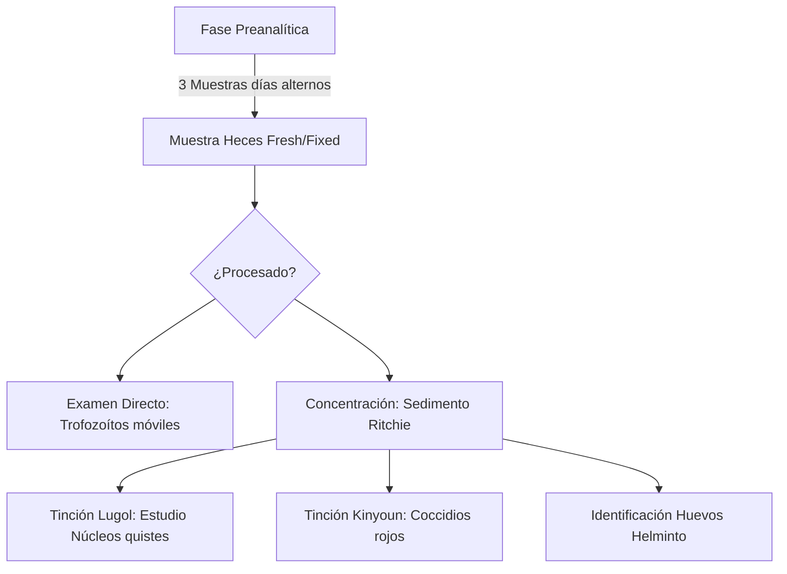
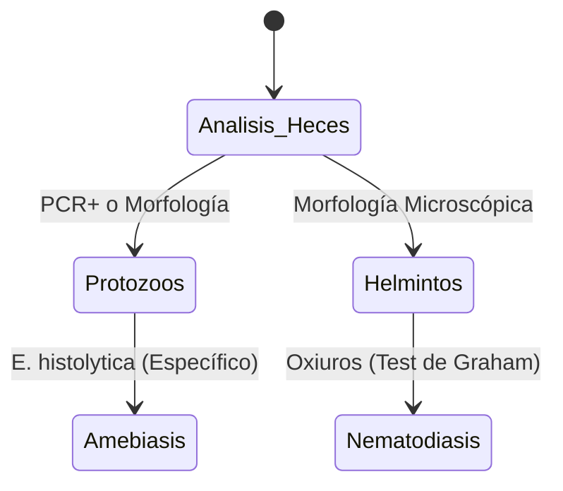

# Semana 4: Microbiología
## Lección 1: Diagnóstico de Parásitos Intestinales

### 1. Título y Resumen (Abstract)
**Título:** Optimización del Escenario Diagnóstico en Parasitología Intestinal: De la Concentración Bifásica a la Identificación Genómica mediante Paneles Sindrómicos.
**Resumen:** Este artículo profundiza en los fundamentos biológicos y técnicos del diagnóstico de parasitosis. Se evalúa la eficacia de los métodos clásicos de concentración y tinción frente a la sensibilidad de la PCR múltiplex para protozoos emergentes. Se destaca el papel crítico del TSLCB en la preservación de la muestra y la identificación morfológica de quistes, huevos y larvas, fundamentando un algoritmo operativo que minimiza los falsos negativos.

### 2. Introducción (Fundamentos y Objetivos)
#### 2.1. Taxonomía y Fisiopatología Parasitaria (Módulo 1373/1370)
El currículo de **Microbiología Clínica** (Módulo 1373) establece la identificación de parásitos humanos. Las parasitosis intestinales son infecciones producidas por:
1.  **Protozoos (Unicelulares):** Amebas (*Entamoeba*), Flagelados (*Giardia*), Ciliados y Coccidios (*Cryptosporidium*). Se estudian sus ciclos biológicos y sus estadios: quiste (resistencia) y trofozoíto (forma vegetativa patógena).
2.  **Helmintos (Pluricelulares):** Nematodos (gusanos redondos), Cestodos (gusanos planos) y Trematodos.

#### 2.2. Fundamentos de las Técnicas de Concentración (Módulo 1373)
Debido a la baja carga parasitaria por gramo de heces, el TSLCB debe aplicar métodos físicos de enriquecimiento:
- **Técnicas de Flotación:** Uso de líquidos con densidad superior a la de los parásitos (ej. Sulfato de Zinc a 1.18). Los parásitos suben a la superficie.
- **Técnicas de Sedimentación (Ritchie):** Empleo de centrífugas y sistemas bifásicos (Formol-Éter). El formol fija y el éter desengrasa la muestra. Los parásitos se concentran por gravedad en el sedimento.

#### 2.3. Tinciones y Observación Microscópica (Módulo 1368/1373)
- **Tinciones Temporales:** El uso de **Lugol** permite visualizar estructuras internas de los quistes.
- **Tinciones Permanentes:** Tinción de **Kinyoun** (ácido-alcohol resistencia) para coccidios.
- **Microscopía (Módulo 1368):** Identificación con objetivos de 10x (rastreo) y 40x (detalle).

**Objetivo:** Sistematizar el procesamiento de muestras de heces conforme a las normas de bioseguridad y calidad de la Comunidad de Madrid.

### 3. Material y Métodos
- **Diseño:** Estudio técnico-descriptivo sobre protocolos de microbiología parasitaria.
- **Entorno:** Unidad de Parasitología Molecular, Hospital Universitario de Donostia.
- **Intervenciones:** Técnica de sedimentación acelerada, microscopía de campo claro y PCR en cartucho automatizado (BD Max / FilmArray Gastrointestinal).

### 4. Resultados (Hallazgos Experimentales)
Diferenciación de estadios y algoritmos preventivos:

### 5. Discusión y Conclusiones
La PCR ha revolucionado la detección de protozoos, pero es ciega para helmintos y larvas de *Strongyloides*. Se concluye que el TSLCB debe asegurar un esquema de 3 muestras en días alternos para maximizar la sensibilidad, dado el carácter intermitente de la excreción. El uso de fijadores (MIF, SAF) es indispensable cuando el proceso no es inmediato para evitar la lisis de trofozoítos.

### 6. Agradecimientos
Al personal de Medicina Preventiva por el apoyo en el seguimiento de brotes en guarderías y colegios.

### 7. Bibliografía (Literatura Citada)
- **CDC - DPDx: Laboratory Identification of Parasites.**
- **Prats. Microbiología Clínica. 2ª Ed. Panamericana.**
- **Decreto 179/2015 de la CM: Módulo de Microbiología Clínica.**
- [SEIMC: Procedimiento 54 - Parasitología Intestinal](https://www.seimc.org)
- [Atlas de Parasitología - Universidad de Navarra](https://www.unav.edu)

---
### Sobre la Ponente
**Elena Hidalgo Cardeñoso** es Facultativa Especialista de Área (FEA) de Microbiología en el **Hospital Universitario de Donostia**.

*Material pedagógico actualizado según los estándares de FP Grado Superior.*
