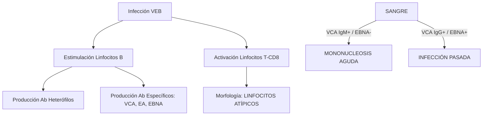
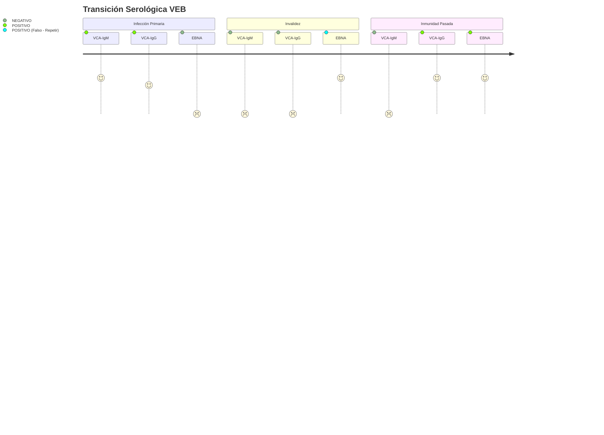

# Semana 4: Microbiología
## Lección 2: Virus Epstein-Barr (VEB): Diagnóstico y Seguimiento

### 1. Título y Resumen (Abstract)
**Título:** Dinámica Infectológica y Marcadores Biológicos del Virus Epstein-Barr: Del Diagnóstico Serológico a la Monitorización de la Carga Viral.
**Resumen:** Este artículo analiza la biología molecular del VEB y su ciclo infectivo en los linfocitos B. Se evalúa el perfil serológico clásico (VCA, EBNA, EA) para la datación de la infección primaria (Mononucleosis Infecciosa) y se analiza el papel del TSLCB en la identificación de la linfocitosis atípica. Se concluye con la importancia de la carga viral por PCR en el seguimiento de pacientes inmunocomprometidos y su asociación con procesos linfoproliferativos.

### 2. Introducción (Fundamentos y Objetivos)
#### 2.1. Virología y Tropismo del Virus Epstein-Barr (Módulo 1373)
El currículo de **Microbiología Clínica** (Módulo 1373) detalla la estructura y replicación de los virus herpes. El VEB (Herpesvirus humano tipo 4) posee una nucleocápside icosaédrica y una envuelta lipídica con glicoproteínas (gp350/220).
- **Entrada Celular (Módulo 1370):** El virus se une al receptor CD21 de los linfocitos B y al MHC clase II de las células epiteliales.
- **Infección Lítica y Latente:** El VEB alterna entre replicación activa y latencia episomal en linfocitos B de memoria.

#### 2.2. Cinética Serológica e Inmunodiagnóstico (Módulo 1372/1371)
El TSLCB debe interpretar los resultados de inmunoensayos sándwich y competitivos:
1.  **VCA-IgM / IgG (Antígeno de Cápside):** La IgM indica primoinfección aguda. La IgG aparece en fase precoz y persiste.
2.  **Anti-EA (Antígeno Temprano):** Marcador de replicación activa (aguda o reactivación).
3.  **Anti-EBNA (Antígeno Nuclear):** Marcador de convalecencia/memoria; su presencia descarta infección aguda.
4.  **Anticuerpos Heterófilos (Test de Paul-Bunnell):** Basado en la aglutinación de hematíes de oveja/caballo (Módulo 1372), indicativo de VEB pero menos específico que los marcadores propios.

#### 2.3. Manifestaciones en Hematología (Módulo 1374)
La respuesta citotóxica (linfocitos T-CD8) genera la "linfocitosis reactiva" detectable en el hemograma y frotis (células de Downey). El TSLCB debe validar la presencia de estas atipias morfológicas.

**Objetivo:** Sistematizar el flujo de validación de perfiles serológicos concordantes con la morfología del frotis según el currículo TSLCB.

### 3. Material y Métodos
- **Diseño:** Análisis descriptivo de cohortes diagnósticas.
- **Entorno:** Laboratorio de Microbiología y Serología, Hospital Universitario de Getafe.
- **Intervenciones:** Determinación de anticuerpos específicos (EIA / Quimioluminiscencia), test de Paul-Bunnell (anticuerpos heterófilos) y cuantificación de ADN viral mediante PCR en tiempo real (qPCR).

### 4. Resultados (Hallazgos Experimentales)
Cinética de biomarcadores y algoritmos de interpretación:

### 5. Discusión y Conclusiones
La ausencia de anticuerpos EBNA con VCA positivo es la "huella dactilar" de la infección aguda. Se concluye que el TSLCB debe informar proactivamente la presencia de linfocitosis reactiva (>10%) al servicio de Microbiología para orientar el panel serológico. En pacientes trasplantados, la monitorización de la carga viral es el único método para prevenir el Síndrome Linfoproliferativo Post-trasplante (PTLD).

### 6. Agradecimientos
Al equipo de Virología por la estandarización de los ciclos de corte (Ct) en la PCR cuantitativa.

### 7. Bibliografía (Literatura Citada)
- **CDC - Epstein-Barr Virus and Infectious Mononucleosis: For Health Care Providers.** [Ver en cdc.gov](https://www.cdc.gov/epstein-barr/hcp/index.html)
- **Procedimientos en Microbiología Clínica: Diagnóstico de las infecciones por virus de la familia Herpesviridae - SEIMC.** [Ver en seimc.org](https://seimc.org/documentos-cientificos/procedimientos-microbiologia)
- **Clinical Practice Guideline: Management of EBV Infection.** [Ver en ncbi.nlm.nih.gov](https://www.ncbi.nlm.nih.gov/pmc/articles/PMC3963428/)
- **StatPearls: Infectious Mononucleosis.** [Ver en ncbi.nlm.nih.gov](https://www.ncbi.nlm.nih.gov/books/NBK470387/)

---
### Sobre la Ponente
**Ángela Iniesta Martínez** es Residente de 4º año (R4) de Microbiología en el **Hospital Universitario de Getafe**.

*Contenido científico exhaustivo para la titulación oficial de la Comunidad de Madrid.*
