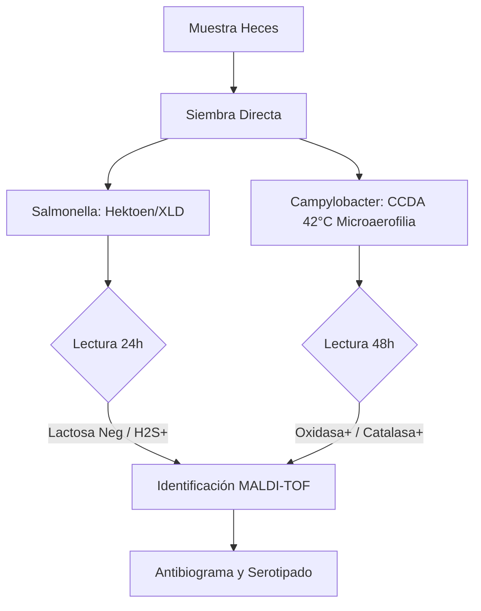
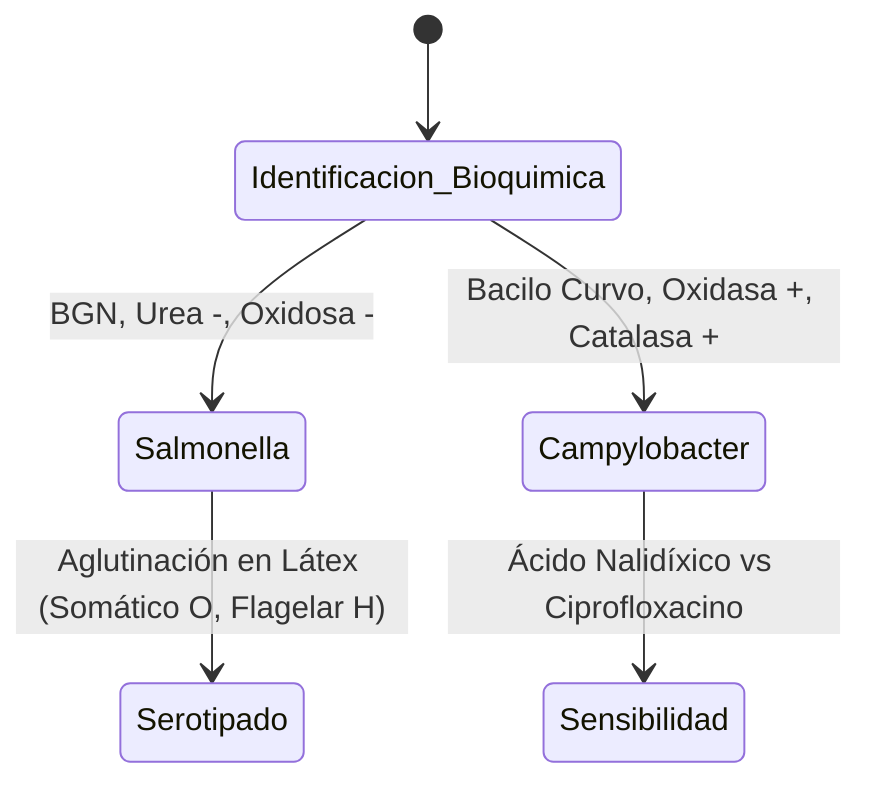

# Semana 4: Microbiología
## Lección 3: Campylobacteriosis y Salmonelosis

### 1. Título y Resumen (Abstract)
**Título:** Abordaje Bacteriológico de la Gastroenteritis Aguda: Estrategias de Cultivo Selectivo e Identificación Proteómica por MALDI-TOF.
**Resumen:** Este artículo analiza la fisiopatología de las infecciones entéricas causadas por *Salmonella* y *Campylobacter*. Se evalúan las técnicas de enriquecimiento y selección en medios específicos (Hektoen, CCDA) y se fundamenta la identificación mediante espectrometría de masas. Se destaca el papel del TSLCB en la gestión de la microaerofilia y la notificación obligatoria a Salud Pública para el control de brotes alimentarios.

### 2. Introducción (Fundamentos y Objetivos)
#### 2.1. Gastroenteritis Bacteriana: Etiopatogenia (Módulo 1370)
El currículo de **Fisiopatología General** (Módulo 1370) describe las infecciones gastrointestinales. *Salmonella* y *Campylobacter* son los principales agentes de zoonosis alimentaria.
1.  **Salmonella (BGN):** Bacteria intracelular facultativa. Invade las células M intestinales.
2.  **Campylobacter jejuni:** Bacilo Gram negativo curvo ("en ala de gaviota"). Produce enterotoxinas y es un precursor del Síndrome de Guillain-Barré.

#### 2.2. Medios de Cultivo y Aislamiento (Módulo 1373)
El **Módulo de Microbiología Clínica** exige el dominio de la siembra y medios:
- **Medios Selectivos y Diferenciales:** 
    - **Hektoen / SS / XLD:** Para *Salmonella*. Se basan en la no fermentación de lactosa y producción de $H_2S$ (colonias con centro negro).
    - **Medios Enriquecidos (CCDA):** Para *Campylobacter*. Contienen carbón y antibióticos para inhibir flora acompañante.
- **Condiciones de Incubación:** 
    - *Salmonella*: Aerobiosis, 37°C.
    - *Campylobacter*: **Microaerofilia** ($5\% O_2, 10\% CO_2$), **Termofilia** (42°C).

#### 2.3. Identificación Proteómica (MALDI-TOF) (Módulo 1368)
El TSLCB aplica nuevas tecnologías:
- **Principio:** Desorción/ionización por láser asistida por matriz. Analiza el espectro de proteínas ribosómicas.
- **Ventaja:** Identificación en minutos frente a las 24h de las galerías bioquímicas tradicionales.

**Objetivo:** Sistematizar el flujo de trabajo del coprocultivo según el Plan de Calidad de la Comunidad de Madrid.

### 3. Material y Métodos
- **Entorno:** Laboratorio de Microbiología Clínica, Hospital Universitario de Getafe.
- **Intervenciones:** Siembra sistemática en Hektoen/XLD y CCDA/Preston. Uso de jarras de microaerofilia con generadores químicos de atmósfera. Identificación por Bruker Biotyper (MALDI-TOF). Detección molecular rápida mediante FilmArray GI.

### 4. Resultados (Hallazgos Experimentales)
Diferenciación técnica y bioquímica:

### 5. Discusión y Conclusiones
MALDI-TOF ha desplazado a las galerías bioquímicas (API) por ahorro de tiempo y costes. Se concluye que el TSLCB es el garante de la viabilidad de *Campylobacter*, cuya fragilidad ante el oxígeno libre requiere un procesado inmediato o el uso riguroso de medios de transporte. La detección de *Salmonella Typhi* constituye una urgencia de Salud Pública que debe comunicarse en < 24 horas.

### 6. Agradecimientos
Al equipo de Vigilancia Epidemiológica de Getafe por la coordinación en la trazabilidad de los brotes de toxoinfección alimentaria.

### 7. Bibliografía (Literatura Citada)
- **Murray. Microbiología Médica. 9ª Ed. Elsevier.**
- **Decreto 179/2015 de la CM: Módulo de Microbiología Clínica.**
- [Bruker: MALDI Biotyper Principles](https://www.bruker.com)
- [Protocolos SEIMC: Diagnóstico de la Gastroenteritis Aguda](https://www.seimc.org)

---
### Sobre la Ponente
**Alba García Sáez** es Residente de 2º año (R2) de Microbiología en el **Hospital Universitario de Getafe**.

*Ficha técnica docente adaptada al currículo oficial de la Comunidad de Madrid.*
