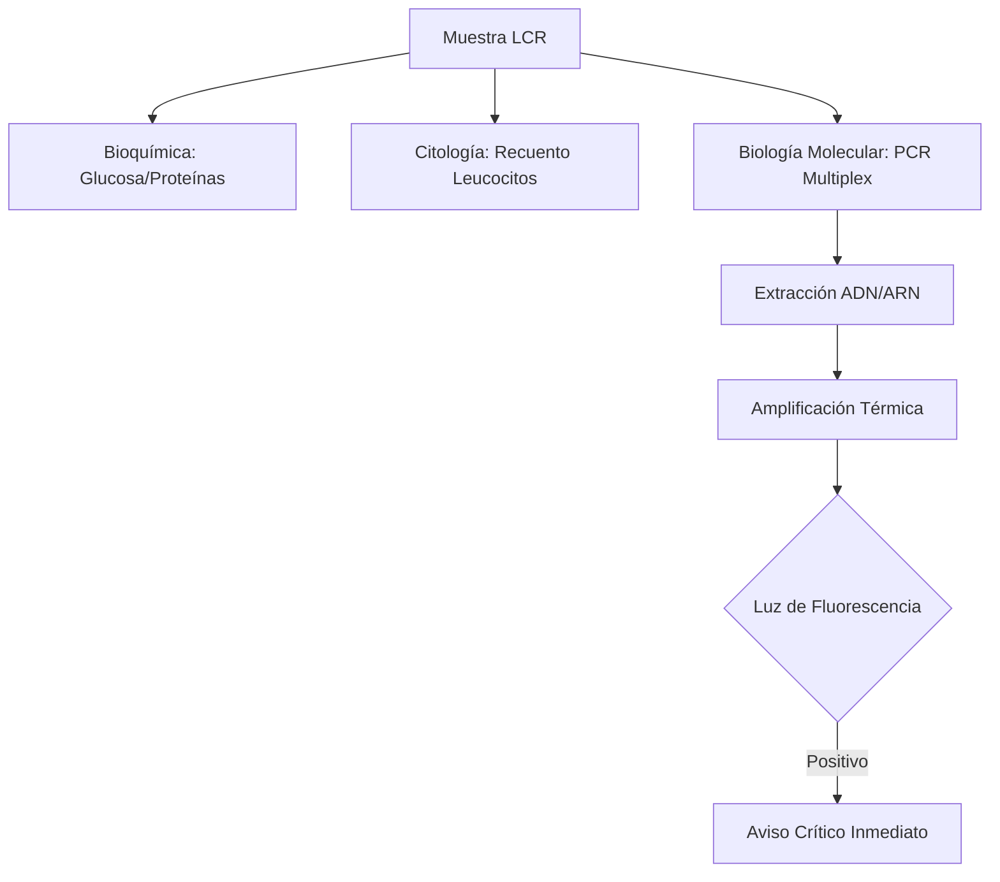
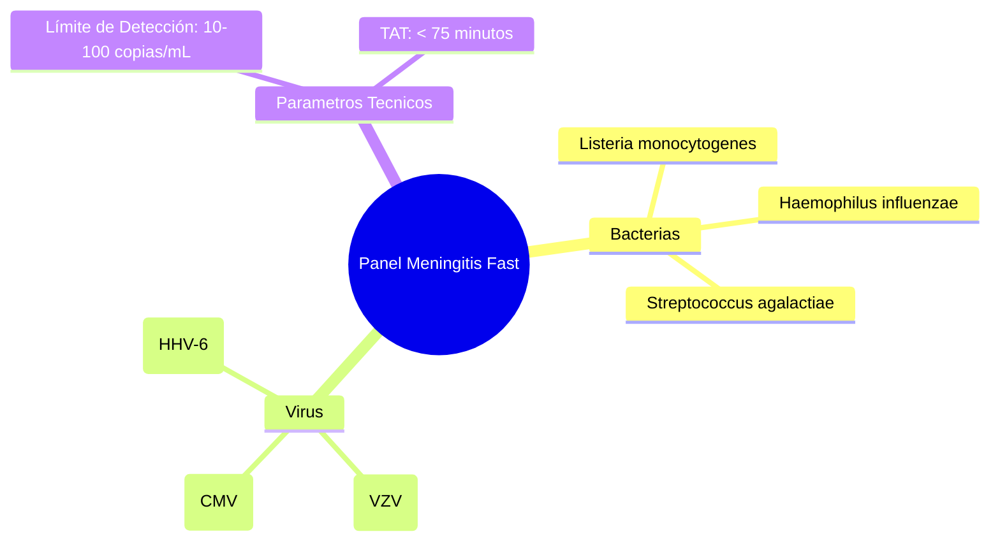

# Semana 4: Microbiología
## Lección 4: Meningitis: PCR rápida para microorganismos neurotropos

### 1. Título y Resumen (Abstract)
**Título:** Eficacia Diagnóstica de la PCR Sindrómica de Punto de Atención en la Urgencia Neuro-Infecciosa: Implementación de la Metodología Multiplex.
**Resumen:** Este artículo analiza la revolucionaria transición del cultivo microbiológico tradicional a los paneles de PCR múltiple en tiempo real para el estudio del líquido cefalorraquídeo (LCR). Se evalúan los fundamentos moleculares de las dianas bacterianas, virales y fúngicas, analizando cómo la reducción del tiempo de respuesta (TAT) de 48h a 1h impacta en la supervivencia del paciente y el ahorro farmacológico.

### 2. Introducción (Fundamentos y Objetivos)
#### 2.1. Fisiopatología de las Infecciones del SNC (Módulo 1370/1373)
El currículo de **Fisiopatología General** (Módulo 1370) incluye las patologías del sistema nervioso. La meningitis es la inflamación de las meninges, con alteración de la barrera hematoencefálica (BHE).
- **Agentes Etiológicos (Módulo 1373):** Varían según la edad.
    - Neonatos: *S. agalactiae*, *E. coli*.
    - Adultos: *S. pneumoniae*, *N. meningitidis*.
    - Virus: Enterovirus, Herpes.

#### 2.2. Biología Molecular: Fundamentos de la PCR (Módulo 1369)
El **Módulo de Biología Molecular** establece el estudio de la amplificación de ácidos nucleicos:
1.  **Extracción (Lisis):** Rotura celular para liberar ADN/ARN. En LCR es crítico por el bajo número de microorganismos.
2.  **Amplificación (PCR):** Ciclos de desnaturalización ($95^\circ\text{C}$), hibridación de cebadores y extensión por la polimerasa.
3.  **Detección en Tiempo Real:** Uso de sondas fluorescentes (TaqMan) que permiten la lectura del resultado durante la amplificación (Módulo 1369).

#### 2.3. Gestión de Muestras y Bioseguridad (Módulo 1367/1368)
- **Procesamiento de LCR:** Muestra preciada e irrepetible. El TSLCB debe procesarla bajo condiciones de esterilidad absoluta y en Cabina de Seguridad Biológica (CSB) Clase II (Módulo 1368).
- **Valores de Pánico:** Elevación de proteínas (hiperproteinorraquia) y descenso de glucosa (hipoglucorraquia) refuerzan la sospecha bacteriana (Módulo 1371).



**Objetivo:** Sistematizar el flujo de validación de "Valores de Pánico" en el LCR según los protocolos de la Comunidad de Madrid.

### 3. Material y Métodos
- **Diseño:** Estudio técnico-intervencionista en entorno de urgencias.
- **Entorno:** Laboratorio de Urgencias y Microbiología, Hospital Universitario de Fuenlabrada.
- **Intervenciones:** Uso de plataformas BioFire FilmArray (Meningitis/Encephalitis Panel).
- **Procesamiento:** El TSLCB realiza la carga de 200 µL de LCR en el cartucho bajo campana de seguridad biológica clase II.

### 4. Resultados (Hallazgos Experimentales)
Eficacia comparada y panel de dianas:

```mermaid
flowchart TD
    P[Paciente Grave] --> LCR[Punción Lumbar]
    LCR --> P_Lab[Procesado Inmediato PCR]
    P_Lab --> Report[Aviso al Clínico < 2h]
    Report --> Therapy[Ajuste Antibiótico / Antiviral]
    Report --> Isol[Aislamiento Respiratorio (si N. men)]
```

### 5. Discusión y Conclusiones
La PCR diagnóstica es el avance más relevante en medicina intensiva de la última década. Se concluye que el TSLCB es el eslabón fundamental en la rapidez informativa: cada minuto de retraso en la carga del cartucho aumenta el riesgo de secuelas neurológicas permanentes. Se destaca que un resultado negativo en PCR no descarta meningitis si hay alta sospecha clínica, requiriendo siempre completar el cultivo de 48h.

### 6. Agradecimientos
A los servicios de Microbiología de la CM por la creación de la red de diagnóstico rápido molecular.

### 7. Bibliografía (Literatura Citada)
- **IDSA Practice Guidelines for the Management of Bacterial Meningitis.** [Ver en idsociety.org](https://www.idsociety.org/practice-guideline/management-of-bacterial-meningitis/)
- **BioFire FilmArray Meningitis/Encephalitis (ME) Panel - Technical Support.** [Ver en biomerieux.com](https://www.biomerieux.com/en/products/biofire-filmarray-meningitisencephalitis-me-panel)
- **Procedimientos en Microbiología Clínica: Diagnóstico microbiológico de las infecciones del sistema nervioso central - SEIMC.** [Ver en seimc.org](https://seimc.org/documentos-cientificos/procedimientos-microbiologia)
- **CDC - Meningitis Information for Healthcare Professionals.** [Ver en cdc.gov](https://www.cdc.gov/meningitis/hcp/index.html)

---
### Sobre la Ponente
**Alba Cano Rodríguez** es Residente de 4º año (R4) de Análisis Clínicos en el **Hospital Universitario de Fuenlabrada**.

*Manual técnico profesional para el Técnico Superior en Laboratorio Clínico y Biomédico.*
