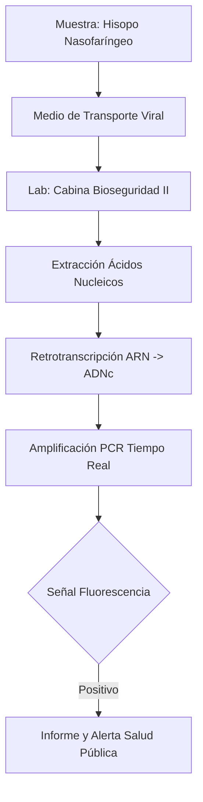
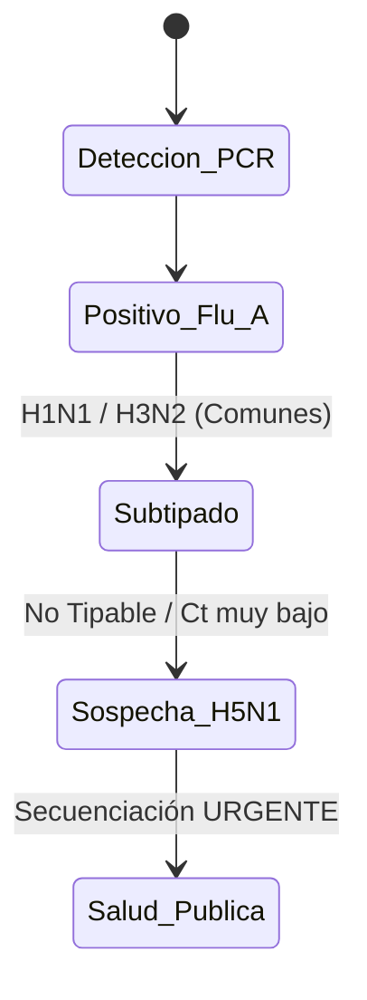

# Semana 4: Microbiología
## Lección 5: Virus Respiratorios: Diagnóstico en la Era Post-Pandemia

### 1. Título y Resumen (Abstract)
**Título:** Vigilancia Molecualar de la "Tripledemia" (SARS-CoV-2, Influenza y VRS): Fundamentos del Diagnóstico Sindrómico y Bio-seguridad en el Laboratorio de Virología.
**Resumen:** Este artículo analiza la integración de paneles combinados en el diagnóstico de infecciones respiratorias agudas. Se evalúan los fundamentos biológicos de la captación celular nasofaríngea y la cinética de replicación viral compartida entre gripe, coronavirus y virus respiratorio sincitial. Se discute la importancia de la fase preanalítica y el papel del TSLCB en la identificación de variantes emergentes y el mantenimiento de estándares de bioseguridad nivel 2+.

### 2. Introducción (Fundamentos y Objetivos)
#### 2.1. Virología de las Infecciones Respiratorias (Módulo 1373/1370)
El currículo de **Microbiología Clínica** (Módulo 1373) establece el estudio de los virus respiratorios. Estos patógenos afectan al epitelio ciliado del tracto respiratorio.
1.  **Orthomyxoviridae (Influenza A/B):** Virus ARN segmentado con envuelta. Poseen Hemaglutinina (unión) y Neuraminidasa (liberación).
2.  **Coronaviridae (SARS-CoV-2):** Virus ARN monocatenario positivo con espículas (proteína S) que se unen al receptor ACE2 (Módulo 1370).
3.  **Paramyxoviridae (VRS):** Causante de bronquiolitis; capacidad de formar sincitios celulares.

#### 2.2. Técnicas de Diagnóstico Rápido y Molecular (Módulo 1373/1369)
El TSLCB debe aplicar flujos de trabajo de alta sensibilidad:
- **Inmunocromatografía (Módulo 1372):** Detección rápida de antígenos (Gripe, VRS). Baja sensibilidad frente a la PCR.
- **RT-qPCR (Módulo 1369):** Técnica de referencia.
    - **Retrotranscripción (RT):** Paso de ARN viral a ADN complementario (ADNc) mediante la transcriptasa inversa.
    - **qPCR:** Amplificación con sondas de hidrólisis (TaqMan) marcadas con fluorocromos.

#### 2.3. Bioseguridad y Gestión de Muestras (Módulo 1367/1368)
- **Toma de Muestra (Módulo 1367):** Exudado nasofaríngeo u orofaríngeo. Uso de medios de transporte viral (VTM/UTM) con conservantes y antibióticos.
- **Contención (Módulo 1368):** Procesado en Cabinas de Seguridad Biológica de Clase II. Uso de EPIs según el nivel de riesgo biológico.

**Objetivo:** Sistematizar el flujo de vigilancia epidemiológica para la detección de brotes de Gripe Aviar o nuevas variantes de Coronavirus según los protocolos de la CM.

### 3. Material y Métodos
- **Diseño:** Estudio observacional descriptivo de vigilancia estacional.
- **Entorno:** Laboratorio de Microbiología, Hospital Universitario de Fuenlabrada.
- **Intervenciones:** Uso de hisopos flocados (Copan), plataformas de extracción magnética rápida y equipos de PCR en tiempo real de alto rendimiento.

### 4. Resultados (Hallazgos Experimentales)
Diferenciación de estadios infectivos y alertas:

### 5. Discusión y Conclusiones
La calidad de la toma de muestra es el factor determinante. Se concluye que un resultado negativo en un paciente con clínica clara debe repetirse con una muestra de tracto respiratorio inferior (esputo/aspirado). El TSLCB debe actuar como vigía de la epidemiología regional, comunicando incrementos inusuales en la tasa de positividad estacional.

### 6. Agradecimientos
Al equipo de Medicina Preventiva y Salud Pública por la monitorización de la incidencia acumulada regional.

### 7. Bibliografía (Literatura Citada)
- **CDC - Respiratory Viruses: Clinical Guidelines and Laboratory Testing.** [Ver en cdc.gov](https://www.cdc.gov/respiratory-viruses/index.html)
- **ECDC - Seasonal Influenza and Other Respiratory Viruses Surveillance.** [Ver en ecdc.europa.eu](https://www.ecdc.europa.eu/en/seasonal-influenza)
- **Sistemas de Vigilancia de Gripe y Otros Virus Respiratorios - ISCIII.** [Ver en isciii.es](https://www.isciii.es/QueHacemos/Servicios/VigilanciaSaludPublicaRENAVE/)
- **WHO - Influenze and other Respiratory Viruses: Surveillance and Response.** [Ver en who.int](https://www.who.int/teams/global-influenza-programme)

---
### Sobre el Ponente
**Javier Granado León** es Facultativa Especialista de Área (FEA) de Análisis Clínicos en el **Hospital Universitario de Fuenlabrada**.

*Material científico pedagógico ampliado para TSLCB.*
