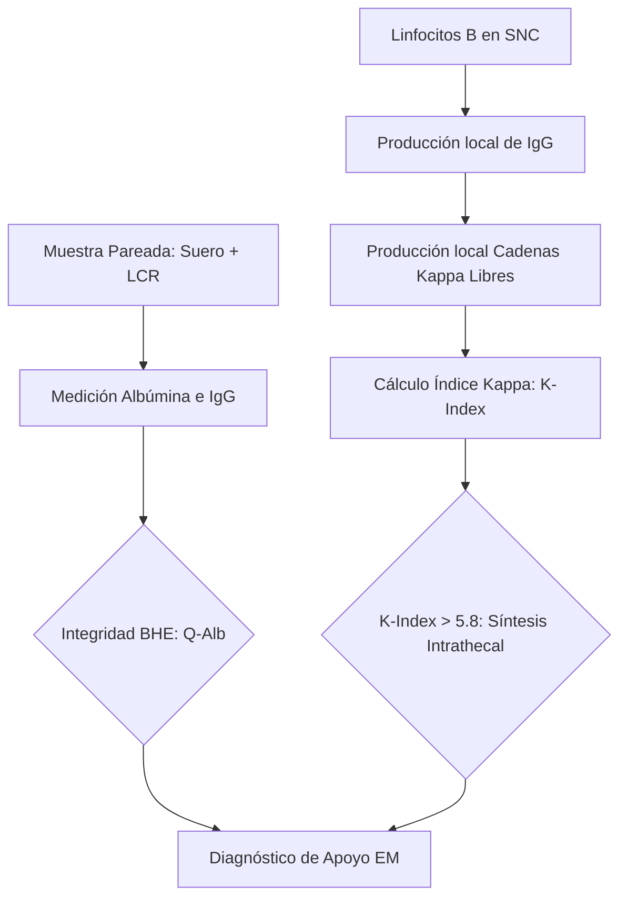
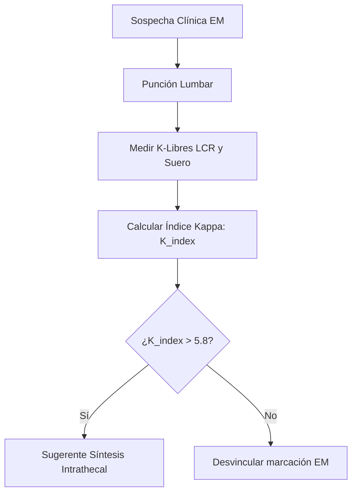
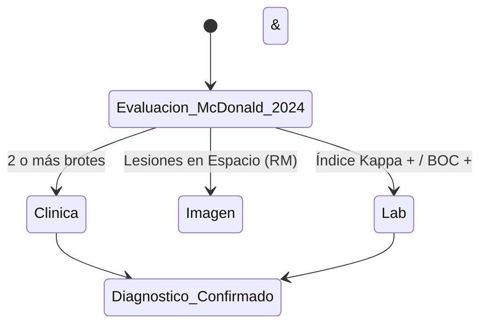

# Semana 5: Más allá de la Sangre
## Lección 1: Cadenas Kappa Libres y Esclerosis Múltiple

### 1. Título y Resumen (Abstract)
**Título:** Valor Diagnóstico del Índice de Cadenas Kappa Libres en el Líquido Cefalorraquídeo: Una Alternativa Automatizada a las Bandas Oligoclonales en la Esclerosis Múltiple.
**Resumen:** Este artículo analiza los fundamentos de la respuesta inmune intrathecal y la fisiopatología de la desmielinización en el Sistema Nervioso Central (SNC). Se evalúa la eficacia de la cuantificación de cadenas ligeras libres Kappa (FLK) frente al isoelectroenfoque de Bandas Oligoclonales (BOC). Se destaca la reciente inclusión de este marcador en los criterios de McDonald (2024), fundamentando el papel del TSLCB en la validación de índices de síntesis y la gestión de la Barrera Hematoencefálica.

### 2. Introducción (Fundamentos y Objetivos)
#### 2.1. Anatomía y Fisiología del SNC y BHE (Módulo 1370)
El currículo de **Fisiopatología General** (Módulo 1370) describe el Sistema Nervioso Central (SNC). El Líquido Cefalorraquídeo (LCR) baña el encéfalo y la médula ósea, actuando como amortiguador y sistema de transporte de nutrientes.
- **Barrera Hematoencefálica (BHE):** Estructura selectiva formada por endotelio capilar con uniones estrechas y astrocitos. Regula el paso de macromoléculas (proteínas) desde la sangre al LCR.
- **Producción y Reabsorción:** El LCR se produce en los plexos coroideos y se reabsorbe en las vellosidades aracnoideas.

#### 2.2. Inmunopatología y Desmielinización (Módulo 1370/1372)
La Esclerosis Múltiple (EM) es una enfermedad desmielinizante autoinmune.
- **Mecanismo:** Linfocitos B activados cruzan la BHE y se diferencian en células plasmáticas dentro del SNC, produciendo inmunoglobulinas (IgG) de forma local (**síntesis intrathecal**).
- **Marcadores de Síntesis (Módulo 1372):** Detectables mediante isoelectroenfoque (**Bandas Oligoclonales**) o cuantificación de cadenas ligeras libres Kappa.

#### 2.3. Fundamentos de la Cuantificación de Proteínas (Módulo 1371)
El **Módulo de Análisis Bioquímico** detalla la medición de proteínas en líquidos:
- **Nefelometría / Turbidimetría:** Medición de la dispersión de luz por complejos Ag-Ab. Permite la cuantificación exacta de Albúmina e IgG en muestras pareadas (suero y LCR).
- **Cociente de Albúmina ($Q_{Alb}$):** Marcador de la integridad de la BHE.
- **Índice de IgG / Índice Kappa:** Corrigen la síntesis intrathecal frente al paso pasivo desde la sangre.

**Objetivo:** Sistematizar el flujo de validación de neuroproteínas según los criterios revisados de McDonald 2024.

### 3. Material y Métodos
- **Diseño:** Estudio técnico-comparativo de sensibilidad diagnóstica.
- **Entorno:** Laboratorio de Neuroproteínas y Bioquímica Especializada, H.U. de Getafe.
- **Intervenciones:** Cuantificación de Albúmina y IgG en suero/LCR pareados. Determinación de Cadenas Kappa Libres mediante nefelometría cinética (BNII / Atellica). IEF en gel de agarosa para BOC.

### 4. Resultados (Hallazgos Experimentales)
Algoritmo de decisión y criterios de confirmación:

### 5. Discusión y Conclusiones
El Índice Kappa presenta una sensibilidad similar a las BOC (>95%) pero con un TAT sustancialmente menor (20 min vs 4h). Se concluye que el TSLCB debe asegurar que la muestra de suero y LCR sean tomadas simultáneamente, ya que una BHE muy dañada puede permitir el paso masivo de proteínas sanguíneas que invalidarían el índice de síntesis local. La EM ahora se define por el hallazgo coordinado de clínica, imagen y laboratorio molecular.

### 6. Agradecimientos
Al servicio de Neurología del HUGF por la validación prospectiva del punto de corte de 5.8 en el índice de síntesis.

### 7. Bibliografía (Literatura Citada)
- **The 2024 McDonald Criteria for the Diagnosis of Multiple Sclerosis.** [Ver en thelancet.com](https://www.thelancet.com/journals/laneur/article/S1474-4422(17)30470-2/fulltext)
- **Cadenas Ligeras Libres Kappa en el Diagnóstico de la Esclerosis Múltiple - SEQCML.** [Ver en seqc.es](https://www.seqc.es/es/bioquimica-en-el-laboratorio-clinico/manuales-y-monografias/)
- **National MS Society: Diagnosis of Multiple Sclerosis.** [Ver en nationalmssociety.org](https://www.nationalmssociety.org/Symptoms-Diagnosis/Diagnosing-MS)
- **StatPearls: Multiple Sclerosis.** [Ver en ncbi.nlm.nih.gov](https://www.ncbi.nlm.nih.gov/books/NBK499849/)

---
### Sobre la Ponente
**Marta María de Paula Ruiz** es Facultativa Especialista de Área (FEA) de Bioquímica Clínica en el **Hospital Universitario de Getafe**.

*Contenido científico ampliado conforme a la titulación de Técnico Superior.*
