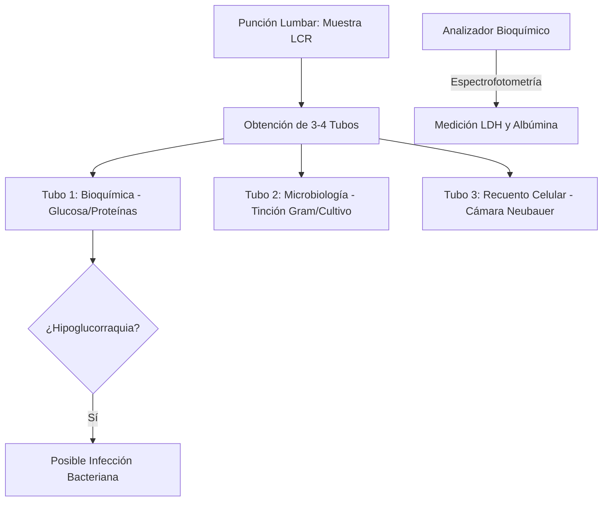
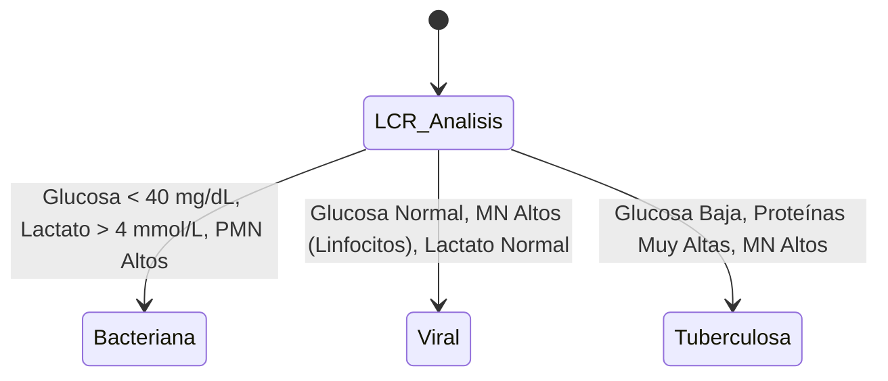
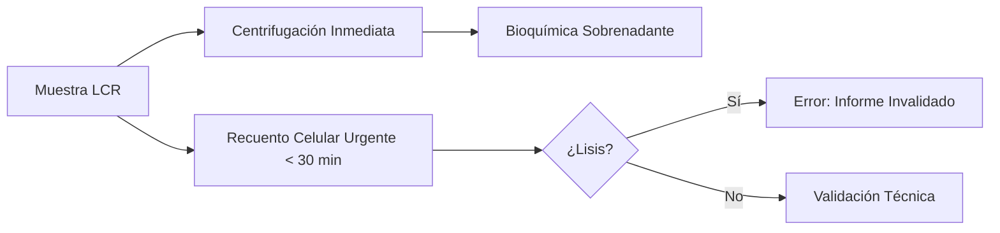

# Semana 5: Más allá de la Sangre
## Lección 2: El Líquido Cefalorraquídeo (LCR): Bioquímica y Fisiopatología

### 1. Título y Resumen (Abstract)
**Título:** Valoración Integral del Líquido Cefalorraquídeo: Dinámica del Ultrafiltrado y Correlación Cito-Bioquímica en Patologías del Sistema Nervioso.
**Resumen:** Este artículo profundiza en la fisiología de la producción y circulación del LCR, analizando los mecanismos de alteración de la barrera hematoencefálica (BHE). Se evalúa el impacto de las infecciones, hemorragias y tumores en los niveles de glucosa, proteínas y lactato. Se fundamenta el papel del TSLCB en la gestión crítica de la muestra (orden de tubos, rapidez de recuento celular) y en la identificación macroscópica diferencial (traumática vs hemorrágica).

### 2. Introducción (Fundamentos y Objetivos)
#### 2.1. Anatomía y Dinámica del Líquido Cefalorraquídeo (Módulo 1370)
El currículo de **Fisiopatología General** (Módulo 1370) describe el Sistema Nervioso Central y sus fluidos. El LCR es un líquido incoloro que circula por el espacio subaracnoideo y los ventrículos cerebrales.
- **Producción:** Se sintetiza en los **plexos coroideos** a un ritmo de ~500 mL/día mediante ultrafiltración plasmática y transporte activo (bombas de Na/K).
- **Circulación:** Fluye desde los ventrículos laterales al tercer y cuarto ventrículo, y de ahí al espacio subaracnoideo.
- **Funciones:** Protección mecánica, eliminación de metabolitos y homeostasis del microambiente cerebral.

#### 2.2. Alteraciones Fisiopatológicas y Bioquímica (Módulo 1371)
El **Módulo de Análisis Bioquímico** detalla el estudio de los componentes del LCR:
- **Proteínas (Módulo 1371):** La **hiperproteinorraquia** indica daño en la BHE (meningitis, tumores) o síntesis local.
- **Glucosa (Módulo 1371):** La **hipoglucorraquia** es un marcador crítico de consumo por bacterias o células neoplásicas. Requiere siempre una glucemia basal (Módulo 1367).
- **Lactato:** Producto del metabolismo anaerobio; su elevación diferencia meningitis bacterianas de virales.

#### 2.3. Gestión Técnica y Calidad de la Muestra (Módulo 1367/1368)
El TSLCB debe aplicar criterios rigurosos de preanalítica:
- **Orden de Tubos (Módulo 1367):** El uso de 3 o 4 tubos permite diferenciar una punción traumática (sangre que aclara del tubo 1 al 3) de una hemorragia subaracnoidea (sangre uniforme).
- **Xantocromía (Módulo 1368):** Coloración amarillenta tras centrifugación (presencia de bilirrubina/oxihemoglobina), indicativa de sangrado antiguo.
- **Conservación:** Recuento citológico inmediato (< 1h) para evitar la lisis leucocitaria.

**Objetivo:** Sistematizar el protocolo de validación técnica del LCR en situación de urgencia conforme a la normativa de la CM.

### 3. Material y Métodos
- **Diseño:** Estudio técnico sobre el perfil de fluidos biológicos.
- **Entorno:** Laboratorio de Urgencias, Hospital Universitario de Getafe.
- **Intervenciones:** Medición de glucosa y proteínas por química seca/húmeda. Recuento manual en cámara de Neubauer y recuento automatizado (Sysmex / Beckman). Determinación de lactato por método enzimático.

### 4. Resultados (Hallazgos Experimentales)
Algoritmo de diagnóstico diferencial en meningitis:

### 5. Discusión y Conclusiones
La rapidez es absoluta. El recuento celular debe realizarse antes de 1 hora de la punción para evitar la degeneración leucocitaria. Se concluye que el TSLCB debe informar cualquier xantocromía visual, ya que los analizadores automatizados pueden no detectarla. La interpretación de la glucorraquia siempre requiere una glucemia concomitante para un cálculo de ratio preciso.

### 6. Agradecimientos
Al equipo de residentes de Análisis Clínicos por la recopilación de perfiles cito-químicos en neuroinfecciones graves.

### 7. Bibliografía (Literatura Citada)
- **Strasinger. Urinalysis and Body Fluids. 7th Ed. F.A. Davis.**
- **Decreto 179/2015 de la CM: Módulo de Gestión de Muestras Biológicas.**
- [Nefrología al Día: Trastornos de la Dinámica del LCR](https://www.nefrologiaaldia.org)
- [British Infection Association: Management of Meningitis](https://www.britishinfection.org)

---
### Sobre la Ponente
**Rosalía F. Heredia** es Facultativa Especialista de Área (FEA) de Bioquímica Clínica en el **Hospital Universitario de Getafe**.

*Manual docente alineado con los objetivos del Grado Superior de Laboratorio.*
