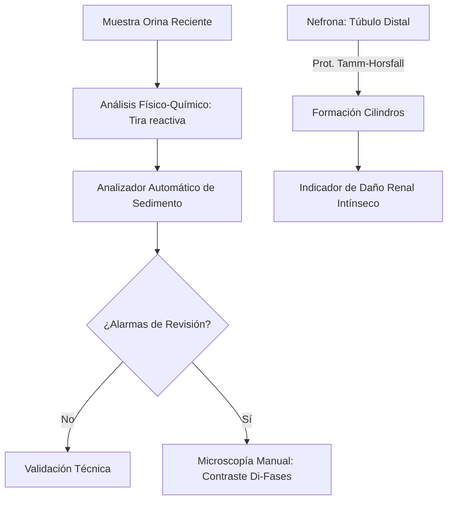
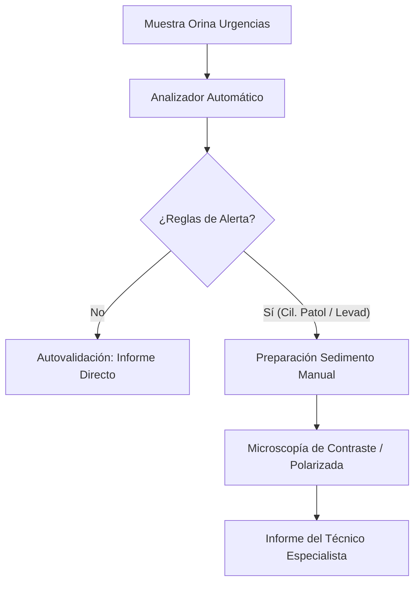
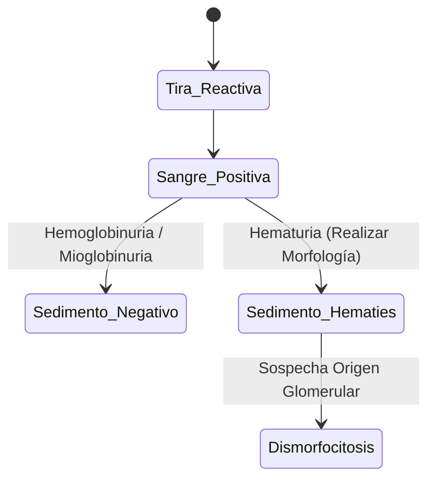

# Semana 5: Más allá de la Sangre
## Lección 3: El Sedimento Urinario: De la Microscopía a la Automatización

### 1. Título y Resumen (Abstract)
**Título:** Implementación de la Citometría de Flujo por Imágenes en el Análisis Sistemático de Orina: Optimización de la Autovalidación y Cribado del Sedimento Patológico.
**Resumen:** Este artículo analiza la evolución tecnológica del análisis de sedimentos urinarios. Se fundamenta el proceso de formación de elementos formes (cilindros, células, cristales) bajo las leyes de la fisiología renal y se evalúa la eficacia de la automatización en la reducción de la subjetividad técnica. Se destaca el papel del TSLCB en la gestión de las reglas de autovalidación y la identificación de elementos críticos mediante microscopía de contraste de fases.

### 2. Introducción (Fundamentos y Objetivos)
#### 2.1. Anatomía y Fisiología Renal (Módulo 1370)
El currículo de **Fisiopatología General** (Módulo 1370) describe el aparato urinario. La orina es el producto de la filtración glomerular, reabsorción tubular y secreción.
- **Formación de Elementos Formes:** Las células epiteliales (túbulos, uréteres, vejiga) descaman de forma natural. Los hematíes y leucocitos aparecen en procesos inflamatorios o de daño glomerular.
- **Cilindros (Módulo 1371):** Estructuras cilíndricas formadas exclusivamente en los túbulos distales por la precipitación de la mucoproteína de **Tamm-Horsfall**. Su presencia indica siempre patología renal parenquimatosa.

#### 2.2. Fundamentos de la Automatización del Sedimento (Módulo 1371/1368)
El **Módulo de Análisis Bioquímico** incluye la automatización de la orina:
1.  **Citometría de Flujo Fluorescente (Láser):** Analiza partículas basándose en señales de dispersión de luz y fluorescencia tras tinción con colorantes de ácidos nucleicos.
2.  **Imágenes Digitales Automáticas:** Capturan miles de fotos de alta resolución en un flujo laminar. Un software de inteligencia artificial (redes neuronales) realiza la clasificación preeliminar por tamaño y forma.
3.  **Técnicas de Concentración (Centrifugación):** Tradicionalmente, se centrifugan 10 mL de orina (Módulo 1371) para concentrar el sedimento antes de la observación microscópica manual.

#### 2.3. Gestión Crítica Preanalítica (Módulo 1367/1368)
- **Estabilidad de la Muestra:** La orina debe procesarse en < 2h. El pH alcalino (producido por bacterias ureolíticas) disuelve los cilindros hialinos y lisa los hematíes (Módulo 1367).
- **Control de Calidad (Módulo 1368):** Uso de materiales de control comerciales que contienen partículas que simulan células y cristales.

**Objetivo:** Establecer algoritmos de autovalidación técnica para optimizar el flujo de trabajo en el laboratorio de alta carga.

### 3. Material y Métodos
- **Diseño:** Estudio técnico sobre eficiencia analítica.
- **Entorno:** Unidad de Sedimentos, Hospital Universitario de Getafe.
- **Intervenciones:** Análisis pareado de 500 muestras mediante tira reactiva (Reflectometría), analizador de imágenes Sysmex UN-Series y microscopía manual (cámara de Fuchs-Rosenthal).

### 4. Resultados (Hallazgos Experimentales)
Workflow de revisión y criterios de sospecha:

### 5. Discusión y Conclusiones
La automatización permite procesar > 50 muestras/hora. Sin embargo, el TSLCB sigue siendo vital para identificar **Hematíes Dismórficos** (acantocitos) que sugieren sangrado renal. Se concluye que las reglas de autovalidación deben ser estrictas: cualquier concordancia de nitritos positivos con ausencia de bacterias en imagen requiere revisión obligatoria. El control del pH preanalítico es el mayor reto para la estabilidad de los cilindros.

### 6. Agradecimientos
Iniciativa apoyada por el Servicio de Nefrología para el cribado precoz de nefropatía diabética mediante la detección de microalbuminuria y cilindros grasos.

### 7. Bibliografía (Literatura Citada)
- **European Urinalysis Guidelines - EFLM.** [Ver en eflm.eu](https://www.eflm.eu/site/page/guidelines)
- **Recomendaciones para el examen sistemático de orina - SEQCML.** [Ver en seqc.es](https://www.seqc.es/es/bioquimica-en-el-laboratorio-clinico/manuales-y-monografias/)
- **Urinalysis StatPearls - NCBI.** [Ver en ncbi.nlm.nih.gov](https://www.ncbi.nlm.nih.gov/books/NBK470501/)
- **Atlas de Sedimento Urinario - Asociación Española de Biopatología Médica.** [Ver en aebm.org](https://www.aebm.org/)

---
### Sobre la Ponente
**Luz del Mar Rivas** es Facultativa Especialista de Área (FEA) de Bioquímica Clínica en el **Hospital Universitario de Getafe**.

*Contenido técnico integral para la excelencia profesional del TSLCB.*
