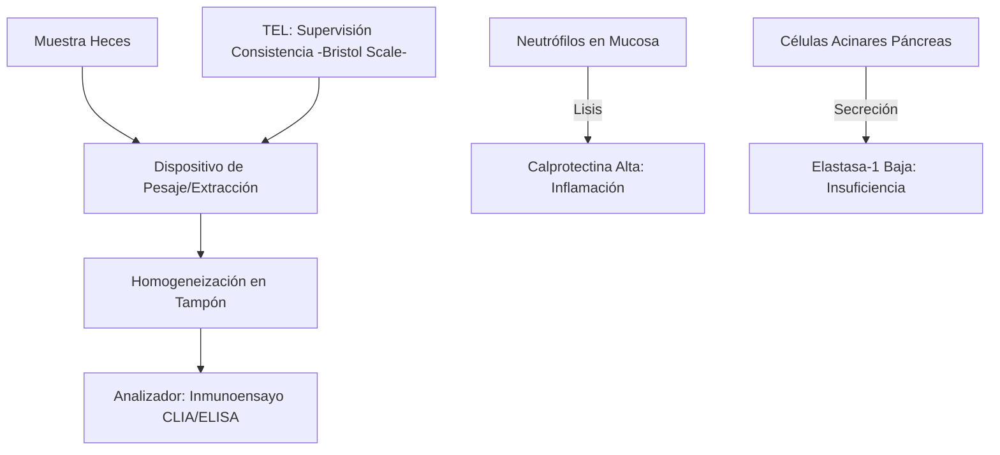
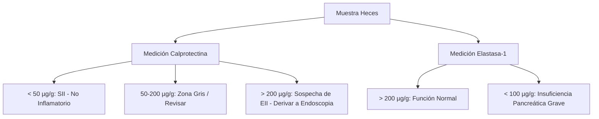
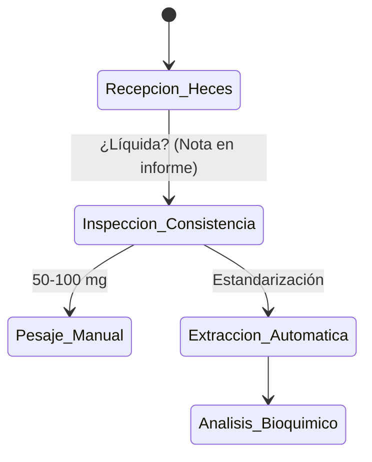

# Semana 5: Más allá de la Sangre
## Lección 4: Información oculta en las Heces: Calprotectina y Elastasa Fecal

### 1. Título y Resumen (Abstract)
**Título:** Utilidad de los Biomarcadores Fecales en el Diagnóstico Diferencial de la Patología Intestinal: De la Inflamación Crónica a la Insuficiencia Pancreática Exocrina.
**Resumen:** Este artículo analiza los fundamentos bioquímicos de la Calprotectina y la Elastasa Fecal como herramientas no invasivas en gastroenterología. Se evalúa el valor de la calprotectina para distinguir entre Enfermedad Inflamatoria Intestinal (EII) y Síndrome de Intestino Irritable (SII), así como la estabilidad de la elastasa como marcador de función pancreática primario. Se destaca el papel del TSLCB en la gestión de muestras fecales y la optimización de los procesos de extracción analítica.

### 2. Introducción (Fundamentos y Objetivos)
#### 2.1. Fisiopatología del Aparato Digestivo (Módulo 1370)
El currículo de **Fisiopatología General** (Módulo 1370) describe las patologías del tubo digestivo y glándulas anexas. 
- **Inflamación Intestinal:** Caracterizada por la migración de leucocitos (neutrófilos) a la mucosa. 
- **Función Pancreática:** Síntesis y secreción de enzimas hidrolíticas (lipasa, amilasa, elastasa) para la digestión de macromoléculas.
- **Patologías Relacionadas:** Enfermedad Inflamatoria Intestinal (Crohn, Colitis Ulcerosa) e Insuficiencia Pancreática Exocrina (FPI).

#### 2.2. Biomarcadores Fecales y su Bioquímica (Módulo 1371)
El **Módulo de Análisis Bioquímico** incluye el estudio de componentes en heces:
1.  **Calprotectina Fecal:** Proteína de unión al calcio (60% de las proteínas citosólicas del neutrófilo). Su presencia en heces indica migración leucocitaria por inflamación mucosa activa.
2.  **Elastasa-1 Pancreática:** Enzima altamente estable que no se degrada en el tránsito intestinal. Su cuantificación indica la capacidad de síntesis del páncreas exocrino.
3.  **Sangre Oculta en Heces (SOH):** Detección de hemoglobina humana (métodos inmunológicos) para el cribado de cáncer colorrectal.

#### 2.3. Fase Preanalítica y Preparación (Módulo 1367/1368)
El TSLCB debe dominar el procesamiento de muestras fecales:
- **Homogeneización y Extracción (Módulo 1367):** Uso de dispositivos colectores con volumen de extracción fijo para estandarizar la dilución de la muestra.
- **Consistencia de las Heces:** Influencia en la concentración del biomarcador (efecto dilución en heces líquidas).
- **Estabilidad (Módulo 1368):** La calprotectina es estable ~7 días a temperatura ambiente.

**Objetivo:** Establecer el algoritmo de validación técnica de biomarcadores fecales conforme a las guías de la Comunidad de Madrid.

### 3. Material y Métodos
- **Diseño:** Estudio descriptivo y procedimental.
- **Entorno:** Laboratorio de Bioquímica y Gastroenterología, Hospital Universitario de Getafe.
- **Intervenciones:** Determinación de Calprotectina mediante inmunocromatografía de alta sensibilidad o inmunoensayo quimioluminiscente (CLIA). Determinación de Elastasa-1 por ELISA monoclonal (específico humano).
- **Procesamiento:** Uso de dispositivos de extracción automatizada de heces (CALEX / Faecal Sample Prep).

### 4. Resultados (Hallazgos Experimentales)
Interpretación clínica según puntos de corte estandarizados:

### 5. Discusión y Conclusiones
La calprotectina tiene un valor predictivo negativo excelente: un resultado < 50 µg/g descarta prácticamente la EII activa, ahorrando colonoscopias innecesarias. Se concluye que el TSLCB debe supervisar meticulosamente la fase de extracción, ya que el moco de la superficie de la hez puede contener concentraciones de calprotectina muy superiores al centro de la muestra. La elastasa fecal sigue siendo el *Gold Standard* no invasivo para descartar malabsorción de origen pancreático.

### 6. Agradecimientos
Al equipo de Enfermería de Digestivo por la formación a los pacientes en la técnica de recogida domiciliaria.

### 7. Bibliografía (Literatura Citada)
- **Harrison. Principios de Medicina Interna. McGraw Hill.**
- **Decreto 179/2015 de la CM: Módulo de Gestión de Muestras Biológicas.**
- [GETECCU: Guía de uso de biomarcadores fecales en EII](https://geteccu.org)
- [British Society of Gastroenterology: Guidelines on Pancreatic Insufficiency](https://www.bsg.org.uk)

---
### Sobre la Ponente
**Marta García Sáez** es Facultativa Especialista de Área (FEA) de Bioquímica Clínica en el **Hospital Universitario de Getafe**.

*Ficha técnica-didáctica ampliada para la formación de Técnicos Superiores.*
