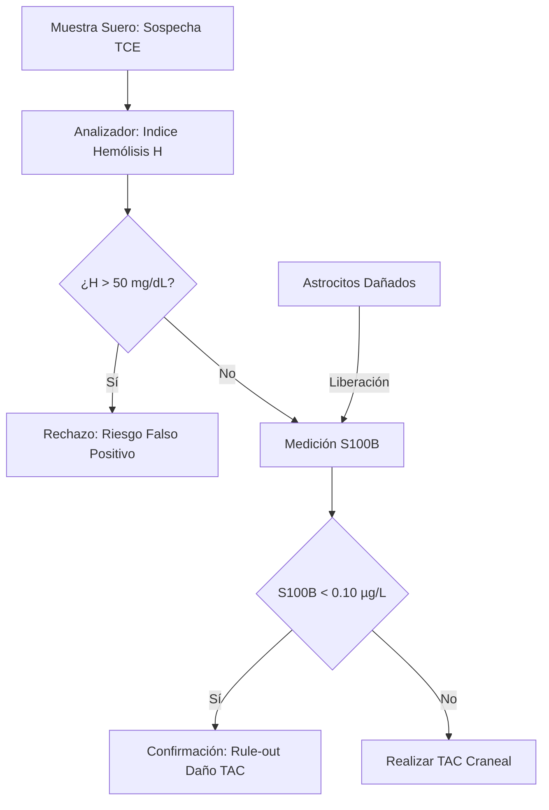
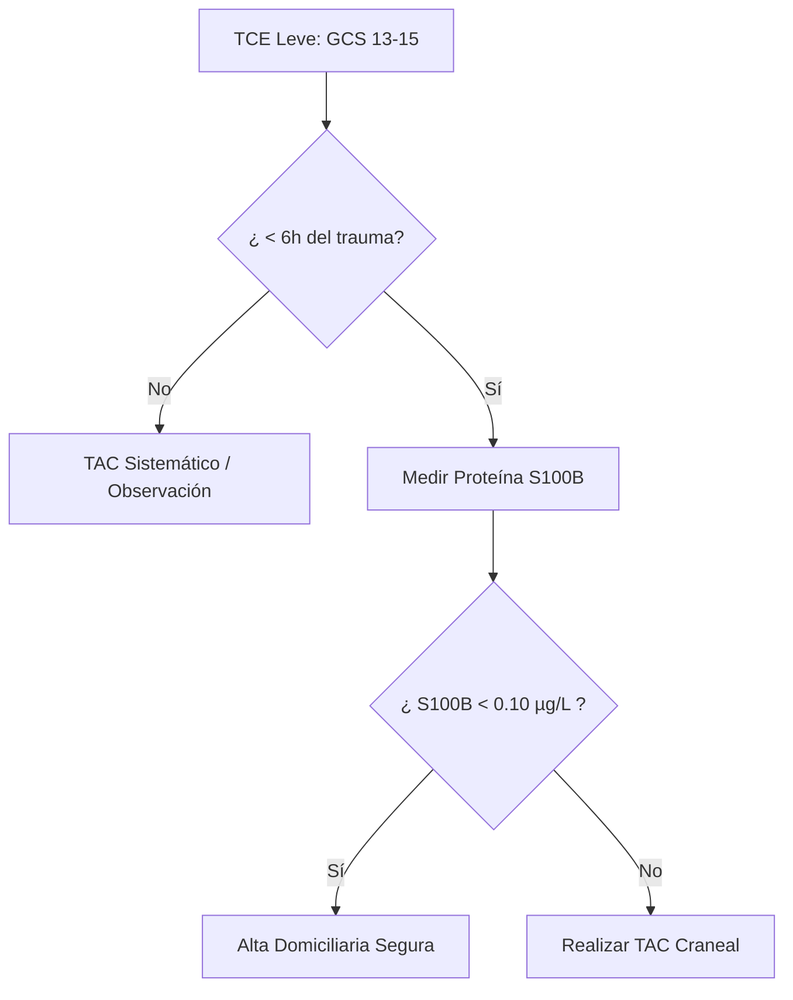
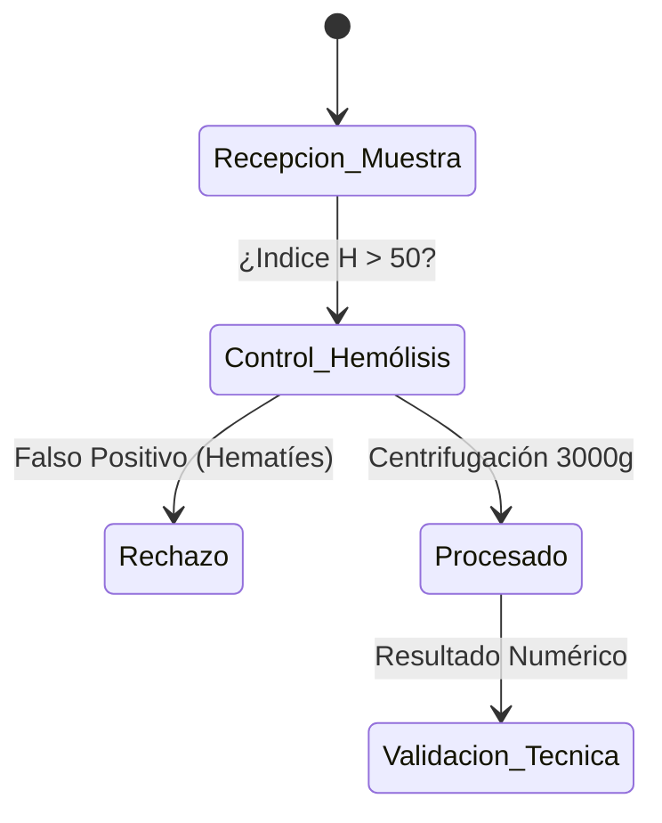

# Semana 6: Nuevos Campos y Técnicas
## Lección 1: Traumatismo Craneoncefálico: Proteína S100B

### 1. Título y Resumen (Abstract)
**Título:** Implementación de la Proteína S100B como Biomarcador de Regla de Exclusión (Rule-out) en el Traumatismo Craneoencefálico Leve: Impacto en la Optimización de Recursos Radiológicos.
**Resumen:** Este artículo analiza los fundamentos bioquímicos de la respuesta astrocitaria al daño cerebral agudo. Se evalúa la sensibilidad de la proteína S100B para predecir hallazgos patológicos en la Tomografía Computarizada (TAC) tras un traumatismo craneoencefálico (TCE) leve. Se fundamenta el papel del TSLCB en la gestión del tiempo de respuesta (TAT) y la validación de interferencias hemolíticas que comprometen la precisión del marcador neuroespecífico.

### 2. Introducción (Fundamentos y Objetivos)
#### 2.1. Fisiopatología del Sistema Nervioso y Glía (Módulo 1370)
El currículo de **Fisiopatología General** (Módulo 1370) establece el estudio del aparato nervioso. El tejido nervioso está compuesto por neuronas y células de la glía (astrocitos, oligodendrocitos, microglía).
- **Astrocitos:** Células de soporte que forman parte de la BHE. Sintetizan la **Proteína S100B**, una proteína de unión al calcio involucrada en el crecimiento y reparación celular.
- **Daño Traumático:** El traumatismo craneoencefálico (TCE) produce una rotura mecánica de los astrocitos y un aumento de la permeabilidad de la BHE (Módulo 1370).

#### 2.2. Marcadores Bioquímicos de Daño Cerebral (Módulo 1371)
El **Módulo de Análisis Bioquímico** incluye la medición de marcadores específicos de órganos:
1.  **Proteína S100B:** Marcador de daño glial. Aparece en sangre a los pocos minutos del trauma debido a su pequeño tamaño molecular (21 kDa).
2.  **Enolasa Neuroespecífica (NSE):** Marcador de daño neuronal e isquemia.
3.  **GFAP (Proteína Fibrilar Ácida Glial):** Nuevo marcador altamente específico de lesión estructural intracraneal.

#### 2.3. Gestión Técnica y Preanalítica Crítica (Módulo 1367/1368)
El TSLCB debe supervisar la calidad de la muestra de suero:
- **Intervalo de Tiempo:** La S100B tiene una vida media corta (~60 min). La muestra debe tomarse en las primeras 6 horas post-trauma (Módulo 1367).
- **Hemólisis (Módulo 1368):** Interferencia crítica. La S100B se encuentra en concentraciones significativas en los hematíes; la hemólisis produce falsos positivos.
- **Técnica:** Inmunoensayo tipo sándwich (Módulo 1372) con detección por quimioluminiscencia.

**Objetivo:** Sistematizar el protocolo de validación de la S100B en el laboratorio de urgencias según los estándares de la Comunidad de Madrid.

### 3. Material y Métodos
- **Diseño:** Estudio técnico-intervencionista sobre seguridad del paciente.
- **Entorno:** Laboratorio de Urgencias, Hospital Universitario de Getafe.
- **Intervenciones:** Determinación de S100B mediante electroquimioluminiscencia (ECLIA).
- **Control Preanalítico:** Tiempo desde el trauma < 6 horas. Muestra libre de hemólisis (la S100B también está presente en eritrocitos y melanocitos).

### 4. Resultados (Hallazgos Experimentales)
Uso de la S100B en el algoritmo de urgencias:

### 5. Discusión y Conclusiones
La S100B ha demostrado reducir el uso de TACs en urgencias en un 30%, disminuyendo los costes y la exposición a radiación ionizante. Se concluye que el TSLCB debe informar proactivamente si la muestra presenta hemólisis, ya que la liberación de S100B de los hematíes puede elevar artificialmente el marcador y llevar a la realización de TACs innecesarios. Hacia 2026, nuevos marcadores como la **GFAP** (Proteína Fibrilar Ácida Glial) complementarán la precisión diagnóstica.

### 6. Agradecimientos
Iniciativa liderada por el equipo de Urgencias del HUGF en coordinación con el Servicio de Bioquímica.

### 7. Bibliografía (Literatura Citada)
- **Scandinavian Neurotrauma Committee (SNC): Guidelines for Management of Mild Traumatic Brain Injury.** [Ver en scandinavian-neurotrauma.org](https://www.scandinavian-neurotrauma.org/guidelines)
- **S100B in the management of head injury: A systematic review.** [Ver en ncbi.nlm.nih.gov](https://www.ncbi.nlm.nih.gov/pmc/articles/PMC8900742/)
- **Utility of Protein S100B in Mild Head Injury Management - IFCC.** [Ver en ifcc.org](https://www.ifcc.org/scientific-activities/clinical-relevance-of-biomarkers/)
- **StatPearls: Traumatic Brain Injury.** [Ver en ncbi.nlm.nih.gov](https://www.ncbi.nlm.nih.gov/books/NBK459146/)

---
### Sobre el Ponente
**Ángel Pablo Pérez Díaz** es Facultativo Especialista de Área (FEA) de Bioquímica Clínica en el **Hospital Universitario de Getafe**.

*Contenido científico ampliado conforme a los estándares académicos del TSLCB.*
