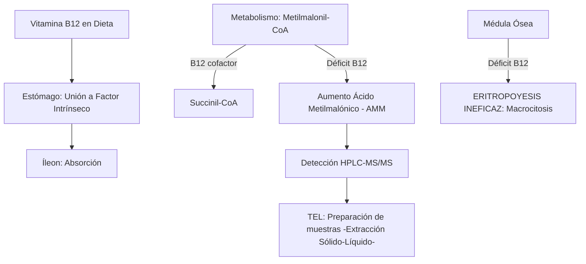
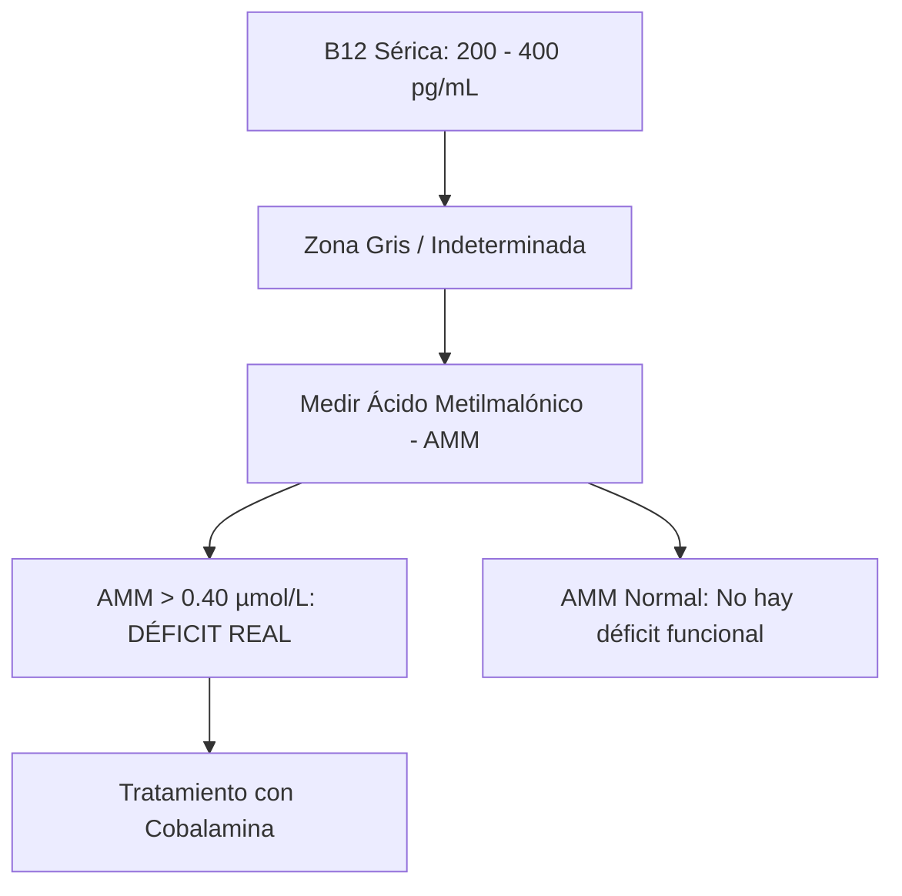
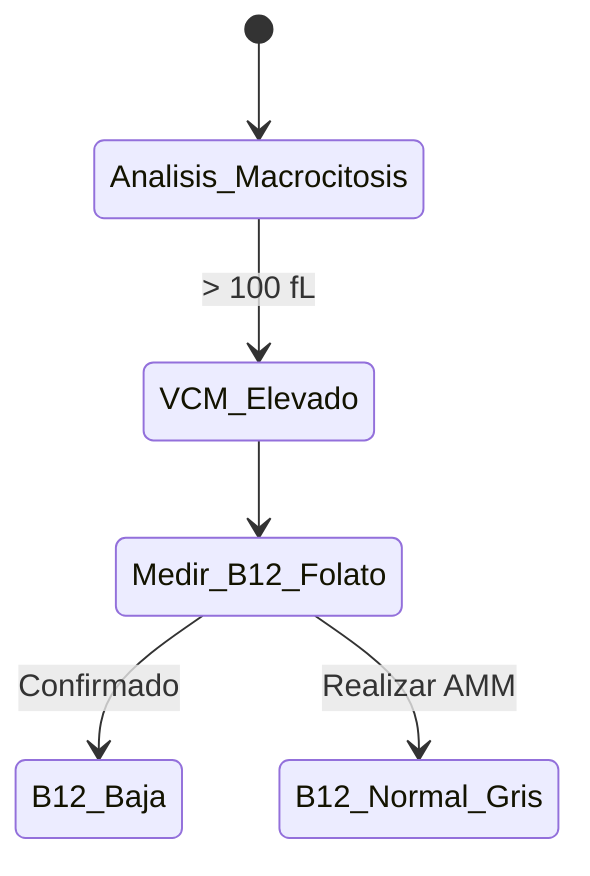

# Semana 6: Nuevos Campos y Técnicas
## Lección 2: Ácido Metilmalónico: Indicador de déficit de vitamina B12

### 1. Título y Resumen (Abstract)
**Título:** Valoración Funcional del Déficit de Cobalamina mediante la Cuantificación de Ácido Metilmalónico por Espectrometría de Masas: Superando las Limitaciones de la Vitamina B12 Sérica.
**Resumen:** Este artículo analiza la ruta metabólica de la Vitamina B12 y el papel del Ácido Metilmalónico (AMM) como biomarcador de deficiencia a nivel celular. Se fundamenta el proceso de conversión de Metilmalonil-CoA a Succinil-CoA y las consecuencias de su bloqueo. Se evalúa la superioridad de la cuantificación por LC-MS/MS frente a los niveles de B12 convencionales, destacando el papel del TSLCB en la gestión de técnicas cromatográficas de alta sensibilidad.

### 2. Introducción (Fundamentos y Objetivos)
#### 2.1. Metabolismo de la Vitamina B12 y Cobalaminas (Módulo 1370)
El currículo de **Fisiopatología General** (Módulo 1370) incluye el estudio del sistema hematopoyético y digestivo. La Vitamina B12 (Cobalamina) es esencial para la hematopoyesis y el mantenimiento de la mielina.
- **Absorción (Módulo 1370):** Requiere la unión al **Factor Intrínseco** (FI) secretado por las células parietales gástricas y su posterior absorción en el íleon terminal.
- **Funciones Metabólicas:** Actúa como cofactor de la L-metilmalonil-CoA mutasa, encargada de la conversión de metilmalonil-CoA en succinil-CoA (Ciclo de Krebs).

#### 2.2. Fisiopatología del Déficit y Acumulación de AMM (Módulo 1371/1374)
- **Anemia Megaloblástica (Módulo 1374):** La deficiencia de B12 altera la síntesis de ADN, provocando macrocitosis (VCM alto) e hipersegmentación de neutrófilos.
- **Ácido Metilmalónico (AMM):** En ausencia de B12, la ruta mitocondrial se bloquea, acumulándose ácido metilmalónico en sangre y orina. Es un marcador de "déficit funcional" (Módulo 1371), más sensible que la B12 sérica en fases precoces.

#### 2.3. Técnicas Instrumentales de Alta Sensibilidad (Módulo 1368/1369)
El TSLCB aplica técnicas de separación y detección avanzada:
- **Cromatografía Líquida - Espectrometría de Masas (LC-MS/MS):** Técnica de elección para la cuantificación de ácidos orgánicos.
    - **Cromatografía (Módulo 1368):** Separación de los componentes de la muestra según su interacción con la fase estacionaria.
    - **Espectrometría (Módulo 1369):** Identificación por la relación masa/carga ($m/z$). Permite la detección de niveles de AMM en el rango de micromoles.

**Objetivo:** Sistematizar el algoritmo de estudio de la anemia macrocítica y la deficiencia de cobalamina en la Comunidad de Madrid.

### 3. Material y Métodos
- **Diseño:** Estudio técnico-descriptivo sobre marcadores metabólicos.
- **Entorno:** Laboratorio de Metabolismo y Vitaminas, Hospital Universitario de Getafe.
- **Intervenciones:** Determinación de B12 sérica por quimioluminiscencia. Cuantificación de Ácido Metilmalónico mediante HPLC acoplada a Espectrometría de Masas en Tándem (LC-MS/MS).

### 4. Resultados (Hallazgos Experimentales)
Interpretación de resultados y zonas grises:

### 5. Discusión y Conclusiones
El AMM es el marcador más específico, salvo en pacientes con insuficiencia renal avanzada (donde se acumula por falta de eliminación). Se concluye que el TSLCB debe dominar la fase de extracción sólido-líquido para purificar el AMM antes de la inyección en el espectrómetro de masas. Hacia 2026, el cribado de AMM será el estándar para la detección precoz de daño neurológico irreversible en ancianos y pacientes veganos.

### 6. Agradecimientos
Al equipo de Hematología del HUGF por la provisión de frotis de sangre periférica con neutrófilos hipersegmentados.

### 7. Bibliografía (Literatura Citada)
- **Vitamin B12 Deficiency: StatPearls - NCBI.** [Ver en ncbi.nlm.nih.gov](https://www.ncbi.nlm.nih.gov/books/NBK441923/)
- **Methylmalonic Acid Test - Testing.com (AACC).** [Ver en testing.com](https://www.testing.com/tests/methylmalonic-acid/)
- **Guía SEQCML: Estudio analítico de la vitamina B12 y metabolitos.** [Ver en seqc.es](https://www.seqc.es/es/bioquimica-en-el-laboratorio-clinico/manuales-y-monografias/)
- **Linus Pauling Institute: Vitamin B12.** [Ver en oregonstate.edu](https://lpi.oregonstate.edu/mic/vitamins/vitamin-B12)

---
### Sobre el Ponente
**Rafael López García** es Facultativo Especialista de Área (FEA) de Bioquímica Clínica en el **Hospital Universitario de Getafe**.

*Contenido científico actualizado conforme al currículo nacional de TSLCB.*
