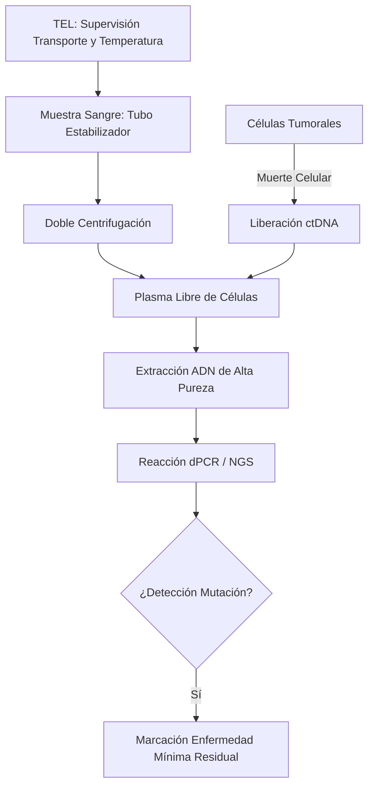
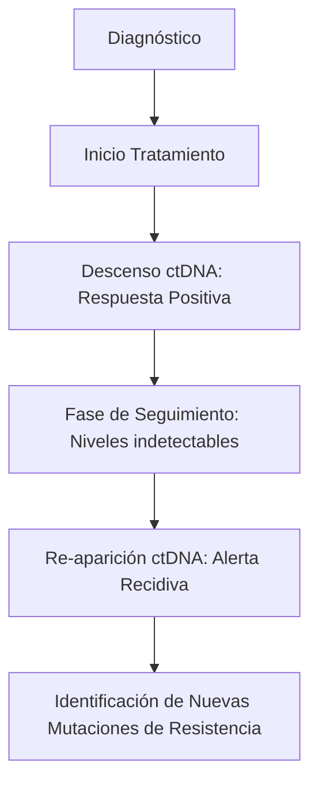
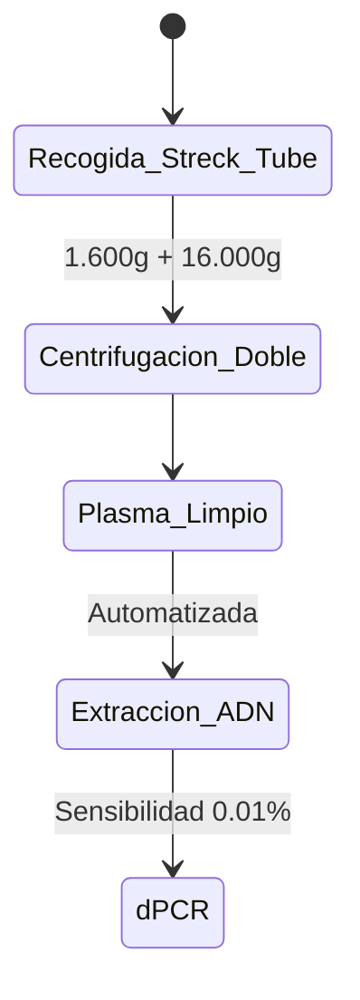

# Semana 6: Nuevos Campos y Técnicas
## Lección 3: Biopsias Líquidas y Exosomas

### 1. Título y Resumen (Abstract)
**Título:** Implementación del ADN Tumoral Circulante (ctDNA) como Herramienta Diagnóstica y de Monitorización en Oncología de Precisión.
**Resumen:** Este artículo analiza los fundamentos moleculares de la biopsia líquida y su capacidad para capturar la heterogeneidad tumoral sistémica. Se evalúan los procesos de liberación de ADN y vesículas extracelulares (exosomas) a la circulación y se justifica la superioridad de la monitorización dinámica sobre la biopsia de tejido sólida. Se destaca el papel del TSLCB en la gestión crítica de la fase preanalítica y el uso de técnicas de ultra-alta sensibilidad como la PCR Digital (dPCR).

### 2. Introducción (Fundamentos y Objetivos)
#### 2.1. Genética del Cáncer y Biología Molecular (Módulo 1370/1369)
El currículo de **Fisiopatología General** (Módulo 1370) describe la carcinogénesis. Las células tumorales presentan mutaciones genéticas (sustituciones, deleciones, amplificaciones) que impulsan su crecimiento.
- **ADN libre circulante (cfDNA):** Fragmentos de ADN (160-200 pb) liberados al plasma por apoptosis o necrosis.
- **ADN tumoral circulante (ctDNA):** Fracción del cfDNA que proviene de las células tumorales (Módulo 1369).
- **Exosomas:** Vesículas de membrana (30-150 nm) que transportan ácidos nucleicos y proteínas.

#### 2.2. Fundamentos de la Biopsia Líquida (Módulo 1369)
El **Módulo de Biología Molecular y Citogenética** incluye el estudio de ácidos nucleicos:
1.  **Aislamiento y Extracción:** Uso de columnas de sílice o perlas magnéticas para concentrar el ADN del plasma.
2.  **PCR Digital (dPCR):** Técnica de cuantificación absoluta. La muestra se divide en miles de microgotas; se realiza una PCR en cada gota y se cuenta cuántas son positivas (presencia de la mutación) frente a negativas (Módulo 1369).
3.  **Secuenciación de Nueva Generación (NGS):** Permite analizar múltiples genes simultáneamente para identificar variantes de resistencia.

#### 2.3. Gestión Crítica Preanalítica (Módulo 1367/1368)
El TSLCB debe asegurar la integridad del ctDNA:
- **Evitar la Lisis Leucocitaria:** El ADN de los glóbulos blancos sanos diluye la señal tumoral. Uso de tubos con estabilizadores celulares (Módulo 1367).
- **Protocolo de Centrifugación (Módulo 1368):** Doble centrifugación (baja y alta velocidad) para obtener plasma libre de detritos celulares.

**Objetivo:** Establecer el protocolo de gestión de muestras para oncología molecular en la red hospitalaria regional.

### 3. Material y Métodos
- **Diseño:** Estudio técnico sobre genómica del cáncer.
- **Entorno:** Instituto de Investigación Sanitaria (IIS), Hospital Universitario de Getafe.
- **Intervenciones:** Extracción de cfDNA mediante kits automatizados. Análisis de mutaciones específicas (ej. EGFR, KRAS, BRAF) mediante **PCR Digital en Gotas (ddPCR)** que permite una cuantificación absoluta sin curva estándar.

### 4. Resultados (Hallazgos Experimentales)
Workflow de monitorización de la carga tumoral molecular:

### 5. Discusión y Conclusiones
La biopsia líquida es el pilar de la Medicina de Precisión. Se concluye que el TSLCB es el garante de la "pureza" de la muestra; un error en la centrifugación (no realizar el segundo paso de alta velocidad) deja restos celulares que invalidan el análisis molecular. Se visualiza que hacia 2026, el análisis de la metilación del ADN en biopsia líquida se utilizará para el cribado poblacional de múltiples tipos de cáncer en una sola toma.

### 6. Agradecimientos
A los oncólogos del HUGF y al personal técnico del IISG por la validación de los perfiles mutacionales.

### 7. Bibliografía (Literatura Citada)
- **Lodish. Biología Celular y Molecular. 9ª Ed. Panamericana.**
- **Decreto 179/2015 de la CM: Módulo de Biología Molecular y Citogenética.**
- [ASCO: Clinical Applications of Liquid Biopsy in Oncology](https://www.asco.org)
- [Liquid Biopsy Journal: Extracellular Vesicles in Cancer](https://www.journals.elsevier.com)

---
### Sobre el Ponente
**José Luis Román Fernández** es investigador en el **Instituto de Investigación Sanitaria Getafe (IISG)**.

*Material técnico docente ampliado según las competencias del Grado Superior.*
