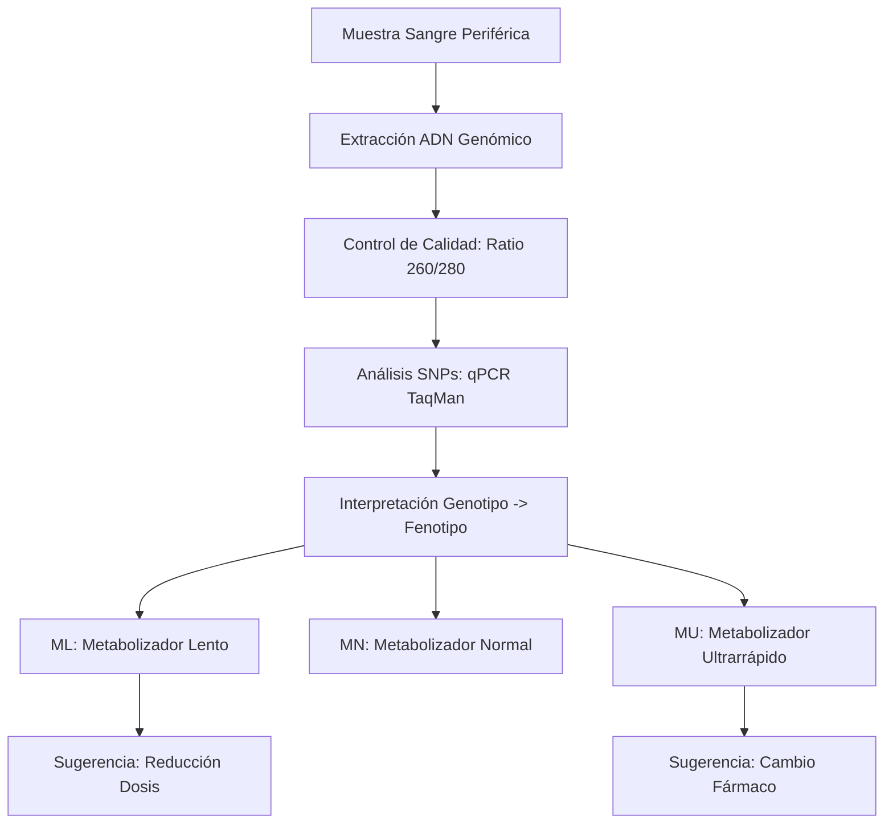
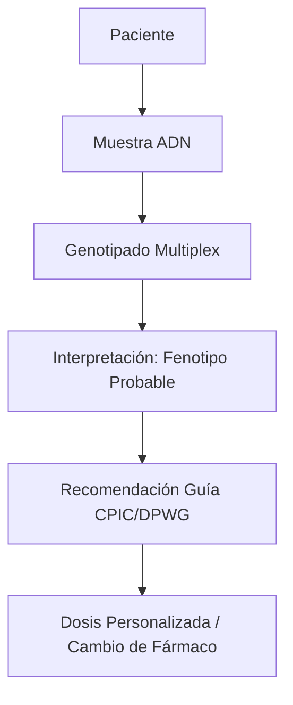
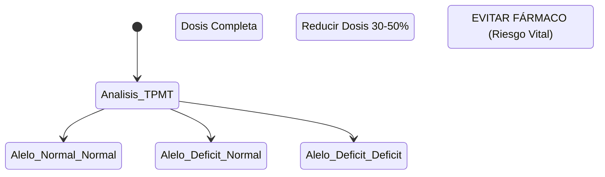

# Semana 6: Nuevos Campos y Técnicas
## Lección 4: ¿Qué es la Farmacogenética? Avanzando en la Medicina de Precisión

### 1. Título y Resumen (Abstract)
**Título:** Impacto del Genotipado de los Citocromos P450 en la Seguridad del Paciente Polimedicado: Una Perspectiva Farmacogenética y Molecular.
**Resumen:** Este artículo analiza cómo la variabilidad genética individual condiciona la respuesta a los fármacos. Se fundamentan los conceptos de Farmacocinética y Farmacodinámica, profundizando en el papel de las variantes polimórficas (SNPs) de las enzimas del Citocromo P450. Se evalúa la utilidad de identificar fenotipos metabolizadores (lentos, intermedios, ultrarrápidos) para prevenir la toxicidad y optimizar la eficacia terapéutica, destacando el papel del TSLCB en la extracción de ADN y la interpretación de genotipos complejos.

### 2. Introducción (Fundamentos y Objetivos)
#### 2.1. Farmacología y Metabolismo (Módulo 1370/1371)
El currículo de **Fisiopatología General** (Módulo 1370) introduce los principios de la acción de los fármacos.
- **Farmacocinética (ADME):** Absorción, Distribución, Metabolismo y Excreción. El hígado es el principal órgano metabolizador mediante el sistema de oxigenasas del Citocromo P450 (CYP).
- **Bioquímica Clínica (Módulo 1371):** El laboratorio monitoriza los niveles plasmáticos de fármacos (TDM) para asegurar el rango terapéutico (ej. Digoxina, Vancomicina).

#### 2.2. Polimorfismos Genéticos y Farmacogenética (Módulo 1369)
La farmaco-genética estudia cómo las variaciones en el ADN (SNPs) afectan la respuesta a medicamentos.
- **Citocromos (CYP2D6, CYP2C19):** Enzimas que metabolizan antidepresivos y antiagregantes. 
    - **Metabolizadores Lentos (ML):** Carecen de alelos funcionales. Riesgo de acumulación y toxicidad (ADR).
    - **Metabolizadores Ultrarrápidos (MU):** Varias copias del gen. Riesgo de ineficacia terapéutica.
- **Genotipos Críticos:** *TPMT* (tiopurinas), *DPYD* (5-fluorouracilo), *HLA-B*57:01* (abacavir).

#### 2.3. Técnicas de Genotipado y Calidad (Módulo 1369)
El **Módulo de Biología Molecular** describe las técnicas para detectar estas variantes:
1.  **Aislamiento de ADN:** Extracción de sangre periférica mediante sistemas automáticos de perlas magnéticas (ADN de alta pureza).
2.  **PCR en Tiempo Real (Sondas TaqMan):** Detección de polimorfismos de un solo nucleótido (SNPs) mediante sondas específicas de alelo (Módulo 1369).
3.  **Secuenciación Sanger:** Gold standard para la validación de variantes raras o estructurales.

**Objetivo:** Sistematizar el flujo de diagnóstico farmacogenético previo a la prescripción según las guías clínicas de la Comunidad de Madrid.

### 3. Material y Métodos
- **Diseño:** Análisis prospectivo de farmacoseguridad.
- **Entorno:** Laboratorio de Bioquímica y Farmacogenética, Hospital Universitario Severo Ochoa.
- **Intervenciones:** Extracción de ADN de sangre periférica mediante sistemas automáticos de perlas magnéticas. Genotipado de variantes específicas mediante PCR en tiempo real (Sondas TaqMan) y Secuenciación Sanger.

### 4. Resultados (Hallazgos Experimentales)
Workflow interpretativo basado en guías internacionales:

### 5. Discusión y Conclusiones
La farmacogenética transforma el modelo de "ensayo y error" en una medicina predictiva. Se concluye que el TSLCB debe asegurar la máxima calidad del ADN (Ratio A260/A280 ~1.8), ya que contaminantes en la extracción pueden inhibir la PCR y dar resultados erróneos de "metabolizador lento" por falta de amplificación de un alelo. Hacia 2026, la farmacogenética se integrará en las recetas electrónicas mediante sistemas de soporte a la decisión clínica.

### 6. Agradecimientos
Al personal de Farmacia Hospitalaria por la recopilación de reacciones adversas medicamentosas para la validación de los perfiles genéticos.

### 7. Bibliografía (Literatura Citada)
- **CPIC: Clinical Pharmacogenetics Implementation Consortium Guidelines.** [Ver en cpicpgx.org](https://cpicpgx.org/guidelines/)
- **PharmGKB: The Pharmacogenomics Knowledgebase.** [Ver en pharmgkb.org](https://www.pharmgkb.org/)
- **Farmacogenética en el laboratorio clínico - SEQCML.** [Ver en seqc.es](https://www.seqc.es/es/bioquimica-en-el-laboratorio-clinico/manuales-y-monografias/)
- **SEFF: Sociedad Española de Farmacogenética y Farmacogenómica.** [Ver en seff.es](http://www.seff.es/)

---
### Sobre las Ponentes
**Ana Irusta Gonzalo** y **Teresa Madero Jiménez** son Residentes de 4º año (R4) de Bioquímica Clínica en el **Hospital Universitario Severo Ochoa**.

*Material científico pedagógico ampliado conforme a la normativa de la Comunidad de Madrid.*
