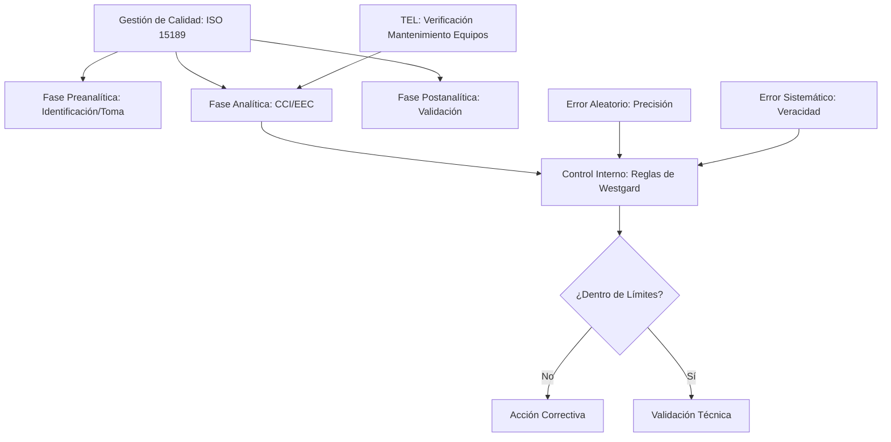
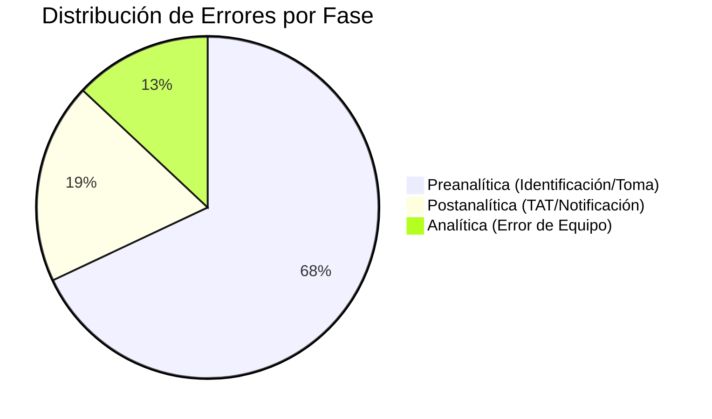
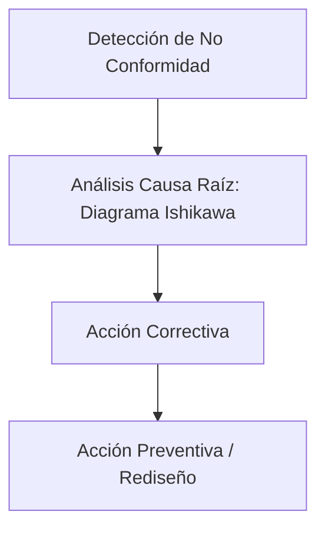

# Semana 6: Nuevos Campos y Técnicas
## Lección: Calidad en el Laboratorio y Seguridad del Paciente

### 1. Título y Resumen (Abstract)
**Título:** Gestión de Riesgos y Mejora Continua bajo la Norma ISO 15189:2022: Un Enfoque en la Seguridad del Paciente en el Entorno del Laboratorio Clínico.
**Resumen:** Este artículo analiza la transición de la gestión de la calidad hacia una cultura proactiva de seguridad del paciente. Se fundamentan los procesos de control de calidad interno (CCI) y evaluación externa de la calidad (EEC), analizando la distribución de errores en el ciclo total del laboratorio. Se evalúa el impacto de la norma ISO 15189:2022 en la validación técnica del TSLCB y en la minimización de eventos adversos asociados al diagnóstico.

### 2. Introducción (Fundamentos y Objetivos)
#### 2.1. Gestión de la Calidad en el Laboratorio (Módulo 1368)
El currículo de **Gestión de Muestras Biológicas** (Módulo 1367) y **Técnicas Generales de Laboratorio** (Módulo 1368) establece las bases de la calidad. La calidad es el cumplimiento de los requisitos para satisfacer las necesidades del paciente y el clínico.
- **Ciclo de Deming (PDCA):** Planificar, Hacer, Verificar, Actuar. Base de la mejora continua.
- **Fases del Proceso Analítico:** Preanalítica (>60% errores), Analítica y Postanalítica. EL TSLCB interviene en todas ellas.

#### 2.2. Control de Calidad Interno y Externo (Módulo 1368/1371)
Para asegurar la fiabilidad de los resultados (Módulo 1368):
1.  **Control de Calidad Interno (CCI):** Procesado de muestras de control (normal y patológico) en cada serie analítica. Se evalúa mediante las **Reglas de Westgard** para detectar errores aleatorios (falta de precisión) y sistemáticos (falta de veracidad).
2.  **Evaluación Externa de la Calidad (EEC):** Programas de intercomparación entre laboratorios para evaluar la exactitud frente a un valor de consenso.
3.  **Material de Referencia:** Sustancias con valores certificados para la calibración de equipos (Módulo 1371).

#### 2.3. Seguridad del Paciente y Norma ISO 15189 (Módulo 1367)
La norma **ISO 15189** es el estándar internacional de competencia para laboratorios clínicos.
- **Gestión de Riesgos:** Identificación proactiva de peligros que puedan causar daño al paciente (ej. error de identificación).
- **No Conformidades:** Registro y análisis de cualquier desviación del procedimiento establecido (Módulo 1367).

**Objetivo:** Sistematizar el flujo de gestión de no conformidades y la validación técnica según los estándares de acreditación de la Comunidad de Madrid.

### 3. Material y Métodos
- **Diseño:** Análisis normativo y de gestión de procesos.
- **Entorno:** Dirección de Calidad, Laboratorios Centralizados de la Red Pública.
- **Intervenciones:** Monitorización de Indicadores de Calidad (IC), auditorías internas y participación en programas de intercomparación (SEQCML / AEBM).

### 4. Resultados (Hallazgos Experimentales)
Distribución típica de errores y barreras de seguridad:

### 5. Discusión y Conclusiones
La calidad técnica es necesaria pero insuficiente; se requiere calidad en la atención. Se concluye que el TSLCB es el primer filtro de seguridad del paciente, teniendo la potestad de rechazar muestras inadecuadas (hemolizadas, mal identificadas) para evitar resultados erróneos. La acreditación ISO 15189 no es un fin, sino el marco de trabajo para la mejora continua del laboratorio de 2026.

### 6. Agradecimientos
A los responsables de calidad de la red hospitalaria de la CM por la estandarización de los indicadores de gestión.

### 7. Bibliografía (Literatura Citada)
- **ISO 15189:2022 - Medical laboratories: Requirements for quality and competence.** [Ver en iso.org](https://www.iso.org/standard/76677.html)
- **Gestión de la Calidad en el Laboratorio Clínico - SEQCML.** [Ver en seqc.es](https://www.seqc.es/es/bioquimica-en-el-laboratorio-clinico/manuales-y-monografias/)
- **IFCC: Global Quality Indicators Project.** [Ver en ifcc.org](https://www.ifcc.org/ifcc-scientific-division/sd-committees/c-tla/quality-indicators-project/)
- **ENAC: Acreditación de Laboratorios Clínicos.** [Ver en enac.es](https://www.enac.es/web/enac/laboratorios-clinicos)

---
*Material técnico didáctico ampliado para la formación de Técnicos Superiores.*
