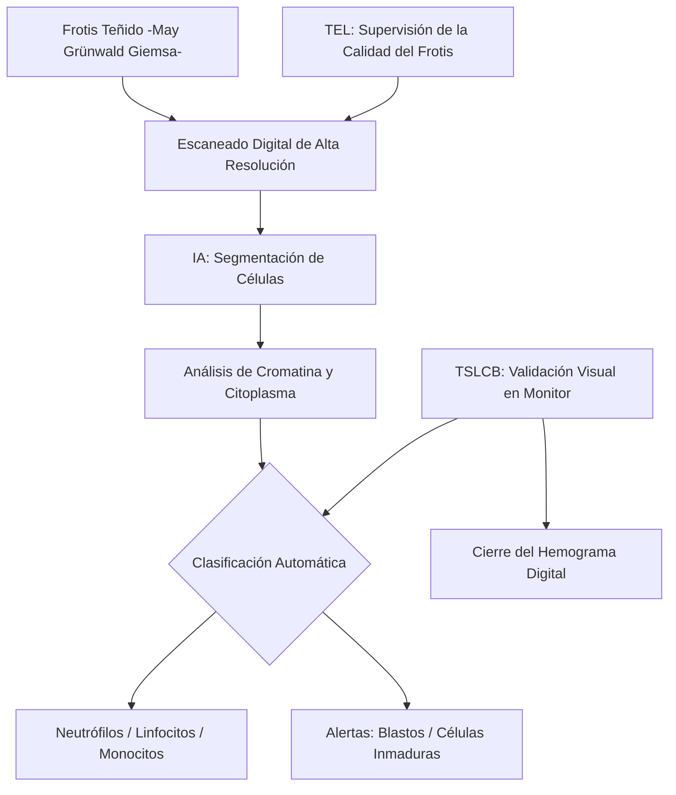
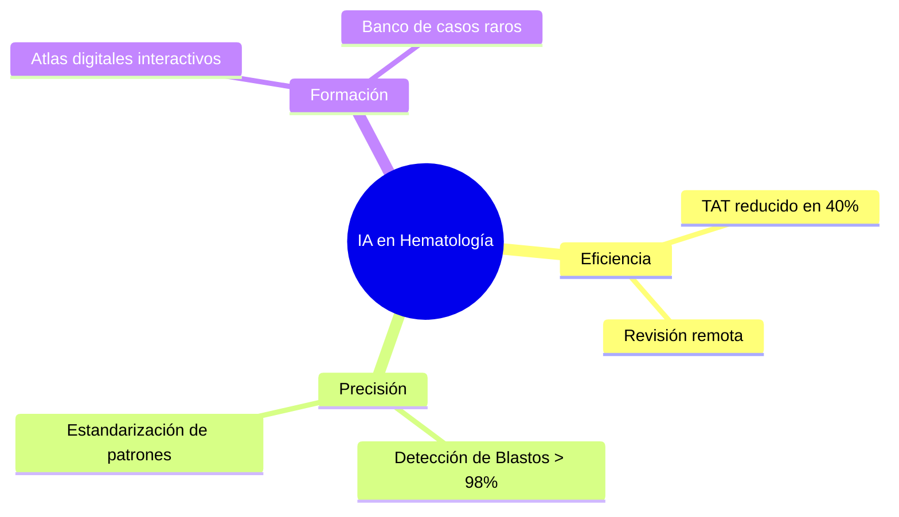
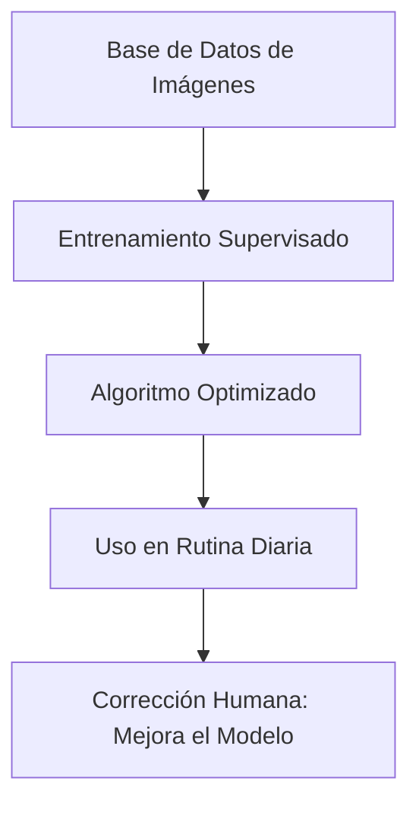

# Semana 6: Nuevos Campos y Técnicas
## Lección: Inteligencia Artificial en Hematología Digital

### 1. Título y Resumen (Abstract)
**Título:** Aplicabilidad de las Redes Neuronales de Convolución en la Pre-Clasificación de Células en Sangre Periférica: Optimización de la Eficiencia en el Frotis Hematológico.
**Resumen:** Este artículo analiza los fundamentos de la morfología linfo-mieloide asistida por algoritmos de aprendizaje profundo (*Deep Learning*). Se evalúa la transición de la microscopía óptica convencional a los sistemas de escaneado digital, fundamentando la capacidad de la IA para detectar blastos y células inmaduras con alta sensibilidad. Se destaca el papel del TSLCB en la supervisión de la pre-clasificación automatizada y el valor de las galerías digitales en la estandarización diagnóstica.

### 2. Introducción (Fundamentos y Objetivos)
#### 2.1. Fisiatología del Sistema Hematopoyético (Módulo 1370)
El currículo de **Fisiopatología General** (Módulo 1370) describe la formación de las células sanguíneas (hematopoyesis) en la médula ósea.
- **Líneas Celulares:** Eritroide (hematíes), Mieloide (granulocitos, monocitos) y Linfoide (linfocitos).
- **Morfología (Módulo 1374):** El estudio visual del frotis de sangre periférica permite detectar anomalías como la presencia de blastos (leucemias), dacriocitos (mielofibrosis) o esquistocitos (hemólisis microangiopática).

#### 2.2. Hematología Digital y Visión Artificial (Módulo 1374/1368)
El **Módulo de Análisis Hematológico** (Módulo 1374) incluye el recuento diferencial leucocitario:
1.  **Sistemas de Categorización Automática:** Utilizan redes neuronales artificiales (ANN) para clasificar las células tras el escaneado digital del frotis.
2.  **Extracción de Características (Módulo 1368):** El software analiza parámetros geométricos (diámetro celular), de textura (cromatina núcleo) y de color (basofilia citoplasmática).
3.  **Galerías Digitales:** El TSLCB revisa en pantalla las células que el sistema no ha podido clasificar con alta confianza (outliers).

#### 2.3. Estandarización y Tele-Hematología (Módulo 1367)
- **Gestión de la Información (Módulo 1367):** Los sistemas digitales facilitan el almacenamiento de imágenes para su revisión remota por expertos (segunda opinión) y para la docencia.
- **Control de Calidad:** La IA reduce la variabilidad entre técnicos, asegurando que los criterios de clasificación sean uniformes en toda la red hospitalaria.

**Objetivo:** Sistematizar el uso de sistemas de morfología digital en la red de laboratorios de la Comunidad de Madrid.

### 3. Material y Métodos
- **Diseño:** Estudio técnico sobre validación de algoritmos de clasificación celular.
- **Entorno:** Unidad de Hematología Digital, Hospital Universitario Central.
- **Intervenciones:** Comparativa de recuento diferencial manual vs sistemas Scopio Labs o CellaVision. Evaluación de la sensibilidad para la detección de "desviación a la izquierda" y linfocitosis reactiva.

### 4. Resultados (Hallazgos Experimentales)
Workflow de integración y entrenamiento del sistema:

### 5. Discusión y Conclusiones
La IA no sustituye al técnico especialista; actúa como un multiplicador de su capacidad. Se concluye que el TSLCB debe supervisar la calidad de la tinción y la homogeneidad de la preparación, ya que un frotis mal realizado induce errores de clasificación en el software. Hacia 2026, la IA será capaz de predecir mutaciones citogenéticas (como la t(15;17)) solo con el análisis de la morfología celular en el frotis inicial.

### 6. Agradecimientos
A los desarrolladores de software de visión artificial por la colaboración en el entrenamiento de redes para la identificación de células oncológicas.

### 7. Bibliografía (Literatura Citada)
- **ISLH: International Society for Laboratory Hematology - Digital Guidelines.** [Ver en islh.org](https://www.islh.org/guidelines)
- **Artificial Intelligence in Hematology: A Review - Lancet Digital Health.** [Ver en thelancet.com](https://www.thelancet.com/journals/landig/article/PIIS2589-7500(20)30141-0/fulltext)
- **AI-driven automation in the clinical hematology laboratory - SEHH.** [Ver en sehh.es](https://www.sehh.es/)
- **StatPearls: Artificial Intelligence in Medicine.** [Ver en ncbi.nlm.nih.gov](https://www.ncbi.nlm.nih.gov/books/NBK590412/)

---
*Material científico adaptado a las nuevas competencias tecnológicas del TSLCB.*
