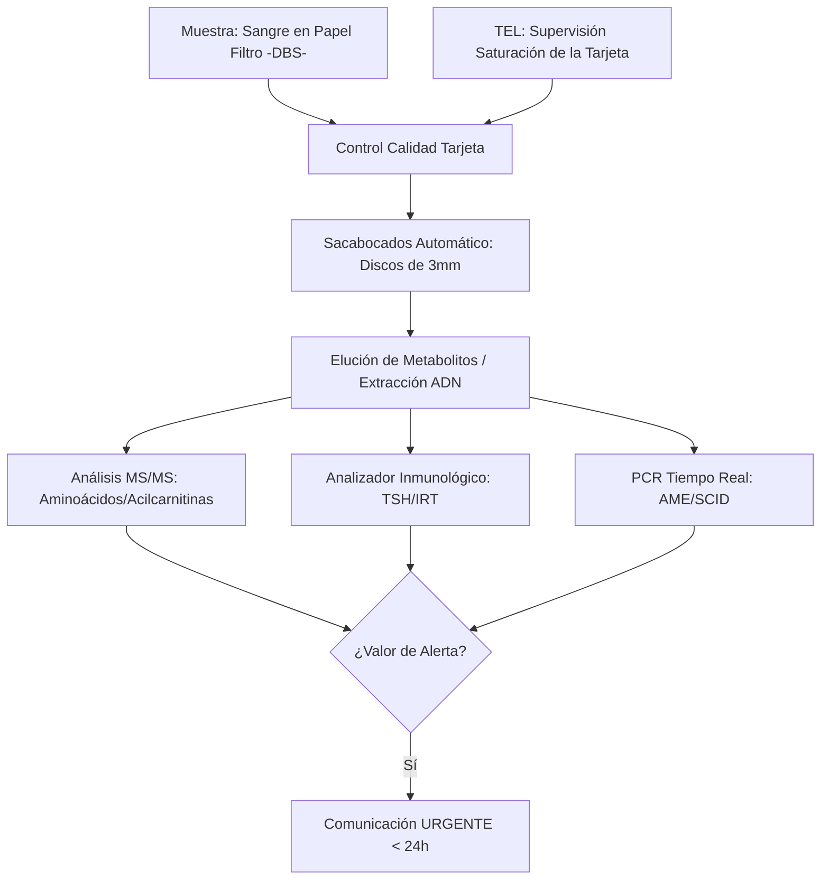
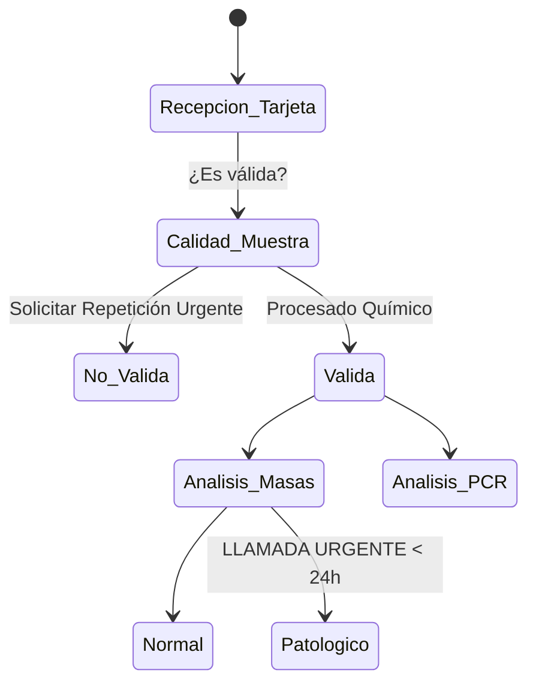
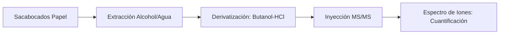

# Semana 6: Nuevos Campos y Técnicas
## Lección: Avances en Cribado Neonatal: Genómica y Metabolopatías

### 1. Título y Resumen (Abstract)
**Título:** Expansión Genómica y Metabólica del Cribado Neonatal: Diagnóstico Precoz mediante Espectrometría de Masas en Tándem y PCR en Tiempo Real.
**Resumen:** Este artículo analiza los fundamentos del diagnóstico presintomático en recién nacidos. Se fundamentan las rutas metabólicas de aminoácidos y acilcarnitinas, así como la detección genómica de la Atrofia Muscular Espinal (AME) y e Inmunodeficiencias Combinadas Graves (SCID). Se evalúa la metodología de la mancha de sangre seca (DBS) y el papel del TSLCB en la gestión de muestras críticas y la validación de alertas urgentes del programa regional de cribado.

### 2. Introducción (Fundamentos y Objetivos)
#### 2.1. Fisiopatología de los Errores Innatos del Metabolismo (EIM) (Módulo 1370/1371)
El currículo de **Fisiopatología General** (Módulo 1370) describe las alteraciones congénitas del metabolismo. Los EIM son enfermedades causadas por mutaciones en genes que codifican enzimas, transportadores o cofactores.
- **Acumulación de Sustratos:** Produce toxicidad (ej. Fenilalanina en la Fenilcetonuria -PKU-).
- **Déficit de Productos:** Altera el crecimiento y desarrollo (ej. falta de tirosina).
- **Trastornos de la Oxidación de Grasas:** Impiden la obtención de energía durante el ayuno, pudiendo causar muerte súbita.

#### 2.2. Fundamentos de las Técnicas de Cribado (Módulo 1369/1371)
El **Módulo de Análisis Bioquímico** (Módulo 1371) incluye el estudio del cribado neonatal:
1.  **Espectrometría de Masas en Tándem (MS/MS):** Permite la cuantificación simultánea de aminoácidos y acilcarnitinas a partir de una gota de sangre (Módulo 1371).
2.  **Inmunoensayo Fluorescente:** Para la detección de TSH (Hipotiroidismo congénito), IRT (Fibrosis Quística) y 17-OH-Progesterona (HSC) (Módulo 1372).
3.  **Genómica de Cribado (qPCR):** Detección de la ausencia de exón 7 en SMN1 (AME) o de círculos de escisión TRECs (SCID) (Módulo 1369).

#### 2.3. Gestión de la Muestra en Sangre Seca (DBS) (Módulo 1367/1368)
El TSLCB debe supervisar la calidad de la tarjeta de cribado:
- **Toma de Muestra:** Punción del talón a las 48h de vida (Módulo 1367). La gota debe impregnar el papel filtro de forma homogénea en ambas caras.
- **Preparación (Punch):** Extracción de un disco de 3 mm mediante sacabocados automático para la elución de los metabolitos analizados.
- **Estabilidad y Secado:** Mínimo 4h a temperatura ambiente antes de su envío (Módulo 1367).

**Objetivo:** Sistematizar el flujo del Programa de Cribado Neonatal de la Comunidad de Madrid y la validación de muestras por tecnología de masas.

### 3. Material y Métodos
- **Diseño:** Análisis técnico-procedimental de salud pública.
- **Entorno:** Centro de Cribado Neonatal Regional, Comunidad de Madrid.
- **Intervenciones:** Medición por MS/MS con derivatización. Extracción automatizada de ADN desde papel filtro y amplificación mediante sondas de hidrólisis (TaqMan).

### 4. Resultados (Hallazgos Experimentales)
Workflow del programa de detección precoz ampliado:

### 5. Discusión y Conclusiones
La detección precoz previene discapacidades permanentes y reduce la mortalidad infantil drásticamente. Se concluye que el TSLCB es el garante de la fase preanalítica; un sacabocados tomado de una zona con "sangre superpuesta" dará un falso positivo masivo por exceso de carga. Hacia 2026, la secuenciación de exoma completo (WES) se perfila como la segunda línea de confirmación sistemática en el propio laboratorio de cribado.

### 6. Agradecimientos
A los servicios de Pediatría y Atención Primaria por el cumplimiento de los tiempos máximos de envío de las tarjetas de cribado.

### 7. Bibliografía (Literatura Citada)
- **AECOM: Asociación Española para el Estudio de los Errores Congénitos del Metabolismo.** [Ver en aecom.org](https://aecom.org/profesionales/cribado-neonatal)
- **ISNS: International Society for Neonatal Screening - Global Standards.** [Ver en isns-nn.org](https://www.isns-nn.org/)
- **Cribado Neonatal de Enfermedades Endocrino-Metabólicas - SEQCML.** [Ver en seqc.es](https://www.seqc.es/es/bioquimica-en-el-laboratorio-clinico/manuales-y-monografias/)
- **Programa de Cribado Neonatal de la Comunidad de Madrid.** [Ver en comunidad.madrid](https://www.comunidad.madrid/servicios/salud/cribado-neonatal)

---
### Sobre el Ponente
**Rafael López García** es Facultativo Especialista de Área (FEA) de Bioquímica Clínica en el **Hospital Universitario de Getafe**.

*Contenido científico actualizado conforme a los objetivos docentes de la Comunidad de Madrid.*
