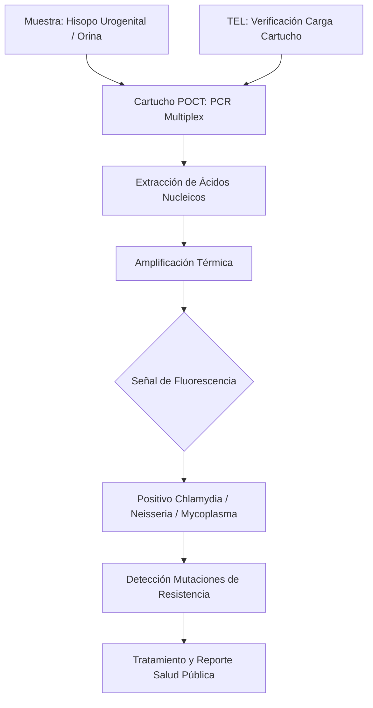
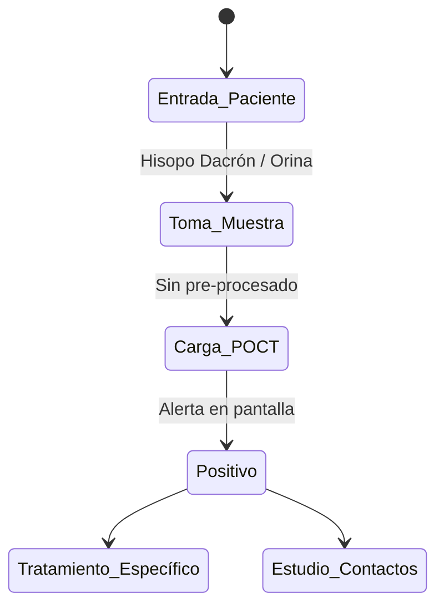

# Semana 6: Nuevos Campos y Técnicas
## Lección: Actualidad en Infecciones de Transmisión Sexual (ITS)

### 1. Título y Resumen (Abstract)
**Título:** Implementación del Diagnóstico Molecular en el Punto de Atención (POCT) para la Vigilancia y Control de las ITS: Un Enfoque en Neisseria y Chlamydia.
**Resumen:** Este artículo analiza la alarmante tendencia al alza de las infecciones de transmisión sexual y la respuesta técnica mediante diagnóstico descentralizado. Se fundamenta el uso de la PCR en tiempo real de respuesta rápida para la ruptura de la cadena epidemiológica y se evalúa el papel del TSLCB en la gestión del POCT, el control de las resistencias antimicrobianas y la comunicación de resultados críticos a Salud Pública.

### 2. Introducción (Fundamentos y Objetivos)
#### 2.1. Microbiología de los Patógenos de ITS (Módulo 1373/1370)
El currículo de **Microbiología Clínica** (Módulo 1373) detalla los principales agentes infecciosos. Las ITS son causadas por bacterias, virus y parásitos que colonizan el tracto urogenital.
1.  **Bacterias Exigentes:** *Neisseria gonorrhoeae* (diplococo G-) requiere medios enriquecidos como el Thayer-Martin (Módulo 1373). *Chlamydia trachomatis* y *Mycoplasma/Ureaplasma* son parásitos intracelulares o carecen de pared celular, dificultando su cultivo.
2.  **Virus (Módulo 1373):** Virus del Papiloma Humano (VPH), Herpes Simple (VHS-1/2) y VIH.
3.  **Fisiatología (Módulo 1370):** La inflamación (uretritis, cervicitis) puede derivar en enfermedad inflamatoria pélvica e infertilidad.

#### 2.2. Diagnóstico Molecular Rápido y POCT (Módulo 1369/1373)
El **Módulo de Biología Molecular** (Módulo 1369) establece el uso de técnicas de amplificación de ácidos nucleicos (NAAT):
- **PCR Sindrómica:** Detección simultánea de múltiples patógenos en un solo cartucho.
- **POCT (Point-of-Care Testing):** Dispositivos de PCR rápida que integran extracción y amplificación en < 90 min (Módulo 1373). Permiten el tratamiento dirigido en la primera consulta.
- **Resistencias Antimicrobianas:** Detección de genes de resistencia (ej. penicilinasas en gonococo) mediante sondas moleculares.

#### 2.3. Fase Preanalítica y Toma de Muestras (Módulo 1367/1368)
El TSLCB debe asegurar la calidad de la muestra:
- **Exudados (Módulo 1367):** Uso de hisopos de dacrón o poliéster (no algodón/madera) con medio de transporte específico para PCR.
- **Orina (Primer Chorro):** Recogida sin limpieza previa para arrastrar los patógenos de la uretra.
- **Gestión (Módulo 1368):** Procesamiento inmediato o refrigeración para evitar la degradación del ADN/ARN.

**Objetivo:** Sistematizar el protocolo de diagnóstico rápido y notificación epidemiológica coordinada en la red sanitaria.

### 3. Material y Métodos
- **Diseño:** Estudio técnico sobre eficiencia diagnóstica en salud sexual.
- **Entorno:** Centros de Diagnóstico Rápido y Laboratorios de Microbiología Regionales.
- **Intervenciones:** Uso de plataformas GeneXpert o Visby Medical para ITS. Comparativa con métodos de cultivo convencional y antibiograma por E-test para Gonococo.

### 4. Resultados (Hallazgos Experimentales)
Workflow de manejo clínico-técnico acelerado:

### 5. Discusión y Conclusiones
La descentralización del diagnóstico molecular es clave para el control de la salud pública. Se concluye que el TSLCB es el garante de la calidad del POCT, supervisando los controles de calidad de los cartuchos y asegurando que las muestras no sufran degradación térmica antes de la carga. La integración de la detección de resistencias génicas en el punto de atención es el mayor avance frente a la crisis global de antibióticos.

### 6. Agradecimientos
Al personal de las Unidades de ITS por la coordinación en la captación de pacientes y seguimiento de contactos.

### 7. Bibliografía (Literatura Citada)
- **Murray. Microbiología Médica. 9ª Ed. Elsevier.**
- **Decreto 179/2015 de la CM: Módulo de Microbiología Clínica.**
- [WHO: Global Health Sector Strategy on STIs](https://www.who.int)
- [SEIMC: Procedimientos en Microbiología - Infecciones de Transmisión Sexual](https://www.seimc.org)

---
### Sobre el Ponente
**Material generado bajo la supervisión de expertos en Salud Pública y Microbiología.**

*Material científico pedagógico ampliado conforme a los requerimientos del TSLCB.*
