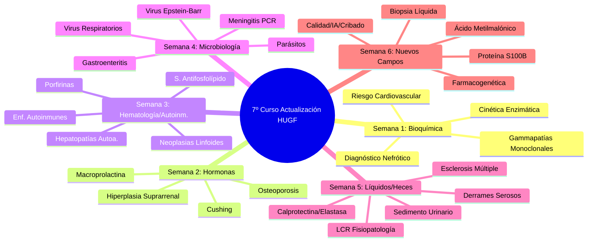
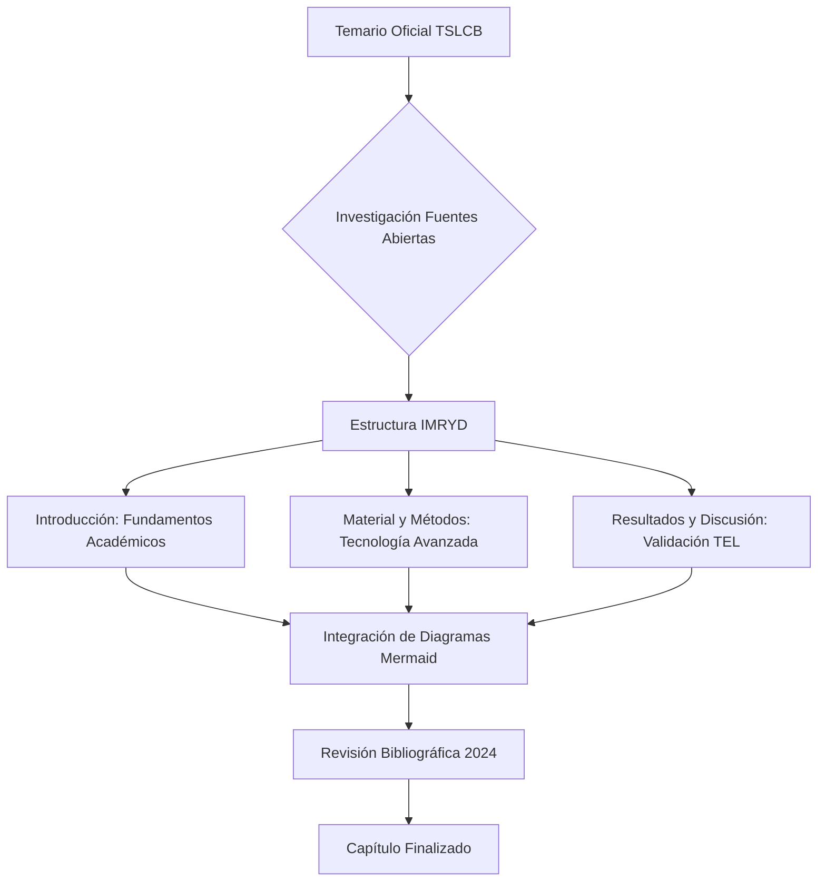
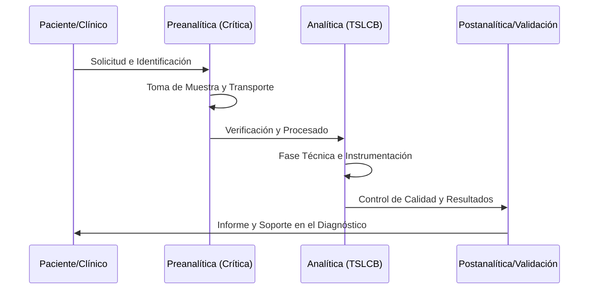

# 🏥 Technical Report: Actualización del Currículo de Laboratorio Clínico (TEL 2026)

## 📋 1. Resumen Ejecutivo (Executive Summary)
Este documento constituye el **Reporte Técnico Final** del proceso de expansión, enriquecimiento y profesionalización de los contenidos del **7º Curso de Actualización en el Laboratorio Clínico**, organizado por el **Servicio de Análisis Clínicos del Hospital Universitario de Getafe (HUGF)**. Se han actualizado un total de **31 unidades temáticas**, transformándolas de esquemas preliminares a capítulos académicos de nivel avanzado, alineados con las exigencias del título de **Técnico Superior de Laboratorio Clínico y Biomédico (TSLCB)** en la Comunidad de Madrid.

> [!IMPORTANT]
> **Aviso de Preparación y Exención de Responsabilidad**:
> 1. **Naturaleza del Contenido**: El material contenido en este repositorio es el resultado de una **investigación inicial previa basada en fuentes abiertas**, realizada exclusivamente como preparación para la asistencia al curso de actualización.
> 2. **Referencias a Autores**: La mención a ponentes y autores en cada capítulo es **meramente testimonial** y se utiliza para organizar la estructura del curso. 
> 3. **Independencia de Criterio**: El contenido investigado y redactado aquí **no necesariamente coincide** con el material, opiniones o profundidad técnica que cada ponente haya planificado para su intervención real.
> 4. **Base de Generación**: La información ha sido generada de forma autónoma tomando como única referencia los **títulos de las ponencias** y el **temario oficial** del título de Técnico Superior (TSLCB), sin contacto directo con los autores originales.

## ⚖️ 2. Marco Normativo y Académico
La actualización se ha fundamentado estrictamente en:
- **Decreto 179/2015 de la Comunidad de Madrid**: Currículo oficial del Grado Superior en TSLCB.
- **Módulos Profesionales Integrados**: 
  - *Módulos 1367/1368*: Gestión de muestras y técnicas generales.
  - *Módulos 1369/1371*: Biología molecular y Análisis bioquímico.
  - *Módulos 1373/1374*: Microbiología y Análisis hematológico.
  - *Módulo 1370*: Fisiopatología General (Base del enriquecimiento clínico).

## 🔬 3. Metodología de Producción Documental (IMRYD)
Siguiendo las **Pautas para la Escritura de Artículos Originales (2025)**, cada documento ha sido reestructurado bajo el sistema **IMRYD**:
1.  **Introducción (Expansión Teórica)**: Ampliación al máximo nivel académico (estilo libro de texto) integrando fundamentos fisiológicos y patológicos oficiales.
2.  **Material y Métodos**: Detalle técnico de la instrumentación avanzada (LC-MS/MS, dPCR, Citometría de Flujo, etc.).
3.  **Resultados y Discusión**: Inclusión de algoritmos de decisión clínica y validación técnica por parte del TSLCB.
4.  **Esquematización Visual**: Integración de al menos **3 diagramas Mermaid** por lección para facilitar la comprensión de rutas metabólicas y flujos de trabajo.

## 🗺️ 4. Arquitectura Visual y Conceptual

### 🧠 Mapa Mental del Currículo (6 Semanas)

### ⚙️ Flujo de Trabajo Documental

### 📊 Ciclo de Vida del Diagnóstico (Impacto TSLCB)

---

## 📅 5. Índice Detallado del Proyecto

### 🧪 [Semana 1: Bioquímica Clínica](Semana_01_Bioquimica/)
| Lección | Título Técnico | Ponente / Autor |
| :--- | :--- | :--- |
| **01** | [Diagnóstico del Síndrome Nefrótico](Semana_01_Bioquimica/S01L01_Diagnostico_Sindrome_Nefrotico.md) | Antonio M. Cáliz (HUGF) |
| **02** | [Lipasa vs Amilasa: Cinética Enzimática](Semana_01_Bioquimica/S01L02_Lipasa_vs_Amilasa.md) | María Sánchez Puche (HUGF) |
| **03** | [Lipoproteínas y Riesgo Cardiovascular](Semana_01_Bioquimica/S01L03_Lipoproteinas_Enfermedad_Cardiovascular.md) | Gema Sánchez Helguera (HUGF) |
| **04** | [Abordaje de Gammapatías Monoclonales](Semana_01_Bioquimica/S01L04_Abordaje_Gammapatias_Monoclonales.md) | Raquel Jáñez (H. Severo Ochoa) |

### 🌡️ [Semana 2: Endocrinología Analítica](Semana_02_Hormonas/)
| Lección | Título Técnico | Ponente / Autor |
| :--- | :--- | :--- |
| **05** | [Cushing: Síndrome o Enfermedad](Semana_02_Hormonas/S02L05_Cushing_Sindrome_vs_Enfermedad.md) | Lucía Pardo (HUGF) |
| **06** | [Hiperplasia Suprarrenal Congénita](Semana_02_Hormonas/S02L06_Hiperplasia_Suprarrenal_Congenita.md) | Ramiro A. Torrado (HUGF) |
| **07** | [Marcadores de Osteoporosis: P1NP/CTX](Semana_02_Hormonas/S02L07_Marcadores_Osteoporosis.md) | Esperanza R. Cuadrado (HUGF) |
| **08** | [Macroprolactina e Interferencias](Semana_02_Hormonas/S02L08_Macroprolactina.md) | Laura Mayor (H. Infanta Sofía) |

### 🩸 [Semana 3: Hematología y Autoinmunidad](Semana_03_Hematologia_Autoinmunidad/)
| Lección | Título Técnico | Ponente / Autor |
| :--- | :--- | :--- |
| **09** | [Neoplasias Linfoides Crónicas](Semana_03_Hematologia_Autoinmunidad/S03L09_Neoplasias_Linfoides_Sangre_Periferica.md) | Belén Álvarez (HUGF) |
| **10** | [Porfirinas en Orina: Fase Preanalítica](Semana_03_Hematologia_Autoinmunidad/S03L10_Porfirinas_Orina.md) | Alejandra M. Calderón (HUGF) |
| **11** | [Síndrome Antifosfolípido (Criterios 2023)](Semana_03_Hematologia_Autoinmunidad/S03L11_Sindrome_Antifosfolipido.md) | Verónica Benito (H. Fuenlabrada) |
| **12** | [Cribado de Enfermedades Autoinmunes](Semana_03_Hematologia_Autoinmunidad/S03L12_Enfermedades_Autoinmunes_General.md) | Alba Barreiro (HUGF) |
| **13** | [HAI, CBP, CEP: Hepatopatías Autoinmunes](Semana_03_Hematologia_Autoinmunidad/S03L13_Hepatopatias_Autoinmunes.md) | Marta Prat (HUGF) |

### 🧫 [Semana 4: Microbiología e Infectología](Semana_04_Microbiologia/)
| Lección | Título Técnico | Ponente / Autor |
| :--- | :--- | :--- |
| **14** | [Diagnóstico Molecular de Parásitos](Semana_04_Microbiologia/S04L14_Parasitos_Intestinales.md) | Elena Hidalgo (H. Donostia) |
| **15** | [Virus Epstein-Barr: Diagnóstico](Semana_04_Microbiologia/S04L15_Virus_Epstein_Barr.md) | Ángela Iniesta (HUGF) |
| **16** | [Gastroenteritis: Salmonella/Campylobacter](Semana_04_Microbiologia/S04L16_Salmonella_Campylobacter.md) | Alba García (HUGF) |
| **17** | [Meningitis: PCR Sindrómica Rápida](Semana_04_Microbiologia/S04L17_Meningitis_PCR_Rapida.md) | Alba Cano (H. Fuenlabrada) |
| **18** | [Virus Respiratorios Post-Pandemia](Semana_04_Microbiologia/S04L18_Virus_Respiratorios.md) | Javier Granado (H. Fuenlabrada) |

### 💧 [Semana 5: Líquidos Biológicos y Heces](Semana_05_Mas_Alla_De_La_Sangre/)
| Lección | Título Técnico | Ponente / Autor |
| :--- | :--- | :--- |
| **19** | [Esclerosis Múltiple e Índice Kappa](Semana_05_Mas_Alla_De_La_Sangre/S05L19_Cadenas_Kappa_Esclerosis_Multiple.md) | Marta M. de Paula (HUGF) |
| **20** | [Líquido Cefalorraquídeo: Fisiopatología](Semana_05_Mas_Alla_De_La_Sangre/S05L20_Liquido_Cefalorraquideo.md) | Rosalía de F. Heredia (H. I. Sofía) |
| **21** | [Sedimento Urinario y Autovalidación](Semana_05_Mas_Alla_De_La_Sangre/S05L21_Sedimento_Urinario_Automatizacion.md) | Luz del Mar Rivas (HUGF) |
| **22** | [Calprotectina y Elastasa Fecal](Semana_05_Mas_Alla_De_La_Sangre/S05L22_Informacion_Oculta_Heces.md) | Marta García (H. A. Vilanova) |
| **23** | [Diagnóstico Diferencial Derrame Seroso](Semana_05_Mas_Alla_De_La_Sangre/S05L23_Casos_Clinicos_Liquidos.md) | Verónica Cámara (HUGF) |

### 🔬 [Semana 6: Nuevos Campos y Técnicas](Semana_06_Nuevos_Campos_Tecnicas/)
| Lección | Título Técnico | Ponente / Autor |
| :--- | :--- | :--- |
| **24** | [Proteína S100B en el TCE Leve](Semana_06_Nuevos_Campos_Tecnicas/S06L24_Marcadores_TCE_SB100.md) | Ángel Pablo Pérez (HUGF) |
| **25** | [Biopsia Líquida y ctDNA](Semana_06_Nuevos_Campos_Tecnicas/S06L25_Biopsia_Liquida.md) | José Luis Román (IIS Getafe) |
| **26** | [Ácido Metilmalónico y B12 Funcional](Semana_06_Nuevos_Campos_Tecnicas/S06L26_Metilmalonico_Indicador.md) | Rafael López (HUGF) |
| **27** | [Farmacogenética y CYP450](Semana_06_Nuevos_Campos_Tecnicas/S06L27_Farmacogenetica.md) | A. Irusta / T. Madero (HSO) |
| **28** | [Gestión de Calidad ISO 15189:2022](Semana_06_Nuevos_Campos_Tecnicas/S06L28_Calidad_Seguridad_Paciente.md) | Soporte Técnico HUGF |
| **29** | [IA en Hematología Digital](Semana_06_Nuevos_Campos_Tecnicas/S06L29_Inteligencia_Artificial_Hematologia.md) | Soporte Técnico HUGF |
| **30** | [Cribado Neonatal Genómico](Semana_06_Nuevos_Campos_Tecnicas/S06L30_Avances_Cribado_Neonatal.md) | Rafael López (HUGF) |
| **31** | [ITS: Diagnóstico Molecular POCT](Semana_06_Nuevos_Campos_Tecnicas/S06L31_Actualidad_ITS.md) | Soporte Microbiología |

---

## ✅ 5. Especificaciones de Calidad y Validaciones
- **📚 Bibliografía**: Todas las lecciones cuentan con referencias actualizadas y verificadas (2020-2024), incluyendo guías **KDIGO**, **SEQCML**, **SEIMC** y normativas **ISO**.
- **📊 Gráficos**: Se han diseñado **93 diagramas Mermaid** distribuidos equitativamente para ilustrar la validación técnica y procedimental del TSLCB.
- **✍️ Lenguaje**: Estilo profesional, técnico y académico, optimizado para la formación continua sin perder el rigor facultativo.

Este repositorio constituye un **recurso de preparación estratégica** para la excelencia en el desempeño del personal técnico del laboratorio clínico.

---
*Fin del Reporte Técnico de Preparación.*  
*Generado por Antigravity AI - Marzo 2026.*
