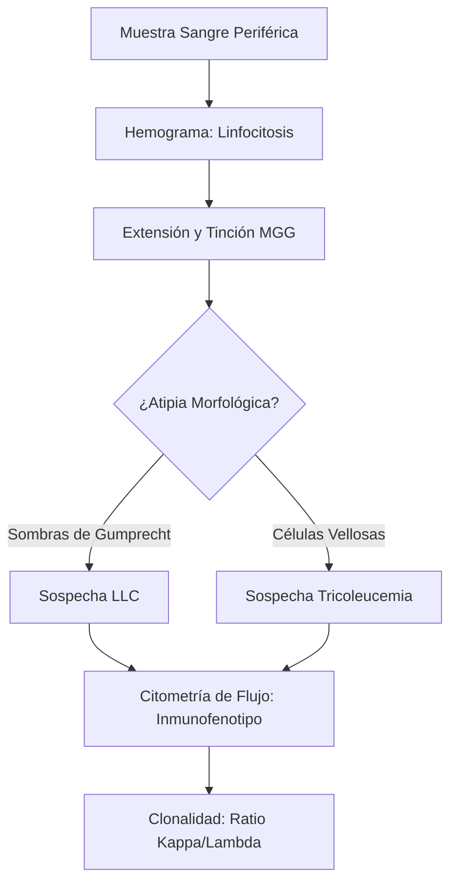
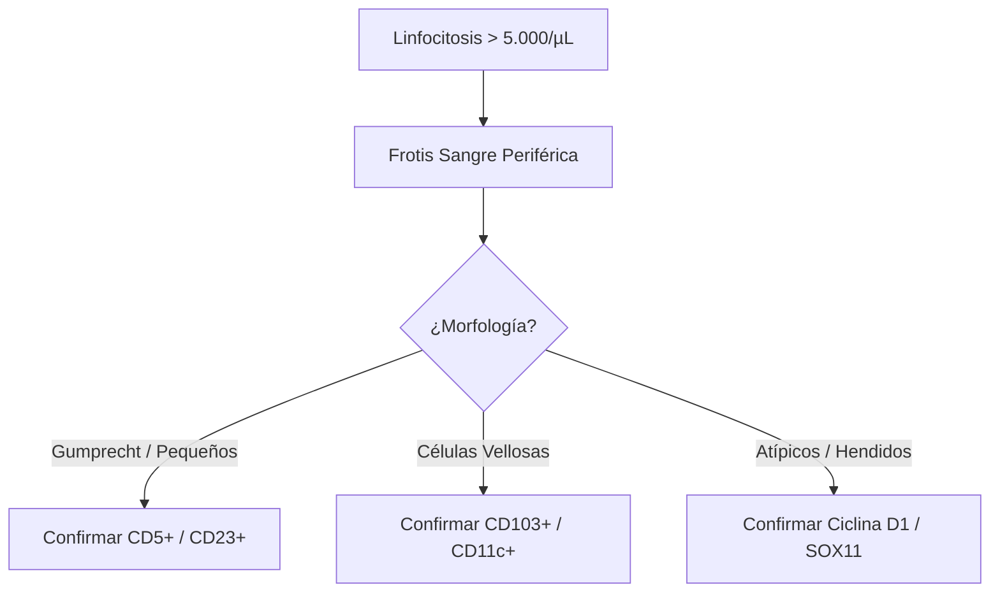
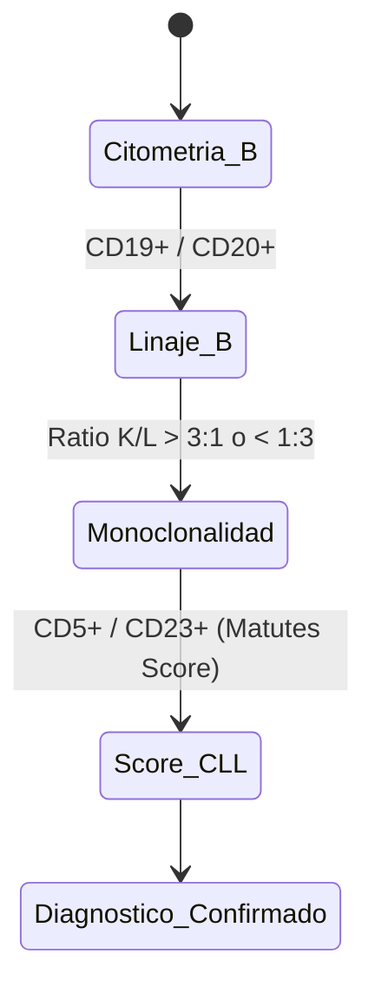

# Semana 3: Hematología y Autoinmunidad
## Lección 1: Neoplasias Linfoides con Expresión en Sangre Periférica

### 1. Título y Resumen (Abstract)
**Título:** Optimización del Algoritmo Diagnóstico en Hemopatías Malignas Crónicas: Integración de la Morfología Digital y la Citometría de Flujo Multiparamétrica.
**Resumen:** Este artículo profundiza en la caracterización de las neoplasias linfoides crónicas que presentan leucemización. Se fundamenta el proceso de diferenciación linfoide normal frente al patológico y se evalúa la eficacia de la revisión del frotis de sangre periférica frente a la confirmación fenotípica. Se destaca el papel del TSLCB en la identificación de atipias citomorfológicas (Sombras de Gumprecht, prolinfocitos) como disparadores de pruebas diagnósticas avanzadas.

### 2. Introducción (Fundamentos y Objetivos)
#### 2.1. Hematopoyesis y Fisiología de la Serie Blanca (Módulo 1374)
El currículo oficial de **Técnicas de Análisis Hematológico** establece el estudio de la hematopoyesis. Los linfocitos se originan a partir de la célula madre pluripotencial en la médula ósea.
1.  **Linaje B:** Maduran en médula ósea y ganglios periféricos. Expresan inmunoglobulinas de superficie.
2.  **Linaje T:** Maduración tímica y adquisición de TCR.
3.  **Procesos Neoplásicos (Módulo 1370):** Resultan de la proliferación clonal descontrolada de una célula en cualquier estadio de maduración, adquiriendo capacidades invasivas de sangre periférica (leucemización).

#### 2.2. Técnicas de Estudio Hematológico y Morfología (Módulo 1374)
- **Tinciones Hematológicas:** El TSLCB debe dominar el uso de colorantes tipo Romanowsky (Giemsa, May-Grünwald) para la diferenciación tintorial de cromatina y citoplasma.
- **Morfología de Neoplasias:** Identificación de **prolinfocitos**, linfocitos de LLC (pequeños con cromatina en "tablero de ajedrez") y **Sombras de Gumprecht** (restos celulares por fragilidad mecánica).
- **Equipos Automáticos:** Manejo de histogramas y citogramas (Módulo 1374), interpretando alarmas de "Blasts" o "Lymph Variant".

#### 2.3. Inmunofenotipo por Citometría de Flujo (Módulo 1372)
- **Principio:** Basado en la dispersión de luz (Forward Scatter para tamaño y Side Scatter para complejidad interna) y fluorescencia.
- **Marcadores de Linaje:** Localización de CD19, CD20 (Serie B), CD3, CD4, CD8 (Serie T).
- **Monoconalidad:** Demostración de la restricción de cadenas ligeras Kappa o Lambda.

**Objetivo:** Establecer el flujo de validación técnica conforme a la Clasificación de la OMS (5ª Edición, 2022-2024), asegurando la identificación morfológica precisa antes de la derivación a inmunofenotipo.

### 3. Material y Métodos
- **Diseño:** Análisis descriptivo retrospectivo de muestras onco-hematológicas.
- **Entorno:** Servicio de Hematología, Laboratorio de Morfología y Citometría, H.U. de Getafe.
- **Intervenciones:**
    - **Analizadores Automatizados:** Sistemas de recuento mediante impedancia y citoquímica de flujo.
    - **Tinción:** May-Grünwald Giemsa (MGG) para detalle de cromatina.
    - **Citometría:** Equipo de 10 colores con marcado para CD19, CD20, CD5, CD23, CD10, CD103, y Cadenas Ligeras Kappa/Lambda.

### 4. Resultados (Hallazgos Experimentales)
Algoritmo de clasificación morfo-fenotípica:

### 5. Discusión y Conclusiones
La pericia en la fase microscópica inicial por parte del TSLCB es irremplazable, incluso con el auge de la IA. La identificación manual de prolinfocitos (> 55% sugiere leucemia prolinfocítica B) tiene implicaciones pronósticas críticas. Se concluye que el informe del laboratorio debe ser integrado ("Integrated Report") uniendo morfología, fenotipo y, en casos de LCM, citogenética molecular (FISH).

### 6. Agradecimientos
A la unidad de Hematopatología por la supervisión de las galerías de imágenes digitales y casos de leucemización de linfomas.

### 7. Bibliografía (Literatura Citada)
- **The 5th edition of the World Health Organization Classification of Haematolymphoid Tumours: Lymphoid Neoplasms.** [Ver en leukemia-lymphoma.org](https://leukemia-lymphoma.org/index.php/LL/article/view/1)
- **Guía Nacional de Tratamiento de la Leucemia Linfática Crónica - SEHH.** [Ver en sehh.es](https://www.sehh.es/index.php?option=com_content&view=article&id=1000)
- **Atlas de Hematología Digital - ASH.** [Ver en ashimagebank.org](https://imagebank.hematology.org/)
- **Manual de Procedimientos en Hematología y Hemoterapia.** [Ver en elsevier.es](https://www.elsevier.es/es-libros-vives-aguilar-manual-tecnicas-laboratorio- hematologia-9788445821213)

---
### 8. Charla y Transcripción (Contenido Multimedia)

**Enlace al vídeo:** [Ver en YouTube](https://www.youtube.com/watch?v=MWBDMRP7fcI)

#### Transcripción de la Sesión
> Hola, bienvenidas y bienvenidos una semana más a este curso de actualización en el laboratorio clínico. Soy Belén Álvarez Núñez, residente de hematología y hemoterapia en el Hospital Universitario de Getafe, y durante este rato vamos a hablar de las neoplasias linfoides con expresión en sangre periférica. He decidido hacer esta pequeña guía, no dogma, para sobrevivir a esos linfocitos que muchas veces nos encontramos con una morfología en sangre periférica y no sabemos cómo abordar. Según la última clasificación de la Organización Mundial de la Salud de 2022, disponemos de más de 100 entidades diferentes. De hecho, os muestro aquí todas las que tenemos en nuestro libro. Pero realmente lo que nos interesa a nosotros es si podemos visualizar todos estos tumores en sangre periférica, e incluso distinguirlos morfológicamente entre sí. Como tampoco vamos a rompernos la cabeza con las preguntas anteriores, he decidido ser práctica y contaros, en esta presentación, las entidades con expresión en sangre periférica más frecuentes y con la morfología más característica.
>
> Por un lado, tenemos las neoplasias B, que incluyo: leucemia linfática crónica, linfomas esplénicos, linfoma del manto, linfoma folicular, linfoma de Burkitt, linfoma linfoplasmocítico y mieloma múltiple. Luego tenemos las neoplasias T y un síndrome bastante particular, el síndrome de Sézary. Y, por último, un apartado sobre linfocitosis policlonales B persistentes y pacientes esplenectomizados.
>
> Los linfocitos se originan a partir de un precursor linfoide en la médula ósea y se diferenciarán en linfocito B o linfocito T. En caso de diferenciación a T, migrarán al timo. Los linfocitos B permanecerán en la médula ósea hasta completar una fase más madura y migrar a ganglios y bazo. En ese paso previo puede producirse un escape clonal que origina la leucemia linfática crónica.
>
> La **leucemia linfática crónica (LLC)** es la neoplasia B más frecuente en nuestro medio. Requiere más de 5.000 linfocitos clonales en sangre periférica mantenidos al menos 3 meses, o una citopenia causada por un infiltrado típico en médula ósea. Las células son pequeñas, con alta relación nucleocitoplasma, cromatina condensada en "caparazón de tortuga" y son frágiles: al hacer el frotis forman las **manchas de Gumprecht**. Si se observa más de un 15 % de prolinfocitos o centrocitos, se considera LLC variante atípica, asociada a mayor frecuencia de alteraciones citogenéticas adversas.
>
> Los **linfomas esplénicos** incluyen la tricoleucemia, con células de mediano a gran tamaño, citoplasma grisáceo y prolongaciones filiformes características. El linfoma B esplénico (antes tricoleucemia variante) presenta nucleólo prominente y peor pronóstico. El **linfoma marginal esplénico** muestra linfocitos vellosos con prolongaciones polares irregulares.
>
> El **linfoma del manto** es una neoplasia agresiva que leucemiza en hasta un 35 % de los casos. Sus células son grandes, de contorno irregular, con cromatina poco condensada que recuerda a blastos. La palabra que lo define es pleomorfismo.
>
> El **linfoma folicular** presenta morfología de grano de café o núcleo hendido (centrocitos), con comportamiento indolente y buen pronóstico. El **linfoma de Burkitt** produce células grandes, con citoplasma intensamente basófilo y numerosas vacuolas periféricas; leucemiza solo en un 10 % de los casos.
>
> La **leucemia de células plasmáticas** implica más de un 5 % de plasmáticas circulantes, con mediana de supervivencia inferior a 6 meses. Las células tienen núcleo lateralizado, citoplasma basófilo con arcoplasma y los hematíes forman rouleaux. El **linfoma linfoplasmocítico** (macroglobulinemia de Waldenström) produce células parecidas con cuerpos de Russell o cuerpos de Dutcher.
>
> Las **neoplasias linfoides T** leucemizan con menos frecuencia. Sus células suelen ser pequeñas, con contorno nuclear irregular. El virus HTLV-1 puede producir morfología en trébol. La **leucemia de linfocitos grandes granulares** requiere identificar clonalidad cuando supera el 20 % de linfocitos grandes granulares. El **síndrome de Sézary** exige por definición expresión en sangre periférica; las células presentan núcleo cerebriforme (aspecto de nuez o de surcos), muy sutil y de difícil identificación.
>
> Por último, la **linfocitosis B policlonal persistente** es un trastorno benigno con linfocitos B binucleados e IgM elevada, típico en fumadoras. En los **pacientes esplenectomizados** es normal encontrar cuerpos de Howell-Jolly en los hematíes y trombocitosis.
>
> Muchísimas gracias por llegar hasta aquí. Espero que sirva para vuestra práctica en el laboratorio. Toda la información la he obtenido del libro de Wesner, que es un libro que usamos mucho los hematólogos para el diagnóstico citológico.

#### Explicación de la Ponencia
La sesión ofrece una guía morfológica práctica para identificar las neoplasias linfoides más frecuentes en el frotis de sangre periférica:
1. **Manchas de Gumprecht (LLC):** Son el hallazgo morfológico más característico de la LLC y el primero que debe reconocer el TSLCB ante una linfocitosis; su presencia obliga a solicitar citometría de flujo.
2. **Células vellosas vs. células con nucleólo:** Distinguir las prolongaciones polares del linfoma marginal esplénico de los filamentos uniformes de la tricoleucemia orienta al diagnóstico antes de la inmunofenotipificación.
3. **Pleomorfismo del linfoma del manto:** La variabilidad extrema de sus células (desde aspecto blástico hasta aspecto en trébol) lo convierte en el "gran imitador" de las leucemias agudas; su reconocimiento precoz tiene implicaciones pronósticas urgentes.
4. **Síndrome de Sézary:** La sutil morfología cerebriforme exige conocer el motivo de consulta (eritrodermia y prurito) para no pasar por alto este linfoma cutáneo de alto riesgo.

---
### Sobre la Ponente
**Belén Álvarez Núñez** es Residente de 2º año (R2) de Hematología y Hemoterapia en el **Hospital Universitario de Getafe**.

*Contenido científico ampliado alineado con el currículo oficial TSLCB.*
