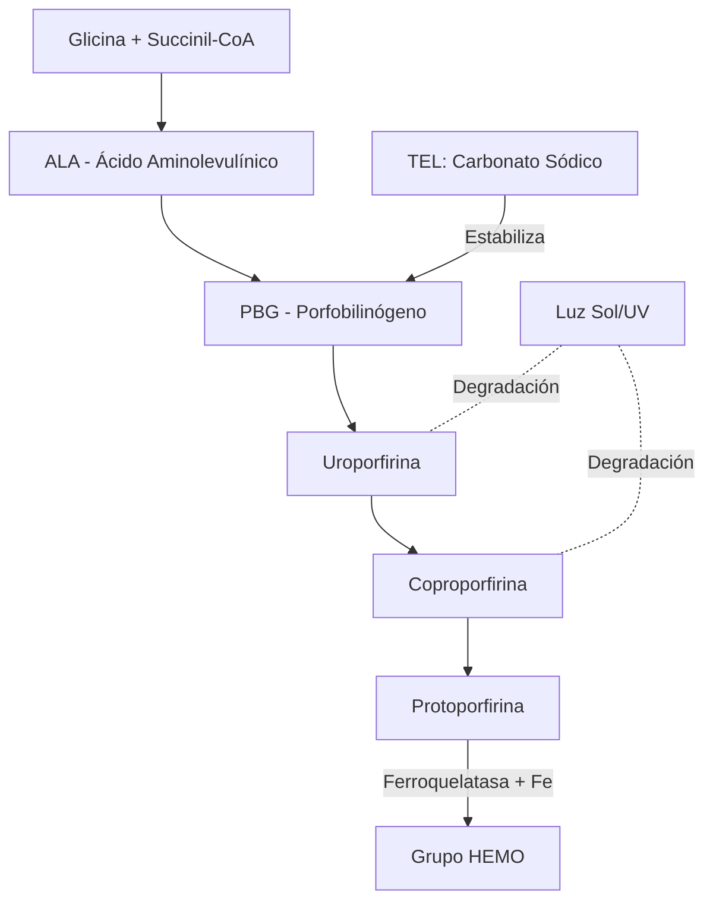
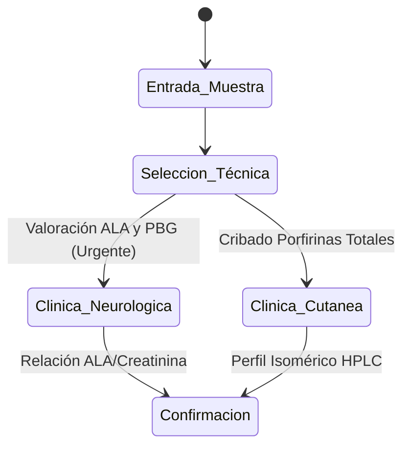
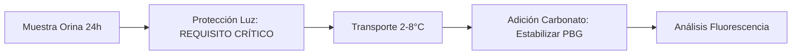

# Semana 3: Hematología y Autoinmunidad
## Lección 2: Determinación de Porfirinas Totales en Orina

### 1. Título y Resumen (Abstract)
**Título:** Optimización de la Fase Preanalítica en la Cuantificación de Porfirinas Urinarias: Evaluación de la Estabilidad Lumínica y Protocolización del Ajuste de pH.
**Resumen:** Este artículo analiza la ruta biosintética del grupo Hemo y los errores innatos del metabolismo que conducen a las porfirias. Se evalúa cómo las condiciones de recogida (protección de la luz, temperatura y agentes conservantes) determinan la integridad analítica de los precursores (ALA, PBG) y las porfirinas fraccionadas. Se concluye con un algoritmo de validación técnica que minimiza los falsos negativos en el diagnóstico de crisis agudas y manifestaciones cutáneas.

### 2. Introducción (Fundamentos y Objetivos)
#### 2.1. Metabolismo del Grupo Hemo y Porfirinas (Módulo 1370/1371)
El currículo de **Análisis Bioquímico** (Módulo 1371) establece el estudio de la biosíntesis del grupo Hemo. El Hemo es una metaloporfirina compuesta por Protoporfirina IX y un átomo de hierro ($Fe^{2+}$).
- **Ruta Metabólica:** Comienza en la mitocondria con la condensación de succinil-CoA y glicina (enzima ALA-sintetasa).
- **Precursores:** Ácido delta-aminolevulínico (ALA) y Porfobilinógeno (PBG).
- **Estructura Química (Módulo 1368):** Las porfirinas son compuestos cíclicos formados por cuatro anillos pirrólicos unidos por puentes metino, lo que les confiere **fluorescencia** característica bajo luz UV.

#### 2.2. Porfirias y Fisiopatología de los Errores Metabólicos (Módulo 1370)
El TSLCB debe identificar los procesos patológicos derivados de bloqueos enzimáticos:
1.  **Porfirias Agudas:** Acúmulo de precursores (ALA, PBG). Toxicidad neuroquímica.
2.  **Porfirias Cutáneas:** Acúmulo de porfirinas fraccionadas (Uro, Copro, Proto). Fotosensibilidad por reacción con la luz en la banda de Soret (~400 nm).

#### 2.3. Gestión de Muestras Fotosensibles y Técnicas (Módulo 1367/1371)
La fase preanalítica es el contenido prioritario para el TSLCB:
- **Protección Lumínica (Módulo 1367):** El espécimen (orina de 24h) debe protegerse de la luz UV para evitar la degradación irreversible de las porfirinas.
- **pH y Estabilidad:** El PBG es inestable a pH ácido; el TSLCB debe instruir sobre el uso de conservantes químicos (Carbonato Sódico) para mantener el pH entre 8 y 9.
- **Técnicas Oficiales:** Cromatografía Líquida de Alta Resolución (HPLC) y espectrometría.

**Objetivo:** Sistematizar los requisitos preanalíticos y la selección de técnicas de confirmación (HPLC vs Espectroscopia) según la normativa de la Comunidad de Madrid.

### 3. Material y Métodos
- **Entorno:** Laboratorio de Química Clínica y Metabolopatías, Hospital Universitario de Getafe.
- **Intervenciones:**
    - **Cribado:** Reacción de Hoesch para PBG (especificidad rápida).
    - **Cuantificación:** Método de separación por HPLC (Cromatografía Líquida de Alta Resolución) con detector de fluorescencia.
    - **Protocolo Preanalítico:** Uso de contenedores opacos (ámbar) o recubiertos con papel de aluminio. Ajuste de pH con Carbonato Sódico (5g/L).

### 4. Resultados (Hallazgos Experimentales)
Diferenciación analítica por tipo de síntoma:

### 5. Discusión y Conclusiones
La integridad del espécimen de orina de 24h es el factor limitante. Una exposición accidental a la luz del sol de solo 30 minutos puede degradar el 40% del contenido de uroporfirinas. Se concluye que el TSLCB debe informar cualquier signo de oscurecimiento de la orina al contacto con el aire ("orina color vino"), sugestivo de Porfiria Aguda Intermitente. El uso de HPLC permite resolver diagnósticos diferenciales complejos entre Porfiria Cutánea Tardía y Coproporfiria Hereditaria.

### 6. Agradecimientos
Al personal de Recogida de Muestras del Área Sanitaria 10 por la implementación del kit de transporte fotosensible.

### 7. Bibliografía (Literatura Citada)
- **EPNET: European Porphyria Network - Best Practice Guidelines.** [Ver en porphyrianet.org](https://porphyrianet.org/en/professionals/guidelines)
- **Diagnóstico de las Porfirias - SEQCML.** [Ver en seqc.es](https://www.seqc.es/es/bioquimica-en-el-laboratorio-clinico/manuales-y-monografias/)
- **Porphyrias and the Clinical Laboratory - AACC/ADLM.** [Ver en adlm.org](https://www.adlm.org/clinical-chemistry/porphyria)
- **Manual de Toma de Muestras Críticas y Estabilidad Analítica.** [Ver en comunidad.madrid](https://www.comunidad.madrid/servicios/salud/)

---
### 8. Charla y Transcripción (Contenido Multimedia)

**Enlace al vídeo:** [Ver en YouTube](https://www.youtube.com/watch?v=WBpkUE7z91M)

#### Transcripción de la Sesión
> Hola a todos. Soy Alejandra Calderón, residente de tercer año de bioquímica clínica del Hospital Universitario de Getafe. En esta séptima edición del curso de actualización en el laboratorio clínico, les hablaré sobre la determinación de porfirinas totales en orina. Para ello vamos a seguir el siguiente contenido: fundamentos de las porfirinas con los conceptos básicos y su relevancia clínica; metabolismo del grupo hemo, tanto la vía biosintética como su regulación; la clasificación de las porfirias, las crisis agudas de porfiria, las manifestaciones clínicas y fisiopatología, el diagnóstico de laboratorio, estrategias analíticas, métodos cualitativos y cuantitativos y la interpretación con casos clínicos.
>
> Las porfirias son un grupo de trastornos raros de carácter hereditario causados por el déficit de alguna de las enzimas implicadas en la síntesis del grupo hemo. El grupo hemo es un componente prostético de proteínas como la hemoglobina, la mioglobina, los citocromos y diversas enzimas. Sus funciones principales son el transporte y almacenamiento de oxígeno, así como su papel en la movilización de electrones y como catalizadores de reacciones redox. La incidencia varía de 0,5 a 10 por cada 100.000 habitantes, con un 10 % de mortalidad si no se instaura tratamiento temprano, y entre el 80 y el 90 % son portadores que nunca presentarán clínica.
>
> La biosíntesis del grupo hemo se efectúa principalmente en la médula ósea y en el hígado. Se lleva a cabo mediante una ruta anabólica secuencial a partir de glicina y succinil-CoA. La enzima ALA sintetasa produce el ácido δ-aminolevulínico. Un déficit de porfobilinógeno deaminasa produce la porfiria aguda intermitente. El déficit de uroporfirinógeno descarboxilasa produce la porfiria cutánea tarda. El déficit de ferroquelatasa produce la protoporfiria eritropoyética y la intoxicación por plomo la inhibiría. El paso limitante es la expresión del gen ALAS1, regulada por los niveles de glucosa a través del PGC-1α.
>
> Las porfirias se clasifican según la localización fisiológica (hepáticas y eritropoyéticas) o según las manifestaciones clínicas: **agudas** (crisis neuroviscerales con dolor abdominal, náuseas, neuropatías, alucinaciones, taquicardia e hiponatremia) y **cutáneas** (fotosensibilidad con ampollas, cicatrices e hipertricosis). Los factores desencadenantes de las crisis agudas son aquellos que inducen el gen ALAS1: barbitúricos, carbamazepina, ayuno, alcohol, tabaquismo y hormonas menstruales.
>
> El **algoritmo diagnóstico** parte de la sospecha clínica: dolor abdominal sin causa y orina roja (descartando hematuria). Se realiza primero un cribado cualitativo con el **test de Hoesch** (reacción con reactivo de Ehrlich: resultado positivo en rosa, rojo o violeta), seguido de cuantificación y tipificación por HPLC. Las muestras de orina deben protegerse de la luz desde su recogida; la concentración de porfobilinógeno puede disminuir un 20 % en 24 horas a temperatura ambiente y un 50 % si está expuesta a la luz. La estabilidad a 4 °C y protegida de la luz es de 48 horas; congelada, al menos un mes.
>
> Para la cuantificación semicuantitativa de porfirinas totales se utiliza espectrofotometría UV-Visible: las porfirinas presentan un pico de absorbancia entre 400 y 410 nm (banda de Soret). Los resultados deben informarse como porfirinas totales por creatinina; rango de referencia 20–230 nmol/mmol creatinina. El **HPLC** es el método de referencia para cuantificación fraccionada y tipificación de cada porfiria, con perfiles cromatográficos característicos.
>
> Caso clínico: varón de 50 años con episodios repetidos de dolor abdominal inexplicable, anemia normocítica y, finalmente, alucinaciones e irritabilidad. El test de Hoesch resultó negativo (descartando porfiria aguda intermitente), pero las porfirinas totales en orina estaban elevadas a 1.180 nmol/L. La HPLC mostró protoporfirinas de 135 nmol/L (elevadas) con coproporfirinas normales. El diagnóstico diferencial llevó a solicitar plomo en sangre: 160 µg/dL (referencia < 4,5 µg/dL). Diagnóstico: **intoxicación crónica por plomo de origen laboral**. Tratamiento con dimercaprol y edetato cálcico disódico con mejoría posterior.
>
> Conclusiones: sospecha clínica temprana ante dolor abdominal inexplicable o síntomas neuropsiquiátricos; el test de Hoesch debe estar disponible en todos los laboratorios de urgencia; la protección de la muestra de la luz es crítica; el HPLC es el método de referencia; y la secuenciación masiva permite el diagnóstico definitivo y el consejo genético familiar.

#### Explicación de la Ponencia
La sesión aborda las porfirias desde la perspectiva del laboratorio clínico, con especial énfasis en los aspectos técnicos que compete gestionar al TSLCB:
1. **Fase preanalítica crítica:** La photosensibilidad de las porfirinas hace que la recogida en recipiente opaco y la protección de la muestra durante el transporte sean pasos ineludibles. Un error aquí invalida todo el proceso analítico y puede llevar a un falso negativo con consecuencias letales.
2. **Test de Hoesch en urgencias:** La ponente subraya como recomendación de las guías clínicas que este reactivo esté disponible en todos los laboratorios de urgencia, ya que permite descartar rápidamente una crisis aguda con un resultado negativo de alta fiabilidad.
3. **La banda de Soret como herramienta de cribado:** La detección espectrofotométrica a 400–410 nm ofrece una alternativa semicuantitativa accesible cuando el HPLC no está disponible de forma inmediata.
4. **Diagnóstico diferencial con intoxicación por plomo:** El patrón de protoporfirina elevada con coproporfirinas normales no es diagnóstico solo de protoporfiria eritropoyética; la cuantificación de plomo en sangre es imprescindible para cerrar el diagnóstico diferencial.

---
### Sobre la Ponente
**Alejandra Mariana Calderón** es Residente de 3er año (R3) de Bioquímica Clínica en el **Hospital Universitario de Getafe**.

*Contenido científico actualizado conforme a los objetivos docentes TEL/TSLCB.*
