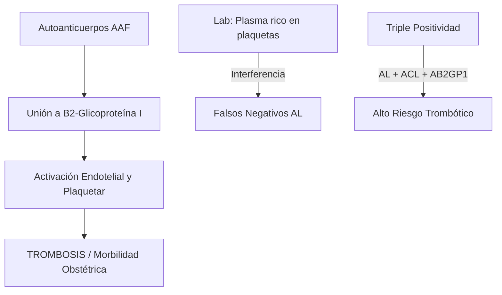
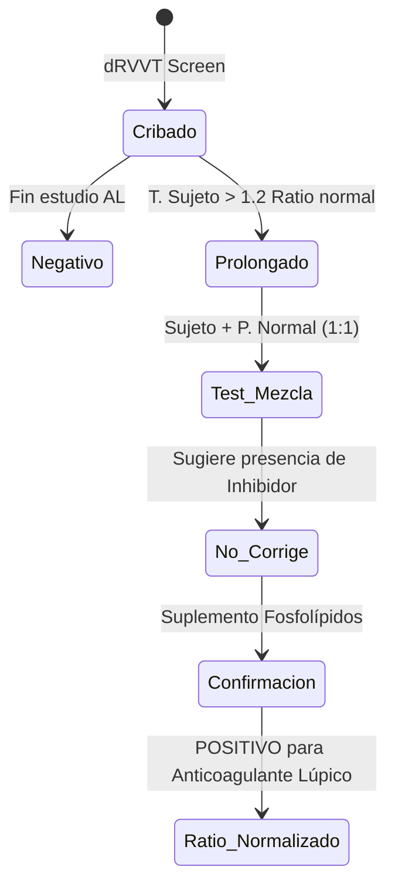
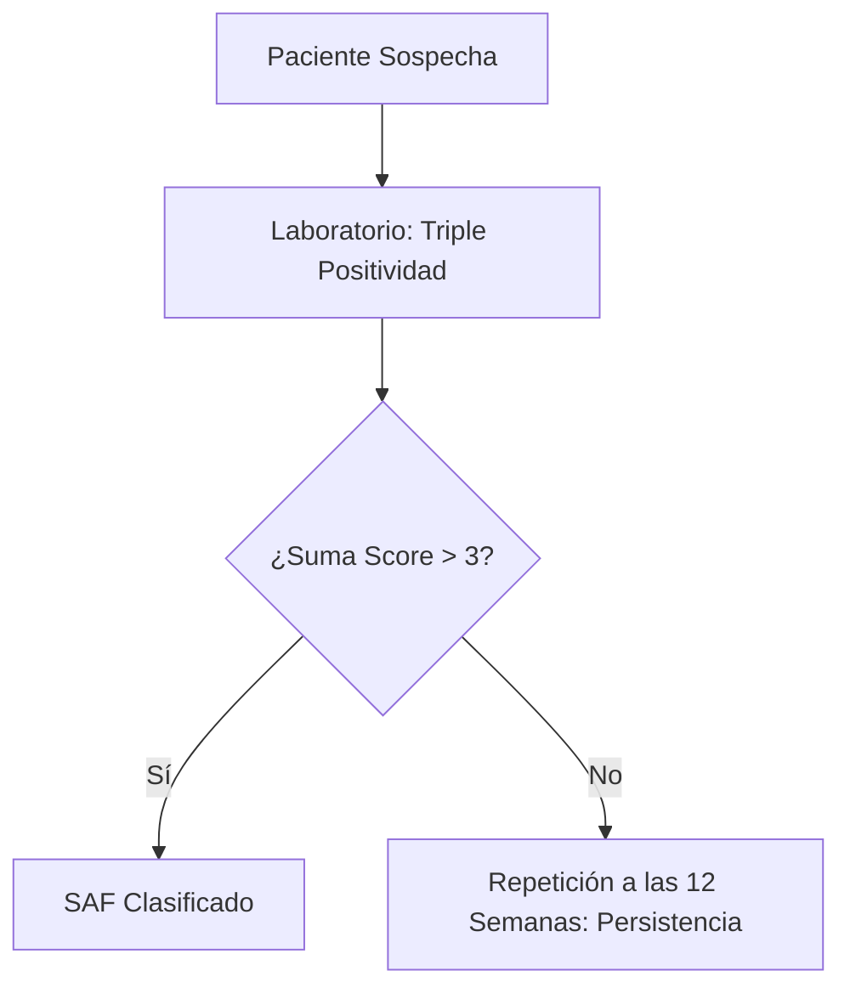

# Semana 3: Hematología y Autoinmunidad
## Lección 3: Síndrome Antifosfolípido (SAF): Criterios de Clasificación y Diagnóstico Biológico

### 1. Título y Resumen (Abstract)
**Título:** Aplicación de los Criterios ACR/EULAR 2023 en el Abordaje Multidisciplinar del SAF: Calidad Preanalítica en el Estudio de la Coagulación y el Inmunoensayo.
**Resumen:** Este artículo analiza la fisiopatología del estado protrombótico inmunomediado y profundiza en la paradoja del anticoagulante lúpico (AL). Se evalúan los requisitos de la fase preanalítica (obtención de plasma pobre en plaquetas) y se comparan las metodologías de coagulación funcionales con las detecciones antigénicas por ELISA, estableciendo un sistema de puntuación para la clasificación diagnóstica definitiva. Se destaca el papel del TSLCB en la gestión del tiempo y la temperatura de las muestras citratadas.

### 2. Introducción (Fundamentos y Objetivos)
#### 2.1. Fisiopatología de la Hemostasia e Inmunidad (Módulo 1374/1370)
El currículo de **Técnicas de Análisis Hematológico** (Módulo 1374) establece el estudio de la coagulación. El Síndrome Antifosfolípido (SAF) es una enfermedad sistémica autoinmune caracterizada por un estado de hipercoagulabilidad mediado por autoanticuerpos.
- **Mecanismo:** Los anticuerpos antifosfolípido (AAF) se dirigen contra proteínas plasmáticas con afinidad por fosfolípidos aniónicos, principalmente la **Beta-2-Glicoproteína I** ($\beta2GPI$).
- **Consecuencia (Módulo 1370):** La unión de estos complejos a células endoteliales y plaquetas induce la expresión de factor tisular y la activación de la cascada de la coagulación, provocando trombosis recurrentes.

#### 2.2. Anticoagulante Lúpico y Paradoja Analítica (Módulo 1374/1371)
El Anticoagulante Lúpico (AL) es un hallazgo de laboratorio crítico para el TSLCB:
- **Efecto In Vitro:** Prolonga los tiempos de coagulación dependientes de fosfolípidos (APTT, dRVVT) al competir por los sitios de unión del reactivo.
- **Efecto In Vivo:** Es un potente factor protrombótico.

#### 2.3. Fase Preanalítica y Técnicas de Inmunoanálisis (Módulo 1367/1372)
- **Gestión de la Muestra (Módulo 1367):** Obtención de **Plasma Pobre en Plaquetas (PPP)** mediante doble centrifugación. Las plaquetas residuales liberan fosfolípidos que neutralizan el AL, causando falsos negativos.
- **Inmunodiagnóstico (Módulo 1372):** Detección de anticuerpos Anticardiolipina (ACL) y Anti-$\beta2GPI$ mediante técnicas ELISA o quimioluminiscencia.

**Objetivo:** Adaptar los flujos de validación del laboratorio de Hemostasia y Autoinmunidad a los requisitos de puntuación 2023.

### 3. Material y Métodos
- **Diseño:** Estudio técnico-comparativo de metodologías funcionales y de inmunoensayo.
- **Entorno:** Laboratorio de Hemostasia y Coagulación, H.U. de Fuenlabrada.
- **Intervenciones:** 
    - **Fase Preanalítica:** Doble centrifugación (2.500g / 15 min x 2) para obtener **Plasma Pobre en Plaquetas (PPP)** < 10.000 plaquetas/µL.
    - **Metodología AL:** Tiempo de veneno de víbora de Russell diluido (dRVVT) y APTT-sensible al AL.
    - **Detección ELISA:** Inmunoensayo enzimático para anticuerpos dirigidos contra Cardiolipina y β2-Glicoproteína 1 (IgG/IgM).

### 4. Resultados (Hallazgos Experimentales)
Workflow de cribado y confirmación técnica para el AL:

### 5. Discusión y Conclusiones
La pericia en la obtención del PPP es fundamental. La presencia de plaquetas intactas por mala centrifugación libera fosfolípidos de membrana durante la congelación, que neutralizan el AL dando falsos negativos catastróficos. Se concluye que el TSLCB debe asegurar que la muestra citratada no permanezca más de 4 horas a temperatura ambiente antes de su procesado. Solo la persistencia analítica (≥ 12 semanas) otorga valor diagnóstico al hallazgo.

### 6. Agradecimientos
Al equipo de Hematología del HUF por la provisión de casos de SAF obstétrico para la validación de los puntos de corte de la β2GP1.

### 7. Bibliografía (Literatura Citada)
- **2023 ACR/EULAR Classification Criteria for Antiphospholipid Syndrome.** [Ver en rheumatology.org](https://www.rheumatology.org/quality-care/clinical-practice-guidelines/antiphospholipid-syndrome)
- **ISTH Guidelines for Lupus Anticoagulant Testing and Interpretation.** [Ver en isth.org](https://www.isth.org/page/Guidance_and_Guidelines)
- **Diagnóstico del Síndrome Antifosfolípido - SEQCML.** [Ver en seqc.es](https://www.seqc.es/es/bioquimica-en-el-laboratorio-clinico/manuales-y-monografias/)
- **Protocolo de Estudio de la Trombofilia - SEHH.** [Ver en sehh.es](https://www.sehh.es/index.php?option=com_content&view=article&id=1000)

---
### 8. Charla y Transcripción (Contenido Multimedia)

**Enlace al vídeo:** [Ver en YouTube](https://www.youtube.com/watch?v=RwAE01aUAhM)

#### Transcripción de la Sesión
> Buenos días. Mi nombre es Verónica Benito Zamorano. Soy facultativa especialista en laboratorio clínico en el Hospital Universitario de Fuenlabrada y os voy a hablar del síndrome antifosfolípido y los criterios de clasificación.
>
> El síndrome antifosfolípido es una enfermedad autoinmune que se caracteriza por la aparición de eventos trombóticos (arteriales, venosos o microvasculares), morbilidad en el embarazo y manifestaciones no trombóticas, todo ello en personas con presencia de anticuerpos antifosfolípido en sangre. Los anticuerpos antifosfolípido se dirigen contra fosfolípidos de membrana, proteínas que se unen a ellos, o la propia unión proteína-fosfolípido. Los tres que forman parte de los criterios internacionales son: **anticuerpos anticardiolipina**, **anticuerpos anti-beta 2 glicoproteína 1** y el **anticoagulante lúpico**.
>
> Los **anticuerpos anticardiolipina** se dirigen contra la cardiolipina, fosfolípido de la membrana mitocondrial interna. Pueden producirse de forma transitoria en respuesta a infecciones (hepatitis, CMV, sífilis), medicamentos, neoplasias o edad avanzada, siempre con títulos bajos e isotipo IgM predominante, sin asociación con trombosis. Los de isotipo IgG se asocian fuertemente con eventos trombóticos.
>
> Los **anticuerpos anti-beta 2 glicoproteína 1** se dirigen contra el dominio uno de esta proteína. La proteína normalmente circula en conformación cerrada y ciertos desencadenantes (infección, inflamación, embarazo) exponen epítopos habitualmente ocultos, induciendo la unión de los anticuerpos. Los isotipos IgG tienen mayor peso clínico que los IgM.
>
> Para su detección existen diferentes inmunoensayos en fase sólida: ELISA, quimioluminiscencia (CLIA) y fluoroinmunoensayo. La guía ACR-EULAR 2023 puntúa de forma diferenciada los títulos moderados y altos, y esta diferenciación solo está validada para ELISA. Se recomienda no mezclar resultados de diferentes técnicas y usar el percentil 99 de una población de referencia sana como punto de corte al emplear otros métodos.
>
> El **anticoagulante lúpico (AL)** no es un anticuerpo único, sino un grupo heterogéneo de anticuerpos que prolongan in vitro las pruebas de coagulación dependientes de fosfolípidos (APTT y dRVVT). Su análisis se realiza en tres pasos según las guías actualizadas de la ISTH (2024): **cribado** (con reactivo de baja concentración de fosfolípidos, expresando resultados en ratio), **estudio de mezclas** (1:1 con plasma normal: la no corrección sugiere inhibidor) y **prueba de confirmación** (con alta concentración de fosfolípidos: la normalización del tiempo confirma el AL). El AL es positivo si al menos uno de los dos sistemas resulta positivo tras los tres pasos. Para obtener un resultado válido se requiere **Plasma Pobre en Plaquetas (PPP)** mediante doble centrifugación; las plaquetas residuales liberan fosfolípidos que neutralizan el AL, causando falsos negativos.
>
> Si alguno de los tres anticuerpos es positivo, hay que repetir la determinación a las **12 semanas** para descartar positividad transitoria. En pacientes con anticoagulantes orales de acción directa, suspender al menos 48 horas antes; con antagonistas de vitamina K, suspender hasta INR < 1,5.
>
> Los **criterios ACR-EULAR 2023** se caracterizan por mayor especificidad (99 %), ponderan el riesgo (no todos los síntomas ni resultados valen igual) e incluyen manifestaciones no trombóticas (valvulopatía cardíaca, trombocitopenia). Para clasificar un paciente como SAF se necesitan: criterio de entrada (al menos un criterio clínico documentado + anticuerpo antifosfolípido positivo en los 3 años anteriores) + ≥ 3 puntos de dominios clínicos + ≥ 3 puntos de dominios de laboratorio. Los perfiles de alto riesgo son: AL persistentemente positivo, triple positividad (los tres anticuerpos), o doble positividad.
>
> El tratamiento del SAF trombótico utiliza heparina de bajo peso molecular en fase aguda, seguida de anticoagulación de por vida con antagonistas de vitamina K. Los anticoagulantes orales de acción directa no se recomiendan de forma general por mayor riesgo de recurrencia. El SAF obstétrico se trata con ácido acetilsalicílico y heparinas de bajo peso molecular.
>
> Mensajes para llevar a casa: los criterios 2023 son de clasificación, no diagnósticos; el diagnóstico se basa en la clínica y exploraciones complementarias; no cumplir los criterios no debe demorar el tratamiento, especialmente en el SAF obstétrico.

#### Explicación de la Ponencia
La sesión hace especial hincapié en los aspectos técnicos y preanalíticos que el TSLCB debe controlar para garantizar resultados válidos:
1. **Doble centrifugación para el PPP:** Es el punto crítico más enfatizado. Un plasma con plaquetas residuales (> 10.000/µL) falsea negativamente el anticoagulante lúpico, con el consiguiente infra-diagnóstico de un estado trombótico de alto riesgo.
2. **No mezclar técnicas analíticas:** La puntuación ACR-EULAR 2023 solo está validada para ELISA; informar resultados de CLIA con los umbrales de ELISA es un error que puede modificar la clasificación del paciente.
3. **Ventana de 12 semanas:** La repetición es obligatoria, no opcional. Un positivo transitorio (por infección, fármaco o edad) clasificado erróneamente como SAF puede conllevar anticoagulación innecesaria y de por vida.
4. **Interferencia de anticoagulantes:** El TSLCB debe verificar que el paciente ha suspendido la medicación según el protocolo antes de procesar la muestra para AL, dado que la heparina y los ACOD alargan los tiempos de coagulación interfiriendo directamente en el cribado y la confirmación.

---
### Sobre la Ponente
**Verónica Benito Zamorano** es Facultativa Especialista de Área (FEA) de Bioquímica Clínica en el **Hospital Universitario de Fuenlabrada**.

*Material técnico ampliado según las competencias del título de Técnico Superior.*
