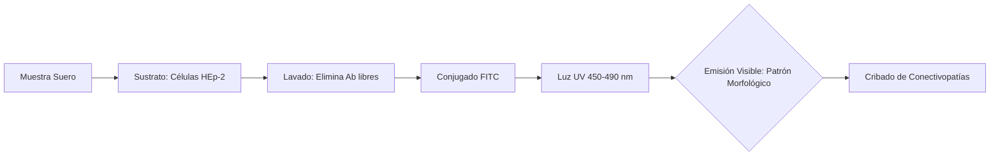
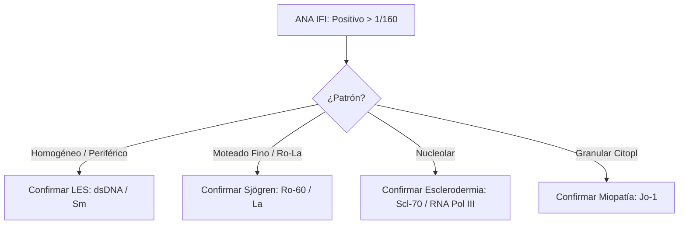

# Semana 3: Hematología y Autoinmunidad
## Lección 4: Las Enfermedades Autoinmunes desde el Laboratorio Clínico

### 1. Título y Resumen (Abstract)
**Título:** Estandarización de la Inmunoflorescencia Indirecta (IFI) y Análisis de Especificidades Antigénicas en el Diagnóstico de Enfermedades Autoinmunes Sistémicas.
**Resumen:** Este artículo profundiza en los fundamentos técnicos del diagnóstico de autoinmunidad. Se fundamenta el uso de células HEp-2 como sustrato de referencia para la detección de Anticuerpos Antinucleares (ANA) y se valida la nomenclatura internacional ICAP. Se evalúa el algoritmo de cribado frente a la confirmación por técnicas de fase sólida (ELISA/LIA), destacando el valor del TSLCB en la identificación de patrones morfológicos complejos y la importancia de la titulación analítica.

### 2. Introducción (Fundamentos y Objetivos)
#### 2.1. Inmunopatología de los Trastornos Autoinmunes (Módulo 1370/1372)
El currículo de **Fisiopatología General** (Módulo 1370) incluye el estudio de la inmunidad natural y específica. Las enfermedades autoinmunes resultan de la rotura de la autotolerancia, con la consiguiente producción de autoanticuerpos contra antígenos propios.
- **Dianas Antigénicas:** Componentes del núcleo (ANA), citoplasma, membranas celulares o proteínas plasmáticas.

#### 2.2. Fundamentos de la Inmunofluorescencia Indirecta (IFI) (Módulo 1372)
El **Módulo de Técnicas de Inmunodiagnóstico** detalla el fundamento de la IFI:
1.  **Sustrato:** Uso de cortes de tejidos o líneas celulares fijadas (habitualmente células **HEp-2**, de carcinoma laríngeo humano, por su gran tamaño nuclear y riqueza en antígenos de división).
2.  **Reacción Ag-Ab Secundaria:** Los autoanticuerpos del paciente se unen al sustrato. Tras el lavado, se añade un conjugado (anti-IgG humana marcada con **FITC** - isotiocianato de fluoresceína).
3.  **Visualización (Módulo 1368):** Uso del microscopio de fluorescencia con fuente de luz de vapor de mercurio o LED y filtros de excitación/emisión.

#### 2.3. Estandarización y Nomenclatura (Módulo 1372)
El TSLCB debe conocer los patrones morfológicos según el consenso internacional (ICAP):
- **Homogéneo:** Sugiere anticuerpos anti-dsDNA o histonas (Lupus).
- **Moteado:** Sugiere anticuerpos frente a antígenos nucleares extraíbles (ENA) como Ro, La, Sm, RNP.
- **Centromérico:** Típico de la Esclerodermia.



**Objetivo:** Sistematizar el cribado de ANA según el currículo nacional, asegurando la correlación entre el patrón óptico y la confirmación antigénica.

### 3. Material y Métodos
- **Diseño:** Estudio técnico sobre el flujo de validación inmunológica.
- **Entorno:** Unidad de Autoinmunidad, Hospital Universitario de Getafe.
- **Intervenciones:** Determinación de ANA por IFI sobre sustrato HEp-2 (punto de corte 1/80), cuantificación de ENA (Anti-Ro, La, Sm, RNP, Scl70, Jo1) mediante Inmunoblot y dsDNA por CLIA.
- **Criterio Técnico:** Uso de microscopio con cámara digital para archivo de imágenes.

### 4. Resultados (Hallazgos Experimentales)
Algoritmo de avance basado en el patrón observado:
```mermaid
mindmap
  root((ANA Patterns ICAP))
    Nucleares
      Nuclear Homogéneo (AC-1) --> Confirmar Anti-dsDNA
      Nuclear Moteado (AC-4/5) --> Confirmar Panel ENA
      Centromérico (AC-3) --> Alta espec. CREST
    Citoplasmáticos
      Fibrilar (AC-15/17)
      Moteado Fino (AC-19/20)
```


### 5. Discusión y Conclusiones
La IFI es altamente sensible pero poco específica; un ANA positivo no es diagnóstico *per se* sin clínica compatible. Se concluye que el TSLCB debe dominar la titulación semi-cuantitativa, ya que títulos bajos (1/80) se encuentran en un 20-30% de la población sana, mientras que títulos > 1/320 son altamente indicativos de patología. La transición a sistemas de lectura automatizada mejora la trazabilidad pero requiere siempre validación humana experta. 

### 6. Agradecimientos
Al equipo de residentes de Bioquímica por la gestión del banco de imágenes de fluorescencia para docencia.

### 7. Bibliografía (Literatura Citada)
- **International Consensus on ANA Patterns (ICAP): Standardized Nomenclature.** [Ver en anapatterns.org](https://www.anapatterns.org/)
- **EULAR Recommendations for ANA Testing and Clinical Interpretation.** [Ver en eular.org](https://www.eular.org/recommendations.cfm)
- **Guía SEQCML: El laboratorio clínico en el diagnóstico de enfermedades autoinmunes.** [Ver en seqc.es](https://www.seqc.es/es/bioquimica-en-el-laboratorio-clinico/manuales-y-monografias/)
- **ANA/ENA Profile Interpretation - StatPearls.** [Ver en ncbi.nlm.nih.gov](https://www.ncbi.nlm.nih.gov/books/NBK539825/)

---
### 8. Charla y Transcripción (Contenido Multimedia)

**Enlace al vídeo:** [Ver en YouTube](https://www.youtube.com/watch?v=4OEDUjhmquY)

#### Transcripción de la Sesión
> Buenos días a todos. Bienvenidos a esta séptima edición del curso de actualización en el laboratorio clínico. Mi nombre es Alba Barreiro Lusquiños y soy residente de bioquímica clínica de cuarto año en el Hospital Universitario de Getafe, y hoy voy a dar una sesión sobre las enfermedades autoinmunes desde el laboratorio clínico. El índice que vamos a seguir: introducción y clasificación de las enfermedades autoinmunes; técnicas de detección de autoanticuerpos (IFI, ELISA, inmunoblot); autoanticuerpos ANA, ENA, ANCA y tejido triple; algoritmo de trabajo del hospital; importancia de la comunicación; y conclusiones.
>
> El **sistema inmunitario** genera respuesta inflamatoria contra elementos extraños, evitando daño en tejidos propios. La **autoinmunidad** es la presencia de autoanticuerpos o linfocitos T que reaccionan contra autoantígenos; puede aparecer en personas sanas y aumenta con la edad. Las **enfermedades autoinmunes** se producen cuando algún mecanismo de tolerancia falla, generando autorreactividad excesiva y lesión. Se estima que afectan al 5 % de la población, con mayor prevalencia en mujeres, e influenciadas por factores genéticos y ambientales. Se dividen en organoespecíficas (tiroiditis de Hashimoto, diabetes tipo 1) y sistémicas (lupus eritematoso sistémico, artritis reumatoide, esclerosis sistémica).
>
> La **inmunofluorescencia indirecta (IFI)** es la técnica estándar de cribado. El suero del paciente se incuba sobre un sustrato de células o tejidos específicos; si hay anticuerpos, se unen al antígeno; un anticuerpo secundario marcado con FITC permite visualizar la fluorescencia en microscopio de fluorescencia. Aporta información sobre el **patrón** (morfología de la fluorescencia) y el **título** (dilución a la que sigue siendo positiva). Presenta alta sensibilidad pero baja especificidad y variabilidad interobservador, por lo que exige confirmación con técnicas específicas.
>
> El **ELISA** utiliza una placa con antígeno específico e informa resultados cuantitativos de alta sensibilidad y alta especificidad. El **inmunoblot (Western Blot)** emplea una membrana con antígenos específicos y aporta información semicuantitativa, también con alta sensibilidad y especificidad.
>
> Los **anticuerpos antinucleares (ANA)** son biomarcadores serológicos de las enfermedades autoinmunes. Se detectan por IFI sobre células **HEp-2** (derivadas de tumor laríngeo, con gran tamaño nuclear y alta frecuencia de mitosis). En 2014 se estableció el **consenso ICAP** para estandarizar la descripción de patrones (actualización más reciente: febrero 2024). Los patrones naranjas son los que deben identificar todos los laboratorios y los verdes son más específicos. Los patrones principales son: homogéneo (anti-dsDNA, histonas → lupus), moteado fino (anti-Ro, La, Sm, RNP), centromérico (CREST/esclerodermia), nucleolar (esclerodermia: Scl-70), citoplasmáticos y mitóticos.
>
> Si ANA es positivo, hay que interpretar el patrón en relación con la sospecha clínica y ampliar con ELISA o inmunoblot para los **antígenos nucleares extraíbles (ENA)**: anti-Ro/SSA, anti-La/SSB, anti-Sm, anti-RNP, anti-Scl-70, anti-centrómero, entre otros.
>
> Los **anticuerpos anti-DNA de doble cadena** se analizan por IFI sobre *Crithidia luciliae*, un protozoo con un kinetoplasto de DNA de doble cadena. La fluorescencia localizada en el kinetoplasto indica anticuerpos anti-dsDNA. Son marcadores de diagnóstico y seguimiento del **lupus eritematoso sistémico**.
>
> Los **anticuerpos ANCA** (anticitoplasma de neutrófilos) se dirigen a proteínas de gránulos de neutrófilos y lisosomales de monocitos. Se estudian por IFI sobre neutrófilos fijados con etanol, lo que permite distinguir: **c-ANCA** (fluorescencia citoplasmática difusa → PR3) y **p-ANCA** (fluorescencia perinuclear → MPO). Los ANCA positivos deben confirmarse siempre con determinación de anti-PR3 y anti-MPO.
>
> El **tejido triple** (hígado, riñón y estómago de rata) permite detectar autoanticuerpos hepatológicos: **AMA** (antimitocondriales → colangitis biliar primaria), **SMA** (antimúsculo liso → hepatitis autoinmune), **LKM-1** (antimicrosomales de hígado y riñón → HAI tipo 2) y anticuerpos contra células parietales gástricas (gastritis autoinmune).
>
> El **algoritmo de trabajo del Hospital de Getafe** comienza con ANA por IFI sobre HEp-2: si es negativo, se detiene el estudio (salvo sospecha clínica muy elevada); si es positivo, se interpreta el patrón y se amplía con ELISA o inmunoblot. La comunicación multidisciplinar es fundamental: el laboratorio no solo informa resultados, sino que amplía pruebas según el contexto clínico.
>
> Conclusiones: las enfermedades autoinmunes requieren la combinación de criterios clínicos y de laboratorio; IFI es la técnica de cribado de ANA de alta sensibilidad; los resultados de IFI siempre deben confirmarse con métodos cuantitativos (ELISA/inmunoblot); el consenso ICAP normaliza la nomenclatura de patrones ANA; los anticuerpos anti-dsDNA son clave en el seguimiento del lupus; y el diagnóstico final exige un equipo multidisciplinar con buena comunicación.

#### Explicación de la Ponencia
La sesión sistematiza el proceso diagnóstico de las enfermedades autoinmunes desde el punto de vista del laboratorio:
1. **IFI como puerta de entrada, no como diagnóstico:** El TSLCB debe comprender que un ANA positivo por IFI 1/80 carece de especificidad; la titulación y la interpretación del patrón morfológico son los primeros pasos orientadores antes de cualquier confirmación serológica.
2. **Consenso ICAP y estandarización:** La existencia de una nomenclatura internacional (AC-1, AC-3, AC-4...) permite comparar resultados entre laboratorios y facilita la comunicación con el clínico, pero requiere formación activa y actualización periódica.
3. **Crithidia luciliae como sustrato único:** La lectura de este protozoo exige identificar específicamente la fluorescencia del kinetoplasto (DNA de doble cadena) y no confundirla con la fluorescencia del cuerpo basal o el flagelo, lo que demanda entrenamiento morfológico.
4. **La variabilidad interobservador de la IFI:** Este punto subraya la responsabilidad del TSLCB en la estandarización de la lectura. El archivo fotográfico de las preparaciones y el uso de sistemas de lectura automatizada son herramientas que mejoran la trazabilidad, pero no sustituyen la validación humana experta.

---
### Sobre la Ponente
**Alba Barreiro Lusquiños** es Residente de 4º año (R4) de Bioquímica Clínica en el **Hospital Universitario de Getafe**.

*Contenido científico exhaustivo para el Grado Superior de Laboratorio Clínico y Biomédico.*
