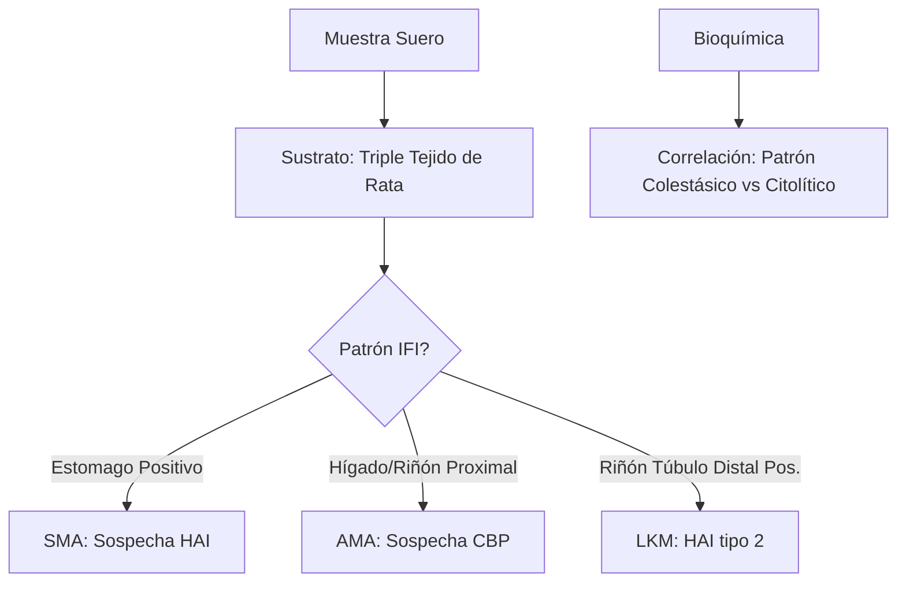
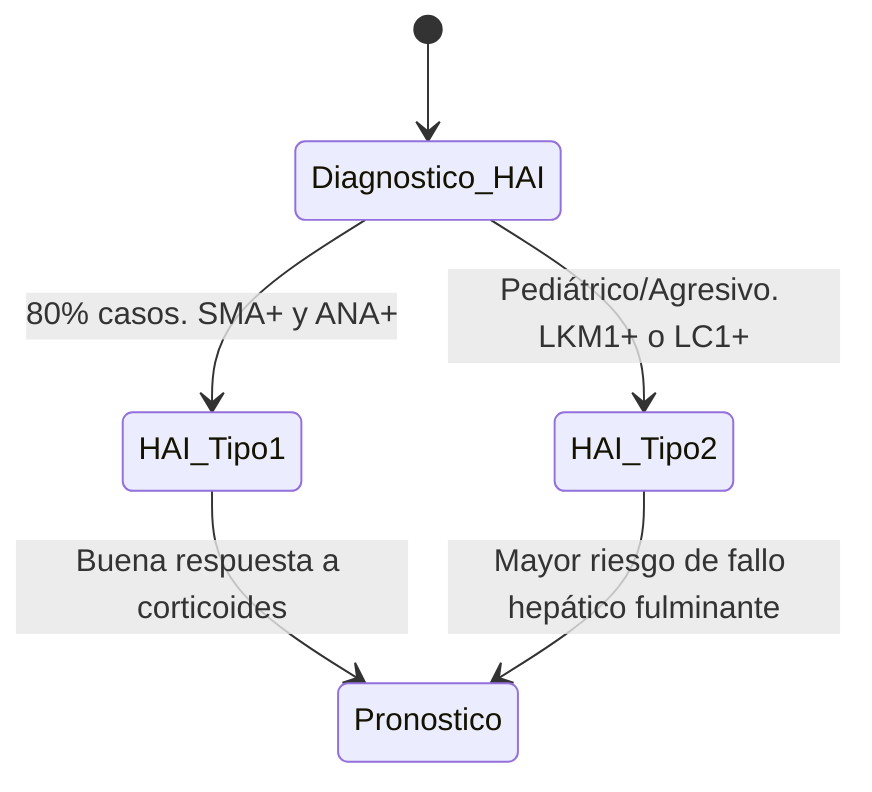
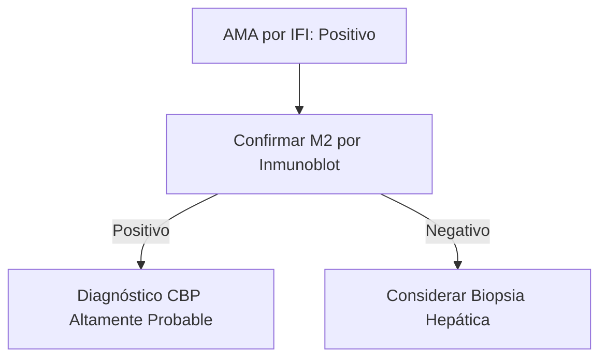

# Semana 3: Hematología y Autoinmunidad
## Lección 5: HAI, CBP, CEP... El ABC de las Hepatopatías Autoinmunes

### 1. Título y Resumen (Abstract)
**Título:** Valor Diagnóstico de los Anticuerpos Hepatopáticos en la Enfermedad Inflamatoria Crónica del Hígado: Caracterización por Triple Tejido y ELISA.
**Resumen:** Este artículo revisa la tríada principal de hepatopatías autoinmunes: Hepatitis Autoinmune (HAI), Cirrosis Biliar Primaria (CBP) y Colangitis Esclerosante Primaria (CEP). Se profundiza en la técnica de IFI sobre triple tejido (estómago, hígado, riñón de rata) para la identificación de patrones SMA, AMA y LKM. Se evalúa la correlación con el perfil bioquímico de colestasis y citólisis, destacando la importancia del diagnóstico precoz para evitar la progresión a cirrosis idiopática.

### 2. Introducción (Fundamentos y Objetivos)
#### 2.1. Fisiopatología de los Trastornos Digestivos y Hepáticos (Módulo 1370)
El currículo de **Fisiopatología General** (Módulo 1370) incluye el estudio de la patología digestiva, hepática y biliar. Las hepatopatías autoinmunes son inflamaciones crónicas mediadas por linfocitos T y autoanticuerpos.
1.  **Hepatitis Autoinmune (HAI):** Destrucción de hepatocitos. Se asocia a hiperganmaglobulinemia e IgG elevada.
2.  **Colangitis Biliar Primaria (CBP):** Destrucción de conductos biliares intrahepáticos.
3.  **Colangitis Esclerosante Primaria (CEP):** Inflamación fibro-obliterativa de los conductos biliares.

#### 2.2. Fundamentos de la IFI sobre Triple Tejido (Módulo 1372)
El **Módulo de Técnicas de Inmunodiagnóstico** describe el estudio de autoanticuerpos mediante sustratos multitisulares:
- **Triple Tejido (Hígado, Estómago, Riñón de Rata):** Permite identificar patrones diferenciales.
    - **SMA (Anti-músculo liso):** Tinción de fibras musculares en estómago. Sugiere HAI.
    - **AMA (Anti-mitocondriales):** Fluorescencia granular en citoplasma de hepatocitos y túbulo renal. Sugiere CBP.
    - **LKM (Anti-microsomales):** Tinción intensa del citoplasma de hepatocitos y túbulos renales. Típico de HAI tipo 2.

#### 2.3. Bioquímica Analítica de la Función Hepática (Módulo 1371)
- **Citolisis:** Medición de ALT (Alanina aminotransferasa) y AST.
- **Colestasis:** Medición de GGT y Fosfatasa Alcalina (Módulo 1371).
- **Inmunoglobulinas:** Cuantificación por nefelometría (Módulo 1368/1372).

**Objetivo:** Sistematizar el flujo de validación inmunológica hepatológica conforme a la normativa de la Comunidad de Madrid.

### 3. Material y Métodos
- **Diseño:** Estudio observacional descriptivo transversal.
- **Entorno:** Unidad de Inmunología Hepática, Hospital Universitario de Getafe.
- **Intervenciones:** Determinación de transaminasas y proteínas totales por espectrofotometría. Detección de autoanticuerpos por IFI (sustrato triple tejido EUROIMMUN) y confirmación de AMA-M2 mediante ELISA.

### 4. Resultados (Hallazgos Experimentales)
Algoritmos de clasificación por tipo de HAI:

### 5. Discusión y Conclusiones
La presencia de títulos bajos de ANA o SMA no es infrecuente en otras hepatopatías (vurales, tóxicas); por ello, la especificidad técnica del TSLCB en la lectura de IFI es vital. Se concluye que el AMA-M2 positivo en presencia de colestasis crónica permite el diagnóstico de CBP sin necesidad de biopsia en el 95% de los casos. La comunicación inmediata de niveles extremos de ALT (>10x LSN) es un valor de alerta en el laboratorio de urgencias.

### 6. Agradecimientos
A los servicios de Digestivo y Anatomía Patológica del HUGF por la correlación histológica en casos de solapamiento ("Overlap syndrome").

### 7. Bibliografía (Literatura Citada)
- **EASL Clinical Practice Guidelines: Autoimmune Hepatitis.** [Ver en easl.eu](https://easl.eu/guidelines/)
- **AASLD Clinical Practice Guidelines: Primary Biliary Cholangitis.** [Ver en aasld.org](https://www.aasld.org/practice-guidelines)
- **Autoanticuerpos en las enfermedades hepáticas autoinmunes - SEQCML.** [Ver en seqc.es](https://www.seqc.es/es/bioquimica-en-el-laboratorio-clinico/manuales-y-monografias/)
- **StatPearls: Autoimmune Hepatitis.** [Ver en ncbi.nlm.nih.gov](https://www.ncbi.nlm.nih.gov/books/NBK459247/)

---
### 8. Charla y Transcripción (Contenido Multimedia)

**Enlace al vídeo:** [Ver en YouTube](https://www.youtube.com/watch?v=g5xWw1ben6o)

#### Transcripción de la Sesión
> Hola, buenos días. Soy Marta Prat Gimeno, residente de cuarto año de bioquímica clínica del Hospital Universitario de Getafe y una de las organizadoras de esta séptima edición del curso de actualización en el laboratorio clínico. Os voy a hablar de las hepatopatías autoinmunes. El índice que vamos a seguir: una pequeña introducción; cada enfermedad por separado; y un caso clínico para entenderlo todo mejor.
>
> Las hepatopatías autoinmunes son respuestas del sistema inmune frente a estructuras propias del hígado. Las tres entidades son: **hepatitis autoinmune (HAI)**, **colangitis biliar primaria (CBP)** y **colangitis esclerosante primaria (CEP)**.
>
> La **hepatitis autoinmune** afecta a ambos sexos y a cualquier edad (incidencia 15–20 casos/100.000 habitantes). Consiste en inflamación crónica que destruye el parénquima hepático por pérdida de tolerancia a los hepatocitos. Tiene fuerte asociación genética y se asocia hasta en un 20 % a otras enfermedades autoinmunes (artritis, lupus, enfermedad celíaca). Sus síntomas van desde una hepatitis asintomática (solo bioquímica alterada) hasta cuadros floridos con ictericia, coagulopatía, dolor abdominal y astenia. El diagnóstico requiere descartar otras causas (hepatitis vírica, esteatosis, enfermedad de Wilson, hemocromatosis). Los hallazgos de laboratorio incluyen: **ALT y AST elevadas** e **IgG elevada**. Los autoanticuerpos principales son **antimúsculo liso (SMA)** presentes hasta en el 90 % (el más típico: anticuerpos contra actina, con patrón VGT en estómago y riñón de rata), **anticuerpos antinucleares (ANA)** en el 70 % (patrón AC-1 homogéneo en HEp-2) y, con menor frecuencia, LKM-1 y SLA. La biopsia hepática debe ser compatible (hepatitis de interfase con infiltrado linfocitario, emperipolesis y rosetas de hepatocitos). Los criterios simplificados puntúan: título de autoanticuerpos, niveles de IgG, ausencia de hepatitis vírica y biopsia típica. Con ≥ 6 puntos la HAI es probable; con ≥ 7, diagnóstico definitivo. El tratamiento es inmunosupresor (prednisona con o sin azatioprina o micofenolato mofetilo). Remisión bioquímica completa si se normalizan transaminasas e IgG a los 12 meses.
>
> La **colangitis biliar primaria (CBP)** afecta preferentemente a mujeres de mediana edad (incidencia 12–30 casos/100.000). Consiste en destrucción progresiva de los conductos biliares intrahepáticos mediada por linfocitos T citotóxicos, progresando a colestasis, fibrosis y cirrosis. Se asocia al síndrome de Sjögren y al síndrome CREST. Los síntomas van desde enfermedad silente hasta prurito intenso, astenia, xantomas y, en fases avanzadas, ascitis y encefalopatía. Bioquímica: **fosfatasa alcalina y GGT elevadas** (patrón colestásico) e **IgM elevada**. Previo a los anticuerpos, hay que descartar colestasis extrahepática por ecografía. Los autoanticuerpos clave son los **anticuerpos antimitocondriales (AMA)**, presentes en el 95 % de casos, dirigidos contra el complejo piruvato deshidrogenasa (subunidad M2). En HEp-2 dan patrón AC-21 (citoplasmático reticular); en tejido de rata, intensa fluorescencia en riñón que realmente corresponde a mitocondrias y puede confundirse con anticuerpos contra células parietales en estómago. Deben confirmarse siempre que sean específicos contra la subunidad M2. En el 30 % de casos, autoanticuerpos antinucleares de tipo AC-12 (envoltura nuclear; anti-GP210) o AC-6 (gránulos nucleares múltiples; anti-SP100), asociados a peor pronóstico. La biopsia no es necesaria para el diagnóstico si los AMA son positivos y hay colestasis crónica. El tratamiento es **ácido ursodesoxicólico**; si hay fallo, trasplante hepático.
>
> La **colangitis esclerosante primaria (CEP)** es más frecuente en hombres (incidencia 6–16 casos/100.000). Consiste en fibrosis crónica de los conductos biliares intra y extrahepáticos, asociada a colitis ulcerosa hasta en un alto porcentaje. Su etiopatología no está del todo conocida. Puede complicarse en colangiocarcinoma. Los síntomas son idénticos a colestasis: fatiga, prurito, esteatorrea y hepatomegalia. No tiene autoanticuerpos específicos (hasta un 80 % presentan p-ANCA de manera inespecífica). El diagnóstico se basa en pruebas de imagen y biopsia. No hay tratamiento médico establecido; si hay fallo hepático, trasplante.
>
> **Síndromes de solapamiento:** HAI y CBP pueden coexistir, sobre todo en mujeres de mediana edad; HAI y CEP en niños. El diagnóstico de solapamiento requiere biopsia hepática confirmatoria. Se utilizan los **criterios de París** (≥ 2 de 3 criterios de cada entidad: para HAI: ALT, IgG y SMA; para CBP: AMA, enzimas colestásicas y lesión biliar en biopsia). El tratamiento debe ser combinado: inmunosupresores para la HAI y ácido ursodesoxicólico para la CBP.
>
> Caso clínico (Paquita, 57 años): hipertransaminasemia persistente + prurito ocasional + xantomas transitorios. Analítica: ALT elevada (→ HAI), GGT y FA elevadas (→ CBP), IgG elevada (→ HAI), AMA positivo a título alto (→ CBP) y SMA positivo (→ HAI). Conclusión: síndrome de solapamiento HAI/CBP; actualmente en tratamiento combinado a la espera de la biopsia confirmatoria.
>
> Conclusiones: las hepatopatías autoinmunes son HAI, CBP y CEP; su diagnóstico diferencial combina parámetros bioquímicos, inmunológicos e histológicos; existen guías internacionales actualizadas (HAI 2025, CBP 2022, CEP 2017); los síndromes no son excluyentes y pueden coexistir.

#### Explicación de la Ponencia
La sesión pone en valor el papel del laboratorio en el diagnóstico diferencial de las hepatopatías autoinmunes, un área que exige combinar bioquímica e inmunología:
1. **Patrón colestásico vs. citolítico como primer orientador:** La elevación de FA y GGT sin ALT predominante dirige hacia CBP o CEP, mientras que la ALT elevada preponderante orienta hacia HAI. El TSLCB debe identificar y comunicar este perfil bioquímico desde el inicio.
2. **Confusión AMA/células parietales en estómago de rata:** La fluorescencia de los AMA en el estómago puede simular anticuerpos contra células parietales, lo que requiere confirmación M2 específica. La ponente incide en que este error tiene consecuencias diagnósticas relevantes.
3. **El AMA-M2 como herramienta diagnóstica definitiva:** En el 95 % de los casos de CBP, la presencia de AMA-M2 junto con colestasis crónica permitía el diagnóstico sin necesidad de biopsia, lo que reduce el riesgo y el coste del proceso diagnóstico.
4. **Criterios de París y síndrome de solapamiento:** El caso de Paquita ilustra que la coexistencia de criterios de las dos entidades no es un error técnico sino una realidad clínica. El laboratorio contribuye a identificar este solapamiento al comunicar simultáneamente el perfil bioquímico y los autoanticuerpos positivos de cada entidad.

---
### Sobre la Ponente
**Marta Prat Gimeno** es Residente de 4º año (R4) de Bioquímica Clínica en el **Hospital Universitario de Getafe**.

*Contenido técnico-científico detallado para el Grado Superior de Laboratorio Clínico.*
