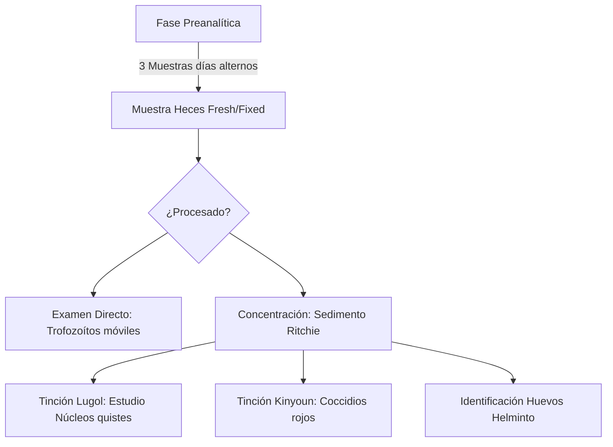
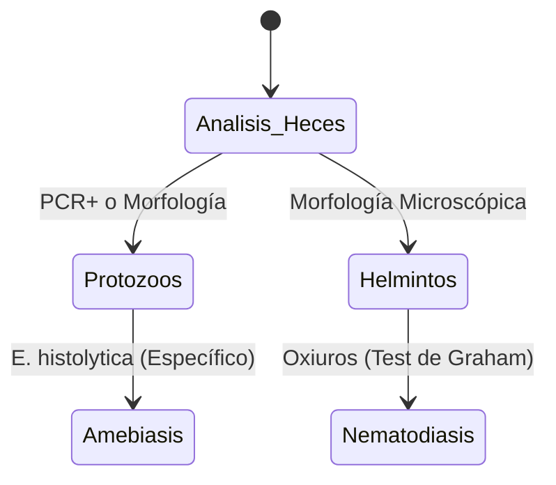

# Semana 4: Microbiología
## Lección 1: Diagnóstico de Parásitos Intestinales

### 1. Título y Resumen (Abstract)
**Título:** Optimización del Escenario Diagnóstico en Parasitología Intestinal: De la Concentración Bifásica a la Identificación Genómica mediante Paneles Sindrómicos.
**Resumen:** Este artículo profundiza en los fundamentos biológicos y técnicos del diagnóstico de parasitosis. Se evalúa la eficacia de los métodos clásicos de concentración y tinción frente a la sensibilidad de la PCR múltiplex para protozoos emergentes. Se destaca el papel crítico del TSLCB en la preservación de la muestra y la identificación morfológica de quistes, huevos y larvas, fundamentando un algoritmo operativo que minimiza los falsos negativos.

### 2. Introducción (Fundamentos y Objetivos)
#### 2.1. Taxonomía y Fisiopatología Parasitaria (Módulo 1373/1370)
El currículo de **Microbiología Clínica** (Módulo 1373) establece la identificación de parásitos humanos. Las parasitosis intestinales son infecciones producidas por:
1.  **Protozoos (Unicelulares):** Amebas (*Entamoeba*), Flagelados (*Giardia*), Ciliados y Coccidios (*Cryptosporidium*). Se estudian sus ciclos biológicos y sus estadios: quiste (resistencia) y trofozoíto (forma vegetativa patógena).
2.  **Helmintos (Pluricelulares):** Nematodos (gusanos redondos), Cestodos (gusanos planos) y Trematodos.

#### 2.2. Fundamentos de las Técnicas de Concentración (Módulo 1373)
Debido a la baja carga parasitaria por gramo de heces, el TSLCB debe aplicar métodos físicos de enriquecimiento:
- **Técnicas de Flotación:** Uso de líquidos con densidad superior a la de los parásitos (ej. Sulfato de Zinc a 1.18). Los parásitos suben a la superficie.
- **Técnicas de Sedimentación (Ritchie):** Empleo de centrífugas y sistemas bifásicos (Formol-Éter). El formol fija y el éter desengrasa la muestra. Los parásitos se concentran por gravedad en el sedimento.

#### 2.3. Tinciones y Observación Microscópica (Módulo 1368/1373)
- **Tinciones Temporales:** El uso de **Lugol** permite visualizar estructuras internas de los quistes.
- **Tinciones Permanentes:** Tinción de **Kinyoun** (ácido-alcohol resistencia) para coccidios.
- **Microscopía (Módulo 1368):** Identificación con objetivos de 10x (rastreo) y 40x (detalle).

**Objetivo:** Sistematizar el procesamiento de muestras de heces conforme a las normas de bioseguridad y calidad de la Comunidad de Madrid.

### 3. Material y Métodos
- **Diseño:** Estudio técnico-descriptivo sobre protocolos de microbiología parasitaria.
- **Entorno:** Unidad de Parasitología Molecular, Hospital Universitario de Donostia.
- **Intervenciones:** Técnica de sedimentación acelerada, microscopía de campo claro y PCR en cartucho automatizado (BD Max / FilmArray Gastrointestinal).

### 4. Resultados (Hallazgos Experimentales)
Diferenciación de estadios y algoritmos preventivos:

### 5. Discusión y Conclusiones
La PCR ha revolucionado la detección de protozoos, pero es ciega para helmintos y larvas de *Strongyloides*. Se concluye que el TSLCB debe asegurar un esquema de 3 muestras en días alternos para maximizar la sensibilidad, dado el carácter intermitente de la excreción. El uso de fijadores (MIF, SAF) es indispensable cuando el proceso no es inmediato para evitar la lisis de trofozoítos.

### 6. Agradecimientos
Al personal de Medicina Preventiva por el apoyo en el seguimiento de brotes en guarderías y colegios.

### 7. Bibliografía (Literatura Citada)
- **CDC - DPDx: Laboratory Identification of Parasites of Public Health Concern.** [Ver en cdc.gov](https://www.cdc.gov/dpdx/index.html)
- **Procedimientos en Microbiología Clínica: Diagnóstico de las parasitosis intestinales - SEIMC.** [Ver en seimc.org](https://seimc.org/documentos-cientificos/procedimientos-microbiologia)
- **Manual de Parasitología Humana - Universidad de Navarra.** [Ver en unav.edu](https://www.unav.edu/web/facultad-de-medicina)
- **WHO: Control of Neglected Tropical Diseases - Soil-transmitted helminthiases.** [Ver en who.int](https://www.who.int/news-room/fact-sheets/detail/soil-transmitted-helminth-infections)

### 8. Charla y Transcripción (Contenido Multimedia)

**Enlace al vídeo:** [Ver en YouTube](https://www.youtube.com/watch?v=w3h3B-I8pLE)

#### Transcripción de la Sesión
Hola a todos, ¿qué tal? Soy Elena Hidalgo y vengo a presentar la ponencia de diagnóstico en el laboratorio de microbiología de parásitos intestinales. Antes de entrar en materia, vamos a hacer una pequeña introducción, con tres definiciones básicas. Primero, qué es la parasitología, que es la ciencia que estudia los parásitos y las relaciones parásito-hospedador. Parásito: lo definimos como un organismo que vive en o sobre otro organismo de diferente especie, que definimos como hospedador, del cual obtiene recursos biológicos para su supervivencia y reproducción, causando algún grado de daño a este hospedador. Y, por último, la parasitosis, que es la enfermedad causada por un parásito sobre el hospedador. Entonces, en las parasitoses intestinales es importante tener en cuenta la forma de recoger, conservar la muestra y luego cómo se prepara esta muestra para el diagnóstico. 

Entonces, empezando por la recogida y conservación de las muestras, tenemos tres tipos de muestras principales para el diagnóstico de parásitos intestinales. En primer lugar, tenemos las muestras de heces, que se utilizan principalmente para el examen microscópico, aunque también se pueden utilizar para otras técnicas diagnósticas, como detección de antígenos o técnicas de biología molecular. La muestra debe llegar al laboratorio en un frasco limpio y seco por fuera para proteger al personal que vaya a manipularla. La cantidad de muestra necesaria no debe ser mayor de 100 g cuando hablamos de heces formadas, ni de 10 ml cuando hablamos de heces líquidas. El procesamiento se recomienda que sea inmediato, en unas 2–4 horas; si no va a ser inmediato, se recomienda fijar la muestra, pero esto no es útil para la observación de larvas. En cuanto al número de muestras recomendadas, sigue un poco en debate y las últimas guías sí recomiendan tres muestras seriadas, ya que esto incrementa la sensibilidad en el examen microscópico. Y para técnicas de detección de antígenos, las muestras tienen que estar frescas, aunque se pueden refrigerar o congelar si no se van a procesar inmediatamente. 

El segundo tipo de muestra útil sería la muestra de suero, que se utiliza para el diagnóstico serológico. La muestra llega al laboratorio en un tubo con gel separador y sin anticoagulante, y lo adecuado es centrifugarlo lo antes posible, nada más llegar al laboratorio, y luego se puede conservar la muestra refrigerada hasta que se procese. Y, por último, tenemos la muestra de orina. Dentro de los parásitos intestinales, el único parásito que vamos a ver en la orina sería Schistosoma haematobium. Para esto necesitamos un volumen mínimo de unos 100 ml y se recomienda que la muestra se recoja por la mañana. Además, se sugiere que el paciente realice algún tipo de ejercicio, como sentadillas o flexiones, para favorecer que los huevos presentes en la vejiga se desprendan y se eliminen con la orina. Sí que las muestras recogidas por la mañana o en orina de 24 horas aumentan la sensibilidad o el rendimiento de este diagnóstico. En caso de no procesarse inmediatamente, conviene refrigerar las orinas y mantenerlas así hasta que se procesen. 

Bueno, una vez tenemos la parte de recogida de muestras clara, vamos a hablar de la preparación de las heces. La sensibilidad del examen microscópico depende en gran medida de la preparación de la muestra. Las técnicas de concentración permiten separar y concentrar quistes, huevos y larvas de estos parásitos, eliminando el exceso de material fecal y facilitando la detección de los parásitos en el microscopio, ya que aumentan la probabilidad de encontrar parásitos, reducen el detrito y los artefactos, permiten campos microscópicos más limpios y facilitan la identificación morfológica. Por lo tanto, las técnicas de concentración son métodos que, uno, separan los parásitos del material fecal; dos, los acumulan en una pequeña fracción de la muestra; y tres, facilitan su detección e identificación microscópica. Estas técnicas se basan en principios físicos como el peso o la densidad. Tenemos dos tipos principales: técnicas de sedimentación, en las que los parásitos más densos sedimentan en el fondo de un recipiente; suelen ser de amplio espectro y se utilizan para el diagnóstico de muchos parásitos, pero sobre todo son útiles para los helmintos y se observa en el sedimento al microscopio. Y luego las técnicas de flotación, que son más o menos lo contrario: los parásitos flotan en soluciones de alta densidad y se obtienen preparaciones más limpias, útiles sobre todo para observar quistes de protozoos; lo que se observa al microscopio sería el oocisto. 

Las técnicas de concentración no están indicadas para el diagnóstico de todos los parásitos. Son útiles para protozoos, quistes y para helmintos cuando vamos a buscar huevos y larvas, pero no están indicadas para trofozoítos, ni para quistes intestinales, ni para Strongyloides stercoralis. Todos estos nombres los iremos aclarando uno a uno. Vamos a empezar por los parásitos; hablaremos de protozoos por un lado y de helmintos por otro. Simplemente, recordar o dejar claro que no voy a hablar de todos los parásitos que pueden afectar al ser humano. He hecho una selección de los que pueden tener más relevancia o los que más vemos en los laboratorios. Y esta es mi selección. 

Empezamos por los parásitos intestinales. Esto es una clasificación: tenemos amebas, de las que hablaremos de Entamoeba histolytica; ciliados, de los que hablaremos de Balantidium coli; cocidios, que son Cryptosporidium, Cyclospora y Cystoisospora; y, dentro de los flagelados, hablaremos de Giardia intestinalis (Lamblia) dentro de la parcela de los flagelados intestinales. Para el diagnóstico de las parasitosis causadas por protozoos disponemos de diferentes técnicas que suelen complementarse entre sí. Empezamos con el examen microscópico, la técnica más utilizada: se utiliza para la detección de trofozoítos y de quistes en heces diarreicas; incluso permite observar, en las muestras frescas, el movimiento de los trofozoítos y también ver los quistes. En el portaobjetos se coloca una gota de muestra con solución salina y, a continuación, se añade un colorante, que suele ser lugol. El objetivo para observar los protozoos suele ser de 40x. En algunos protozoos es necesario el uso de tinciones, concretamente para los coccidios, que hemos citado: Cryptosporidium, Cyclospora y Cystoisospora belli. Las tinciones que se utilizan suelen ser la tinción de Ziehl-Neelsen modificada, también llamada tinción de Kinyoun, que permite diferenciar, entre otras, la característica pared resistente de estos parásitos. Además, estas tinciones se pueden realizar en muestras fijadas o concentradas para aumentar la sensibilidad del diagnóstico. 

Otras técnicas utilizadas para el diagnóstico microbiológico de protozoos serían: uno, el diagnóstico serológico, que incluye inmunoensayos como ELISA y pruebas de inmunofluorescencia directa para la detección de antígenos específicos de algunos parásitos; dos, las técnicas moleculares, que permiten la detección simultánea de múltiples protozoos e incluso de otros elementos con alta sensibilidad y especificidad. Son especialmente útiles para diferenciar especies morfológicamente similares y para el diagnóstico en muestras con baja carga parasitaria; y, por último, la detección de antígenos. 

Vamos a empezar con los síndromes, uno a uno. Empezamos con el diagnóstico de la amebiasis. En el ser humano, Entamoeba histolytica es la que causa la infección intestinal y produce amebiasis invasiva. Esta especie tiene quistes morfológicamente idénticos a otras Entamoeba, como E. dispar, E. bangladeshi y E. moskovi (moshkowski). De estas, E. dispar y E. bangladeshi no son patógenas; E. histolytica sí lo es y se asocia a diarrea invasiva. En la figura de arriba a la izquierda, señalada por un círculo rojo, se muestran quistes; se representa cómo son los quistes de estas cuatro especies de Entamoeba. 

Para el diagnóstico de amebiasis, primero tenemos la visualización directa o microscopía. Es una técnica barata, pero su desventaja es que requiere formación. Se suele observar más quistes que trofozoítos; no conviene diferenciar entre quistes de E. histolytica y los de otras amebas menos patógenas. En el caso de infecciones por E. histolytica, a veces sí se pueden observar trofozoítos, porque da tiempo a que se forme el quiste antes de que el paciente los elimine. No es una técnica de diagnóstico recomendada si disponemos de otras alternativas. Aquí os dejo unas imágenes para que veáis más o menos cómo se ven: arriba a la izquierda, un trofozoíto de E. histolytica; en las heces no se observan trofozoítos, sino quistes teñidos con Lugol o, en ocasiones, con azul de lactofenol, como lo solemos ver en los laboratorios de microbiología. 

El siguiente método diagnóstico de la amebiasis sería el diagnóstico serológico. Consiste en la detección de anticuerpos frente a Entamoeba histolytica. Principalmente es útil para diagnosticar formas extraintestinales y también cuando los métodos directos, como la microscopía o la PCR, fallan, pero los síntomas persisten. La principal limitación de la serología es que no se puede utilizar para el diagnóstico de una infección aguda, ya que los anticuerpos tardan en producirse en el paciente. Por ello, se recomienda como apoyo en el diagnóstico de la amebiasis invasiva, pero no es la técnica de elección para el diagnóstico de una amebiasis aguda. Y, por último, en tercer lugar, tenemos la detección de ácidos nucleicos, que consiste en la detección de material genético de E. histolytica en la muestra de heces. Esto sí permite la detección y diferenciación de E. histolytica frente a E. dispar y E. moskovi, y suele realizarse en paneles de PCR multiplex junto con otros parásitos y bacterias causantes de diarrea. Ahora sí, por último, tenemos el diagnóstico de amebiasis mediante detección de antígenos. Se detectan antígenos específicos en heces frescas, permitiendo un diagnóstico diferencial respecto a las otras especies de amebas, y tiene una limitada sensibilidad y especificidad. Principalmente, es formato ELISA que utiliza anticuerpos monoclonales frente a un antígeno específico de E. histolytica, pero también existen otros formatos, como inmunocromatografías, que no permiten diferenciar entre especies. 

El siguiente parásito del que vamos a hablar será Giardia intestinalis (Lamblia), que tiene varios nombres. Es el principal protozoo intestinal flagelado que infecta al ser humano. La giardiasis es una diarrea esporádica, no de mucha gravedad, y es endémica y epidémica en muchas partes del mundo. Giardia presenta dos formas de vida: el trofozoíto, que es la forma móvil que se encuentra en el intestino; y el quiste, que es la forma infectante excretada con las heces y que es más resistente al medio ambiente, como se observa en la diapositiva de la derecha. En cuanto al diagnóstico de la giardiasis, primero tenemos la microscopía: podemos detectar quistes (como se ve en las fotos de las imágenes de abajo) o trofozoítos, que suele ocurrir en heces diarreicas; al observar las heces en fresco con Lugol, se puede observar el movimiento flagelado característico del trofozoíto de Giardia, que es rápido y en una dirección, girando sobre sí mismo. Las limitaciones de la microscopía son las típicas: se necesita personal cualificado para detectar estos quistes en las heces; en la imagen de la izquierda hay muchos quistes presentes, y puede haber artefactos que dificulten la observación. Esta imagen, además, es una muestra bonita de microscopía electrónica en la que se ve el trofozoito de Giardia apoyado en las microvellosidades de las células epiteliales del intestino; el círculo marcado a la izquierda corresponde al trofozoito adherido. Quedan fijados, se nutren del huésped y producen diarrea. 

El siguiente método para el diagnóstico de giardiasis es la detección de ácidos nucleicos. De nuevo, suele formar parte de paneles de PCR múltiple y se detecta el material genético en muestras de heces. Por último, la detección de antígenos: existen técnicas comerciales de detección de antígenos de Giardia, principalmente en formato inmunocromatográfico, que también permiten detectar antígenos de Giardia intestinalis. 

Y dentro de los protozoos, tenemos el diagnóstico de Balantidium coli. Balantidium coli es el único patógeno dentro del grupo de los ciliados y es el protozoo patógeno intestinal más grande. Sus dos formas de vida son el trofozoíto (que mide entre 30–150 μm de longitud y 20–120 μm de anchura) y los quistes (40–60 μm de diámetro). Los quistes son las formas infectivas y sobreviven bien en el medio ambiente. El diagnóstico se realiza principalmente por microscopía. En estas imágenes se ve el trofozoíto a la izquierda y el quiste de Balantidium coli, que he incluido de nuevo en la diapositiva. 

Ahora pasamos a los helmintos. Esto es un poco la clasificación de los helmintos: nematodos (gusanos redondos), trematodos (gusanos planos) y cestodos (gusanos segmentados). Los nematodos, o gusanos redondos, son gusanos que, en parte de su ciclo vital, ocurren en el suelo; nos infectamos al ingerir por accidente los huevos de estos nematodos. Todos son parásitos del aparato digestivo humano y, en esta tabla, se resumen las características principales de los nematodos intestinales. No he hablado aún de los ciclos biológicos ni de la sintomatología, porque sería extender demasiado la materia; sin embargo, dejo aquí pinceladas de los nematodos más relevantes para nuestra práctica, como Ascaris lumbricoides, Trichuris trichiura, Necator americanus y Ancylostoma duodenale, que son las mencionadas ancilostomátidos. 

El diagnóstico de geohelmintiasis: primero, los síntomas. La mayoría de las parasitosis intestinales por geohelmintos son subclínicas, es decir, no hay síntomas hasta que, por una razón u otra, aparecen signos característicos de cada especie. En infecciones primarias o agudas pueden aparecer dolor abdominal, diarrea, malnutrición o retraso del crecimiento; según avanza la infección, aparecen síntomas específicos de cada especie. Ascaris lumbricoides puede provocar obstrucción intestinal; los adultos pueden medir hasta 13 cm. Las larvas producen anemia; Necator americanus y Ancylostoma duodenale pueden inducir autoinfección, y Trichuris trichiura produce colitis o proctitis; Enterobius vermicularis (oxiuros) produce prurito anal. En la analítica suele haber eosinofilia durante la migración tisular, y persiste la infección sólo si hay reinfección. En el laboratorio, el diagnóstico se realiza buscando huevos o larvas por microscopía; la serología es especialmente útil en infestaciones por Strongyloides stercoralis y Enterobius vermicularis; el test de Graham se utiliza para Enterobius vermicularis; la biología molecular también puede emplearse para diagnóstico de geohelmintiasis, aunque es cara y requiere personal cualificado. 

Vamos a hablar un poco de algunas técnicas que facilitan o aumentan la rentabilidad del diagnóstico de los geohelmintos. En primer lugar, la técnica de Kato-Katz, una técnica de microscopía estandarizada que mide la carga parasitaria cuantificando el número de huevos por gramo de heces a partir de dos muestras diferentes. No es una técnica de concentración, aunque puede asociarse a una de estas para aumentar la precisión del diagnóstico. Es un procedimiento barato y, además, tiene pocos falsos positivos, pero su realización es laboriosa. Los falsos negativos pueden ocurrir por la fluctuación diaria y la excreción intermitente de huevos; además, se necesita personal entrenado para visualizarlo al microscopio. Por ello no es una técnica fácil ni de uso rutinario en la mayoría de laboratorios. 

¿Cuándo se usa Kato-Katz? Se utiliza para el control poblacional de las helmintiasis y para medir la intensidad de la infección, pero no para el diagnóstico clínico individual ni para protocolos de diagnóstico intestinal. En resumen, se emplea como medida epidemiológica para los helmintos. Para el diagnóstico clínico de Trichuris trichiura, Ascaris lumbricoides y otros helmintos se utiliza la PCR dentro de paneles múltiples; en Strongyloides stercoralis sí se utiliza la microscopía para el diagnóstico buscando las larvas. 

Existe una técnica específica de concentración, la técnica de Baermann, para la concentración de larvas vivas de Strongyloides stercoralis. Se basa en dos propiedades de las larvas: la motilidad activa y la tendencia de las larvas a migrar a medios cálidos y húmedos. Las larvas salen activamente de la muestra de heces y migran al agua en el dispositivo, concentrándose por gravedad en el fondo. Debido a que la excreción de huevos de Strongyloides es intermitente, pueden ser necesarias hasta siete muestras diferentes de heces para el diagnóstico. A continuación, os dejo un esquema de cómo es la técnica de Baermann: primero se recolectan las heces y se colocan sobre una gasa doblada en un embudo; se llena el embudo con agua tibia hasta que la muestra queda en contacto con el agua sin sumergirla por completo; se deja incubar 2–4 horas y las larvas van migrando hacia el agua y, por gravedad, caen al fondo. Luego se coge el sedimento y se buscan las larvas. 

En el diagnóstico de Strongyloides, a veces es más útil la serología que la microscopía, aunque, como todo, tiene limitaciones; por ejemplo, las pruebas de ELISA pueden presentar reacciones cruzadas con IgG frente a otros antígenos y producir falsos positivos. Otra forma útil de diagnóstico es la PCR, que detecta el ADN del parásito y puede ser más sensible cuando la concentración de larvas es baja. Y existe el test de Graham para Enterobius vermicularis, que sigue siendo la técnica de elección para este diagnóstico. El test de Graham se basa en la técnica de la cinta adhesiva transparente que se coloca sobre el ano a primera hora de la mañana para capturar huevos, que luego se observan al microscopio. Los huevos de Enterobius vermicularis se observan fácilmente en esta preparación; actualmente no existen pruebas serológicas o de PCR para oxiuros. 

A continuación, imágenes para ver la morfología de los huevos de los diferentes parásitos. Arriba a la izquierda, el huevo de Ascaris lumbricoides; abajo a la izquierda, el huevo de Necator americanus; abajo a la derecha, el huevo de Ancylostoma duodenale; en la parte central, el huevo de Enterobius vermicularis, que se vería en el test de Graham; y a la derecha, el huevo de Trichuris trichiura, con su forma característica de barril o limón. En cuanto a los adultos, solo hay una foto de Ascaris lumbricoides; en la imagen de la izquierda, la hembra es la de mayor tamaño, y hay una imagen de una larva de Strongyloides stercoralis en la figura de la derecha. 

Vamos a pasar a los tremátodos, que son los llamados gusanos planos, centrando la atención únicamente en el Schistosoma. La esquistosomiasis es una enfermedad crónica parásita producida por diferentes especies del género Schistosoma. Cinco especies parasitan al ser humano: la esquistosomiasis intestinal por Schistosoma mansoni, S. intercalatum, S. japonicum y S. mekongi; y la esquistosomiasis urinaria, principalmente por Schistosoma haematobium. En la imagen de la derecha se observan dos adultos: la hembra, más gruesa, y el macho, más delgado; se encuentran copulando, normalmente en la vejiga o en el intestino. 

En cuanto al diagnóstico, la microscopía es el método más utilizado; es el método de referencia y se basa en la detección de huevos en heces o en orina. Permite identificar las especies de esquistosomas según la morfología característica del huevo y evaluar la intensidad de la infección, pero no es adecuado para el diagnóstico temprano, ya que la puesta de huevos se produce alrededor de la cuarta semana posinfección. Para la esquistosomiasis intestinal, causada por S. mansoni, S. intercalatum, S. japonicum y S. mekongi, se utilizan técnicas que permiten estimar la carga parasitaria, como la técnica de Kato-Katz, y se asocian técnicas de concentración para aumentar el rendimiento diagnóstico. Se observa una muestra fresca de unos 50 mg; se observa en extensión y se considera válido si se observan al menos 20 huevos por gramo de heces. También se puede utilizar biopsia rectal para aumentar la sensibilidad en pacientes con estudio de heces negativo. Las especies se diferencian por la morfología de los huevos: S. mansoni tiene huevos ovalados con espícula lateral relativamente prominente; S. japonicum es más redondeado y puede presentar espícula pequeña o ausente; S. mekongi presenta características similares. En la esquistosomiasis urinaria, el principal causante es Schistosoma haematobium, cuyos huevos se detectan en orina; es preciso concentrar la orina y la sensibilidad es baja; la morfología del huevo es ovalada y presenta una espícula terminal visible al microscopio. 

En cuanto al diagnóstico serológico de la esquistosomiasis, es altamente inmunogénica; es decir, los anticuerpos se generan, pero es difícil detectar anticuerpos en suero durante la fase aguda, pues tardan en aparecer; además, los antígenos pueden persistir incluso cuando la infección ya se ha tratado, lo que genera falsos positivos. Existen técnicas como ELISA, enzimoinmunoanálisis, etc. Y la detección de ácidos nucleicos consiste en la detección de ADN de esquistosomas en muestras de heces, orina o biopsias; es altamente sensible y específica, pero estas técnicas tienen un coste elevado y requieren personal y equipamiento especializado, por lo que su uso queda restringido a laboratorios de referencia o para confirmar resultados en laboratorios de atención secundaria. 

Y ya vamos a pasar a los cestodos, que son los gusanos segmentados, representados por las tenias, de las que todos hemos oído hablar. La teniasis es la infección intestinal causada por tres especies de cestodos: Taenia solium, Taenia saginata y Taenia asiatica. El modo de infección en el ser humano es el consumo de carne infectada con las larvas, carne cruda o poco cocinada; dependiendo del tipo de carne que consumimos, nos infectamos por una especie u otra. Taenia solium se asocia a carne de cerdo, Taenia saginata a carne de vacuno, y Taenia asiatica se relaciona con cerdo y, en menor medida, con carne de res. Si en vez de ingerir las larvas ingerimos los huevos de Taenia, aparece la cisticercosis, que es más peligrosa porque las larvas pueden migrar a otros órganos, llegando al cerebro y produciendo infección en el sistema nervioso central. 

Para el diagnóstico de la teniasis se han utilizado distintos métodos microscópicos, inmunológicos y moleculares, y parece claro que la sensibilidad aumenta al combinar dos o más métodos diagnósticos. Los métodos más utilizados son la microscopía directa para la detección de huevos en heces y, a veces, la serología. 

Antes de continuar, veamos un poco la morfología de las tenias. Arriba tenemos la cabeza o escólex, que tiene un rostelo y puede tener ganchos o no. La morfología del escólex permite diferenciar entre especies. Taenia saginata y Taenia solium presentan diferencias notables. El cuerpo de la tenia se divide en proglótides; las proglótides más cercanas a la cabeza son las grávidas, las maduras contienen los huevos y las viejas son las de la cola. Dentro de las proglótides hay un aparato reproductor con los testículos y el útero, y las ramificaciones (diferentes en número y forma) entre Taenia solium y Taenia saginata. En microscopía, los huevos son indistinguibles entre especies; miden aproximadamente 31–43 μm, esféricos y con una cubierta radial estriada que contiene una oncosfera con seis ganchos. Se pueden observar proglótides eliminadas con características morfológicas diferenciales entre especies. Cuando hay menos de 15 ramificaciones y son gruesas, es característico de Taenia solium; cuando hay más de 15 ramificaciones y son más finas, es característico de Taenia saginata. Las ramificaciones se observan aplastando las proglótides entre dos portaobjetos; las proglótides pueden ser visibles a simple vista o con lupa en las heces. Estas manipulaciones deben hacerse con extrema precaución (guantes, papel de filtro desechable), ya que los huevos de Taenia son infectantes y pueden causar infección al personal sanitario. 

En cuanto al diagnóstico serológico, permite la identificación a nivel de especie a través de la detección de coproantígenos específicos mediante técnicas de enzimoinmunoanálisis; la ventaja es que no se producen reacciones cruzadas con otros elementos, pero la desventaja es que los antígenos pueden permanecer tras la infección y ser estables durante años si se refrigeran o congelan. El diagnóstico es más útil para Taenia. Y, por último, la detección de ácidos nucleicos: existen diferentes técnicas de PCR que permiten identificar a nivel de especie; para Taenia, la desventaja es que se necesita la presencia de huevos o proglótides en las heces; si no hay una cantidad suficiente de proglótidos o huevos, la PCR no ofrece grandes ventajas frente a la microscopía en el diagnóstico de la taeniasis, aunque puede mantener una buena sensibilidad y especificidad. 

Y nada, eso es todo. Muchas gracias por vuestra atención.

#### Explicación de la Ponencia
Esta ponencia técnica proporciona al TSLCB las claves para el diagnóstico parasitológico integral:
1.  **Optimización Preanalítica:** Importancia de procesar muestras frescas o fijadas (MIF, SAF) para preservar trofozoítos y larvas.
2.  **Métodos de Concentración:** Fundamentos de las técnicas de sedimentación (Ritchie) y flotación para aumentar la rentabilidad diagnóstica.
3.  **Algoritmo Diagnóstico:** Uso complementario de la microscopía clásica (estándar de oro para helmintos) y la PCR múltiplex (alta sensibilidad para protozoos).
4.  **Técnicas Especiales:** Aplicación del test de Graham para oxiuros y la técnica de Baermann para el aislamiento de larvas motiles.

---
### Sobre la Ponente
**Elena Hidalgo Cardeñoso** es Facultativa Especialista de Área (FEA) de Microbiología en el **Hospital Universitario de Donostia**.

*Material pedagógico actualizado según los estándares de FP Grado Superior.*
