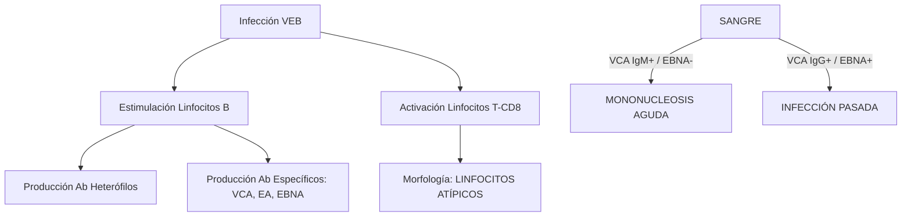
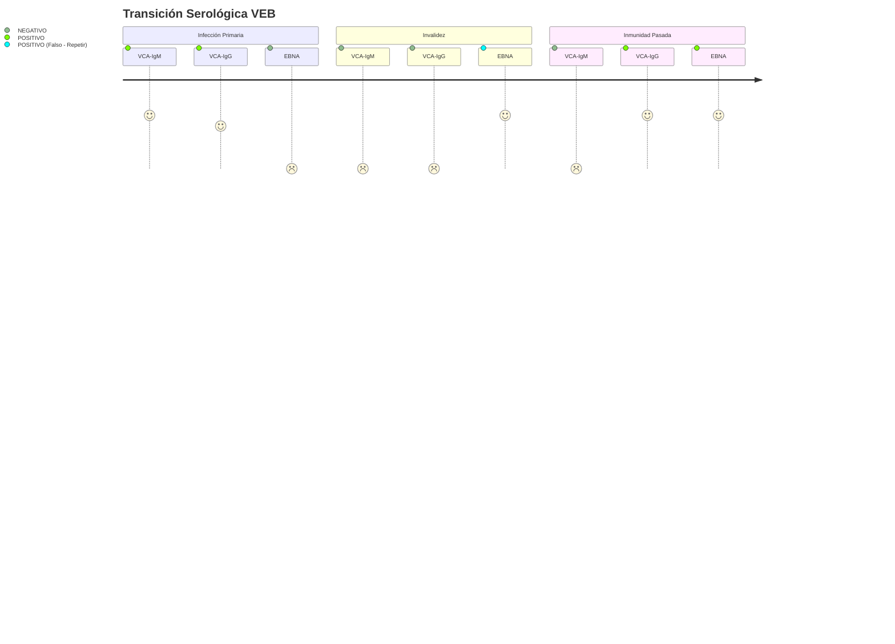

# Semana 4: Microbiología
## Lección 2: Virus Epstein-Barr (VEB): Diagnóstico y Seguimiento

### 1. Título y Resumen (Abstract)
**Título:** Dinámica Infectológica y Marcadores Biológicos del Virus Epstein-Barr: Del Diagnóstico Serológico a la Monitorización de la Carga Viral.
**Resumen:** Este artículo analiza la biología molecular del VEB y su ciclo infectivo en los linfocitos B. Se evalúa el perfil serológico clásico (VCA, EBNA, EA) para la datación de la infección primaria (Mononucleosis Infecciosa) y se analiza el papel del TSLCB en la identificación de la linfocitosis atípica. Se concluye con la importancia de la carga viral por PCR en el seguimiento de pacientes inmunocomprometidos y su asociación con procesos linfoproliferativos.

### 2. Introducción (Fundamentos y Objetivos)
#### 2.1. Virología y Tropismo del Virus Epstein-Barr (Módulo 1373)
El currículo de **Microbiología Clínica** (Módulo 1373) detalla la estructura y replicación de los virus herpes. El VEB (Herpesvirus humano tipo 4) posee una nucleocápside icosaédrica y una envuelta lipídica con glicoproteínas (gp350/220).
- **Entrada Celular (Módulo 1370):** El virus se une al receptor CD21 de los linfocitos B y al MHC clase II de las células epiteliales.
- **Infección Lítica y Latente:** El VEB alterna entre replicación activa y latencia episomal en linfocitos B de memoria.

#### 2.2. Cinética Serológica e Inmunodiagnóstico (Módulo 1372/1371)
El TSLCB debe interpretar los resultados de inmunoensayos sándwich y competitivos:
1.  **VCA-IgM / IgG (Antígeno de Cápside):** La IgM indica primoinfección aguda. La IgG aparece en fase precoz y persiste.
2.  **Anti-EA (Antígeno Temprano):** Marcador de replicación activa (aguda o reactivación).
3.  **Anti-EBNA (Antígeno Nuclear):** Marcador de convalecencia/memoria; su presencia descarta infección aguda.
4.  **Anticuerpos Heterófilos (Test de Paul-Bunnell):** Basado en la aglutinación de hematíes de oveja/caballo (Módulo 1372), indicativo de VEB pero menos específico que los marcadores propios.

#### 2.3. Manifestaciones en Hematología (Módulo 1374)
La respuesta citotóxica (linfocitos T-CD8) genera la "linfocitosis reactiva" detectable en el hemograma y frotis (células de Downey). El TSLCB debe validar la presencia de estas atipias morfológicas.

**Objetivo:** Sistematizar el flujo de validación de perfiles serológicos concordantes con la morfología del frotis según el currículo TSLCB.

### 3. Material y Métodos
- **Diseño:** Análisis descriptivo de cohortes diagnósticas.
- **Entorno:** Laboratorio de Microbiología y Serología, Hospital Universitario de Getafe.
- **Intervenciones:** Determinación de anticuerpos específicos (EIA / Quimioluminiscencia), test de Paul-Bunnell (anticuerpos heterófilos) y cuantificación de ADN viral mediante PCR en tiempo real (qPCR).

### 4. Resultados (Hallazgos Experimentales)
Cinética de biomarcadores y algoritmos de interpretación:

### 5. Discusión y Conclusiones
La ausencia de anticuerpos EBNA con VCA positivo es la "huella dactilar" de la infección aguda. Se concluye que el TSLCB debe informar proactivamente la presencia de linfocitosis reactiva (>10%) al servicio de Microbiología para orientar el panel serológico. En pacientes trasplantados, la monitorización de la carga viral es el único método para prevenir el Síndrome Linfoproliferativo Post-trasplante (PTLD).

### 6. Agradecimientos
Al equipo de Virología por la estandarización de los ciclos de corte (Ct) en la PCR cuantitativa.

### 7. Bibliografía (Literatura Citada)
- **CDC - Epstein-Barr Virus and Infectious Mononucleosis: For Health Care Providers.** [Ver en cdc.gov](https://www.cdc.gov/epstein-barr/hcp/index.html)
- **Procedimientos en Microbiología Clínica: Diagnóstico de las infecciones por virus de la familia Herpesviridae - SEIMC.** [Ver en seimc.org](https://seimc.org/documentos-cientificos/procedimientos-microbiologia)
- **Clinical Practice Guideline: Management of EBV Infection.** [Ver en ncbi.nlm.nih.gov](https://www.ncbi.nlm.nih.gov/pmc/articles/PMC3963428/)
- **StatPearls: Infectious Mononucleosis.** [Ver en ncbi.nlm.nih.gov](https://www.ncbi.nlm.nih.gov/books/NBK470387/)

### 8. Charla y Transcripción (Contenido Multimedia)

**Enlace al vídeo:** [Ver en YouTube](https://www.youtube.com/watch?v=wTW_oC2oNeE)

#### Transcripción de la Sesión
Hola, mi nombre es Ángela Iniesta, soy residente de cuarto año del servicio de microbiología del Hospital Universitario de Getafe y os voy a dar esta sesión sobre el virus de Steinbar. Este es el índice que voy a seguir. Voy a comenzar realizando una introducción. Después hablaré sobre algo de historia de este virus. A continuación os contaré cuál es el ciclo infectivo, cuáles son sus manifestaciones clínicas, centrándome sobre todo en la mononucleosis infecciosa o enfermedad del beso. Eh, después os comentaré algunas de las complicaciones que pueden surgir a partir de esta infección. Eh, también hablaréis sobre las neoplasias que están asociadas a la infección por el virus bar. Y por último, pues ya me centraré más en la parte de diagnóstico, sobre todo con las técnicas serológicas. Eh, también os comentaré algo acerca del tratamiento y la prevención de la infección. Y por último, pues eh os traigo tres casos clínicos. El virus Epstein Bar pertenece a la familia de Herpes virus y dentro de esa familia pertenece a la subfamilia de gamma herpes virus. Es un virus de DNA, de doble cadena y puede eh disponerse en forma lineal cuando se encuentra en en el birión, que es la forma infectiva, la forma replicativa, la forma de la infección aguda. Pero cuando entra en forma latente el virus es va a hacer circularizar su genoma. tiene una cápside icosaédrica y una envuelta que le va a conferir una alta resistencia a las condiciones del medio, a las temperaturas altas, a los eh detergentes o a la desecación. El virussteinbar está asociado con una amplia variedad de estados de enfermedad, eh, pero la más conocida sería la mononucleosis infecciosa o enfermedad del beso. Sin embargo, hay pacientes que pueden permanecer asintomáticos completamente y otros que pueden, sin embargo, desarrollar complicaciones leves, complicaciones más graves, incluso eh se ha asociado con la aparición de ciertas neoplasias. En cuanto a la historia, los informes sobre la mononucleosis infecciosa suelen atribuir eh la descripción de la enfermedad a Philatop y a Feifer, eh quienes a finales del siglo XIX describieron una enfermedad que estaba caracterizada por malestar general, por fiebre, por adenopatías, eh también por molestias abdominales y le pusieron el nombre de Druen Fieber, que es fiebre glandular. Pero no fue hasta el año 1920 cuando eh la mononucleosis infecciosa se situó como una entidad clínica y esto se debe a Sprunt y Evans. En el año 1922 eh se describieron de forma más detallada esos los linfocitos atípicos que son frecuentes en la infección. En el año 32, eh, Paul y Vanel eh hallaron de forma inesperada títulos elevados de aglutininas para los eritrocitos de carnero que se producían de forma espontánea en el suelo de pacientes que tenían mononucleosis. Y estos son los anticuerpos heterófilos que hoy en día se utilizan para el diagnóstico de la la infección. En los años 40 y 50 eh se logró conseguir eh detectar el agente causal de la mononucleosis infecciosa. En el año 58, Burkit describió un linfoma inusual con predilección por la zona del cuello o de la cara que eh tenía una distribución sobre todo en las zonas de África, que sería el linfoma de Burkit. En el año 64, Michael Anthony, Epstein, Bert Acong e Avon Bar describieron la presencia de partículas similares a los herpes virus dentro de las biopsias o en las biopsias de pacientes que tenían linfoma de Burkil. He ahí su asociación con este virus. Eh, Werner y Gertrud Henley más tarde desarrollaron un análisis de inmunoflorescencia directa indirecta para detectar los anticuerpos antipsteinbar. Fueron como las primeras personas que diseñaron una técnica para detectar este virus. Y después de estos eh pues empezaron a aparecer más eh técnicas para detectar el virus y eh bueno, estudios posteriores revelaron que el 90% de los adultos estadounidenses tenían anticuerpos frente al virus Epsteinb. El ciclo infectivo del virus Epstein Bar se se produce tras la exposición a las secreciones orales de de pacientes que están infectados por este virus eh a través del beso, a través de compartir alimentos o compartir cubiertos. Una vez que el virusstein bar eh ha entrado en contacto con la mucosa oral, va a unirse a esos a los receptores que se encuentran en esta mucosa e y va a empezar a multiplicarse a nivel de las células de laurofaringe. A continuación, el virus se va a propagar a los linfocitos B y en esos linfocitos B puede producir una respuesta intensa de linfocitos técitotóxicos, que son los linfocitos atípicos, que son estos que a veces se pueden utilizar para el diagnóstico de la infección. Tras la infección aguda por el virus Epsteinbar, este puede permanecer eh de forma latente en los linfocitos B en forma de que circulariza su genoma y e puede permanecer ahí años y en ciertas situaciones, sobre todo cuando hay un desequilibrio inmunológico, por inmunosupresión o por una situación de estrés, el virus se puede reactivar. En ese momento regresa a las células de la eurofaringe y allí pues empieza a multiplicarse y a liberar nuevos biriones. Por lo tanto, tenemos que el virus Epsteinb tiene dos ciclos de vida. un ciclolítico donde vamos a tener que tiene una fase de replicación de síntesis proteica y de génesis de nuevos biriones y un ciclo de latencia donde esta fase de replicación y esta fase de eh generación de nuevos viriones desaparecen y únicamente eh el virus sintetizaría eh algunas proteínas que le resultan esenciales y en ciertas situaciones pues puede desregularse el sistema inmune. y volver a eh reactivarse el virus y volver a desarrollar estos ciclos líticos. En cuanto a las manifestaciones clínicas, primero me voy a centrar en la parte de la mononucleosis infecciosa o la enfermedad del beso, que todos conocemos. Eh, y bueno, en general eh la mononucleosis va a tener una un periodo de incubación de entre 4 a 6 semanas y eh va a cursar con una tríada clásica de síntomas que serían el dolor de garganta, la fiebre y la linfadenopatía. Pero aparte pueden aparecer una serie de síntomas inespecíficos como los escalofríos, malestar general, cefalea, mialgias, hepatoesplenomegalia. En cuanto a la evolución de la infección, se va a resolver de forma espontánea al pasar unas dos tr semanas. En cuanto a cada uno de los síntomas, el dolor de garganta, que suele llevar asociado un exudado purulento, suele eh ser un dolor bastante intenso que suele ser máximo en el día 3, día 5 después de la infección, eh, y se suele resolver de manera gradual a los 7 o 10 días. La fiebre también puede durar bastante, puede durar hasta dos semanas y es verdad que en los últimos días suele ser más una febrícula y aparte puede haber una estenia asociada que se puede resolver de forma más gradual. Puede eh podemos estar con Astenia durante meses después de la infección. As manifestaciones clínicas van a depender de en qué momento de nuestra vida nos infectamos. Si nos infectamos durante la infancia, los niños pequeños suelen ser asintomáticos. Si eh sin embargo, si nos infectamos en la adolescencia, vamos a tener manifestaciones clínicas típicas de la mononucleosis infecciosa. Cuando un adolescente se dice que tiene mononucleosis infecciosa, lo más probable es que sea eh causada por el virus exsteinbar. El 90% de las mononucleosis están causadas por este virus en adolescentes. Sin embargo, hay un 10% de casos en los que eh no se produce por epstein bar, sino que se puede producir por citomegalovirus, por VIH o por toxoplasma. Cuando una persona tiene mononucleosis o un síndrome mononucleósico, eh, cuando tiene más de 25 años, lo más probable es que lo que tenga sea una infección por citomegalovirus. Y eh sí que decir que el 90 95% de la población eh han estado expuestos al virus Epsteinbar. En cuanto a las complicaciones, existen complicaciones dermatológicas como un exantema generalizado, como el que se observa en esta imagen, o úlceras herpéticas en diferentes localizaciones como la úlcera de Lipsut, que es una úlcera que se da eh a nivel genital. Eh se calcula que alrededor de un 30% de las adolescentes que presentan mononucleosis desarrollan una úlcera de este tipo. Son muy dolorosas y muy molestas. En cuanto a las complicaciones hematológicas, se puede desarrollar trombocitopenia leve, neutropenia y en cuanto a la y también puede haber rotura del vazo. Eh, la rotura eslénica es una complicación poco frecuente, pero bastante grave de la mononucleosis infecciosa y eh se produce pues por esa gran infiltración linfocítica a nivel del vazo y el aumento del tamaño del órgano. Pero como digo, es algo bastante poco frecuente, al igual que las complicaciones neurológicas que se dan en menos de un 1% de los casos y pueden cursar desde encefalitis, meningitis. También eh pueden aparecer complicaciones hepáticas, es muy típica la elevación de las enzimas hepáticas, pero mucho menos frecuente la hepatitis fulminante que se da en muy pocos casos. Y eh como otra complicación o asociación de este virus estarían las neoplasias. Virus exstein bar se considera que tiene un gran potencial oncogénico. Eh, hay muchísimas neoplasias que se asocian con este virus. ¿Y por qué ocurre esto? Bien, pues el virusstein bar establece una infección latente y en esa en ese estado de latencia eh va a tener la posibilidad de imitar factores de crecimiento, factores de transcripción, factores que interfieren en la optosis y además puede evitar el reconocimiento del sistema inmune, por lo que altera de alguna forma todo ese control de las de las células y empieza a descontrolarse un poco todo e empiezan a aparecer pues todas estas neoplasias. y eh pueden aparecer tanto en huéspedes inmunosuprimidos eh y también pueden aparecer en huéspedes inmunocompetentes. En ocasiones el virus eh junto con eh factores ambientales o factores genéticos pues pueden eh dar lugar a esta aparición de neoplasias en estos pacientes que no tienen ninguna alteración inmune. Las neoplasi más comúnmente asociadas con el virusin bar, pues serían la enfermedad linfoproliferativa que surge ante la ausencia de vigilancia inmunitaria. El linfoma de Burkit, que es muy común en África, está asociada con casos de malaria y es un tumor en la zona de la mandíbula, del cuello. Eh, también se asocia con el linfoma de de Hotkin, con el carcinoma nosofaríngeio y con el carcinoma gástrico. en esta diapostitive simplemente eh comentaros eh que cuáles son las proteínas que están codificadas por el virus Epstein Barb, ya que ahora vamos a hablar del diagnóstico y nos va a ayudar un poco a entenderlo todo. Eh, vamos a tener proteínas que se van a eh producir en la fase de latencia, ¿vale? como las proteínas del EPNA, que es la más importante, y luego proteínas que se producen en la fase lítica, en la fase de de multiplicación del virus, en la de la infección aguda, como los antígenos precoces o el antígeno de la cápside. El diagnóstico de la infección por del virus de Steinb se realiza como en otras muchas infecciones, siempre que hay una sospecha clínica. tenemos que correlacionarlo siempre con la clínica, pero también podemos encontrar ciertos hallazgos bioquímicos que nos eh hagan sospechar de esta infección, como puede ser la elevación de las enzimas hepatocelulares. También puede haber hallazgos hematológicos que nos hagan sospechar como la linfocitosis e o los la aparición de los linfocitos atípicos, que son estos de que aparecen en esta imagen. En cuanto al cultivo celular, sería una forma de diagnosticar el virus exstein bar, pero no está disponible en la mayor parte de los laboratorios. Es una técnica difícil, lenta y no es muy práctica, pero a nivel de investigación en ciertos casos pues sí que se puede realizar y para ello pues necesitaríamos eh como muestras la sangre o también se puede hacer sobre exudados faríngeos. También podemos eh diagnosticar esta infección por técnicas de amplificación de ácidos nucleicos, sobre todo mediante la detección de la carga viral con PCRs cuantitativas que me van a dar exactamente el número de copias que existen en muestras de sangre, de líquido cefaloraquídeo o de biopsias. Y esto sobre todo tiene utilidad en pacientes inmunodeprimidos que han sufrido una reactivación de de su infección por el exstein bar y necesitamos saber si lo tienen en sangre y se está replicando. Eh, y en cuanto a las técnicas serológicas, serían las que hm en las que me voy a centrar más. Eh, tendríamos la detección de anticuerpos heterófilos, eh la detección de Igs e IgMs frente a antígenos de la cápside. anticuerpos antiebna, eh, y también eh anticuerpos antiarly antigens, que son los antígenos tempranos. Y esto se realiza sobre muestras de suero o de plasma. Y bueno, me voy a centrar ahora más en hablar sobre estas técnicas. Los anticuerpos heterófilos son anticuerpos IgMados frente a proteínas no específicas del virus. van a causar la aglutinación de eritrocitos eh de diferentes mamíferos y van a ser positivos en la primera semana de la infección y eh van a ser máximos en la segunda tercera semana de la infección y se pueden mantener positivos durante varios meses. Son muy específicos, pero su sensibilidad es más variable. Hay que tener en cuenta que prácticamente casi todos los adultos que tienen una infección por el virus exstein bar, aproximadamente el 90 96% van a dar una prueba positiva en los anticuerpos heterófilos, pero el 50% de los niños que tienen una mononucleosis por el virus exsteinbar eh van a dar negativa a esta prueba. Entonces eh no es muy útil en la en la en la detección de esta infección por este virus en niños. Eh, se hay diferentes pruebas que me van a detectar estos anticuerpos heterófilos como la prueba de Paul Bonel, la prueba las pruebas de látex como el monospot o inmunocromatografías. Por tanto, si tenemos un resultado positivo en una prueba de anticuerpos heterófilos, en muchos casos no es necesario realizar las IgMs del anticuerpo de de las el antígeno de la cápside, porque nos podemos fiar bastante de este resultado. Son son pruebas muy específicas, aunque hay que tener en cuenta esto. Siempre hay ciertos falsos positivos, como en el caso de las infecciones por citomalovirus, de parbovirus, de hepatitis A o de leptospira, que pueden dar resultados falsos positivos. Siempre que tengamos esto en cuenta, pues nos podemos fiar bastante de estos resultados. Cuando tenemos un resultado dudoso, pues sí que habría que ampliar y hacer otra otros marcadores serológicos para verificar bien qué está pasando. Cuando tenemos un resultado negativo en los anticuerpos heterófilos, también necesitaríamos realizar el resto de marcadores serológicos, porque existen muchos falsos negativos, sobre todo eh en en casos precoces, cuando eh todavía no hemos dado tiempo a generar estos anticuerpos heterófilos. En un 10% de los adultos hemos visto que hay eh hay adultos que no van a dar positiva esta prueba, incluso un 50% de niños no van a dar positiva esta eh prueba, por lo que habría que tener precaución y también cuando tenemos una mononucleosis que no es bebida a alpstein bar. En cuanto eh a los anticuerpos IgMente al antígeno de la cápside, van a aparecer al inicio de la infección y se van a mantener durante 2 tr meses y en ciertas situaciones pueden no aparecer e incluso pueden mantenerse positivos en otras situaciones durante meses, incluso un año. Y tener en cuenta que las IgMas reacciones inespecíficas, reacciones cruzadas con otro herpes virus como puede ser el citomegalovirus. Los anticuerpos IGG frente al antígeno de la cápside van a aparecer al inicio de la infección un poquito más tarde que la los IgMer positivos toda la vida. Los anticuerpos antiebna, a pesar de que el las proteínas EVNA son las primeras que se expresan en las células infectadas, no van a aparecer al inicio de la infección, se van a expresar en la fase latente, como hemos visto en la imagen de antes, eh, y van a coincidir justo con el declinar de los Igm del el antígeno de la cápside y van a permanecer positivos toda la vida, aunque hay que tener en cuenta que en ciertas estas ocasiones como en cierta en situaciones de inmunodepresión pueden no aparecer. En cuanto a los anticuerpos dirigidos frente a los early antigens, eh diferenciamos dos. Los primeros eh aparecen al inicio de la infección y se mantienen durante 3 meses y los segundos pueden aparecer en situaciones de convalescencia, en la infección crónica y también en linfoma de Burkit. En esta diapositive vamos a ver la dinámica de los anticuerpos según el momento de la infección en la que nos encontremos. Como podéis ver en la imagen, e los primeros en aparecer van a ser los IgM frente al antígeno de la cápside y también los anticuerpos heterófilos. Eh, también pueden aparecer eh al inicio los early antigens y eh un poquito después van a aparecer eh los anticuerpos IgG frente al antígeno de la cápside, que como veis eh permanecen positivos de por vida. Y un poquito después aparece también los anticuerpos antiefna que eh también permanecen positivos de por vida. Aquí en esta otra imagen pues se ve un poco lo mismo, pero también te incluye casos de reactivación donde como veis pues hay un repunte de los eh anticuerpos IGG, eh también de los EVNA y también eh de los Igm frente al antígeno de la cápside. En esta otra diapostitive eh se ve como eh cuál sería la situación normal en una persona que no está infectada y que no ha pasado la mononucleosis, pues tendría todo negativo. En una persona que está teniendo una infección aguda por mononucleosis, tendremos los anticuerpos heterófilos pueden ser positivos, los IgM pueden ser positivos y eh dependiendo del momento en el que pillemos la infección, pues los IGG pueden ser positivos también. Eh, si la infección es antigua ya pasada, pues eh los heterófilos y los IGM deberían estar negativos, también los earlyantillas, pero e los anticuerpos IGG van a estar positivos y los EVNA van a estar positivos también. En casos de reactivaciones, pues van a estar todos negativos, aunque en los IGM a veces pueden repuntar un poquito. Y también van a repuntar los IGGs, que bueno, van a estar positivos, pero pueden subir un poco el título. Eh, y los EVNA también pues pueden subir un poquito el título. En cuanto al tratamiento de la mononucleosis, el tratamiento es un tratamiento de soporte como en muchas otras infecciones víricas, aunque los corticoides pueden ser útiles en las en algunas complicaciones de la mononucleosis. No se han demostrado eh que los tratamientos eh antivirales sean de utilidad en la mononucleosis y en las enfermedades linfoproliferativas se puede tratar con reducción de la eh inmunosupresión, con rituximap o con inmunoterapia. En cuanto a la prevención, en la actualidad no existen vacunas contra el virus bar, aunque están en procesos de investigación. Y aquí os traigo el primer caso clínico. Este sería un varón de 18 años que tiene fiebre alta, faringitis severa, sensación de agotamiento de varios días y adenopatías cervicales. Eh, se le coge una serología y estos son los resultados del laboratorio. Tiene las IgMuerpo de la capside de positivas. también tiene eh las IgG positivas. El EBNA es negativo, todavía es negativo y los anticuerpos heterófilos son positivos. Además, en el hemograma se ve una leucocitosis con un 15% de linfocitos atípicos. En este caso, ¿de qué se trata? ¿Una infección primaria aguda? ¿Una infección pasada o una reinfección? Bueno, pues estamos de acuerdo que sería un caso de una infección primaria aguda porque tiene las higienes positivas, tiene eh los anticuerpos heterofilos positivos, todavía no ha creado los eh antipna y además todo el cuadro clínico cuadra con que sea una primoinfección por el virus bar. El segundo caso clínico es una mujer de 30 años que se realiza un chequeo general por un poco de cansancio. Eh, no presenta fiebre ni inflamación de ganglios ni ningún otro síntoma y sí que le hacen serología de el virus exsteinbar y tiene estos resultados. Eh, una IgM negativa, IGG positiva con un título alto y EVNA positivo. En este caso, ¿n qué situación estamos? Bueno, pues en este caso sería una infección pasada, no tiene anticuerpos IgM positivos. Eh, además el EVNA ya es positivo, quiere decir que es algo que está pasado. Y el tercer caso clínico sería un paciente de 60 años, receptor de un trasplante renal hace 6 meses que presenta fiebre persistente de origen desconocido. Le toman una muestra de suero y eh tenemos estos resultados. eh unas IGG positivas, eh EPNA positivo también y también se le hace eh carga viral con una detección de 150,000 unidades por mililitros, unidades internacionales por mililitro. En este caso se trataría de una reactivación, ya que el paciente pues eh es receptor de un trasplante renal, probablemente ha estado en en tratamiento con fármacos inmunosupresores o está en tratamiento con este tipo de fármacos y eso ha podido hacer que el virus pues vuelva a reactivarse y a y a replicarse y por eso pues tenemos estas esta carga viral positiva. Y esto es todo.

#### Explicación de la Ponencia
Esta sesión detalla el abordaje diagnóstico del VEB desde la perspectiva del laboratorio clínico:
1.  **Biología Viral:** Diferenciación entre el ciclo lítico y el ciclo de latencia, fundamental para interpretar los marcadores serológicos.
2.  **Marcadores de Fase Aguda:** Valor diagnóstico de las IgM anti-VCA y los anticuerpos heterófilos en el síndrome mononucleósico.
3.  **Serocuadro Epidemiológico:** Importancia del anti-EBNA para diferenciar una infección primaria actual de una inmunidad pasada.
4.  **Asociación Oncológica:** El papel del VEB como virus oncogénico en el desarrollo de linfomas y su monitorización mediante PCR cuantitativa.

---
### Sobre la Ponente
**Ángela Iniesta Martínez** es Médica Residente (MIR) de Microbiología en el **Hospital Universitario de Getafe**.

*Material pedagógico actualizado según los estándares de FP Grado Superior.*
