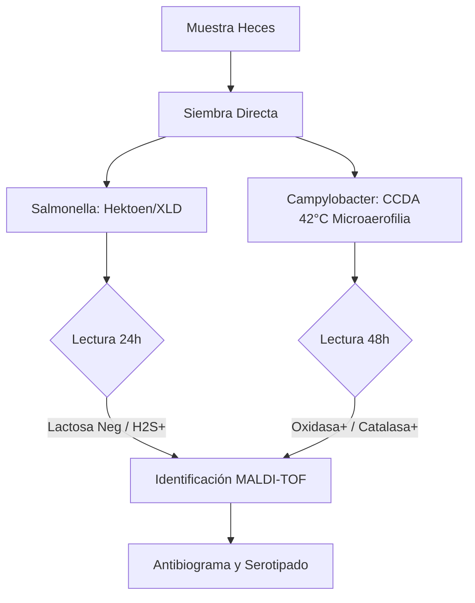
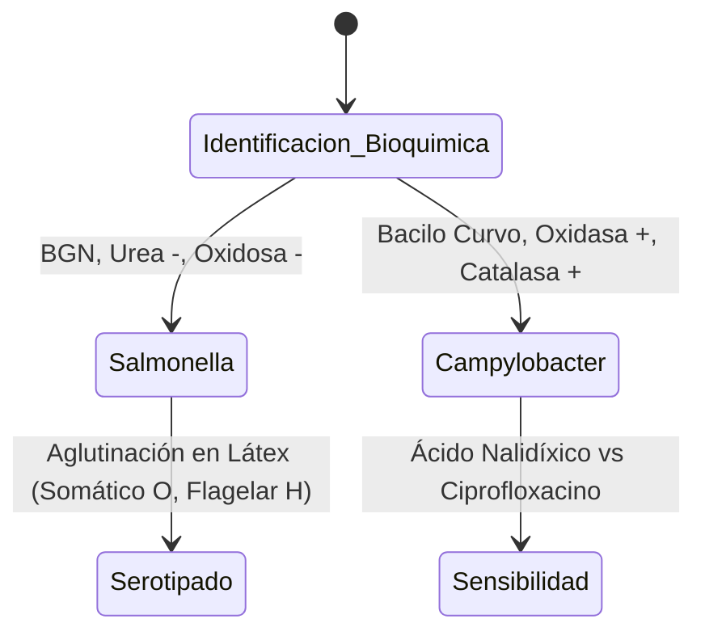

# Semana 4: Microbiología
## Lección 3: Campylobacteriosis y Salmonelosis

### 1. Título y Resumen (Abstract)
**Título:** Abordaje Bacteriológico de la Gastroenteritis Aguda: Estrategias de Cultivo Selectivo e Identificación Proteómica por MALDI-TOF.
**Resumen:** Este artículo analiza la fisiopatología de las infecciones entéricas causadas por *Salmonella* y *Campylobacter*. Se evalúan las técnicas de enriquecimiento y selección en medios específicos (Hektoen, CCDA) y se fundamenta la identificación mediante espectrometría de masas. Se destaca el papel del TSLCB en la gestión de la microaerofilia y la notificación obligatoria a Salud Pública para el control de brotes alimentarios.

### 2. Introducción (Fundamentos y Objetivos)
#### 2.1. Gastroenteritis Bacteriana: Etiopatogenia (Módulo 1370)
El currículo de **Fisiopatología General** (Módulo 1370) describe las infecciones gastrointestinales. *Salmonella* y *Campylobacter* son los principales agentes de zoonosis alimentaria.
1.  **Salmonella (BGN):** Bacteria intracelular facultativa. Invade las células M intestinales.
2.  **Campylobacter jejuni:** Bacilo Gram negativo curvo ("en ala de gaviota"). Produce enterotoxinas y es un precursor del Síndrome de Guillain-Barré.

#### 2.2. Medios de Cultivo y Aislamiento (Módulo 1373)
El **Módulo de Microbiología Clínica** exige el dominio de la siembra y medios:
- **Medios Selectivos y Diferenciales:** 
    - **Hektoen / SS / XLD:** Para *Salmonella*. Se basan en la no fermentación de lactosa y producción de $H_2S$ (colonias con centro negro).
    - **Medios Enriquecidos (CCDA):** Para *Campylobacter*. Contienen carbón y antibióticos para inhibir flora acompañante.
- **Condiciones de Incubación:** 
    - *Salmonella*: Aerobiosis, 37°C.
    - *Campylobacter*: **Microaerofilia** ($5\% O_2, 10\% CO_2$), **Termofilia** (42°C).

#### 2.3. Identificación Proteómica (MALDI-TOF) (Módulo 1368)
El TSLCB aplica nuevas tecnologías:
- **Principio:** Desorción/ionización por láser asistida por matriz. Analiza el espectro de proteínas ribosómicas.
- **Ventaja:** Identificación en minutos frente a las 24h de las galerías bioquímicas tradicionales.

**Objetivo:** Sistematizar el flujo de trabajo del coprocultivo según el Plan de Calidad de la Comunidad de Madrid.

### 3. Material y Métodos
- **Entorno:** Laboratorio de Microbiología Clínica, Hospital Universitario de Getafe.
- **Intervenciones:** Siembra sistemática en Hektoen/XLD y CCDA/Preston. Uso de jarras de microaerofilia con generadores químicos de atmósfera. Identificación por Bruker Biotyper (MALDI-TOF). Detección molecular rápida mediante FilmArray GI.

### 4. Resultados (Hallazgos Experimentales)
Diferenciación técnica y bioquímica:

### 5. Discusión y Conclusiones
MALDI-TOF ha desplazado a las galerías bioquímicas (API) por ahorro de tiempo y costes. Se concluye que el TSLCB es el garante de la viabilidad de *Campylobacter*, cuya fragilidad ante el oxígeno libre requiere un procesado inmediato o el uso riguroso de medios de transporte. La detección de *Salmonella Typhi* constituye una urgencia de Salud Pública que debe comunicarse en < 24 horas.

### 6. Agradecimientos
Al equipo de Vigilancia Epidemiológica de Getafe por la coordinación en la trazabilidad de los brotes de toxoinfección alimentaria.

### 7. Bibliografía (Literatura Citada)
- **CDC - Salmonella Information for Healthcare Professionals.** [Ver en cdc.gov](https://www.cdc.gov/salmonella/hcp/index.html)
- **CDC - Campylobacter Information for Healthcare Professionals.** [Ver en cdc.gov](https://www.cdc.gov/campylobacter/hcp/index.html)
- **Procedimientos en Microbiología Clínica: Diagnóstico microbiológico de las infecciones bacterianas gastrointestinales - SEIMC.** [Ver en seimc.org](https://seimc.org/documentos-cientificos/procedimientos-microbiologia)
- **WHO: Food Safety - Fact Sheets on Salmonella and Campylobacter.** [Ver en who.int](https://www.who.int/news-room/fact-sheets/detail/salmonella-(non-typhoidal))

### 8. Charla y Transcripción (Contenido Multimedia)

**Enlace al vídeo:** [Ver en YouTube](https://www.youtube.com/watch?v=6j-OpDFC8L8)

#### Transcripción de la Sesión
Hola, buenos días. Yo soy Alba García Sáez, residente de primer año de microbiología del Hospital Universitario de Getafe. Y hoy os voy a hablar de una de las infecciones de las que más muestras recibimos en el laboratorio, que es la gastroenteritis bacteriana y, en concreto, de las dos que más aislamos, que son la Campylobacteriosis y la Salmonelosis. Este es el índice que voy a seguir. Primero haré una breve introducción sobre qué microorganismos producen estas enfermedades; luego hablaré de cada una por separado y luego describiré cómo es el diagnóstico en el laboratorio, que es común para ambas. En general, como ya os he dicho, la Campylobacteriosis y la salmonelosis son las dos eh bacterias o microorganismos que más frecuentemente producen diarrea en nuestro país, junto con otros como virus o otros parásitos que ha escrito mi compañera anteriormente. Eh, son lo que se denominan zoonosis de transmisión alimentaria. Esto significa que los animales son el reservorio y que nosotros nos infectamos por la vía fecal-oral, bien sea por contacto directo con los animales o por consumir alimentos o aguas contaminadas por sus heces. Eh, son eh patógenos entéricos intestinales, lo que significa que lo que producen es un daño de la mucosa intestinal o que liberan una toxina; y esto lo que produce es que haya una secreción neta de agua y de electrolitos a la luz intestinal, produciendo la diarrea. Eh, como hemos dicho, son una gran causa de morbilidad y también de mortalidad, sobre todo en países en en desarrollo y en ancianos o en o en niños. Comenzaremos hablando del género Campylobacter. El género Campylobacter pertenece a la familia Campylobacteraceae. Son bacilos gramnegativos, curvos en forma de ese o de alas de gaviota, que además suelen tener un flagelo que les confiere una movilidad característica, como si fuera de un sacacorchos. Son microorganismos microaerófilos. Esto significa que para crecer necesitan una atmósfera con una menor concentración de oxígeno que el aire ambiental. Concretamente, entre un 5% y un 10% de oxígeno; y que además tienen un crecimiento óptimo a 42 grados. Por eso se les denomina también camplicobacterias termófilas. De todas las especies que existen, las más frecuentemente aisladas son Campylobacter jejuni, que representa el 90% de los casos, y secundariamente Campylobacter coli. En cuanto a su importancia, como he dicho, es la principal causa bacteriana de diarrea en los países desarrollados. El reservorio suelen ser eh aves de corral como gallinas, pavos o aves silvestres, pero también el ganado vacuno o perros y gatos. Por tanto, la infección se va a producir al consumir un alimento que esté contaminado con excrementos, por ejemplo eh carne de pollo que no esté suficientemente cocinada. pero también por leche que no esté pasterizada o por agua contaminada. Además, es un microorganismo que tiene una dosis infectiva muy baja. Esto significa que solo con unos pocos microorganismos que ingiramos eh ya se produce la enfermedad. Clínicamente, eh se caracteriza por una diarrea que puede ser acuosa o puede ser también eh disentérica. Esto significa que es sanguinolenta o que tiene restos de pus o de moco. Se además acompaña de náuseas, fiebre, malestar y dolores estomacales. Por lo general, se trata de una enfermedad autolimitada que dura pocos días y que no eh necesita de un tratamiento específico, salvo que sea un cuadro que se alargue o que sea un cuadro grave en una persona que esté inmunodeprimida. En estos casos, pues eh los antibióticos de elección suelen ser los macrólidos como la azitromicina. Sin embargo, Campylobacter tiene importancia porque puede dar lugar a complicaciones graves, como por ejemplo eh el síndrome de Gilen Barré, que produce una parálisis muscular ascendente, porque se producen anticuerpos que reaccionan contra los nervios. o la artritis reactiva que eh después de haber tenido la diarrea pues eh te empiezan a doler las articulaciones. En cuanto al género de Salmonella. Salmonella pertenece a la familia de las enterobacterias. Son bacilos gramnegativos, también son móviles por un flagelo, aunque estos e son anaerobios facultativos. Eh, su diagnóstico eh y su clasificación es un poco compleja. Actualmente eh dentro del género Salmonella se distinguen dos especies que son Salmonella entérica y Salmonella bongori. Salmonella entérica tiene además a su vez seis subespecies. La subespecie que más infecta eh en humanos es la Salmonella entérica subespecie entérica. Esta e subespecie tiene muchísimos serotipos. Los serotipos se definen según su estructura eh de antígenos. Es decir, por la pared eh que es el antígeno o o por los flagelos que es el antígeno h. De todos los serotipos que hay, los más frecuentes que producen diarrea son Salmonella typhimurium y Salmonella enteritidis. Eh, existe otro tipo de Salmonella que es el serotipo eh typhi y paratyphi que son muy importantes porque en vez de diarrea lo que producen es una encefalo eh una enfermedad sistémica eh que es la fiebre tifoidea y paratifoidea. Eh, la salmonela que produce diarrea que se denomina Salmonella no tipo idea tiene su reservorio eh también en muchísimos animales como eh el ganado, las aves, los cerdos e incluso las mascotas como tortugas o serpientes. Nosotros nos infectamos de nuevo por consumir alimentos que estén contaminados, sobre todo huevos pero también leche o vegetales o de nuevo por contacto directo con los animales. Tiene una dosis infectiva más alta que Campylobacter. Esto significa que necesitamos consumir un mayor número de microorganismos para que se produzca la enfermedad. Clínicamente eh se caracteriza por un inicio brusco de náuseas, vómitos, dolor abdominal y diarrea de tipo acuoso pero que puede de nuevo volverse eh sanguinolenta. De nuevo la mayoría de los casos son autolimitados y no requieren tratamiento. El tratamiento de elección en este caso pues eh suelen ser las quinolonas como el ciprofloxacino o las de cefalosporinas de de tercera generación. Por último, eh voy a explicaros cómo es el diagnóstico en el laboratorio que, como os he dicho, es común para estos dos microorganismos. Eh, la muestra que se requiere es una muestra eh de heces, lo que se denomina coprocultivo. Eh, se deben recoger eh las heces eh y pues o llevarlas frescas al laboratorio procesarlas en menos de 2 horas o si no pues se debe utilizar un medio de transporte. El medio de transporte que se suele utilizar es el Carib Blair que tiene un eh conservante que ayuda a que las bacterias eh pues no se mueran. En el laboratorio cuando recibimos estas heces lo que hacemos es sembrarlas en placas que contienen unos medios que eh tienen sustancias eh nutricionales que ayudan a que crezcan estos microorganismos y que además tienen antibióticos que impiden que crezcan las otras bacterias normales de la microbiota intestinal. Eh, como os he dicho, para Campylobacter se necesitan eh medios especiales y seleccionados que tienen pues distintos antibióticos como carm o anfotericina, polimixina que impiden eh que crezca Salmonella u otros microorganismos. Campylobacter también un medio muy muy eh utilizado hoy en día es el CCDA que además de antibióticos tiene carbón que neutraliza pues el resto de de los residuos de las heces y de nuevo pues para que la salmonela por ejemplo no pueda crecer sobre él. Como he dicho de Campylobacter jejuni necesita una atmósfera de microaerofilia por lo que se incuban en estas jarras que veis en la imagen eh que de pues se consigue esta atmósfera metiendo un sobre que tiene una mezcla de de gases. Salmonella entérica eh perdón, en cuanto a la Salmonella uh perdón por Salmonella entérica los medios de de diagnóstico más frecuentes son el agar Hektoen que es este de color verde. En él Salmonella utiliza las peptonas y eh produce unos eh unas colonias que se denominan eh incoloras y que además como Salmonella produce ácido sulfídrico el ácido sulfídrico reacciona con con las sales de hierro del medio y se produce un precipitado de color negro característico en el centro. La microscopía eh por tinción de Gram eh tiene tiene poca utilidad en el coprocultivo porque hay muchísimas bacterias en las heces eh que por tinción de Gram son todas iguales, son todos bacilos gramnegativos. No podemos distinguir una salmonela de una Shigeru o de una ecolia. Eh, Campylobacter sí se ve de forma característica, como he dicho, tiene esa forma curva pero igualmente eh sigue habiendo otros microorganismos que se pueden parecer y por tanto no no se usa de forma rutinaria. Una vez que ya tenemos el crecimiento en nuestra placa lo que debemos hacer es la identificación, para saber exactamente qué especie eh tenemos en nuestro cultivo. Eh, para ello primero se suelen utilizar unas pruebas bioquímicas rápidas que se hacen en escasos segundos. Por ejemplo, la de la oxidasa o de la catalasa que en ambos eh son positivas. Y también para diferenciar Campylobacter jejuni de Campylobacter coli se utiliza la prueba de la hidrólisis del hipurato que solo es positiva para jejuni. Eh, hoy en día este proceso está eh muy agilizado eh gracias a la espectrometría de masas o MALDI-TOF. El MALDI-TOF lo que hace es detectar de forma muy rápida las proteínas de la superficie del microorganismo dándonos una identificación certera de qué bacteria eh es en tan solo pues unos escasos segundos. Por último, eh se debe realizar eh un serotipado eh en este caso por ejemplo para Salmonella para determinar eh pues esto que os contaba de qué antígenos tiene y saber si es typhi o no. Y eh para ambos eh microorganismos es obligatorio realizar un antibiograma que nos diga a qué antibióticos son eh pues sensibles estos microorganismos. Eh, otra técnica que se usa que eh cada vez eh está pues eh más eh disponible en todos los laboratorios es la PCR. Como han explicado anteriores compañeras, la PCR eh detecta directamente el ADN de los microorganismos eh de los de las heces, de modo que es un diagnóstico que es eh mucho más rápido eh pero que eh al no obtener eh el microorganismo en cultivo eh pues no podemos ni saber el antibiograma ni nada similar por lo que siempre se debe pedir el cultivo de forma conjunta. Y por mi parte nada más, muchas gracias y eso espero que hayáis aprendido algo de de gastroenteritis.

#### Explicación de la Ponencia
Esta ponencia describe los protocolos estándar para el aislamiento de enteropatógenos:
1.  **Diferenciación Metabólica:** Fundamentos del uso de medios selectivos y diferenciales (Lactosa, H2S) para la identificación presuntiva de *Salmonella*.
2.  **Requerimientos de Incubación:** Manejo de atmósferas microaerófilas y temperaturas termofílicas (42°C) para optimizar el crecimiento de *Campylobacter*.
3.  **Confirmación Bioquímica:** Importancia del test del hipurato para la diferenciación de especies dentro del género *Campylobacter*.
4.  **Serotipificación:** Manual de uso de antisueros para la clasificación de *Salmonella* según el esquema de Kauffmann-White.

---
### Sobre la Ponente
**Alba García Sáez** es Médica Residente (MIR) de Microbiología en el **Hospital Universitario de Getafe**.

*Material pedagógico actualizado según los estándares de FP Grado Superior.*
