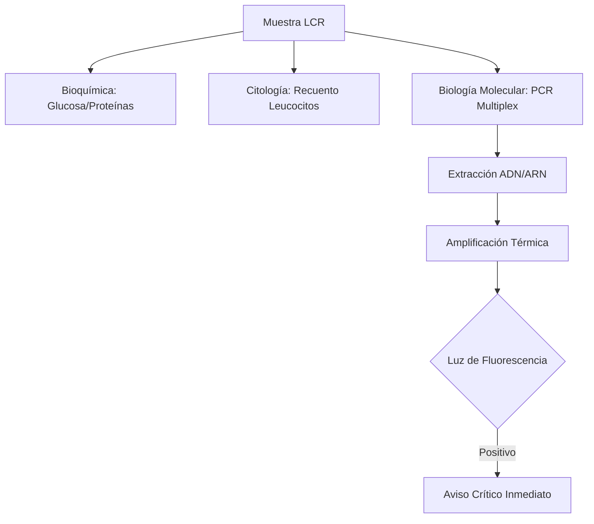
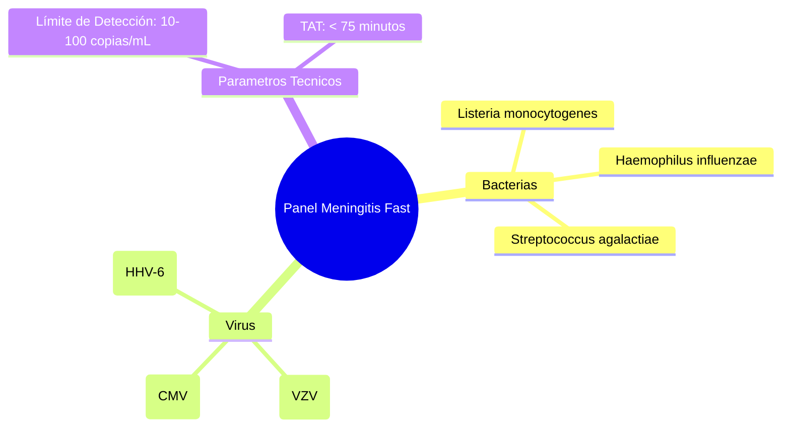

# Semana 4: Microbiología
## Lección 4: Meningitis: PCR rápida para microorganismos neurotropos

### 1. Título y Resumen (Abstract)
**Título:** Eficacia Diagnóstica de la PCR Sindrómica de Punto de Atención en la Urgencia Neuro-Infecciosa: Implementación de la Metodología Multiplex.
**Resumen:** Este artículo analiza la revolucionaria transición del cultivo microbiológico tradicional a los paneles de PCR múltiple en tiempo real para el estudio del líquido cefalorraquídeo (LCR). Se evalúan los fundamentos moleculares de las dianas bacterianas, virales y fúngicas, analizando cómo la reducción del tiempo de respuesta (TAT) de 48h a 1h impacta en la supervivencia del paciente y el ahorro farmacológico.

### 2. Introducción (Fundamentos y Objetivos)
#### 2.1. Fisiopatología de las Infecciones del SNC (Módulo 1370/1373)
El currículo de **Fisiopatología General** (Módulo 1370) incluye las patologías del sistema nervioso. La meningitis es la inflamación de las meninges, con alteración de la barrera hematoencefálica (BHE).
- **Agentes Etiológicos (Módulo 1373):** Varían según la edad.
    - Neonatos: *S. agalactiae*, *E. coli*.
    - Adultos: *S. pneumoniae*, *N. meningitidis*.
    - Virus: Enterovirus, Herpes.

#### 2.2. Biología Molecular: Fundamentos de la PCR (Módulo 1369)
El **Módulo de Biología Molecular** establece el estudio de la amplificación de ácidos nucleicos:
1.  **Extracción (Lisis):** Rotura celular para liberar ADN/ARN. En LCR es crítico por el bajo número de microorganismos.
2.  **Amplificación (PCR):** Ciclos de desnaturalización ($95^\circ\text{C}$), hibridación de cebadores y extensión por la polimerasa.
3.  **Detección en Tiempo Real:** Uso de sondas fluorescentes (TaqMan) que permiten la lectura del resultado durante la amplificación (Módulo 1369).

#### 2.3. Gestión de Muestras y Bioseguridad (Módulo 1367/1368)
- **Procesamiento de LCR:** Muestra preciada e irrepetible. El TSLCB debe procesarla bajo condiciones de esterilidad absoluta y en Cabina de Seguridad Biológica (CSB) Clase II (Módulo 1368).
- **Valores de Pánico:** Elevación de proteínas (hiperproteinorraquia) y descenso de glucosa (hipoglucorraquia) refuerzan la sospecha bacteriana (Módulo 1371).



**Objetivo:** Sistematizar el flujo de validación de "Valores de Pánico" en el LCR según los protocolos de la Comunidad de Madrid.

### 3. Material y Métodos
- **Diseño:** Estudio técnico-intervencionista en entorno de urgencias.
- **Entorno:** Laboratorio de Urgencias y Microbiología, Hospital Universitario de Fuenlabrada.
- **Intervenciones:** Uso de plataformas BioFire FilmArray (Meningitis/Encephalitis Panel).
- **Procesamiento:** El TSLCB realiza la carga de 200 µL de LCR en el cartucho bajo campana de seguridad biológica clase II.

### 4. Resultados (Hallazgos Experimentales)
Eficacia comparada y panel de dianas:

```mermaid
flowchart TD
    P[Paciente Grave] --> LCR[Punción Lumbar]
    LCR --> P_Lab[Procesado Inmediato PCR]
    P_Lab --> Report[Aviso al Clínico < 2h]
    Report --> Therapy[Ajuste Antibiótico / Antiviral]
    Report --> Isol[Aislamiento Respiratorio (si N. men)]
```

### 5. Discusión y Conclusiones
La PCR diagnóstica es el avance más relevante en medicina intensiva de la última década. Se concluye que el TSLCB es el eslabón fundamental en la rapidez informativa: cada minuto de retraso en la carga del cartucho aumenta el riesgo de secuelas neurológicas permanentes. Se destaca que un resultado negativo en PCR no descarta meningitis si hay alta sospecha clínica, requiriendo siempre completar el cultivo de 48h.

### 6. Agradecimientos
A los servicios de Microbiología de la CM por la creación de la red de diagnóstico rápido molecular.

### 7. Bibliografía (Literatura Citada)
- **IDSA Practice Guidelines for the Management of Bacterial Meningitis.** [Ver en idsociety.org](https://www.idsociety.org/practice-guideline/management-of-bacterial-meningitis/)
- **BioFire FilmArray Meningitis/Encephalitis (ME) Panel - Technical Support.** [Ver en biomerieux.com](https://www.biomerieux.com/en/products/biofire-filmarray-meningitisencephalitis-me-panel)
- **Procedimientos en Microbiología Clínica: Diagnóstico microbiológico de las infecciones del sistema nervioso central - SEIMC.** [Ver en seimc.org](https://seimc.org/documentos-cientificos/procedimientos-microbiologia)
- **CDC - Meningitis Information for Healthcare Professionals.** [Ver en cdc.gov](https://www.cdc.gov/meningitis/hcp/index.html)

### 8. Charla y Transcripción (Contenido Multimedia)

**Enlace al vídeo:** [Ver en YouTube](https://www.youtube.com/watch?v=fwtZ1kj5kno)

#### Transcripción de la Sesión
Hola a todos. Yo soy Alba, R4 de análisis clínicos del Hospital Universitario de Fuenlabrada. Y hoy os voy a hablar sobre la meningitis y cómo se diagnostica mediante un panel de PCR rápida de lo que se llama Point of Care. Empezando por la definición de lo que es una meningitis, es la inflamación de las meninges, que son las membranas que recubren nuestro cerebro y la médula espinal. Es una emergencia médica y debe ser tratada de forma inmediata porque eh puede ser eh puede comprometer la vida del paciente o dejarle importantes secuelas. Estas eh meningitis pueden ser de causa infecciosa o no infecciosa. Las no infecciosas eh suelen estar producidas por algún tipo de traumatismo o una operación del cerebro reciente o por tumores; y las infecciosas, que son las que me voy a centrar yo, eh pueden estar causadas por bacterias, virus o hongos. En el paciente lo que vamos a ver es lo que se denomina la tríada clásica que todo médico conoce, que es la fiebre, el dolor de cabeza y la rigidez de nuca. Otros síntomas que pueden presentar son las náuseas, vómitos, la fotofobia (que es que te moleste la luz) o incluso cambios en el estado de conciencia o que el paciente esté eh obnubilado o coma. Eh, como os decía, eh dependiendo de la etiología de la meningitis eh tendremos pues unas bacterias u otras. Las más frecuentes, pues eh en adultos son Streptococcus pneumoniae o Neisseria meningitidis y luego en pacientes más eh mayores o con factores de riesgo, tenemos que pensar en Listeria monocytogenes; y en niños ha disminuido mucho gracias a las vacunas, pero todavía aparece Haemophilus influenzae o Streptococcus agalactiae. En cuanto a lo que son los virus, los más frecuentes son los enterovirus, eh luego los herpes virus, como el herpes simple o el herpes zóster; y luego en menor frecuencia otros virus eh más específicos. Eh, antes de comenzar con el diagnóstico microbiológico de la meningitis me gustaría resaltar la importancia clínica del líquido de cefaloraquídeo, que es la muestra con la que vamos a trabajar. Eh, el LCR es el líquido que eh rodea todo nuestro sistema nervioso central y eh pues se suele extraer por una punción lumbar dándole un pinchazo al paciente en la espalda. Eh, esta muestra eh es es de vital importancia porque es lo que nos va a permitir eh pues eh diagnosticar al paciente. En el laboratorio cuando recibimos eh este líquido céfalo raquídeo lo primero que vamos a observar son unos hallazgos eh bioquímicos y citológicos que nos van a orientar la causa de la meningitis. Eh, si es una causa bacteriana típicamente vamos a encontrar muchísimos eh leucocitos de tipo polimorfonuclear o neutrófilos, una glucosa en el líquido que es muy bajita frente a la del paciente (porque la bacteria consume esa glucosa), las proteínas están elevadas y el lactato también está muy elevado. Por contra, en una meningitis que es de tipo viral el recuento de células es más bajito, eh los leucocitos suelen ser mononucleares, linfocitos, y la glucosa y de normal es normal frente a la a la glucosa del paciente, eh las proteínas están poco elevadas y el lactato suele estar normal. En cuanto a la causa fúngica es un caso intermedio eh donde pues eso la glucosa no está tan baja, las proteínas pues eh tampoco tan elevadas eh y suele presentarse con eh leucocitos mononucleares. El diagnóstico de referencia, el Gold Standard de la meningitis bacteriana es el gram y el cultivo. El gram eh se hace pues de forma rápida unos 15 20 minutos desde la llegada de la muestra y el cultivo pues como bien sabéis eh suele haber eh suele haber que esperar a que la bacteria crezca, lo cual lleva entre 24 y 48 horas. ¿Cual es el problema del gran y el cultivo? Pues que tienen eh una baja sensibilidad, hay pocos microorganismos en el líquido tésalo raquídeo, y que además si el paciente ha recibido dosis de antibiótico antes de que nosotros hagamos la punción lumbar pues eh es posible que disminuya la sensibilidad eh y que eh no que no podamos identificar el microorganismo. Sin embargo, en el laboratorio pues eh como os digo con el polivalente el FilmArray Me que es un panel de de de PCR rápida y esto es el gran eh cambio y la mayor importancia que que tenemos hoy en día diagnóstico de la meningitis. Eh, mediante este panel eh se detectan de forma específica eh bacterias, virus o hongos que más frecuentemente producen la meningitis. Como os digo es un sistema que es Point Of Care. Esto significa que eh se diagnostica eh al lado del paciente, o sea se no se suele estar en todo el laboratorio o por un microbiólogo que lo eh que haya que montarlo, sino que cualquier persona en un laboratorio eh de urgencias eh puede eh montarlo y sacarlo en solamente en 60 70 minutos. Eh, es un sistema automático que hace ya la PCR y la lisis y lo hace todo e identifica pues ya bacterias, virus o hongos. Eh, las bacterias que están metidas en este panel son las de que he comentado antes, Streptococcus pneumoniae, Neisseria meningitidis, Haemophilus influenzae, Listeria monocytogenes, Streptococcus agalactiae y Escherichia coli k1. Los virus más importantes como os decía son los enterovirus, los herpes simples 1 y 2, el virus de la varicela-zoster, el virus del peste bar, el citomegalovirus y eh el herpes eh virus humano tipo 6; y el hongo que está metido es Cryptococcus neoformans. Eh, la importancia de este diagnóstico rápido eh es fundamental para saber qué tenemos y poder de forma inmediata dar el tratamiento eh correspondiente al clínico. Por ejemplo, en el caso de las bacterias permite eh de reducir el tiempo para poner el antibiótico dirigido eh de modo que eh pues el paciente pues eso tenga menos secuelas; y en el caso de los virus permite por un lado no poner antibióticos innecesarios y quitar el aislamiento respiratorio en caso de que sospechemos que pueda ser un meningococo y no lo sea, o incluso en el caso de los herpes pues ponerle el la ciclovir que es su tratamiento de elección. Eh, este sistema por tanto es un cambio eh brutal eh dentro del diagnóstico de laboratorio y nada esto es un poco lo que os quería contar. Eh, muchas gracias a todos y por por vuestro tiempo.

#### Explicación de la Ponencia
Esta sesión técnica resalta la transformación del diagnóstico de meningitis mediante biología molecular:
1.  **Parámetros Diferenciales:** Revisión de los perfiles bioquímicos (Ratio Glucosa LCR/Plasma < 0.6) y citológicos que orientan hacia una etiología bacteriana.
2.  **Tecnología 'Point-of-Care' (POCT):** Funcionamiento del sistema de cartuchos cerrados que minimizan el error humano y aceleran el tiempo de respuesta (TAT).
3.  **Interpretación de Curvas:** Importancia de la validación técnica de los ciclos de amplificación (CT) y el control interno para asegurar la calidad del resultado.
4.  **Optimización Terapéutica:** Impacto clínico de la detección rápida de virus y hongos en la reducción de estancias hospitalarias y costes farmacológicos.

---
### Sobre la Ponente
**Alba Cano Rodríguez** es Residente de 4º año (R4) de Análisis Clínicos en el **Hospital Universitario de Fuenlabrada**.

*Manual técnico profesional para el Técnico Superior en Laboratorio Clínico y Biomédico.*
