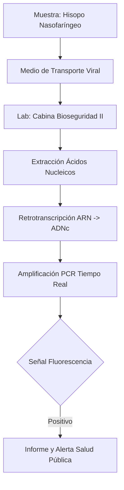
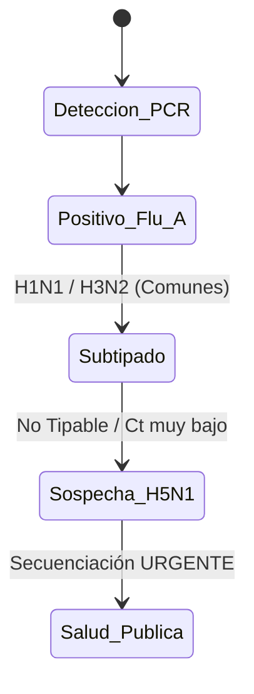

# Semana 4: Microbiología
## Lección 5: Virus Respiratorios: Diagnóstico en la Era Post-Pandemia

### 1. Título y Resumen (Abstract)
**Título:** Vigilancia Molecualar de la "Tripledemia" (SARS-CoV-2, Influenza y VRS): Fundamentos del Diagnóstico Sindrómico y Bio-seguridad en el Laboratorio de Virología.
**Resumen:** Este artículo analiza la integración de paneles combinados en el diagnóstico de infecciones respiratorias agudas. Se evalúan los fundamentos biológicos de la captación celular nasofaríngea y la cinética de replicación viral compartida entre gripe, coronavirus y virus respiratorio sincitial. Se discute la importancia de la fase preanalítica y el papel del TSLCB en la identificación de variantes emergentes y el mantenimiento de estándares de bioseguridad nivel 2+.

### 2. Introducción (Fundamentos y Objetivos)
#### 2.1. Virología de las Infecciones Respiratorias (Módulo 1373/1370)
El currículo de **Microbiología Clínica** (Módulo 1373) establece el estudio de los virus respiratorios. Estos patógenos afectan al epitelio ciliado del tracto respiratorio.
1.  **Orthomyxoviridae (Influenza A/B):** Virus ARN segmentado con envuelta. Poseen Hemaglutinina (unión) y Neuraminidasa (liberación).
2.  **Coronaviridae (SARS-CoV-2):** Virus ARN monocatenario positivo con espículas (proteína S) que se unen al receptor ACE2 (Módulo 1370).
3.  **Paramyxoviridae (VRS):** Causante de bronquiolitis; capacidad de formar sincitios celulares.

#### 2.2. Técnicas de Diagnóstico Rápido y Molecular (Módulo 1373/1369)
El TSLCB debe aplicar flujos de trabajo de alta sensibilidad:
- **Inmunocromatografía (Módulo 1372):** Detección rápida de antígenos (Gripe, VRS). Baja sensibilidad frente a la PCR.
- **RT-qPCR (Módulo 1369):** Técnica de referencia.
    - **Retrotranscripción (RT):** Paso de ARN viral a ADN complementario (ADNc) mediante la transcriptasa inversa.
    - **qPCR:** Amplificación con sondas de hidrólisis (TaqMan) marcadas con fluorocromos.

#### 2.3. Bioseguridad y Gestión de Muestras (Módulo 1367/1368)
- **Toma de Muestra (Módulo 1367):** Exudado nasofaríngeo u orofaríngeo. Uso de medios de transporte viral (VTM/UTM) con conservantes y antibióticos.
- **Contención (Módulo 1368):** Procesado en Cabinas de Seguridad Biológica de Clase II. Uso de EPIs según el nivel de riesgo biológico.

**Objetivo:** Sistematizar el flujo de vigilancia epidemiológica para la detección de brotes de Gripe Aviar o nuevas variantes de Coronavirus según los protocolos de la CM.

### 3. Material y Métodos
- **Diseño:** Estudio observacional descriptivo de vigilancia estacional.
- **Entorno:** Laboratorio de Microbiología, Hospital Universitario de Fuenlabrada.
- **Intervenciones:** Uso de hisopos flocados (Copan), plataformas de extracción magnética rápida y equipos de PCR en tiempo real de alto rendimiento.

### 4. Resultados (Hallazgos Experimentales)
Diferenciación de estadios infectivos y alertas:

### 5. Discusión y Conclusiones
La calidad de la toma de muestra es el factor determinante. Se concluye que un resultado negativo en un paciente con clínica clara debe repetirse con una muestra de tracto respiratorio inferior (esputo/aspirado). El TSLCB debe actuar como vigía de la epidemiología regional, comunicando incrementos inusuales en la tasa de positividad estacional.

### 6. Agradecimientos
Al equipo de Medicina Preventiva y Salud Pública por la monitorización de la incidencia acumulada regional.

### 7. Bibliografía (Literatura Citada)
- **CDC - Respiratory Viruses: Clinical Guidelines and Laboratory Testing.** [Ver en cdc.gov](https://www.cdc.gov/respiratory-viruses/index.html)
- **ECDC - Seasonal Influenza and Other Respiratory Viruses Surveillance.** [Ver en ecdc.europa.eu](https://www.ecdc.europa.eu/en/seasonal-influenza)
- **Sistemas de Vigilancia de Gripe y Otros Virus Respiratorios - ISCIII.** [Ver en isciii.es](https://www.isciii.es/QueHacemos/Servicios/VigilanciaSaludPublicaRENAVE/)
- **WHO - Influenze and other Respiratory Viruses: Surveillance and Response.** [Ver en who.int](https://www.who.int/teams/global-influenza-programme)

### 8. Charla y Transcripción (Contenido Multimedia)

**Enlace al vídeo:** [Ver en YouTube](https://www.youtube.com/watch?v=OrecN5ZYILE)

#### Transcripción de la Sesión
Buenos días a todos. Mi nombre es Javier Ganado León. Soy facultativo de análisis clínicos del Hospital Universitario de Fuenlabrada y hoy os voy a hablar de los virus respiratorios. Los virus respiratorios son la principal causa de infección en humanos. Eh, tienen su importancia clínica eh porque producen un una gran frecuencia de hospitalizaciones, producen muchísimas eh visitas a los servicios de urgencia y en definitiva eh suponen un gran gasto sanitario. Eh, de todos los virus que hay me voy a centrar en tres que son el virus de la gripe, el virus respiratorio sincitial y el virus que nos ha vuelto a todos un poco locos estos últimos años, que es el SARS-CoV-2. ¿Cómo eh nos infectan estos virus? Pues bueno, suelen tener un mecanismo de transmisión en general por góticas de o por aerosoles cuando estamos eh cerquita de una persona pues que está estornudando o tosiendo o hablando. Eh, y de forma general el virus exeh se une a receptores específicos de nuestras células de la epitelio respiratorio, eh se introduce dentro de ellas y utiliza nuestra propia maquinaria para poder replicarse. Una vez que ya se ha eh multiplicado pues eh estos nuevos biriones eh salen de de la célula y van a infectar eh a otras células o de otras personas. Clínicamente presentan unos síntomas generalizados como la fiebre, la tos, el dolor de garganta, la congestión nasal e incluso a veces cefaleas y mialgias. Empezando por el virus de la gripe, el virus de de la gripe pertenece a la familia Orthomyxoviridae. Eh, es un virus de RNA de cadena simple y que tiene una característica muy importante y es que su genoma está segmentado en ocho partes. Eh, esto eh tiene importancia porque eh lo que le va a dar a la gripe es la capacidad de tener muchísimas variaciones. Eh, existen tres tipos de virus de la gripe, la A, la B y lación o gripe C. La que más nos interesa es la gripe A, porque eh tiene una gran capacidad de infectar a muchísimas especies y eh como os decía debido a este genoma segmentado, tiene una gran variabilidad. Estas eh variaciones genéticas eh pueden ser de dos tipos. Eh, una deriva génica (o drift) que se produce por pequeñas eh mutaciones que se van acumulando y que es lo que hace que eh pues eh cada año tengamos brotes estacionales de gripe y que por ejemplo eh yo si tengo un anticuerpo frente a la gripe del año pasado, pues este año ya no me sirva y por eso eh la vacuna siempre hay que cambiarla cada año. Eh, pero aparte existe lo que es el salto genético (o el shift) que se produce de forma mucho más brusca cuando dos virus eh diferentes una gripe de una ave y una gripe humana coinciden en el mismo huésped y se intercambian sus segmentos de DNA perdón de RNA dándonos lugar a un virus completamente nuevo frente al cual la población no tiene ningún tipo de inmunidad y eh lo que daría lugar a una pandemia, como ya ocurrió eh pues en 1918 con la gripe española o eh con la gripe A de 2009. El virus respiratorio sincitial por su parte eh pertenece a la familia de los Paramyxoviridae. También es un virus de RNA. Eh, lo más importante de este virus es su importancia eh en niños y sobre todo en lactantes, ya que es la principal causa de bronquiolitis eh y de neumonía. El reservorio de este virus es únicamente humano y eh prácticamente pues eso antes de de que los niños cumplan los 2 años pues ya casi todos se han infectado. Eh, el tratamiento pues eh de este virus pues suele ser eh sobre todo un tratamiento de soporte, aunque existe una profilaxis con anticuerpos monoclonales para niños que pues que tengan algún tipo de factor de peligro. Eh, por último el SARS-CoV-2. El SARS-CoV-2 eh como todos sabemos eh es un una un bueno pertenece a la familia Coronaviridae eh y se une a sus al receptor ACE2 de nuestras células del epitelio respiratorio a través de su de lo que es la famosa proteína Spike (o proteína S). Eh, es un virus que eh nos pues eso no ha producido la pandemia de 2019 de la COVID-19 y que eh bueno pues hoy en día ya se ha convertido casi como en un virus estacional y el diagnóstico se hace de forma conjunta con con el resto de virus respiratorios. En cuanto a lo que es el diagnóstico nos vamos a basar principalmente en las técnicas rápidas de antígenos que las podemos tener en 15 20 minutos eh o en la PCR. Eh, la toma de muestra eh debe debe hacerse a través de un exudado nasofaríngeo o orofaríngeo. Se mete un hisopo eh en lo que es en la nariz o en la boca eh y se pues ahí se se recogen las células que tienen los virus. Esta muestra eh se debe e bueno se debe procesar de forma inmediata y para el diagnóstico molecular con PCR lo que hacemos eh en el laboratorio por contra eh perdonad eh la PCR es la técnica que eh tiene una eh mayor sensibilidad. Eh, detecta el material genético de los virus eh y eh hoy en día con lo que se llama la tripledemia eh lo que hacemos en el laboratorios es que eh hacemos un un diagnóstico conjunto eh metemos en una misma eh pocillo de PCR eh el SARS-CoV-2, influenza y VRS y eh nos lo bueno y pues el el clínico ya sabe de forma eh conjunta pues qué es lo que tiene su paciente. Con este diagnóstico de PCR podemos eh determinar además lo que es eh el CT de la PCR. El CT de la PCR eh lo que nos va a dar es una idea de la carga viral o la cantidad de virus que tiene el paciente. A menor CT eh mayor cantidad de virus tiene el paciente y por tanto eh pues eh tiene pues eh un pues eh una mayor carga viral y un mayor riesgo de para el paciente. El tratamiento eh de este virus pues eh en general suele ser un tratamiento un tratamiento de soporte pero para la gripe por ejemplo existe el oseltamivir o para el SARS-CoV-2 eh hoy en día hay algunos eh fármacos eh un fármacos eh que eh pueden ayudar de forma de como un tratamiento específico. Eh, la vacunación eh sigue ya veis por ya veis la importancia eh de la vacunación sobre todo en la gripe para prevenir casos graves. Y por mi parte nada más, eh muchas gracias por todo y espero que os haya servido esta sesión de virus respiratorios.

#### Explicación de la Ponencia
Esta ponencia técnica profundiza en la virología respiratoria desde la operativa del laboratorio:
1.  **Fundamentos de Biología Molecular:** Aplicación de la RT-qPCR (Retrotransscripción y PCR cuantitativa) para la detección de virus de RNA.
2.  **Cinética de Amplificación:** Interpretación del valor CT (Cycle Threshold) como estimador de la carga viral infectiva.
3.  **Vigilancia Epidemiológica:** Diferenciación entre el Drift y Shift antigénico en el virus Influenza y su repercusión en la composición de las vacunas anuales.
4.  **Manejo de Muestras:** Importancia de los medios de transporte viral (VTM) con estabilizadores y antibióticos para garantizar la viabilidad técnica del procesado.

---
### Sobre la Ponente
**Javier Granado León** es Facultativa Especialista de Área (FEA) de Análisis Clínicos en el **Hospital Universitario de Fuenlabrada**.

*Material pedagógico actualizado según los estándares de FP Grado Superior.*
