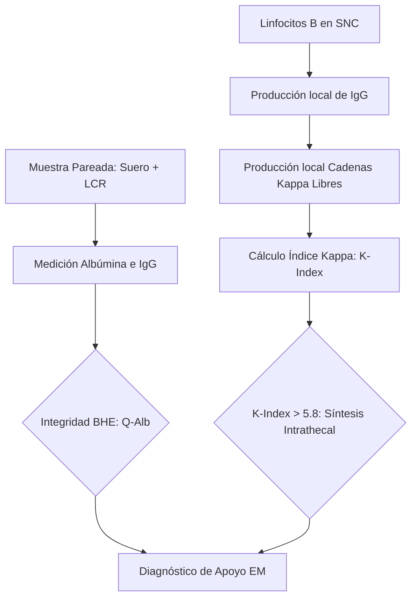
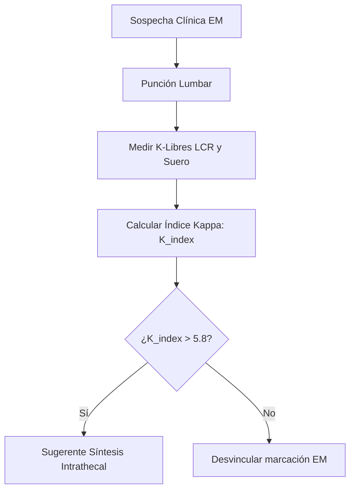
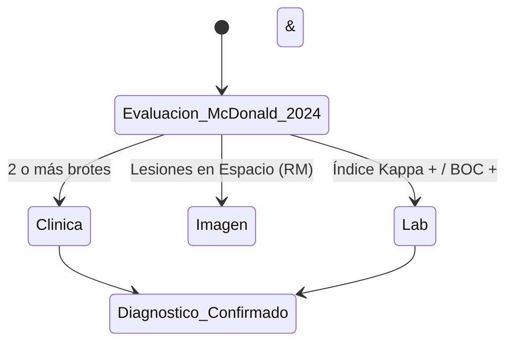

# Semana 5: Más allá de la Sangre
## Lección 19: Cadenas Kappa Libres y Esclerosis Múltiple

### 1. Título y Resumen (Abstract)
**Título:** Valor Diagnóstico del Índice de Cadenas Kappa Libres en el Líquido Cefalorraquídeo: Una Alternativa Automatizada a las Bandas Oligoclonales en la Esclerosis Múltiple.
**Resumen:** Este artículo analiza los fundamentos de la respuesta inmune intrathecal y la fisiopatología de la desmielinización en el Sistema Nervioso Central (SNC). Se evalúa la eficacia de la cuantificación de cadenas ligeras libres Kappa (FLK) frente al isoelectroenfoque de Bandas Oligoclonales (BOC). Se destaca la reciente inclusión de este marcador en los criterios de McDonald (2024), fundamentando el papel del TSLCB en la validación de índices de síntesis y la gestión de la Barrera Hematoencefálica.

### 2. Introducción (Fundamentos y Objetivos)
#### 2.1. Anatomía y Fisiología del SNC y BHE (Módulo 1370)
El currículo de **Fisiopatología General** (Módulo 1370) describe el Sistema Nervioso Central (SNC). El Líquido Cefalorraquídeo (LCR) baña el encéfalo y la médula ósea, actuando como amortiguador y sistema de transporte de nutrientes.
- **Barrera Hematoencefálica (BHE):** Estructura selectiva formada por endotelio capilar con uniones estrechas y astrocitos. Regula el paso de macromoléculas (proteínas) desde la sangre al LCR.
- **Producción y Reabsorción:** El LCR se produce en los plexos coroideos y se reabsorbe en las vellosidades aracnoideas.

#### 2.2. Inmunopatología y Desmielinización (Módulo 1370/1372)
La Esclerosis Múltiple (EM) es una enfermedad desmielinizante autoinmune.
- **Mecanismo:** Linfocitos B activados cruzan la BHE y se diferencian en células plasmáticas dentro del SNC, produciendo inmunoglobulinas (IgG) de forma local (**síntesis intrathecal**).
- **Marcadores de Síntesis (Módulo 1372):** Detectables mediante isoelectroenfoque (**Bandas Oligoclonales**) o cuantificación de cadenas ligeras libres Kappa.

#### 2.3. Fundamentos de la Cuantificación de Proteínas (Módulo 1371)
El **Módulo de Análisis Bioquímico** detalla la medición de proteínas en líquidos:
- **Nefelometría / Turbidimetría:** Medición de la dispersión de luz por complejos Ag-Ab. Permite la cuantificación exacta de Albúmina e IgG en muestras pareadas (suero y LCR).
- **Cociente de Albúmina ($Q_{Alb}$):** Marcador de la integridad de la BHE.
- **Índice de IgG / Índice Kappa:** Corrigen la síntesis intrathecal frente al paso pasivo desde la sangre.

**Objetivo:** Sistematizar el flujo de validación de neuroproteínas según los criterios revisados de McDonald 2024.

### 3. Material y Métodos
- **Diseño:** Estudio técnico-comparativo de sensibilidad diagnóstica.
- **Entorno:** Laboratorio de Neuroproteínas y Bioquímica Especializada, H.U. de Getafe.
- **Intervenciones:** Cuantificación de Albúmina y IgG en suero/LCR pareados. Determinación de Cadenas Kappa Libres mediante nefelometría cinética (BNII / Atellica). IEF en gel de agarosa para BOC.

### 4. Resultados (Hallazgos Experimentales)
Algoritmo de decisión y criterios de confirmación:

### 5. Discusión y Conclusiones
El Índice Kappa presenta una sensibilidad similar a las BOC (>95%) pero con un TAT sustancialmente menor (20 min vs 4h). Se concluye que el TSLCB debe asegurar que la muestra de suero y LCR sean tomadas simultáneamente, ya que una BHE muy dañada puede permitir el paso masivo de proteínas sanguíneas que invalidarían el índice de síntesis local. La EM ahora se define por el hallazgo coordinado de clínica, imagen y laboratorio molecular.

### 6. Agradecimientos
Al servicio de Neurología del HUGF por la validación prospectiva del punto de corte de 5.8 en el índice de síntesis.

### 7. Bibliografía (Literatura Citada)
- **The 2024 McDonald Criteria for the Diagnosis of Multiple Sclerosis.** [Ver en thelancet.com](https://www.thelancet.com/journals/laneur/article/S1474-4422(17)30470-2/fulltext)
- **Cadenas Ligeras Libres Kappa en el Diagnóstico de la Esclerosis Múltiple - SEQCML.** [Ver en seqc.es](https://www.seqc.es/es/bioquimica-en-el-laboratorio-clinico/manuales-y-monografias/)
- **National MS Society: Diagnosis of Multiple Sclerosis.** [Ver en nationalmssociety.org](https://www.nationalmssociety.org/Symptoms-Diagnosis/Diagnosing-MS)
- **StatPearls: Multiple Sclerosis.** [Ver en ncbi.nlm.nih.gov](https://www.ncbi.nlm.nih.gov/books/NBK499849/)

---
### Sobre la Ponente
**Marta María de Paula Ruiz** es Facultativa Especialista de Área (FEA) de Bioquímica Clínica en el **Hospital Universitario de Getafe**.

### 8. Charla y Transcripción (Contenido Multimedia)

**Enlace al vídeo:** [Ver en YouTube](https://www.youtube.com/watch?v=eNBsI3joktI)

#### Transcripción de la Sesión
Buenos días a todos. Mi nombre es Marta de Paula y soy facultativo, especialista en bioquímica clínica en el área de proteínas y autoinmunidad. En esta sesión que corresponde al curso de actualización de laboratorio clínico ya en su séptima edición, voy a explicaros una técnica que va a suponer un cambio importante en el estudio del líquido céfalorraquídeo para el diagnóstico de la esclerosis múltiple. Y esto es la determinación de las cadenas ligeras capa libres en líquido céfaloraquídeo.

Para estructurar la sesión comenzaremos con una breve definición de la esclerosis múltiple y los conceptos clave para situarnos. Se repasarán los criterios de McDonald's, que son nuestro marco de referencia, y luego analizaremos los marcadores biológicos, desde las clásicas bandas oligoclonales hasta la determinación de capa lidiéndonos en los índices necesarios para su interpretación. Finalmente, propondremos una estrategia diagnóstica eficiente para y para terminar con las conclusiones y la bibliografía de apoyo.

Para abordar el tema debemos conocer que la esclerosis múltiple es un trastorno neurológico crónico, desmirinizante, degenerativo, inflamatorio y autoinmune que afecta al sistema nervioso central. La esquilarosis múltiple es la enfermedad desmielinizante más frecuente del sistema nervioso central y se considera la primera causa de discapacidad no traumática en adultos jóvenes. Es verdad que puede aparecer a lo largo de toda la vida, pero los síntomas suelen iniciarse en torno a los 25 30 años y la edad promedio de diagnóstico a nivel mundial son 32 años. es una enfermedad más prevalente en mujeres con una ratio aproximada de 21 y es una enfermedad multifactorial, es decir, el componente genético interacciona con los factores ambientales para desarrollar la enfermedad. Y entre esos factores ambientales que se sabe que interaccionan con los factores genéticos, encontramos tabaquismo, la infección por el virus de bar y la obesidad en la adolescencia.

En el laboratorio, nuestro objetivo fundamental es lograr un diagnóstico rápido y preciso. ¿Por qué rápido? Porque un diagnóstico temprano facilita el inicio precoce de tratamientos que pueden cambiar la historidad natural de la enfermedad. ¿Y por qué preciso? porque es crucial evitar un diagnóstico erróneo. Esto es así porque algunos tratamientos para la esclerosis múltiple están especialmente contraindicados en diagnósticos diferenciales clave, como ocurre con el trastorno del espectro de la neuromiélitis óptica.

Para el diagnóstico de la esclerosis múltiple tenemos dos conceptos clave, que son la diseminación en espacio y la diseminación en tiempo. ¿Cómo se objetivan estos dos conceptos? La diseminación en espacio se objetiva por la presencia de lesiones en al menos dos de las cuatro áreas típicas del sistema nervioso central: periventricular, cortical, justa cortical, infratentorial o médula espinal. Desde 2024 se incluye dentro de esta diseminación en espacio la presencia de lesiones en el nervio óptico. Y respecto a la diseminación en tiempo, esto supone una aparición de nuevas lesiones en diferentes momentos. como se demuestra, por resonancias sucesivas o por la presencia simultánea de lesiones captantes y no captantes de galino.

El primer episodio de síntomas neurológicos causados por inflamación y desmelización del sistema nervioso central se conoce como síndrome clínico aislado y es la forma en que típicamente debuta la esclerosis múltiple. Por otra parte, tenemos otro concepto que es el síndrome radiológico aislado. Este concepto surge con el aumento del uso de la resonancia magnética y se refiere a la detección de lesiones que aparecen en la resonancia, que son altamente sugestivas de esclerosis múltiple, pero que se encuentran de forma incidental en un paciente que no presenta síntomas neurológicos. El resto el reto diagnóstico aparece, por tanto, en los estadios iniciales de la enfermedad. En el síndrome clínico aislado, el paciente ya tiene síntomas, pero quizá la imagen aún no es concluyente. En el síndrome radiológico aislado, la imagen nos alerta, pero el paciente está asintomático.

Para el diagnóstico es clave entender el patrón de inicio de la enfermedad. La mayoría de los pacientes empiezan con la forma recurrente remitente, es decir, aparece un síntoma neurológico durante al menos un día y luego el paciente se estabiliza o mejora. Esta es la forma más común en mujeres jóvenes. Por otro lado, la tenemos la forma progresiva primaria. Aquí solo tenemos una línea ascendente de discapacidad desde el primer día. Esta forma suele aparecer más tarde hacia los 40 años y afecta por igual a hombres y mujeres. Por último, la forma secundaria progresiva es lo que ocurre cuando la forma recurrente remitente evoluciona con el tiempo hacia un deterioro constante. Históricamente, hasta la mitad de los pacientes con esclerosis múltiple recurrente remitente acaban en esta fase secundaria una vez transcurridos unos 20 años de progresión de la enfermedad.

Los criterios diagnósticos de McDonald's han evolucionado con el tiempo. En 2001 se hizo la primera descripción del papel fundamental de la resonancia magnética en el diagnóstico de la esclerosis múltiple. Succesivas revisiones 20050-217 ajustaron las condiciones de diseminación en el espacio y diseminación en el tiempo para aumentar la sensibilidad sin perder especificidad. En 2010 se permite el diagnóstico de esclerosis múltiple con una única resonancia magnética en cualquier momento tras el inicio de los síntomas, pero con la limitación que otorgaban escasa relevancia clínica al análisis de líquido céfaloraquídeo como herramienta diagnóstica. En 2017 se incluyen lesiones sintomáticas para cumplir diseminación en el espacio y diseminación en el tiempo y revalorizan el papel del líquido cefaloraquídeo, ya que la presencia de bandas oligoclonales vuelve a ser determinante en el proceso diagnóstico.

Los nuevos consensos apuntan ya desde 2024 a la medición de capa libre en líquido céfalorraquídeo como un biomarcador equivalente a las bandas oligoclonales para demostrar la síntesis intratecal de IGG. no es solo una alternativa, sino que tiene entidad suficiente para ser utilizada en los criterios diagnósticos a la altura de las clásicas bandas oligoclonales. La revisión de los criterios diagnósticos de McDonald's que comenzó en 2024 buscan acelerar aún más el proceso diagnóstico, manteniendo siempre la especificidad. Los puntos clave de esta revisión hacen eh hincapié sobre todo en la unificación de criterios. Es decir, se ofrece un enfoque unificado para diagnosticar la escreis múltiple tanto en la presentación remitente recurrente como en la presentación progresiva a lo largo de toda la vida del paciente. Por otro lado, el concepto de diseminación en el tiempo ya no se considera un requisito obligatorio y además se propone la incorporación de las bandas oligoclonales y de forma equivalente las cadenas capa libre como biomarcadores diagnósticos. Se incluye el nervio óptico como una quinta localización anatómica para demostrar diseminación en el espacio. Y por último, los eh síndromes radiológicos y síntomas no típicos permiten también diagnosticar en ciertos casos la esclerosis múltiple en pacientes con síntomas neurológicos que no constituyen un brote típico.

El proceso de determinación de bandas solóicoclonales se basa en la obtención de muestras pareadas de líquido céfaloraquídeo y suero. Es decir, requiere la obtención simultánea de una muestra de cefalorraquídeo y de una muestra de sangre del paciente con sospecha de esclerosis múltiple. Esto es crucial para comparar el patrón de anticuerpos que circulan en sangre con el patrón de anticuerpos presentes en el sistema nervioso central. Posteriormente las eh proteínas, las muestras se colocan en un soporte con gel de agarroso poliacrilamida y se someten a isoelectroenfoque, que está basado en la aplicación de un campo eléctrico y un gradiente de pH que separa las moléculas de IGG con un patrón de bandas. Una vez separadas, las bandas se detectan y visualizan mediante inmunodetección con anticuerpos antiG. La interpretación de los resultados se basa en la comparación visual del patrón de bandas de céfalo raquideo con el patrón de vacunas de suero. Consideramos un resultado positivo, es decir, indicativo de síntesis intratecal de IGG, cuando hay dos o más bandas de Igus en el líquido céfaloraquídeo. Pero hay que tener muy claro que el significado diagnóstico y pronóstico de las bandas oligoclonales actúa como un factor independiente que predice el riesgo de desarrollar un segundo brote o de conversión a esclerosis múltiple clínicamente definida.

En esta diapositiva comentaremos brevemente los distintos patrones de interpretación de las bandas oligoclonales. El patrón tipo uno sería el patrón normal. en la que hay ausencia de bandas. El patrón tipo dos, las bandas aparecen solo en líquidofalorraquídeo. Es una síntesis intratecal verdadera. Aparece el céfalorraquídeo con un patrón normal sin bandas en suero. Refleja una respuesta inmune, persistente y compartimentalizada exclusivamente dentro del sistema nervioso central. Su valor diagnóstico es que es el patrón típico de la esclerosis múltiple presente en más del 90% de los pacientes. Y en los criterios McDonald's, su presencia permite confirmar la disaminación en el tiempo tras un primer brote clínico. El tipo tres es un patrón más complejo porque presenta bandas en líquido céfalorraquídeo y bandas adicionales compartidas con el suero. El significado biológico indica que existe una respuesta inmune tanto dentro como fuera del sistema nervioso central. Se considera un resultado positivo para síntesis intratecal, pero presenta mayor dificultad técnica en la interpretación. Los patrones cuatro y cinco son patrones en espejo, reflejan procesos sistémicos no locales del sistema nervioso central. El patrión tipo 4 presenta bandas idénticas en céfaloquido y en suero. Indica una respuesta inmunesistémica donde los anticuerpos cruzan la barrera hematoencefálica y sería por tanto negativo para síntesis intratecal. El patrón cinco en en se observa bandas monoclonales que son típicas y características de las gamapatías monoclonales que también pueden atravesar la barrera hematoencefálica y aparecer en espejo tanto en suero como en líquido céfalo raquídeo.

Como alternativa a esta técnica tan compleja, tanto desde el punto de vista metodológico como de interpretación, que son las bandas oligoclonales, tenemos otro biomarcador emergente que son las cadenas capa libres. Aunque existen dos tipos de cadenas ligeras, capa y landanda, la cadena capa es la que presenta un mayor potencial diagnóstico en patologías neuroinflamatorias. Su relevancia radica en que presentan una alta sensibilidad para reflejar de forma global las síntesis de IGG, IGA e IgM, superando la visión parcial que obtenemos mediante las bandas oligoclonales convencionales. Como todos sabéis, las inmunoglobulinas están estructuradas en dos cadenas pesadas y dos ligeras. Durante el proceso de respuesta inmune, las células B plasmáticas generan un exceso de cadenas ligeras. que se secretan de forma independiente y este exceso de cadenas ligeras se libera directamente al torrente sanguíneo o al líquido cfaloraquídeo. ¿Por qué preferimos la capa sobre la IGG total o las bandas tradicionales? Primer lugar por la sensibilidad. Al ser moléculas monoméricas de apenas 22 kilalton, su detección es un indicador mucho más ágil de la actividad inmunológica que la molécula de Ig. Las bandas oligoclonales nos informan sobre las IGG. Sin embargo, la capa libre nos da una visión global, ya que refleja la síntesis intratecal de las tres isoformas principales de inmunoglobulinas. Subida media es corta, eso significa que la media la medida representa lo que está ocurriendo en el sistema nervioso del paciente. En resumen, pasaríamos de un marcador lento y parcial a uno rápido, cuantitativo y global.

Desde el punto de vista analítico, el gran avance de la capa libre es su capacidad de integración en la rutina del laboratorio. Utilizamos para su determinación las técnicas de inmunonefelometría o inmunoturbidimetría. Brevemente, la evaluación de la concentración de un antígeno solubre por turbidimetría o nefelometría se fundamenta en la reacción de un antisuero específico para formar complejos insolubles. Al pasar la luz a través de la suspensión formada se transmite y y focaliza una porción de salud a un fotodiodo mediante un sistema de lentes ópticas. La cantidad de luz transmitida es indirectamente proporcional a la concentración de proteína específica de la muestra analizada. Y las concentraciones se calculan automáticamente a partir de una curva de calibración almacenada en el instrumento. A diferencia del iso electroenfoque para bandas oligoclonales, que requiere una manipulación manual intensiva y una interpretación visual, estos métodos están totalmente automatizados. Esto no solo nos permite obtener un resultado cuantitativo y objetivo en cuestión de minutos, sino que garantiza una reproducibilidad mucho mayor, facilitando la estandarización entre distintos centros y eliminando la variabilidad interobservador.

Pero no todo es tan sencillo. Para obtener la mejor concordancia entre la medida de capa libre y la síntesis intratecal de inmunoglobulinas, podemos hacer diferentes aproximaciones. Podemos medir la concentración absoluta de capa libre en líquidofaloraquídeo, que tiene las ventajas de simplicidad logística, ya que no requiere la obtención de una muestra de suero simultánea. También rapidez, pues permite un cribado inmediato y si el valor es muy bajo, la probabilidad de bandas oligoclonales es prácticamente nula y la objetividad es un valor numérico directo proporcionado por el analizador. Sin embargo, hay inconvenientes. La influencia de la integridad de la barrera hematoencefálica, pues un valor elevado puede deberse a una síntesis propia en el sistema nervioso central, pero también puede deberse a un aumento de la permeabilidad. de la barrera metroencefálica que permita el paso de capa desde la sangre y también tiene como inconveniente una menor especificidad. Puede dar falsos positivos en pacientes con inflamaciones sistémicas muy severas o disfunción de la barrea batencefálica grave.

Una forma de intentar solventar todos estos problemas es el cálculo del índice capa libre. Es un cálculo sencillo que incluye el parámetro del índice de albúmina para evaluar la integridad de la barrera hematoencefálica. Se calcula mediante el cociente entre el ratio de capa y el ratio de albúmina, siguiendo una fórmula análoga al índice de IGG. tiene como ventaja que corrige la posible entrada de proteínas desde la sangre por difusión pasiva que diferencia con gran escratitud la síntesis intratecal verdadera de la simple difusión de la barrera hematoencefálica y es el parámetro que mejor correlaciona con la presencia de bandas olegoclonales como inconvenientes podríamos decir que obliga a procesar determinaciones de capa y albúmina en ambas matrices, es decir, en suero y encéfaloorraquídeo. y que requiere también, por supuesto, mayor tiempo de procesamiento en el laboratorio. Aunque se ha propuesto un punto de corte para este índice de capa libre sin unidades de 6,1, los estudios disponibles demuestran que no existe un consenso único para este punto de corte del índice de capa y los valores discriminantes reportados varían ampliamente. Sin embargo, tenemos que tener en cuenta que la insuficiencia renal puede aumentar las cadenas ligeras capa en suero, lo que conduciría a una disminución artificial del índice K y, por tanto, a la posibilidad de un resultado falso negativo. Así, los valores de cortes lineales como índice capa tampoco consideran la difusión fisiológica no lineal de proteínas derivadas de la sangre con diferentes tamaños a través de una barrera hematoencefálica intacta.

Entonces ha surgido otra variedad de métodos de interpretación para las concentraciones capa que están más alineados con la con los principios fisiológicos. Son los diagramas no lineales como el diagrama de River. No vamos a entrar en detalles, pero el diagrama de RER es una herramienta gráfica diseñada para analizar el comportamiento de las cadenas capa en líquidofalorraquídeo y poder distinguir si su presencia se debe a una síntesis intratecal, es decir, dentro del sistemao central o a una disfunción de la barrera hematoencefálica. En pantalla vemos esta referencia no lineal hiperbólica que proporciona una sensibilidad muy buena, casi del 97%. para la detección de síntesis intratecal en pacientes con esclerosis múltiple, haciéndola más precisa desde una perspectiva fisiológica que los índices lineales.

En esta diapositiva podemos ver las diferentes ventajas e inconvenientes de ambas herramientas diagnósticas. Tanto capa libre como bandas oligoclonales presentan elevada sensibilidad y especificidad diagnóstica. Sus parámetros son estables tanto en líquido cfalorraquídeo como en suero. Sin embargo, las ventajas de la capa libre es que se trata de un método fácil, rápido, coste efectivo con resultados cuantitativos que son de fácil interpretación. Por otra parte, las bandas oligoclonales tienen la posibilidad de detectar clonalidad de Ig, tanto en céfalorraquídeo como en suero. Diferencian patrones de síntesis, pero se trata de una técnica laboriosa, técnicamente compleja, con resultados cualitativos, cuya interpretación a veces es difícil.

Para finalizar, eh comentar que la mejor estrategia diagnóstica sería la combinación de andas técnicas siempre que estén disponibles. Claro, podríamos comenzar con la determinación de capa libre, el líquido cefaloraquídeo o el índice capa como prueba de cribado de primera línea y un enfoque reflejo aplicaría dos puntos de corte para resultar los para reportar los resultados en casos claramente negativos o claramente positivos. Los valores situados entre ambos puntos de corte, la llamada zona gris, sería el grupo de pacientes donde se recomendaría realizar la detección de bandas oligoclonales como segunda etapa. Pero claro, el punto de corte bajo debe asegurar que los pacientes con un resultado negativo realmente no presenten signos de actividad de células B intratecal, mientras que el segundo punto de corte, el punto de corte alto, debería identificar sin ambigüedades a los pacientes con síntesis sintatecal de inmunoglobulinas. El valor de índice capa promedio asociado al diagnóstico de esclerosis múltiple se sitúa en en torno a 6,1. Sin embargo, en la práctica clínica lo que nos interesa es la estrategia de test reflejo. El valor de índice capa que nos permite descartar la realización de bandas orgoigoclonales es eh un punto de corte de 3,1. La zona gris entre 3,1 y 20 nos obligaría a realizar bandas como segundo paso para aclarar casos dudosos o borderline. Y un nivel alto ya superior a 20 es el que nos permite omitir la realización de bandas oligoclonales.

Entonces, eh para ilustrar un poco estos puntos de corte, vamos a ver algunos casos clínicos. El primer caso es una paciente de 36 años que tiene antecedentes de lupus y que sufre un episodio de cefalea. Este episodio se puede encuadrar como una migraña con aura, pero hay que descartar una enfermedad desmilinizante, ya que existe una relación bien documentada entre enfermedades autoinmunes y riesgo de desarrollar estas enfermedades. Se indica, por tanto, una resonancia magnética. Se extrae el líquidofalorraquídeo para estudio de bandas y otros anticuerpos. Vemos en los resultados de bioquímica del líquido y suero, que los resultados son bastante normales. Si calculamos los índices, vemos que el índice K tiene un resultado de 3,23, que no nos permitiría descartar razonablemente la presencia de bandas oligoclonales, habría que realizarlas. Sin embargo, es un índice bajo también eh la la capa libre en líquidez defaloraquídeo es baja y cuando realizamos las bandas vemos que no se detectan bandas oligoclonales en el líquido céfaloorraquídeo de esta paciente.

El segundo caso se trata de un paciente varón de 26 años con hábito tabáquico activo que en mayo del 24 tuvo un primer episodio de adormecimiento miembros inferiores que duró unos dos días pero que a las dos semanas volvió a notar este adormecimiento ya con parestesias con lo cual la sospecha de mielitis de repetición puede estar en relación con una esclerosis múltiple, por lo cual se indica resonancia magnética graneal y cervical y se extrae líquido céfalorraquide. digo, los resultados, pues eh podemos observar que todos los índices están alterados. El resultado del índice capa es claramente positivo. Nosotros lo confirmamos y en el estudio de bandas soliconares pues se demuestra que se eh que se observan estas bandas en el líquido.

El tercer caso se trata de una paciente de 70 años con múltiples factores de riesgo cardiovascular mal controlados, que presenta un episodio de diplopia binocular que puede estar relacionado con un origen vascular, pero siempre hay que descartar que su origen sea una enfermedad desmelizante, por lo que se solicita el estudio bioquímico del líquido céfalorraquideo. Los resultados, como vemos en pantalla, pues caen claramente en zona gris. El índice capa de 9,54 y la capa en líquido céfaloquídeo no nos permiten claramente identificar la presencia de bandas, pero tampoco descartarlas. Hay que realizar el procedimiento y como vemos en en la imagen, no se detectaron bandas oligoclonales en el en el líquido céfalorquido de esta paciente.

A modo de conclusión, resaltar que ambas técnicas son pruebas complementarias que tienen fortalezas y limitaciones metodológicas que se equilibran mutuamente. Se recomienda el uso utilizando un algoritmo de screening que utilice de primera línea la determinación de cadenas libres y si el resultado cae en zona gris se podría abordar la determinación más compleja de las bandas oleigoclonales y resaltar sobre todo el valor pronóstico, ya que niveles elevados de capa libre o índice capa predicen con buena precisión el riesgo de conversión de un síndrome clínico aislado a esclerosis múltiple definida y sobre todo la progresión temprana de la discapacidad. Por tanto, ¿qué aporta el laboratorio en el diagnóstico de la esclerosis múltiple? Pues el laboratorio aporta la posibilidad de confirmación o rechazo de la sospecha diagnóstica. También facilita el diagnóstico diferencial. La evaluación del riesgo de desarrollar esclerosis múltiple permite una referencia para el seguimiento y por último una valoración pronóstica.

#### Explicación de la Ponencia
La sesión detalla la transición diagnóstica en la Esclerosis Múltiple, donde la cuantificación automatizada de cadenas ligeras libres Kappa (especialmente mediante el K-index) se posiciona como una alternativa robusta, rápida y cuantitativa al isoelectroenfoque tradicional de bandas oligoclonales. Se discute la importancia de la síntesis intrathecal, los criterios de McDonald revisados y la implementación de algoritmos de cribado en el laboratorio clínico para optimizar el diagnóstico precoz.

*Contenido científico ampliado conforme a la titulación de Técnico Superior.*
