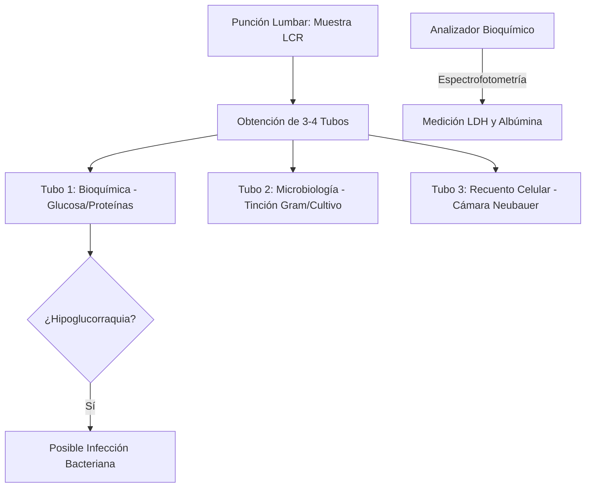
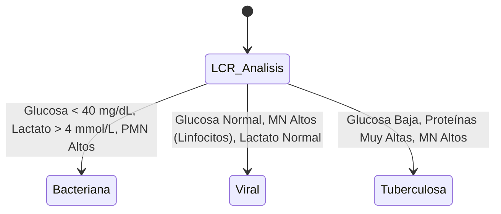
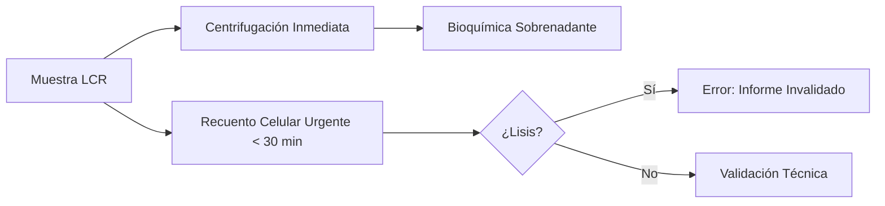

# Semana 5: Más allá de la Sangre
## Lección 20: El Líquido Cefalorraquídeo (LCR): Bioquímica y Fisiopatología

### 1. Título y Resumen (Abstract)
**Título:** Valoración Integral del Líquido Cefalorraquídeo: Dinámica del Ultrafiltrado y Correlación Cito-Bioquímica en Patologías del Sistema Nervioso.
**Resumen:** Este artículo profundiza en la fisiología de la producción y circulación del LCR, analizando los mecanismos de alteración de la barrera hematoencefálica (BHE). Se evalúa el impacto de las infecciones, hemorragias y tumores en los niveles de glucosa, proteínas y lactato. Se fundamenta el papel del TSLCB en la gestión crítica de la muestra (orden de tubos, rapidez de recuento celular) y en la identificación macroscópica diferencial (traumática vs hemorrágica).

### 2. Introducción (Fundamentos y Objetivos)
#### 2.1. Anatomía y Dinámica del Líquido Cefalorraquídeo (Módulo 1370)
El currículo de **Fisiopatología General** (Módulo 1370) describe el Sistema Nervioso Central y sus fluidos. El LCR es un líquido incoloro que circula por el espacio subaracnoideo y los ventrículos cerebrales.
- **Producción:** Se sintetiza en los **plexos coroideos** a un ritmo de ~500 mL/día mediante ultrafiltración plasmática y transporte activo (bombas de Na/K).
- **Circulación:** Fluye desde los ventrículos laterales al tercer y cuarto ventrículo, y de ahí al espacio subaracnoideo.
- **Funciones:** Protección mecánica, eliminación de metabolitos y homeostasis del microambiente cerebral.

#### 2.2. Alteraciones Fisiopatológicas y Bioquímica (Módulo 1371)
El **Módulo de Análisis Bioquímico** detalla el estudio de los componentes del LCR:
- **Proteínas (Módulo 1371):** La **hiperproteinorraquia** indica daño en la BHE (meningitis, tumores) o síntesis local.
- **Glucosa (Módulo 1371):** La **hipoglucorraquia** es un marcador crítico de consumo por bacterias o células neoplásicas. Requiere siempre una glucemia basal (Módulo 1367).
- **Lactato:** Producto del metabolismo anaerobio; su elevación diferencia meningitis bacterianas de virales.

#### 2.3. Gestión Técnica y Calidad de la Muestra (Módulo 1367/1368)
El TSLCB debe aplicar criterios rigurosos de preanalítica:
- **Orden de Tubos (Módulo 1367):** El uso de 3 o 4 tubos permite diferenciar una punción traumática (sangre que aclara del tubo 1 al 3) de una hemorragia subaracnoidea (sangre uniforme).
- **Xantocromía (Módulo 1368):** Coloración amarillenta tras centrifugación (presencia de bilirrubina/oxihemoglobina), indicativa de sangrado antiguo.
- **Conservación:** Recuento citológico inmediato (< 1h) para evitar la lisis leucocitaria.

**Objetivo:** Sistematizar el protocolo de validación técnica del LCR en situación de urgencia conforme a la normativa de la CM.

### 3. Material y Métodos
- **Diseño:** Estudio técnico sobre el perfil de fluidos biológicos.
- **Entorno:** Laboratorio de Urgencias, Hospital Universitario de Getafe.
- **Intervenciones:** Medición de glucosa y proteínas por química seca/húmeda. Recuento manual en cámara de Neubauer y recuento automatizado (Sysmex / Beckman). Determinación de lactato por método enzimático.

### 4. Resultados (Hallazgos Experimentales)
Algoritmo de diagnóstico diferencial en meningitis:

### 5. Discusión y Conclusiones
La rapidez es absoluta. El recuento celular debe realizarse antes de 1 hora de la punción para evitar la degeneración leucocitaria. Se concluye que el TSLCB debe informar cualquier xantocromía visual, ya que los analizadores automatizados pueden no detectarla. La interpretación de la glucorraquia siempre requiere una glucemia concomitante para un cálculo de ratio preciso.

### 6. Agradecimientos
Al equipo de residentes de Análisis Clínicos por la recopilación de perfiles cito-químicos en neuroinfecciones graves.

### 7. Bibliografía (Literatura Citada)
- **Cerebrospinal Fluid Analysis - StatPearls.** [Ver en ncbi.nlm.nih.gov](https://www.ncbi.nlm.nih.gov/books/NBK557672/)
- **Estudio del líquido cefalorraquídeo: Técnicas y Aplicaciones - SEQCML.** [Ver en seqc.es](https://www.seqc.es/es/bioquimica-en-el-laboratorio-clinico/manuales-y-monografias/)
- **Diagnostic Testing of the CSF - Neurochemistry.** [Ver en frontiersin.org](https://www.frontiersin.org/articles/10.3389/fneur.2021.670305/full)
- **Manual de Procedimientos: Estudio de Líquidos Biológicos - Comunidad de Madrid.** [Ver en comunidad.madrid](https://www.comunidad.madrid/servicios/salud/)

---
### Sobre la Ponente
**Rosalía F. Heredia** es Facultativa Especialista de Área (FEA) de Bioquímica Clínica en el **Hospital Universitario de Getafe**.

### 8. Charla y Transcripción (Contenido Multimedia)

**Enlace al vídeo:** [Ver en YouTube](https://www.youtube.com/watch?v=eAwWEkKhP9M)

#### Transcripción de la Sesión
Hola, ¿qué tal? Yo soy Rosalía Heredia, facultativo de biica clínica y actualmente trabajo en el hospital universitario Infanta Sofía y yo voy a hablar del estudio del líquido de Palo Raquidio, un poco del análisis integral que realizamos en el laboratorio. Bien, eh a modo de índice eh vamos a empezar hablando de unos conceptos básicos sobre el líquido céfalo raquidio. Después pasaremos a hablar del estudio e interpretación del mismo en el que desglosaremos los aspectos macroscópicos y microscópico. Dentro de esto, pues hablaremos del estudio bioquímico citológico, eh un poquito como estos dos se pueden relacionar en el estudio microbiológico y ya por último unas pinceladas de eh como ejemplo de estudio inmunológico.

Bien, el líquido céfaloraquídeo se forma en los plexos coroideos y ventrículos laterales. Y bueno, pues al final es una sustancia que vaña el encéfalo y la médula espinal. Eh, tiene múltiples funciones como proporcionar soporte físico y protección al sistema nervioso central. También amortigua a cambio de aceleración con respecto a estructura ósea. No sirve como vehículo, por ejemplo, para la eliminación de metabolitos. También actúa en el transporte de hormonas y neurotransmisores. Y bueno, eh al final pues proporciona un entorno químico regulando cambios de pH, iones y proteínas. Como digo, se forma en los plesos coroideos, pero se reabsorbe en las vellocidades anoideas. El volumen de líquidos de falorraquídeo como tal es de unos 150 ml en los que se reparten de en las siguientes proporciones. 20 de ellos se localizan en los ventrículos, 60 en la cisterna subaranoidea y 70 en el canal raquídeo como tal. Entonces se forman como unos 500 ml al día. eh que equivalen como 20 ml porh como velocidad de formación. Cualquier desequilibrio en tanto en su producción como en la reabsorción del mismo, pues va a producir una una patología.

Con respecto a la obtención del especime, sabemos que se tiene que realizar la técnica como tal es una punción lumbar que se realiza a nivel de la vértebra L3 eh L4 o L4 L5. Vale, pero también se pueden realizar otras funciones como la cisternal, lateral, cervical o derivaciones. Eh, las derivaciones se van a realizar con la idea de disminuir la presión intraventricular. Por ejemplo, en un caso de hidrocefalia, pues se van a realizar estas derivaciones que pueden ser internas o externas. Las internas que se denominan se denominan también zouns, pues son permanentes y la principal es la eh el drenaje ventrículo peritoneal, es decir, es decir, se eh se realiza un drenaje entre el ventrículo y el peritoneo con la eh finalidad de disminuir la presión intraventular. También pueden ser externas como los drenajes temporales o ventriculares, como se observa aquí en la imagen de la derecha.

Bien, eh la realización de punción lumbar ya sabemos que es una técnica pues difícil, compleja y que no se tiene que realizar así porque sí, si no es como la extracción de una sangre periférica, entonces tiene que haber una serie de criterios y de indicaciones. Eh, normalmente lo más común es por una sospecha de una infección en el sistema nervioso central como una menigitis, que suele ser lo más frecuente, casos de encefalítico en acceso cerebral también. si sospechambos de una enfermedad inflamatoria o autoinmune como el caso de esclerosis múltiple, una neuromioliti óptica o también lupus con afectación neurológica, si también sospecha de una posible homes subaras nueva idea o por ejemplo de una leucemia que ha afectado al sistema nervioso central. Eh, como digo, es muy importante tener una serie de indicaciones, ya que eh pues eh al ser una técnica compleja, pues no está de complicaciones, se pueden producir aquí uno de los ejemplos que os pongo, el enclavamiento del cerebelo o de la amídala cerebelosa en los pacientes con una hipertensión intragraneal, también eh la producción de una hematoma extradural o subdural, la perforación de las meninge o también en recién nacidos pues puede producirse la muerte por aficia.

Bien, el tubo tiene que cumplir una serie también de indicaciones, es que tiene que ser seco, sin aditivos ni anticoagulante y con tapón de rosca. Se suelen obtener como unos 12 ml que se suelen repartir en cuatro tubos. El orden de extracción de los tubos con respecto a la técnica que se determina posteriori tiene cierta importancia. Es verdad que luego creo que en la práctica no se suele realizar bien. Es que eh o sea, al final cuando extrae líquidos de valor el primer tubo que va a tener más cantidad de sangre como tal. Entonces, pues no se recomienda que ese primer tubo se realice para estudio eh citoquímico, citológico. Entonces, el primero se suele utilizar para un estudio bioquímico, el segundo y el tercero para un análisis microbiológico y ya el cuarto se se utilizaría para una citología porque es un líquido más puro.

El transporte es muy importante. Se recomienda que se lleve lo antes posible y que la entrega se haga directamente, ¿no? Es decir, evitar el tubo neumático porque esto puede producir pues una gradación de la célula y con ello falsear un aumento de las proteínas y también el recuento celular. Con respecto al procesamiento previo de la muestra, pues muy importante, sobre todo para el recuento celular, realizar una homogeneización. Eh, si se realiza en un equipo automático con máximo de 5 minutos y manual, pues simplemente con voltear unas 15 veces es suficiente no hacerlo de forma vigorosa porque esto eh pues puede producir esa degradación de de célula, ¿vale? Simplemente pues un volteo eh muy ligero. Por supuesto, cuanto más turbio es el líquido de palorraquídeo, pues más tenemos que homogeneizar. Con respecto a la estabilidad de la muestra, se recomienda analizarlo como máximo en una hora. Y bueno, si es para un cultivo de bacterias eh necesitamos tener la temperatura ambiente o en estufa a 35 gr, importante no refrigerar porque al final esto pues va va a impedir que que proliferen las bacterias, pero si es para virus y se va a analizar en menos de 24 horas, pues se puede eh estabilizar, o sea, almacenar entre 2 y 8 gr. y sea más de 24 horas a -20º.

Bien, comenzamos hablando del estudio e interpretación del líquido cfaloraquídeo. Sabemos que tiene que un líquido céfaloraquidio normal es incoloro, inodoro y transparente. Se dice que es similar al agua de roca. Tiene una concentración de un 90% de agua y la hormolaridad es de 281 m litro, es decir, es muy parecida a la del plasma. Con respecto al estudio macroscópico, eh sabemos que si el líquido de palorraquídeo tiene un un aspecto turbio, pues esto va a estar estrechamente relacionado con una presencia de abundante celularidad y de bacterias. Sin embargo, si esático, pues lo más común es que se trate de una punción traumática, aunque también puede ser por una hemorragia suparanoidea. Una de las cosas que se sabe es que eh si es por una punción traumática, a medida que eh realizamos la punción lumbar, el líquido se va aclarando. Sin embargo, eh si es por una hemorragia subaranoidea, este líquido no se aclara. Y luego también si tenemos un aspecto santocrómico, pues esto orienta hacia una una hemorragia aranoidea avanzada. La presencia de coágulo es bastante frecuente, sobre todo en caso de punción traumática. Es lo más común. Al final eh lo que ocurre aquí es que se libera una cantidad considerable de citrinógeno y por tanto se coagula muy rápidamente la muestra, pero también puede darse en caso de hemorragias intracraneal. Esto produce un rechazo de la muestra, pero no de todo. Simplemente eh se suele rechazar por al final el recuento celular, pero sí que puede servir para realizar el el análisis bioquímico y y microbiológico. Lo que sí sea importante es reflejar el análisis macroscópico del líquido céfalorraquídeo que quede bien reflejado en el en el informe de de laboratorio.

Bien, y con respecto al estudio microscópico, pues vamos a hablar del estudio bioquímico, citológico, microbiológico e inmunológico. Empezamos hablando por el estudio bioquímico y la principal determinación que se realiza y que siempre se suele solicitar es la glucosa, ¿vale? La glucosa es un reflejo de la glucosa plasmática. Al final pasa el líquido cefalorraquídeo a través de un transporte pasivo por difusión simple o un transporte activo. Entonces, en el líquido céfaloquídeo, la concentración de glucosa refleja un 60 70% de la del plasma. Si en el plasma tenemos unos valores normales entre 70 y 120 mg de cilitro, en el líquido van a ser entre 50 y 80. Por esta estrecha relación se recomienda determinar ambas concentraciones simultáneamente. La hiperglucorraquia, es decir, un aumento de glucosa en líquido cepalorraquillo, pues como digo, va a ser un reflejo del plasma. aportando, lo más común es que se deba a una situación de diabetes mellito. Sin embargo, la hipoglucorraia se puede deber a un una deficiencia en el mecanismo de transporte activo o que haya un mayor consumo que suele ser frecuente en caso de tumores o de microorganismos o también que el paciente tenga una hipoglicemia prolongada. Como dato diré es que en la menigitis bacteriana la glucosa se puede reducir hasta un 50% o más.

Bien, eh otras determinaciones que se suelen solicitar son los niveles de lactato y en este caso son independientes del lactato sérico. Eh es decir, son reflejo también porque hay glucólisis cerebral. El un aumento en específico de este lactato pueden darse en caso de menigitis, lesión cerebral por hipoxia o una hemorragia subaranoidea. Pero lo que se sabe es que en la menitis bacteriana como tal hay un aumento bastante considerable. Eh, se establece como punto de corte en esto lo he visto en alguna bibliografía, 4,2 mimol litro para diferenciar entre la menejitis bacteriana del viral. Y bueno, también comentar que no es un marcador útil de respuesta al trozamiento.

La proteína eh también es un reflejo del paso de proteína del plasma líquido céfalorraquídeo y la principal pues va a ser la albumina. Aclarar que eh al final por una inmadurez en la barriera hematofálica la cantidad de proteínas va a ser mucho mayor en neonatos que en adultos. En el valor normal es entre 30 y 140 y en adulto entre 15 y 45 mg de cilitro. Un incremento de las proteínas pues puede deberse porque hay eh pues una alteración de la permeabilidad de la barriera rematoencefálica por diferentes procesos, por ejemplo, por una inflamación en caso de una menigitis. Entonces, al final se filtra más cantidad y aumenta la cantidad de proteína. También puede ser que haya una obstrucción de la circulación como en caso de traumatismos. tumores, etcétera. Una mayor síntesis en el sistema nervioso central y también en la degeneración ística, como ocurre en esclerosis múltiple. En caso de accidentes vasculares como hemorragia, trombosis, en bolia cerebral, también va a haber un aumento de proteína y por supuesto también por una punción traumática. El descenso es menos común, eh, pero se puede deber a una fuga de líquido céfalorraquío en caso de traumatismo, porción lumbar previa de rinorrea o u otorrea y también porque hay un aumento la presión intracaneal que genera una filtración del líquido en las microbiosidades araideas.

Bien, en las proteínas pues eh como he dicho, la hiperproteorragia es patológica refleja que puede haber lo más común alteración en la barrera hematoencefálica y se clasifica en ligera y está entre 47 y 75, moderada entre 75 y 100, un aumento muy marcado, perdón, entre 500 y 50 y muy marcado entre 500 y 3,500. Otra de las determinaciones que se pueden solicitar es la adenosina de aminaza y es una enzima esencial en el desarrollo del sistema inmunitario y sus concentraciones elevadas se relacionan con la menigitis tuberculosa, ¿vale? Se dice que eh más de 10 unidades por litro se asocian con una menigitis tuberculosa. Esto se produce porque al final esta lo que hacen estas bacterias estimular la producción por parte de los linfocitos de esta. Aunque también se ha visto que puede aumentar en menigitis bacteriana y viral en niño.

Pasamos a hablar del estudio citológico. El recuento celular que se recomienda realizarlo como máximo en una hora porque si no se produce esa degradación y se puede falsear los resultados y se puede realizar tanto de forma manual que se realizan en cámara o en o como automático el recuento en cámara. Eh, tenemos dos cámaras principalmente, la F Rosental eh que es la que más se recomienda en caso del líquido cfaloraquídeo porque utiliza una mayor cantidad de volumen. Entonces, al final en los líquidos de valorraquidos, lo más común es que no haya muchas células, por lo que utilizando mayor volumen vamos a cometer menos error. Pero es verdad que al final lo más común es que se utilice la Newware, que al final como sirve para otros tipos de líquidos y son las que se recomiendan para otros tipos de líquido, pues suele ser la más utilizada. Con respecto al recuento automático, pues se suele realizar por citometida de flujo por fluorescencia, que se basa alfinar en en diferentes pasos como son en primer lugar la lisis de la célula, posteriormente se realiza la tinción fluorescente y luego se clasifica en función de la complejidad interna del tamaño y del contenido de ácidos nucleicos que tengan esas células. Eh, de manera que el el líquido céfaloquillo se deposita en los ocitómetros y este lo que lo que ocurre es que pasa hay un paso de una suspensión celular que se alinea gracias al a un láser focalizado y esto genera una señal óptica en función de las características físicas y químicas. Estas señales ópticas se van a dividir en en el caso del del citómetro que os pongo en el ejemplo que es el que se utiliza en Getafe, que es de el de Menarini, pues se divide principalmente en tres características en tres señales ópticas, perdón. La primera de ellas es la señal forward scatter, que nos da información de la dispersión frontal, es decir, se detecta la luz dispersada en ángulo recto, ¿vale? Casi en línea recta con el la y esto nos da información del tamaño relativo de la célula. La señal Side Scatter nos da información de la dispersión lateral que se detecta luz dispersada en un ángulo de 90º respecto al láser. Y en este caso lo que nos da información es de la estructura interna, es decir, de los gránulos, organela. Eh, al final las células que tengan una complejidad interna mayor, pues se van a ver reflejadas en esta eh en esta señal, en ese descarte. Y luego el contenido de fluorescencia, ¿vale? que al final lo que nos refleja es el la cantidad de ADN que tiene de ácido nucleico que tiene esa célula. De esta manera, enfrentando dos ejes, que son el de fluorescencia en en el eje vertical y en el horizontal side scatter, pues vamos a poder clasificar la célula sanguínea de líquido céfalorraquídeo, o sea, sí, la célula de líquido céfalorraquío. Entonces, por ejemplo, ¿qué ocurre con los monocitos y los linfocitos? Son células que no tienen complejidad interna porque el linfocito, por ejemplo, es puro núcleo, no tiene apenas citoplasma y sin embargo el monocito, aunque sí que tiene muchos citoplasma pero no tiene gránulos como tal. Entonces se van a localizar a nivel del eje side scatter que era el de la complejidad interna, se van a localizar más a la izquierda. Y si comparamos el entre el linfo y el mono, pues al final el mono tiene más ácido nucleico. Entonces, en el eje de fluorescencia va a estar localizado más arriba que el linfocito. Sin embargo, ¿qué ocurre con los neutrófilos y los eosinófilos? Pues que tienen tienen gránulo, entonces van a estar localizados más a la derecha en el eje se descate. Pero en cuanto a contenido de ácido nucleicos son similares, entonces van a estar localizados a una altura similar. El eosinófilo, sin embargo, es más complejo que el neutrófilo, entonces va a estar localizado más a la derecha y de esta manera, pues podemos clasificar a la a la célula en el líquido de jalurraquío. Esto nos da mucha información.

Bien, eh con respecto a los valores normales de la célula de líquido céfaloquídeo, pues importante decir que en un recién nacido al final por esa inmadurez de la barrera hematoencefálica van a ser van a ser diferentes a las de los adultos, mientras que los hematí están entre 0 y 50, en el adulto entre 0 y 5 en lo normal y los lecos entre 0 y 27 en recién nacido y entre 0 y 5 en el adulto. El diferencial luucitario normal también es diferente al de sangre periférica, mientras que en sangre periférica lo que prevalecen, o sea, lo más frecuentes son los neutrófilos, en este caso son los linfocitos, seguido de los macrófagos. ¿Vale? Bien, importante también que tenemos que confirmar el diferencial, ¿vale? Pues para ello se hace uso del ácido centrrifuga en el que se deposita la muestra en un adaptador y se pone la citocentrífuga que se suele centrifugar 700, es decir, una centrifugación suave durante 6 minutos y posteriormente pues se pasa a teñirlo. En primer lugar se pasa por un un fijador que es el metanol. Luego se pasa por la solución I, que es eosinófila, es decir, tiene eosina e i, perdón, que es un colorante aniónico, es decir, con carga negativa. Entonces, como los ecinófilos tienen gránulos ricos en proteínas básicas, pues se van a teñir. Y luego se pasa por la solución dos, que es la basúquila que contiene colorantes básicos como son e como la tiacina. Los gránulos basófilos tienen carga negativa como la heparina, entonces se van a teñir también. Esto sería un ejemplo de cómo se vería, por ejemplo, una tinción de un líquido céfaloquídeo con numeroso neutrófilo. Eh, vamos, cabe destacar que esto no suele ser lo más común, ya que lo más frecuente es que no tengan nada por suerte.

Bien, y ahora quiero poner una tablita en el que vamos a relacionar el estudio bioquímico citológico con el análisis microbiológico, es decir, con en relación más bien a los diferentes tipos de menigitis, ya que es el motivo principal por el que se suele realizar solicitar el estudios de faloraquirio. Bien, entonces el aspecto como tal del líquidofalorraquío ya hemos visto que es similar al agua de rosca. En una meningiti bacteriana, este aspecto va a ser turbio. En una menigit viral, sin embargo, es transparente. eh por hongos es ligeramente turbio y en una menigitis tuberculosa, pues se dice que tiene un aspecto lechoso. Con respecto al recuento leucocetario, lo normal ya hemos visto que en adulto es inferior a cinco, en neonato era 27, si no me equivoco. En una menigite bacteriana pueden superar los 1000 leucos por microlitro. En la viral está entre 10 y 500, en hongo entre 20 y 400 y en una tuberculosa entre 50 y 300. Es verdad que esto tiene que ser orientativo, ¿vale? No tiene que no tenemos que ser muy estrictos con con esta tabla. Al final sirve un poquito para para orientar el diagnóstico microbiológico, más bien orientar o apoyar el predominio. Esto es importante. Hemos visto que lo normal sería en mononucleares y en todos los otros casos también, salvo en el caso de menigitis bacteriana, que lo que vamos a tener es un predominio de neutrófilo. Con respecto al niveles de glucosa, lo normal es 50 y 80 como hemos visto. Y en estos casos, pues en una menigitis en la que haya un consumo por bacterias de glucosa, por bacterias o por hongos, esta glucosa va a estar baja. Sin embargo, una menijitis viral, la glucosa va a ser mayor de 45. Las proteínas e entre 15 y 45 es lo normal. Sin embargo, la bacteriana va a estar entre 100 y 500. En una viral también aumenta, pero no tanto. Entre 50 y 100 en un hongo simplemente se dice que mayor de 45, es decir, proteínas aumentadas, pero no he visto un rango claro y en la tuberculosa entre 50 y 300.

Bien, y ahora os quiero poner unos ejemplos que son reales, ¿vale? son casos reales un poquito para que veamos esa relación entre el estudio bioquímico y citológico. En un estudio celular en el que tenemos el recuento del leuco de 3,520 con un predominio claro de neutrófilo de 98,2 que ya hemos visto que lo más normal es que sean linfo lo lo más común. Eh, y con respecto al estudio bioquímico, tenemos una glucosa de dos. Eh, las proteínas también en 330 están bastante aumentadas y unos niveles de lactato de nueve. En este caso, si vemos nuestra grafiquita, como vemos, efectivamente lo que hay es una es una condensación e de los neutrófilos. Vemos que en esa zona se forma una clara nube de neutrófilos donde se suelen donde suelen estar en este tipo de gráficas. Y si realizamos un análisis microbiológico, lo que se vio en este caso es que se trataba de una menigitis bacteriana por estooco neumonia.

En este otro caso, sin embargo, lo que tenemos son 121 células por microlitro y e un predominio de linfocitos con un 93,1%. Esto a priori parece que puede orientar hacia una meningiti vírica por ese predominio. Sin embargo, cuando analizamos el estudio bioquímico vemos que tenemos glucosas bajas con unas proteínas también bastante aumentadas y el lactato también está aumentado. Ya hemos visto que en el caso de la menigitis vírica, aunque lo que tengamos es un predominio de mononucleares, la glucosa no tiene que estar tan baja. Cuando vemos nuestra grafiquita, vemos que efectivamente lo que lo que vemos, si la comparáis con la gráfica anterior veis como es tan diferente. En este caso es una nube de linfocitos, de mononucleares. Y en este caso lo que se trataba era de una meningüencefalitis por micobacterium tuberculosis. Eh, la tuberculosis, aunque sea una enfermedad por una por una bacteria, sabemos que lo que hay principalmente es un predominio de linfocito. Entonces, lo que quiero ver aquí es la importancia de interpretar todas las pruebas, no solo del estudio celular, sino tenerlo todo en cuenta. El estudio bioquímico aquí aporta mucha información y apoya mucho el diagnóstico microbiológico.

Bien, y ya por último, que solo voy a dar unas pinceladas del estudio inmunológico, porque sé que se ha hablado en otras charlas de otras ediciones de este tema, entonces solo voy a no voy a pararme mucho y es el estudio de banda oligoclonales, que es algo que se solicita con bastante frecuencia también al laboratorio. ¿Andas qué son? Pues al final son es un hallazgo de laboratorio que lo que manifiesta es una síntesis intratecal de inmunoglobulina. Entonces, vamos a desglosar esto un poco. Las bandas, ¿eh? ¿A qué se refiere? Porque al final lo que se hace es una separación de proteínas por el exrofores. Entonces, esto nos da un patrón, una serie de bandas. ¿Y por qué se le denomina oligocoglonales? Porque lo que se detecta son inmunoglobulinas específicas, que son sobre todo IGG, es decir, no se van a detectar e IGG, IGA, IgM, no hay un aumento policronal como tal, no, sino que es más bien de inmunoglobulina específica. ¿Y por qué se denomina síntesis intratecal? En este caso, intratecal se refiere a como dentro de la cubierta, por así decirlo. En este caso se refiere a las meninges como tal. Entonces, lo que se produce es una producción local, es decir, en el sistema nervioso central de esa inmunoglobulina.

¿Cómo sabemos que hay una producción local? Porque lo que se hace es que se enfrenta el suero con respecto al líquido cfalorasquidio. Entonces, esto nos va a dar una serie de patrones que van a ser pues representativos de de una patología u otra o de una situaciones hm sí, más bien patológicas o fisiológicas, como por ejemplo en el patrón uno es el en el que no hay banda oliguaales en el suelo ni líquido cíjalo raquídeo y este es el patrón normal. E eso significa que no hay proteína y que no se separan por estroforés y que no se ve nada. No, eso significa que no hay bandas olevoclonales, es decir, sí que puede haber inmunoglobulinas, pero tiene una expresión policlonal. Eh, ¿vale? Entonces, no se vería tanto como banda, sino se vería más bien como un fondo. En el caso del el patrón dos y tres, en el que en el patrón dos la banda olivo cronal en el líquido cfalorraquídeo están, pero en el suero no están, como veis. E y en el caso del patrón tres, hay banda idéntica en suero y en líquidos de falorraquido, pero en el líquido defalorraquido, como veis, hay bandas adicionales que no están en el suero. En ambos casos, esto es compatible con una síntesis intratecal de inmunoglobulina, ¿vale? porque si lo comparamos con respecto al suelo, en el patrón dos no tenemos nada y en el patrón tres tenemos solo alguna, no todas. ¿Vale? Entonces, esto sería pues una situación que no es fisiológica y que y que puede ser como consecuencia de una síntesis de de Ig. Bien, en el patrón número cuatro lo que vemos son bandas idénticas tanto en suero como en líquidos de falorraquido. Esto se denomina patrón en espejo porque vemos lo mismo en un sitio que en otro y esto no refleja una síntesis intratecal, ya es que se ve exactamente lo mismo. Lo que refleja es que lo que hay es unos pasos de lo que hay en suero, pues ha pasado líquido céfalorraquío, que también puede darse en algunas enfermedades sistémicas.

¿Y por qué es importante la detección de banda oligoclonales? Porque se sabe que la principal patología que está muy relacionada con ella y que apoya mucho el diagnóstico es en la esclerosis múltiple. Entonces, es como el motivo la causa más frecuente de solicitud de bandiglioclonales. También se puede dar en otros casos, ¿vale? como lo que os reflejo aquí en esta tablita, como por ejemplo en el lupu, también el síndrome de de Segre o en casos de de UVH, de neurosif, etcétera. Vale, aquí os pongo varios ejemplos para que lo tengáis como guía, pero quiero que os quedéis con la idea que lo más común es en esclerosis múltiple, ¿vale? Y esto es todo. No he puesto una diapiva como conclusiones porque no tiene mucho sentido hacer un, por así decirlo, un resumen de los que hemos visto, pero con lo que os quiero que os quedéis como que en el oratorio de de urgencias, que al final es donde se analiza muy frecuentemente el líquido de valorraquidio, pues destacar la importancia que tiene que al final es una muestra muy que hay que tener muy mucho cuidado y que se tiene que analizar lo más pronto posible y también por supuesto destacar la importancia del técnico de laboratorio en el análisis del mismo. O sea, al final los resultados que nosotros estamos dando van a tener van a tener un significado y el clínico pues puede orientar la patología hacia un sitio u otro. Entonces, pues quiero destacar esa importancia y esa relevancia de de tener cuidado a la hora de analizar el líquido céfalosquidio.

#### Explicación de la Ponencia
La sesión ofrece una visión integral del análisis del líquido cefalorraquídeo (LCR), abordando desde su fisiología y obtención mediante punción lumbar hasta su interpretación macroscópica y microscópica. Se destaca la importancia de la correlación cito-bioquímica (glucosa, lactato, proteínas) para el diagnóstico diferencial de meningitis (bacteriana, vírica, tuberculosa) y el valor del estudio inmunológico mediante bandas oligoclonales para la detección de síntesis intrathecal de inmunoglobulinas, fundamental en patologías como la esclerosis múltiple.

*Manual docente alineado con los objetivos del Grado Superior de Laboratorio.*
